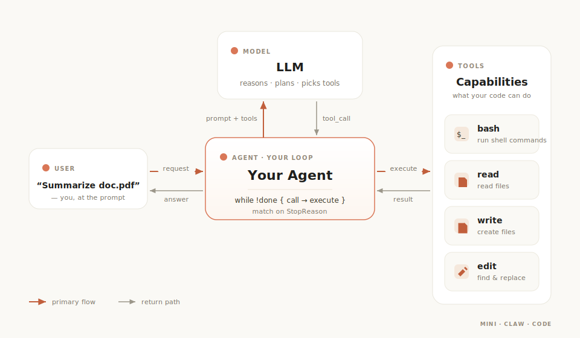
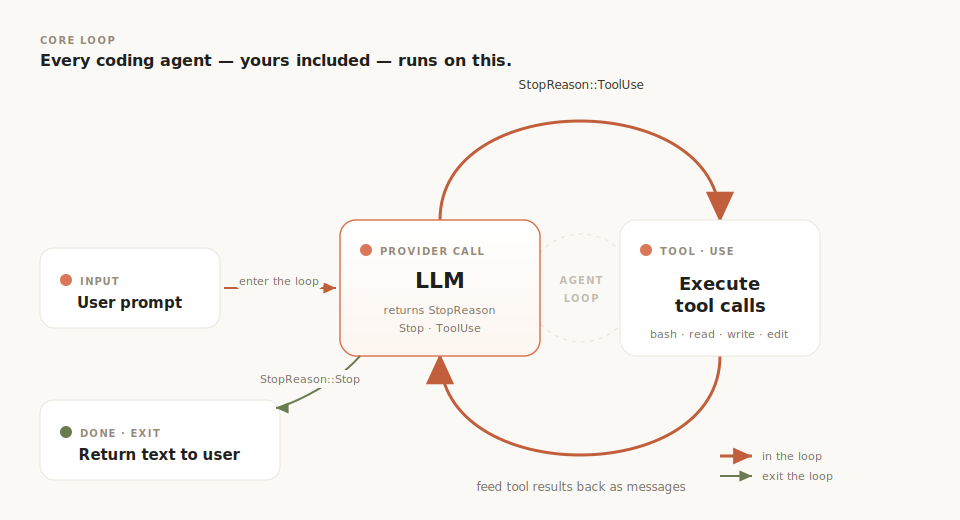
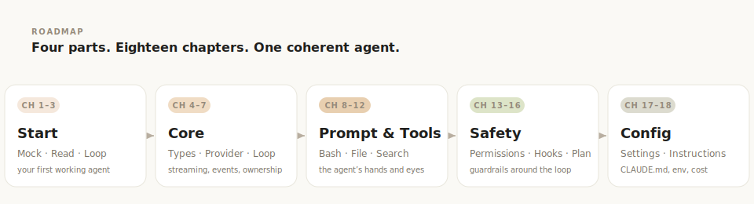
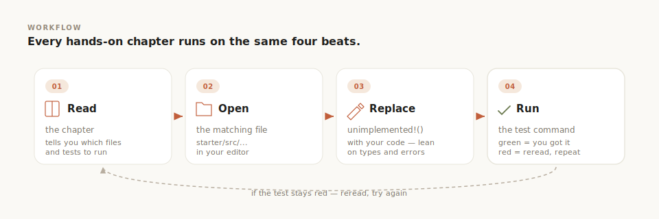
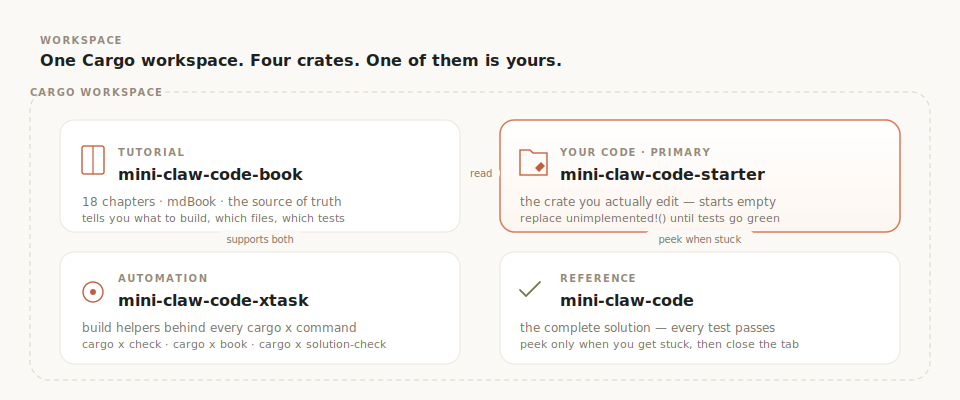

<p align="center">
  
</p>

<h1 align="center">Mini Claw Code</h1>

<p align="center">
  <strong>Build a coding agent from scratch in Rust — guided by Claude Code's architecture.</strong>
</p>

<p align="center">
  <a href="https://odysa.github.io/mini-claw-code/">Read the Book (EN)</a> &middot;
  <a href="https://odysa.github.io/mini-claw-code/zh/">中文版 (Book)</a> &middot;
  <a href="./README.zh.md">中文 README</a> &middot;
  <a href="#quick-start">Quick Start</a> &middot;
  <a href="#chapter-roadmap">Chapters</a>
</p>

---

You use coding agents every day. Ever wonder how they actually work?

<p align="center">
  
</p>

It's simpler than you think. Strip away the UI, the streaming, the model routing — and every coding agent is just this loop:

```
loop:
    response = llm(messages, tools)
    if response.done:
        break
    for call in response.tool_calls:
        result = execute(call)
        messages.append(result)
```

The LLM never touches your filesystem. It *asks* your code to run tools — read a file, execute a command, edit code — and your code *does*. That loop is the entire idea.

This book builds that loop from scratch and then grows it into the full architecture of a real coding agent: streaming, permissions, hooks, plan mode, configuration, and more. **18 chapters. Test-driven. No magic.**

<p align="center">
  
</p>

## What you'll build

A working coding agent that can:

- **Run shell commands** — `ls`, `grep`, `git`, anything
- **Read, write, and edit files** — full filesystem access with surgical find-and-replace
- **Talk to real LLMs** — via OpenRouter (free tier available, no credit card)
- **Stream responses** — SSE parsing, token-by-token output
- **Search a codebase** — glob for files, grep for content
- **Enforce safety** — permission rules, command filters, protected paths
- **Run user hooks** — shell commands before/after tools
- **Plan before acting** — two-phase plan/execute with approval gating
- **Load project instructions** — CLAUDE.md discovery, layered config

All test-driven. No API key needed until Chapter 5 — and even then, the default model is free.

## The core loop

Every coding agent — yours included — runs on this:

<p align="center">
  
</p>

Match on `StopReason`. Follow instructions. That's the architecture.

## Chapter roadmap

**Getting started** — zero to a working agent in under an hour

| Ch | You build | What clicks |
|----|-----------|-------------|
| 1 | `MockProvider` | The protocol: messages in, tool calls out |
| 2 | `ReadTool` | The `Tool` trait — every tool is this pattern |
| 3 | `single_turn()` + `SimpleAgent` | Match on `StopReason`, wrap it in a loop |

**Part I — Core agent**

| Ch | Topic | What it adds |
|----|-------|--------------|
| 4 | Messages & Types | The shared protocol behind every provider and tool |
| 5a | Provider & Streaming Foundations | `Provider` trait, SSE parsing, `StreamAccumulator` |
| 5b | OpenRouter & StreamingAgent | `OpenRouterProvider`, event channels, `StreamingAgent` |
| 6 | Tool Interface | Why `Tool` and `Provider` pick different async styles |
| 7 | The Agentic Loop (Deep Dive) | `execute_tools`, event plumbing, ownership |

**Part II — Prompt & tools**

| Ch | Topic | What it adds |
|----|-------|--------------|
| 8 | System Prompt | Static identity + dynamic project context |
| 9 | File Tools | `WriteTool`, `EditTool` with exact-match invariant |
| 10 | Bash Tool | Async `tokio::process` with stdout+stderr capture |
| 11 | Search Tools | `GlobTool`, `GrepTool` — the agent's eyes |
| 12 | Tool Registry | `ToolSet` lookup, tool summaries for UIs |

**Part III — Safety & control**

| Ch | Topic | What it adds |
|----|-------|--------------|
| 13 | Permission Engine | Glob rules, session-allow, default policies |
| 14 | Safety Checks | Path validation, command filters, protected files |
| 15 | Hooks | Pre/post-tool shell commands with block/modify/continue |
| 16 | Plan Mode | Two-phase read-only plan → approval → execute |

**Part IV — Configuration**

| Ch | Topic | What it adds |
|----|-------|--------------|
| 17 | Settings Hierarchy | TOML layers, env overrides, `CostTracker` |
| 18 | Project Instructions | CLAUDE.md discovery, `ContextManager` |

<p align="center">
  
</p>

## Safety warning

The core agent has **unrestricted shell access**. `BashTool` passes LLM-generated commands straight to `bash -c`; `ReadTool`/`WriteTool` can touch any file your user account can. Chapters 13–16 add the real safety rails. Until then:

- **Do not run untrusted prompts or file contents** through the agent (prompt injection via file contents can execute arbitrary commands).
- **Do not run on a machine with sensitive data** without understanding the risks.

## Quick start

```bash
git clone https://github.com/odysa/mini-claw-code.git
cd mini-claw-code
cargo build
```

Read the book locally:

```bash
cargo install mdbook mdbook-mermaid   # one-time
cargo x book                          # English + 中文 on localhost:3000 (switch via the top-right toggle)
```

Or read it online at **[odysa.github.io/mini-claw-code](https://odysa.github.io/mini-claw-code/)** (English) / **[中文版](https://odysa.github.io/mini-claw-code/zh/)**. Use the **EN / 中文** toggle in the top-right of the site to switch languages at any time.

## The workflow

Every hands-on chapter follows the same rhythm:

<p align="center">
  
</p>

1. **Read** the chapter — it tells you which files to edit and which tests to run.
2. **Open** the matching file in `mini-claw-code-starter/src/`.
3. **Replace** `unimplemented!()` with your code.
4. **Run** the test command the chapter gave you (e.g. `cargo test -p mini-claw-code-starter test_read_`).

Green tests = you got it.

> **Heads up:** starter tests are organized by feature, not chapter number — each chapter tells you exactly which test prefix to run (e.g. `test_read_`, `test_bash_`, `test_edit_`). The full mapping lives in the [overview](https://odysa.github.io/mini-claw-code/ch00-overview.html).

## Project structure

<p align="center">
  
</p>

```
mini-claw-code-starter/     <- YOUR code (fill in the stubs)
mini-claw-code/             <- Reference solution (no peeking!)
mini-claw-code-book/        <- The tutorial (18 chapters)
mini-claw-code-xtask/       <- Helper commands (cargo x ...)
```

## Prerequisites

- **Rust 1.85+** — [rustup.rs](https://rustup.rs)
- Basic Rust knowledge (ownership, enums, `Result`/`Option`)
- Basic async familiarity (`async`/`await`, `tokio`)
- No API key until Chapter 5

## Commands

```bash
cargo test -p mini-claw-code-starter test_read_   # tests for one chapter (see book for mapping)
cargo test -p mini-claw-code-starter             # all tests
cargo x check                                    # fmt + clippy + starter build
cargo x book                                     # serve both languages at localhost:3000 (中文 at /zh/)
```

## Looking for V1?

The original hands-on tutorial (15 chapters, Part I hands-on + Part II extensions) and its Chinese translation are archived at [archive/v1-book/](https://github.com/odysa/mini-claw-code/tree/main/archive/v1-book). GitHub renders the markdown natively — start at [archive/v1-book/en/ch00-overview.md](https://github.com/odysa/mini-claw-code/blob/main/archive/v1-book/en/ch00-overview.md).

## License

MIT
