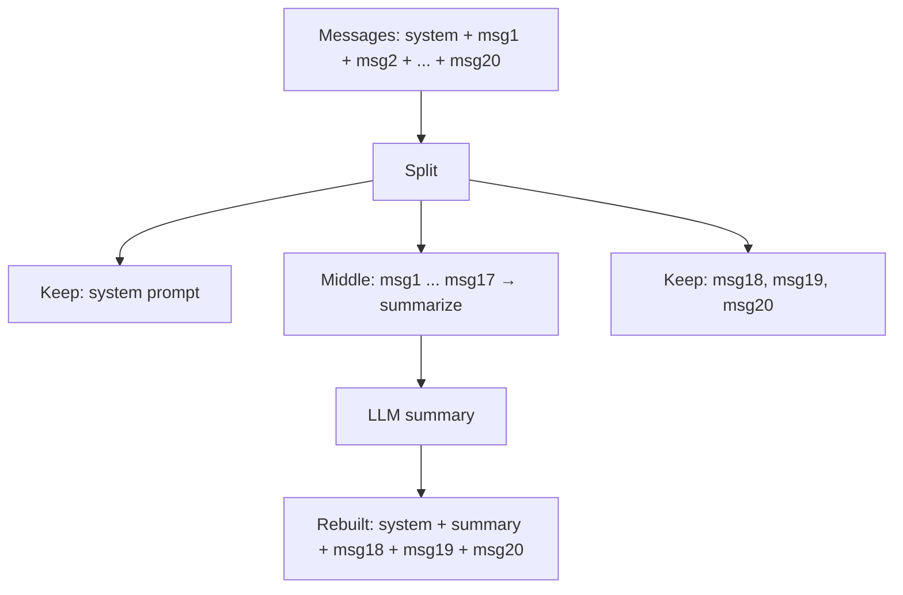

# Chapter 15: Context Management

Every LLM has a context window -- a fixed number of tokens it can process in
a single request. Claude has 200k tokens. GPT-4o has 128k. Sounds like a lot,
until your agent reads a few large files, runs a test suite, edits some code,
and runs the tests again. Each tool result gets appended to the message
history, and that history gets sent to the LLM on *every turn*. A busy session
can blow past 100k tokens in minutes.

When that happens, the API either rejects the request or silently truncates
your messages. Either way, the agent breaks. Real coding agents handle this
automatically -- Claude Code, for example, compacts the conversation when it
gets too long, summarizing old messages while keeping recent context intact.
The user sees a brief "auto-compacting conversation..." message and the session
continues.

In this chapter you will build a `ContextManager` that does exactly that:
tracks token usage, decides when to compact, and uses the LLM itself to
summarize old messages into a short recap. You will also implement the
`should_compact()` threshold check as an exercise.

## The problem

Consider this 10-turn conversation:

```text
User: Find the bug in src/parser.rs
  [read: src/parser.rs]              ← 500 lines of code
  [read: src/types.rs]               ← 300 lines of code
Assistant: I see the issue. The parser...
  [bash: cargo test]                  ← 200 lines of test output
  [edit: src/parser.rs]               ← patch
  [bash: cargo test]                  ← 200 lines of test output
Assistant: All tests pass now.
User: Great. Now add a --verbose flag to the CLI.
  [read: src/main.rs]                 ← 400 lines
  ...
```

By the time the user asks a second question, the message history already
contains thousands of tokens of file contents, test output, and tool calls.
Most of that detail is irrelevant to the new task. But the LLM still receives
it all, which wastes tokens, increases latency, and eventually hits the
context limit.

The solution: periodically **compact** the history by summarizing old messages
and keeping only the recent ones.

## The strategy

Compaction works in three steps:

1. **Detect** -- after each LLM turn, check if cumulative token usage has
   crossed a threshold.
2. **Summarize** -- take the old messages (everything except the system prompt
   and the most recent N messages) and ask the LLM to summarize them into a
   few sentences.
3. **Rebuild** -- replace the message history with: the original system prompt,
   the summary as a new system message, and the recent messages.



After compaction, the conversation has 4-5 messages instead of 20+. The LLM
loses the fine-grained detail of early messages but retains the key facts and
decisions through the summary. The recent messages are preserved verbatim, so
the LLM has full context for whatever it is working on right now.

This is the same approach Claude Code uses. It is simple, effective, and
requires no changes to the agent loop or provider -- just a pre-processing
step before each `provider.chat()` call.

## The ContextManager struct

Open `mini-claw-code/src/context.rs`. The struct has three fields:

```rust
pub struct ContextManager {
    /// Maximum total tokens before compaction triggers.
    max_tokens: u64,
    /// Number of recent messages to always preserve during compaction.
    preserve_recent: usize,
    /// Running total of tokens used in the current conversation.
    tokens_used: u64,
}
```

- `max_tokens` is the budget. When cumulative usage crosses this threshold,
  compaction fires. This is not the model's context window size -- it is a
  *lower* number you choose to leave headroom. For a 200k-token model, you
  might set this to 100k so you always have room for the LLM's response.
- `preserve_recent` is how many messages to keep verbatim. These are the
  messages most relevant to the current task. A value of 4-6 usually works
  well.
- `tokens_used` is the running counter, updated after each LLM turn.

The constructor is straightforward:

```rust
impl ContextManager {
    pub fn new(max_tokens: u64, preserve_recent: usize) -> Self {
        Self {
            max_tokens,
            preserve_recent,
            tokens_used: 0,
        }
    }
}
```

## Tracking token usage

The LLM API reports how many tokens each request consumed. Our `AssistantTurn`
type carries this information in an optional `usage` field:

```rust
pub struct AssistantTurn {
    pub text: Option<String>,
    pub tool_calls: Vec<ToolCall>,
    pub stop_reason: StopReason,
    pub usage: Option<TokenUsage>,
}

#[derive(Debug, Clone, Default)]
pub struct TokenUsage {
    pub input_tokens: u64,
    pub output_tokens: u64,
}
```

After each provider call, the agent records the usage:

```rust
pub fn record(&mut self, usage: &TokenUsage) {
    self.tokens_used += usage.input_tokens + usage.output_tokens;
}
```

This is a rough estimate. Input tokens grow with each turn (because the full
history is resent), so summing input + output across all turns overcounts. But
for a threshold check, overcounting is fine -- it just means we compact a
little earlier than strictly necessary, which is safer than compacting too
late.

You can query the current total at any time:

```rust
pub fn tokens_used(&self) -> u64 {
    self.tokens_used
}
```

## Exercise: implement `should_compact()`

This is your exercise for the chapter. The method signature is:

```rust
pub fn should_compact(&self) -> bool {
    // TODO: return true if tokens_used >= max_tokens
    todo!()
}
```

The logic is a single comparison. When `tokens_used` meets or exceeds
`max_tokens`, it is time to compact. Implement it in the starter crate and
run the tests:

```bash
cargo test -p mini-claw-code-starter ch15
```

Here are the tests that verify your implementation:

```rust
#[test]
fn test_ch15_below_threshold_no_compact() {
    let cm = ContextManager::new(10000, 4);
    assert!(!cm.should_compact());
}

#[test]
fn test_ch15_triggers_at_threshold() {
    let mut cm = ContextManager::new(1000, 4);
    cm.record(&TokenUsage {
        input_tokens: 600,
        output_tokens: 500,
    });
    assert!(cm.should_compact());
}

#[test]
fn test_ch15_tracks_tokens() {
    let mut cm = ContextManager::new(10000, 4);
    cm.record(&TokenUsage {
        input_tokens: 100,
        output_tokens: 50,
    });
    cm.record(&TokenUsage {
        input_tokens: 200,
        output_tokens: 100,
    });
    assert_eq!(cm.tokens_used(), 450);
}
```

The first test creates a fresh `ContextManager` with zero usage -- it should
not compact. The second records 1100 tokens against a budget of 1000 -- it
should compact. The third verifies that multiple `record()` calls accumulate
correctly.

## The compact() method

Once `should_compact()` returns `true`, the agent calls `compact()`. This is
the core of context management. Let us walk through it step by step.

### Guard clause: too few messages

```rust
pub async fn compact<P: Provider>(
    &mut self,
    provider: &P,
    messages: &mut Vec<Message>,
) -> anyhow::Result<()> {
    if messages.len() <= self.preserve_recent + 1 {
        return Ok(());
    }
```

If the conversation is short enough that there is nothing to summarize, bail
out. No point summarizing two messages into two sentences.

### Splitting the history

The method divides messages into three segments:

```rust
let keep_start = if matches!(messages.first(), Some(Message::System(_))) {
    1
} else {
    0
};

let total = messages.len();
if total <= keep_start + self.preserve_recent {
    return Ok(());
}

let middle_end = total - self.preserve_recent;
let middle = &messages[keep_start..middle_end];
```

- **Head** (`0..keep_start`): the system prompt, if present. Always preserved.
- **Middle** (`keep_start..middle_end`): old messages that will be summarized.
- **Tail** (`middle_end..total`): the most recent `preserve_recent` messages,
  kept verbatim.

If the system prompt is "You are a helpful coding agent" and there are 10
messages with `preserve_recent = 3`, then: head = message 0, middle = messages
1-6, tail = messages 7-9.

### Building the summarization prompt

The method formats each middle message into a human-readable block:

```rust
let mut summary_parts = Vec::new();
for msg in middle {
    match msg {
        Message::User(text) => summary_parts.push(format!("User: {text}")),
        Message::Assistant(turn) => {
            if let Some(ref text) = turn.text {
                summary_parts.push(format!("Assistant: {text}"));
            }
            for call in &turn.tool_calls {
                summary_parts.push(format!("  [tool: {}]", call.name));
            }
        }
        Message::ToolResult { content, .. } => {
            let preview = if content.len() > 100 {
                format!("{}...", &content[..100])
            } else {
                content.clone()
            };
            summary_parts.push(format!("  Tool result: {preview}"));
        }
        Message::System(text) => summary_parts.push(format!("System: {text}")),
    }
}
```

Notice the truncation: tool results longer than 100 characters are clipped.
This matters because tool results can be huge -- the entire contents of a
source file, or the full output of a test suite. Including all of that in the
summarization prompt would itself be expensive. The LLM only needs enough
context to produce a useful summary.

The formatted parts are joined into a single summarization prompt:

```rust
let prompt = format!(
    "Summarize this conversation history in 2-3 sentences, \
     preserving key facts and decisions:\n\n{}",
    summary_parts.join("\n")
);
```

### Calling the LLM

The summary prompt is sent as a fresh conversation -- no tools, no history:

```rust
let summary_messages = vec![Message::User(prompt)];
let turn = provider.chat(&summary_messages, &[]).await?;
let summary_text = turn.text.unwrap_or_else(|| "Previous conversation.".into());
```

This is a neat trick: we reuse the same `Provider` the agent already has. No
extra configuration, no special summarization model. The LLM that does the
coding also does the summarization. If the provider call fails, we use a
generic fallback string so the conversation can continue.

### Rebuilding the message history

Finally, the method assembles the new, shorter history:

```rust
let mut new_messages = Vec::new();

// Keep leading messages (system prompt)
for msg in messages.iter().take(keep_start) {
    if let Message::System(text) = msg {
        new_messages.push(Message::System(text.clone()));
    }
}

// Insert the summary as a system message
new_messages.push(Message::System(format!(
    "[Conversation summary]: {summary_text}"
)));

// Keep recent messages
let recent_start = total - self.preserve_recent;
let recent: Vec<Message> = messages.drain(recent_start..).collect();
new_messages.extend(recent);

*messages = new_messages;
```

The summary is inserted as a `Message::System(...)` tagged with
`[Conversation summary]`. This tells the LLM it is reading a recap, not a
direct instruction. The recent messages come after the summary, so the LLM
sees the most relevant context last -- right before it generates its response.

After rebuilding, the token counter is reduced:

```rust
self.tokens_used /= 3;
```

This is a rough heuristic. The actual token savings depend on how much was
summarized, but dividing by 3 is a reasonable estimate that avoids
re-triggering compaction immediately.

## The integration point: maybe_compact()

The `maybe_compact()` method ties detection and compaction together:

```rust
pub async fn maybe_compact<P: Provider>(
    &mut self,
    provider: &P,
    messages: &mut Vec<Message>,
) -> anyhow::Result<()> {
    if self.should_compact() {
        self.compact(provider, messages).await?;
    }
    Ok(())
}
```

This is the method the agent loop calls. The integration is a single line
added before each `provider.chat()` call:

```rust
loop {
    // NEW: compact if needed before calling the LLM
    context_manager.maybe_compact(&self.provider, &mut messages).await?;

    let turn = self.provider.chat(&messages, &defs).await?;

    // Record token usage from this turn
    if let Some(ref usage) = turn.usage {
        context_manager.record(usage);
    }

    match turn.stop_reason {
        StopReason::Stop => return Ok(turn.text.unwrap_or_default()),
        StopReason::ToolUse => {
            // ... execute tools, push results ...
        }
    }
}
```

That is the entire integration. Two lines added to the existing agent loop:
one to maybe compact before the call, one to record usage after. The
`ContextManager` handles all the logic internally.

## Running the tests

```bash
cargo test -p mini-claw-code ch15
```

### What the tests verify

- **`test_ch15_below_threshold_no_compact`**: A fresh `ContextManager` with
  zero usage should not trigger compaction.

- **`test_ch15_triggers_at_threshold`**: After recording 1100 tokens against
  a budget of 1000, `should_compact()` returns `true`.

- **`test_ch15_tracks_tokens`**: Two `record()` calls accumulate correctly
  (100 + 50 + 200 + 100 = 450).

- **`test_ch15_compact_preserves_system_prompt`**: After compacting a
  6-message conversation (system + 5 user messages), the system prompt
  remains as the first message and a summary message is present.

- **`test_ch15_compact_too_few_messages`**: When `preserve_recent` is larger
  than the message count, compaction is a no-op -- nothing changes.

- **`test_ch15_maybe_compact_skips_when_not_needed`**: When token usage is
  below the threshold, `maybe_compact()` leaves messages untouched.

- **`test_ch15_compact_preserves_recent`**: After compacting a 5-message
  conversation with `preserve_recent = 2`, the last two messages ("Recent A"
  and "Recent B") are preserved verbatim.

The async tests use `MockProvider` to provide a canned summary response. No
real API calls, no network. The mock returns a fixed summary string, and the
tests verify that the message history is restructured correctly around it.

## Design tradeoffs

**Why not count tokens precisely?** The `tokens_used` counter sums input and
output tokens across all turns, which overcounts because input tokens are
resent each turn. A precise implementation would track only incremental
tokens. But the threshold approach is intentionally conservative -- it
triggers compaction a bit early, which is always safe. And it avoids the
complexity of a token counting model.

**Why not truncate instead of summarize?** You could simply drop old messages.
But the LLM would lose context about what it already did, leading to repeated
work or contradictory actions. Summarization preserves the key facts ("I found
a bug in parser.rs line 42 and fixed it, all tests pass now") in a compact
form.

**Why divide tokens_used by 3?** After compaction, the actual token count is
unknown without re-counting. Dividing by 3 is a rough approximation that
works well in practice: the summary is much shorter than the original
messages, and the recent messages were already counted. The approximation
errs on the side of under-counting, which means the next compaction might
trigger slightly late. In practice this is fine because `preserve_recent`
keeps enough headroom.

**Why use a system message for the summary?** System messages are treated with
high priority by most LLMs. By tagging the summary as
`[Conversation summary]`, we signal to the model that this is background
context, not an instruction or a user message. This avoids confusing the LLM
about who said what.

## Recap

- **Context windows are finite.** Long agent sessions accumulate token-heavy
  tool results that eventually exhaust the budget.
- **`ContextManager`** tracks cumulative token usage and triggers compaction
  when a threshold is reached.
- **`should_compact()`** is a simple threshold check: `tokens_used >= max_tokens`.
- **`compact()`** splits the message history into head (system prompt), middle
  (old messages to summarize), and tail (recent messages to preserve). The
  middle is summarized by the LLM and replaced with a single system message.
- **`maybe_compact()`** is the integration point -- one line before each
  `provider.chat()` call in the agent loop.
- **Token counting is approximate.** The system errs on the side of compacting
  early, which is safer than compacting late.

## What's next

Your agent now manages its own context window -- it can run indefinitely
without hitting token limits. Combined with tools, streaming, subagents, and
plan mode from earlier chapters, you have a complete coding agent framework.

The next step is yours. Extend the agent with new tools, experiment with
different summarization strategies, add token-level counting with a proper
tokenizer, or deploy it as a daily-driver CLI. The architecture you have built
is the same one that powers production coding agents -- the difference is
polish, not structure.
