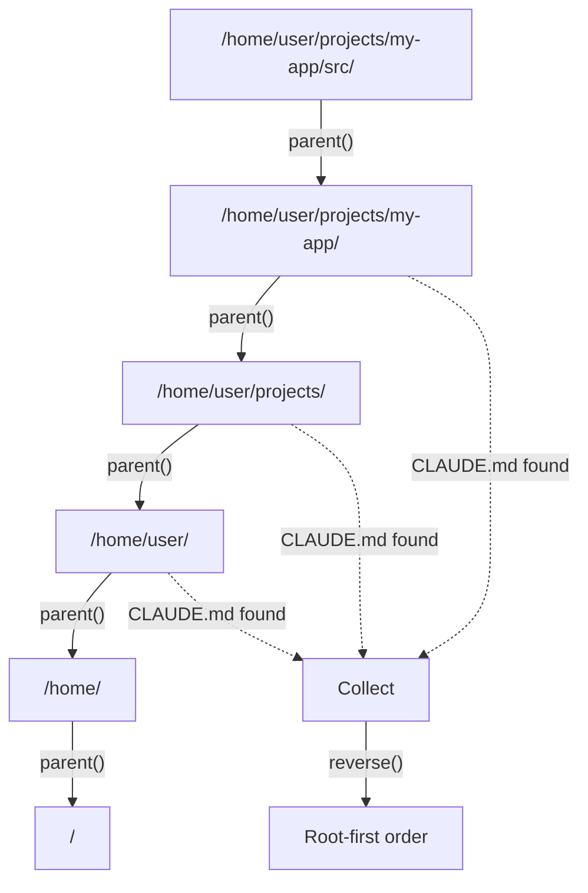

# Chapter 17: Project Instructions

Every coding agent worth its salt understands the project it is working in.
Claude Code reads `CLAUDE.md` files to learn your coding conventions, preferred
libraries, and project-specific quirks. Your agent should do the same.

In this chapter you will build an `InstructionLoader` that discovers instruction
files by walking the filesystem upward from the current directory, loads their
contents, and formats them for injection into the agent's system prompt. It is a
small piece of infrastructure, but the payoff is immediate -- your agent starts
respecting project context the moment it launches.

## Goal

Implement `InstructionLoader` so that:

1. Given a starting directory, it walks upward toward the filesystem root
   looking for instruction files (e.g. `CLAUDE.md`).
2. It returns discovered paths in **root-first** order (outermost files first,
   innermost last).
3. It loads and concatenates file contents with clear headers.
4. It produces a formatted section ready for the system prompt.

## The discovery pattern

Consider a project with this layout:

```
/home/user/CLAUDE.md               <-- global preferences
/home/user/projects/CLAUDE.md      <-- org-level conventions
/home/user/projects/my-app/CLAUDE.md  <-- project-specific rules
/home/user/projects/my-app/src/    <-- you are here
```

When the agent starts in `/home/user/projects/my-app/src/`, it should walk
upward, checking each directory for instruction files. After collecting
everything, it reverses the list so that the broadest context (closest to root)
appears first and project-specific overrides appear last. This mirrors how
Claude Code layers its own `CLAUDE.md` files.



## The implementation

Create a new file at `mini-claw-code-starter/src/instructions.rs`. You will also
need to add `pub mod instructions;` to your `lib.rs` and re-export the struct:

```rust
pub use instructions::InstructionLoader;
```

### The struct

`InstructionLoader` holds a list of file names to search for:

```rust
use std::path::{Path, PathBuf};

pub struct InstructionLoader {
    file_names: Vec<String>,
}
```

It is deliberately simple -- no async, no caching, just a synchronous walker.
Instruction files are tiny and loaded once at startup, so there is no need for
the complexity of async I/O here.

### Step 1: Constructors

Provide two ways to create a loader. The first accepts an explicit list of file
names:

```rust
impl InstructionLoader {
    pub fn new(file_names: &[&str]) -> Self {
        Self {
            file_names: file_names.iter().map(|s| s.to_string()).collect(),
        }
    }
}
```

The second provides sensible defaults:

```rust
pub fn default_files() -> Self {
    Self::new(&["CLAUDE.md", ".mini-claw/instructions.md"])
}
```

This lets users customize the file names if they want, while the common case
requires no configuration at all.

### Step 2: `discover()` -- filesystem traversal

This is the core method. It takes a starting directory and walks upward:

```rust
pub fn discover(&self, start_dir: &Path) -> Vec<PathBuf> {
    let mut found = Vec::new();
    let mut dir = Some(start_dir.to_path_buf());

    while let Some(current) = dir {
        for name in &self.file_names {
            let candidate = current.join(name);
            if candidate.is_file() {
                found.push(candidate);
            }
        }
        dir = current.parent().map(|p| p.to_path_buf());
    }

    // Reverse so root-level files come first
    found.reverse();
    found
}
```

Walk through the key details:

- **`dir = Some(start_dir.to_path_buf())`** -- We use `Option<PathBuf>` to
  drive the loop. When `parent()` returns `None` (we have reached the root),
  the loop ends.
- **Inner loop over `file_names`** -- At each directory level we check every
  file name in the search list. This means a single directory can contribute
  multiple instruction files if both `CLAUDE.md` and
  `.mini-claw/instructions.md` exist there.
- **`candidate.is_file()`** -- A synchronous filesystem check. We only collect
  paths that actually exist and are files.
- **`found.reverse()`** -- The traversal naturally produces innermost-first
  order (we start at the deepest directory). Reversing gives us root-first
  order, which is what we want for layering: broad context first, specific
  overrides last.

### Step 3: `load()` -- reading and concatenating

With discovery in hand, loading is straightforward:

```rust
pub fn load(&self, start_dir: &Path) -> Option<String> {
    let paths = self.discover(start_dir);
    if paths.is_empty() {
        return None;
    }

    let mut sections = Vec::new();
    for path in &paths {
        if let Ok(content) = std::fs::read_to_string(path) {
            let content = content.trim().to_string();
            if !content.is_empty() {
                sections.push(format!(
                    "# Instructions from {}\n\n{}",
                    path.display(),
                    content
                ));
            }
        }
    }

    if sections.is_empty() {
        None
    } else {
        Some(sections.join("\n\n---\n\n"))
    }
}
```

A few things to note:

- **Returns `Option<String>`** -- `None` means no instruction files were found
  (or all were empty). This makes it easy for the caller to skip injection
  entirely.
- **`content.trim()`** -- Strips leading/trailing whitespace so empty files
  (or files with only whitespace) are excluded.
- **Header per file** -- Each section starts with
  `# Instructions from /path/to/CLAUDE.md` so the LLM (and you, when
  debugging) can see exactly where each instruction came from.
- **`---` separator** -- A horizontal rule between sections keeps the output
  readable when multiple files are concatenated.

### Step 4: `system_prompt_section()` -- ready for the agent

The final method wraps the loaded content with a preamble that tells the LLM
to follow the instructions:

```rust
pub fn system_prompt_section(&self, start_dir: &Path) -> Option<String> {
    self.load(start_dir).map(|content| {
        format!(
            "The following project instructions were loaded automatically. \
             Follow them carefully:\n\n{content}"
        )
    })
}
```

This returns `None` when there are no instructions, so integrating it is clean:

```rust
// In your agent setup code:
let loader = InstructionLoader::default_files();
if let Some(section) = loader.system_prompt_section(&current_dir) {
    messages.insert(0, Message::System(section));
}
```

The `Message::System` variant you defined back in Chapter 1 is the right place
for this. System messages sit at the front of the conversation and guide the
LLM's behavior for the entire session.

## Integrating with the agent

To wire this into your agent, add instruction loading to your startup code
(for example, in `main()` or wherever you build the initial message list).
The pattern is:

1. Determine the current working directory.
2. Create an `InstructionLoader` (usually with `default_files()`).
3. Call `system_prompt_section()`.
4. If it returns `Some`, prepend a `Message::System` to your conversation.

```rust
use std::env;
use mini_claw_code::{InstructionLoader, Message};

let cwd = env::current_dir().expect("failed to get current directory");
let loader = InstructionLoader::default_files();

let mut messages = Vec::new();
if let Some(instructions) = loader.system_prompt_section(&cwd) {
    messages.push(Message::System(instructions));
}
// ... continue with user prompt and agent loop
```

That is it. No changes to the agent loop, no changes to the provider. The
instructions flow in as part of the system prompt and the LLM sees them on
every turn.

## Running the tests

Run the Chapter 17 tests:

```bash
cargo test -p mini-claw-code-starter ch17
```

### What the tests verify

- **`test_ch17_discover_in_current_dir`**: Creates a temp directory with a
  `CLAUDE.md` file and verifies `discover()` finds it.
- **`test_ch17_discover_in_parent`**: Creates a `CLAUDE.md` in a parent
  directory and starts discovery from a child. The file should still be found.
- **`test_ch17_no_files_found`**: Searches for a nonexistent file name and
  verifies the result is empty.
- **`test_ch17_load_content`**: Writes a `CLAUDE.md` with known content and
  verifies `load()` returns it.
- **`test_ch17_load_empty_file`**: An empty file should cause `load()` to
  return `None` -- empty instructions are not useful.
- **`test_ch17_multiple_file_names`**: Creates both `CLAUDE.md` and
  `.mini-claw/instructions.md` in the same directory and verifies both are
  loaded.
- **`test_ch17_system_prompt_section`**: Verifies the output includes the
  preamble text ("project instructions") and the file content.
- **`test_ch17_default_files`**: Confirms `default_files()` does not panic.

## Recap

You built a project instruction loader with three layers:

- **`discover()`** walks the filesystem upward, collecting instruction file
  paths in root-first order.
- **`load()`** reads and concatenates those files with clear headers and
  separators.
- **`system_prompt_section()`** wraps the result for direct injection into
  `Message::System`.

The key design choices:

- **Root-first ordering** ensures broad conventions appear before
  project-specific overrides, letting the LLM resolve conflicts by giving
  priority to the most specific instructions (which appear last).
- **`Option<String>` return types** make it trivial to skip injection when no
  files exist.
- **Synchronous I/O** is appropriate here -- instruction files are small and
  loaded once at startup.

Your agent now reads project context automatically. Drop a `CLAUDE.md` in any
directory and the agent picks it up. This is the same pattern that makes tools
like Claude Code project-aware from the first prompt.
