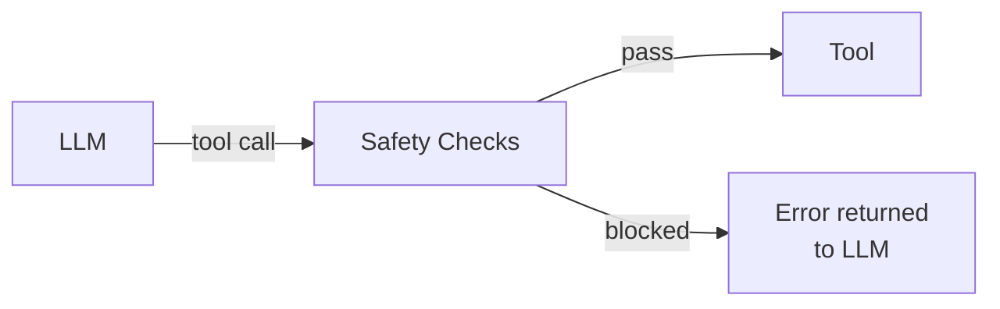
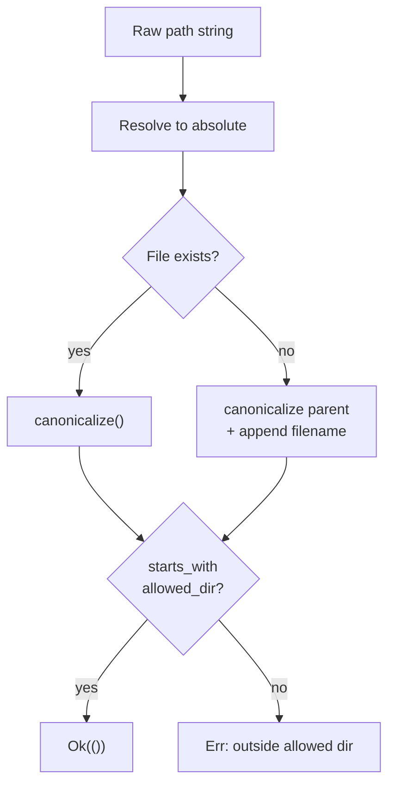

# Chapter 18: Safety Rails

Your agent can now read files, write files, edit code, and run arbitrary shell
commands. Take a moment to appreciate what that means: the LLM -- a statistical
model that occasionally hallucinates -- has root-level access to your file
system and can execute any command your user account can. It can `rm -rf /`. It
can read `/etc/passwd`. It can overwrite your `.env` file with your API keys
exposed. That is terrifying.

Production coding agents like Claude Code invest heavily in multi-layered
safety. In this chapter you will build a miniature version of those safety rails:
a set of composable checks that run *before* every tool call, blocking dangerous
operations before they reach the file system or shell.



## Goal

Implement four types in `safety.rs`:

1. **`SafetyCheck`** trait -- the common interface every check implements.
2. **`PathValidator`** -- ensures file paths stay inside an allowed directory.
3. **`CommandFilter`** -- blocks dangerous shell commands by glob pattern.
4. **`ProtectedFileCheck`** -- prevents writes to sensitive files like `.env`.

Then implement **`SafeToolWrapper`** -- a decorator that wraps any `Box<dyn Tool>`
with a list of safety checks, running them before delegating to the inner tool.

## Key Rust concepts

### The decorator pattern with trait objects

Rust does not have class inheritance, but you can achieve the decorator pattern
with trait objects. A decorator struct holds a `Box<dyn Tool>` and itself
implements `Tool`. From the outside it looks like any other tool. Inside, it
adds behavior (safety checks) before delegating to the wrapped tool.

```rust
struct SafeToolWrapper {
    inner: Box<dyn Tool>,
    checks: Vec<Box<dyn SafetyCheck>>,
}

impl Tool for SafeToolWrapper {
    fn definition(&self) -> &ToolDefinition {
        self.inner.definition()  // delegate
    }

    async fn call(&self, args: Value) -> anyhow::Result<String> {
        // run checks first, then delegate
        self.inner.call(args).await
    }
}
```

This is the same idea as Python's `functools.wraps` or the classic Gang of Four
decorator, but expressed through Rust's trait system.

### `std::path::Path::canonicalize()`

Canonicalizing a path resolves all `.`, `..`, and symbolic links, producing an
absolute path that cannot be tricked by directory traversal:

```rust
let sneaky = Path::new("/home/user/project/../../../etc/passwd");
let resolved = sneaky.canonicalize()?;
// resolved == "/etc/passwd"
```

This is how you defeat `../` attacks. After canonicalization, a simple
`starts_with` check is enough to verify containment.

### `glob::Pattern`

The `glob` crate provides Unix-style glob matching. You will use it to match
both commands and file paths against patterns:

```rust
let pattern = glob::Pattern::new("sudo *").unwrap();
assert!(pattern.matches("sudo reboot"));
assert!(!pattern.matches("echo hello"));
```

The `*` matches any sequence of characters, `?` matches any single character,
and `[abc]` matches character classes. This gives you flexible pattern-based
filtering without writing complex regex.

---

## Step 1: The SafetyCheck trait

Open `mini-claw-code-starter/src/safety.rs` and start with the trait that all
safety checks will implement.

```rust
use std::path::{Path, PathBuf};

use async_trait::async_trait;
use serde_json::Value;

use crate::types::{Tool, ToolDefinition};

/// A check that runs before a tool call is executed.
///
/// Implementations validate tool arguments and return `Ok(())` to allow
/// execution or `Err(reason)` to block it.
pub trait SafetyCheck: Send + Sync {
    fn check(&self, tool_name: &str, args: &Value) -> Result<(), String>;
}
```

A few things to notice:

- The method is **synchronous**. Safety checks inspect arguments -- they do not
  need to do I/O or anything async. Keeping them sync makes them cheap and easy
  to compose.
- It returns `Result<(), String>`, not `anyhow::Result`. The `String` error is
  the human-readable reason the check failed. This keeps safety checks
  self-contained with no dependency on `anyhow`.
- The trait is `Send + Sync` because tools run inside an async runtime and may
  be shared across tasks.
- Every check receives the **tool name** and the **raw arguments**. This lets a
  single check implementation decide which tools it cares about (e.g. a path
  validator only inspects `read`, `write`, and `edit`).

---

## Step 2: PathValidator

The first real check prevents directory traversal attacks. A user (or a confused
LLM) might ask to read `../../etc/passwd` or write to `/root/.ssh/authorized_keys`.
`PathValidator` ensures every file path resolves to somewhere inside an allowed
directory.

### The struct

```rust
pub struct PathValidator {
    allowed_dir: PathBuf,
}

impl PathValidator {
    pub fn new(allowed_dir: impl Into<PathBuf>) -> Self {
        Self {
            allowed_dir: allowed_dir.into(),
        }
    }
}
```

### The core method: `validate_path`

This is where the real logic lives. The method takes a raw path string and
either accepts or rejects it.

```rust
pub fn validate_path(&self, path: &str) -> Result<(), String> {
    let target = Path::new(path);

    // Resolve to absolute path
    let resolved = if target.is_absolute() {
        target.to_path_buf()
    } else {
        self.allowed_dir.join(target)
    };
```

If the path is relative (like `src/main.rs`), we join it with the allowed
directory to get an absolute path. If it is already absolute, we use it as-is.

Next, canonicalize both paths. This is the critical step -- it collapses any
`..` segments:

```rust
    let canonical_allowed = self
        .allowed_dir
        .canonicalize()
        .map_err(|e| format!("cannot resolve allowed directory: {e}"))?;

    let canonical_target = if resolved.exists() {
        resolved
            .canonicalize()
            .map_err(|e| format!("cannot resolve path: {e}"))?
```

But what about new files that do not exist yet? You cannot canonicalize a
non-existent path. The trick is to canonicalize the **parent directory** and
then append the filename:

```rust
    } else {
        // For new files, check the parent directory
        let parent = resolved.parent().ok_or("invalid path")?;
        if parent.exists() {
            let mut canonical = parent
                .canonicalize()
                .map_err(|e| format!("cannot resolve parent: {e}"))?;
            if let Some(filename) = resolved.file_name() {
                canonical.push(filename);
            }
            canonical
        } else {
            return Err(format!(
                "parent directory does not exist: {}",
                parent.display()
            ));
        }
    };
```

Finally, the containment check. After canonicalization, `starts_with` is safe:

```rust
    if canonical_target.starts_with(&canonical_allowed) {
        Ok(())
    } else {
        Err(format!(
            "path {} is outside allowed directory {}",
            canonical_target.display(),
            canonical_allowed.display()
        ))
    }
}
```



### Implementing SafetyCheck for PathValidator

The trait implementation decides *which tools* this check applies to. Path
validation only makes sense for tools that take a `"path"` argument:

```rust
impl SafetyCheck for PathValidator {
    fn check(&self, tool_name: &str, args: &Value) -> Result<(), String> {
        match tool_name {
            "read" | "write" | "edit" => {
                if let Some(path) = args.get("path").and_then(|v| v.as_str()) {
                    self.validate_path(path)
                } else {
                    Ok(()) // No path argument, nothing to check
                }
            }
            _ => Ok(()),
        }
    }
}
```

Notice the `_ => Ok(())` arm. The `bash` tool does not have a `"path"` argument,
so the path validator silently allows it. Each check is responsible only for what
it understands.

---

## Step 3: CommandFilter

The second layer blocks dangerous shell commands. You do not want the LLM to
run `rm -rf /`, `sudo anything`, or write directly to block devices.

### The struct

```rust
pub struct CommandFilter {
    blocked_patterns: Vec<glob::Pattern>,
}
```

### Constructor and defaults

```rust
impl CommandFilter {
    pub fn new(patterns: &[String]) -> Self {
        Self {
            blocked_patterns: patterns
                .iter()
                .filter_map(|p| glob::Pattern::new(p).ok())
                .collect(),
        }
    }

    pub fn default_filters() -> Self {
        Self::new(&[
            "rm -rf /".into(),
            "rm -rf /*".into(),
            "sudo *".into(),
            "> /dev/sda*".into(),
            "mkfs.*".into(),
            "dd if=*of=/dev/*".into(),
            ":(){:|:&};:".into(),
        ])
    }
}
```

The `default_filters()` method creates a baseline set of blocked patterns. That
last one -- `:(){:|:&};:` -- is the infamous bash fork bomb. The `filter_map`
call in the constructor silently drops any patterns that fail to parse, which is
a reasonable default for a list of glob strings.

### The matching method

```rust
pub fn is_blocked(&self, command: &str) -> Option<&str> {
    let trimmed = command.trim();
    for pattern in &self.blocked_patterns {
        if pattern.matches(trimmed) {
            return Some(pattern.as_str());
        }
    }
    None
}
```

It returns `Some(pattern_str)` when a match is found so the error message can
tell the user *which* pattern was triggered. Returning `None` means the command
is allowed.

### Implementing SafetyCheck

```rust
impl SafetyCheck for CommandFilter {
    fn check(&self, tool_name: &str, args: &Value) -> Result<(), String> {
        if tool_name != "bash" {
            return Ok(());
        }
        if let Some(command) = args.get("command").and_then(|v| v.as_str()) {
            if let Some(pattern) = self.is_blocked(command) {
                Err(format!("blocked command matching pattern `{pattern}`"))
            } else {
                Ok(())
            }
        } else {
            Ok(())
        }
    }
}
```

This check only fires for the `bash` tool. It extracts the `"command"` argument
and tests it against every blocked pattern. Clean and focused.

---

## Step 4: ProtectedFileCheck

The third layer protects sensitive files from being overwritten. Even if a path
is inside the allowed directory, you might not want the LLM writing to `.env`,
`.git/config`, or `credentials.json`.

### The struct

```rust
pub struct ProtectedFileCheck {
    patterns: Vec<glob::Pattern>,
}

impl ProtectedFileCheck {
    pub fn new(patterns: &[String]) -> Self {
        Self {
            patterns: patterns
                .iter()
                .filter_map(|p| glob::Pattern::new(p).ok())
                .collect(),
        }
    }
}
```

### Implementing SafetyCheck

This check only applies to *write* operations (`write` and `edit`). Reading a
sensitive file is less dangerous than overwriting it:

```rust
impl SafetyCheck for ProtectedFileCheck {
    fn check(&self, tool_name: &str, args: &Value) -> Result<(), String> {
        match tool_name {
            "write" | "edit" => {
                if let Some(path) = args.get("path").and_then(|v| v.as_str()) {
                    for pattern in &self.patterns {
                        if pattern.matches(path)
                            || pattern.matches(
                                Path::new(path)
                                    .file_name()
                                    .unwrap_or_default()
                                    .to_str()
                                    .unwrap_or(""),
                            )
                        {
                            return Err(format!(
                                "file `{path}` is protected (matches pattern `{}`)",
                                pattern.as_str()
                            ));
                        }
                    }
                    Ok(())
                } else {
                    Ok(())
                }
            }
            _ => Ok(()),
        }
    }
}
```

There is a subtlety here: the check matches the pattern against both the full
path *and* just the filename. This means a pattern like `.env` will match
`/home/user/project/.env` as well as just `.env`. Without this, a user would
need to write patterns for every possible directory prefix.

---

## Step 5: SafeToolWrapper -- the decorator

Now you have three independent safety checks. The final piece is the glue that
attaches them to actual tools. `SafeToolWrapper` wraps any `Box<dyn Tool>` and
runs all checks before delegating to the inner tool.

### The struct

```rust
pub struct SafeToolWrapper {
    inner: Box<dyn Tool>,
    checks: Vec<Box<dyn SafetyCheck>>,
}
```

Two fields: the wrapped tool and a list of checks (each a trait object). This
means you can mix and match checks freely -- attach just a path validator, or
stack all three.

### Constructors

```rust
impl SafeToolWrapper {
    pub fn new(tool: Box<dyn Tool>, checks: Vec<Box<dyn SafetyCheck>>) -> Self {
        Self {
            inner: tool,
            checks,
        }
    }

    pub fn with_check(tool: Box<dyn Tool>, check: impl SafetyCheck + 'static) -> Self {
        Self::new(tool, vec![Box::new(check)])
    }
}
```

`with_check` is a convenience for the common case of a single check. The
`'static` bound is needed because the check will be stored in a `Box`.

### Implementing Tool

This is the core of the decorator pattern:

```rust
#[async_trait]
impl Tool for SafeToolWrapper {
    fn definition(&self) -> &ToolDefinition {
        self.inner.definition()
    }

    async fn call(&self, args: Value) -> anyhow::Result<String> {
        let tool_name = self.inner.definition().name;
        for check in &self.checks {
            if let Err(reason) = check.check(tool_name, &args) {
                return Ok(format!("error: safety check failed: {reason}"));
            }
        }
        self.inner.call(args).await
    }
}
```

Key design decisions:

1. **`definition()` delegates directly.** The wrapped tool's schema is unchanged.
   The LLM sees the exact same tool definition -- it has no idea safety checks
   exist. The safety layer is invisible.

2. **Failed checks return `Ok(...)`, not `Err(...)`**. This is intentional. A
   safety check failure is not a program crash -- it is a message back to the
   LLM explaining why the operation was blocked. The LLM can then adjust its
   approach. If we returned `Err`, the agent loop might interpret it as a fatal
   error and abort.

3. **All checks run sequentially.** If any check fails, the tool call is
   blocked immediately. The remaining checks do not run. This is a fail-fast
   approach -- one "no" is enough.

4. **The tool name comes from the inner tool's definition.** This means checks
   see the real tool name (e.g. `"read"`, `"bash"`) and can filter accordingly.

---

## Putting it together

Here is how you would wire up safety checks when building your agent:

```rust
use crate::safety::*;
use crate::tools::*;

// Create a ReadTool with path validation
let allowed_dir = std::env::current_dir().unwrap();
let validator = PathValidator::new(&allowed_dir);
let safe_read = SafeToolWrapper::with_check(
    Box::new(ReadTool::new()),
    validator,
);

// Create a BashTool with command filtering
let safe_bash = SafeToolWrapper::with_check(
    Box::new(BashTool),
    CommandFilter::default_filters(),
);

// Create a WriteTool with multiple checks
let safe_write = SafeToolWrapper::new(
    Box::new(WriteTool),
    vec![
        Box::new(PathValidator::new(&allowed_dir)),
        Box::new(ProtectedFileCheck::new(&[
            ".env".into(),
            ".env.*".into(),
            "*.pem".into(),
            "*.key".into(),
        ])),
    ],
);
```

Because `SafeToolWrapper` itself implements `Tool`, it slots into the existing
`ToolSet` with no changes to the agent loop. The agent does not know or care
that safety checks exist. This is the power of the decorator pattern -- you add
behavior without modifying existing code.

---

## Running the tests

Run the Chapter 18 tests:

```bash
cargo test -p mini-claw-code ch18
```

### What the tests verify

**PathValidator:**
- **`test_ch18_path_within_allowed`**: A file inside the allowed directory is
  accepted.
- **`test_ch18_path_outside_allowed`**: `/etc/passwd` is rejected when the
  allowed directory is a temp dir.
- **`test_ch18_path_traversal_blocked`**: A path like
  `allowed/sub/../../../etc/passwd` is rejected after canonicalization.
- **`test_ch18_path_new_file_in_allowed`**: A file that does not exist yet but
  whose parent is inside the allowed directory is accepted.
- **`test_ch18_safety_check_read_tool`**: The `SafetyCheck` impl correctly
  checks paths for the `read` tool.
- **`test_ch18_safety_check_ignores_bash`**: The `PathValidator` ignores the
  `bash` tool (no `"path"` argument).

**CommandFilter:**
- **`test_ch18_command_filter_blocks_rm_rf`**: `rm -rf /` and `rm -rf /*` are
  blocked.
- **`test_ch18_command_filter_blocks_sudo`**: `sudo rm file` matches the
  `sudo *` pattern.
- **`test_ch18_command_filter_allows_safe`**: `ls -la`, `echo hello`, and
  `cargo test` pass through.
- **`test_ch18_command_filter_safety_check`**: The `SafetyCheck` impl blocks
  `sudo reboot` via the `bash` tool and allows `echo safe`.
- **`test_ch18_custom_blocked_commands`**: Custom patterns like `docker rm *`
  and `npm publish*` work correctly.

**ProtectedFileCheck:**
- **`test_ch18_protected_file_blocks_env`**: Writing to `.env` or `.env.local`
  is blocked.
- **`test_ch18_protected_file_allows_normal`**: Writing to `src/main.rs` is
  allowed.

**SafeToolWrapper:**
- **`test_ch18_wrapper_blocks_on_check_failure`**: A wrapped `ReadTool` returns
  a `"safety check failed"` message when the path is outside the allowed
  directory.
- **`test_ch18_wrapper_allows_valid_call`**: A wrapped `ReadTool` successfully
  reads a file inside the allowed directory, proving the decorator delegates
  correctly.

---

## Defense in depth

No single check catches everything. That is the point of layered security.
Consider what happens when the LLM asks to write to
`/home/user/project/.env`:

1. **PathValidator** -- checks if the path is inside the allowed directory.
   If the allowed directory is `/home/user/project`, this passes. The path is
   technically inside the project.
2. **ProtectedFileCheck** -- catches it. `.env` matches the protected pattern.
   The write is blocked.
3. **CommandFilter** -- does not apply. This is a `write` tool call, not `bash`.

Now consider `rm -rf /` via the bash tool:

1. **PathValidator** -- does not apply. `bash` has no `"path"` argument.
2. **ProtectedFileCheck** -- does not apply. This is not a `write` or `edit`.
3. **CommandFilter** -- catches it. The command matches `rm -rf /`.

And a path traversal attack via `read`:

1. **PathValidator** -- catches it. Canonicalization resolves the `..` segments
   and the path ends up outside the allowed directory.
2. The other checks never need to fire.

Each layer covers a different attack surface. Together they form a mesh that is
much harder to slip through than any single check. This is the principle of
**defense in depth** -- do not rely on one gatekeeper; stack them.

### Limitations

This is a tutorial implementation. A production safety system would also need:

- **Confirmation prompts** for destructive but non-blocked operations (e.g.
  deleting a file within the project).
- **Rate limiting** to prevent an LLM from making thousands of tool calls.
- **Regex-based command filtering** for more precise matching than globs allow.
- **Audit logging** so you can review every tool call after the fact.
- **Sandboxing** (containers, VMs) as the ultimate backstop.

But the architecture you built here -- a trait-based system of composable checks
wired through a decorator -- is exactly the right foundation. Adding more checks
is just implementing one more `SafetyCheck`.

## Recap

You built a safety layer with four components:

| Type | Purpose | Applies to |
|---|---|---|
| `SafetyCheck` trait | Common interface | All checks |
| `PathValidator` | Prevent directory traversal | `read`, `write`, `edit` |
| `CommandFilter` | Block dangerous commands | `bash` |
| `ProtectedFileCheck` | Guard sensitive files | `write`, `edit` |
| `SafeToolWrapper` | Decorator that runs checks | Any `Box<dyn Tool>` |

The key patterns:

- **Canonicalize before comparing** -- never trust raw path strings.
- **Glob matching** -- flexible pattern-based filtering for both commands and
  file paths.
- **Decorator pattern** -- wrap a trait object with additional behavior without
  modifying the original.
- **Defense in depth** -- layer independent checks so no single bypass defeats
  the entire system.

Your agent is no longer a terrifying root-access footgun. It still has power,
but now that power flows through safety rails that you control.
