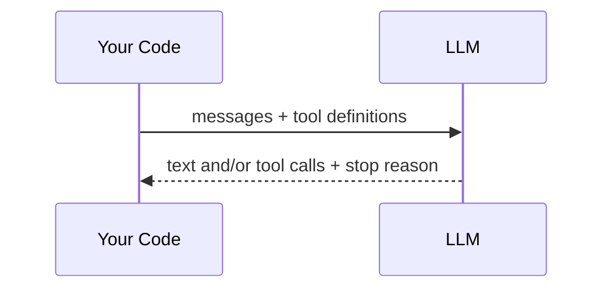
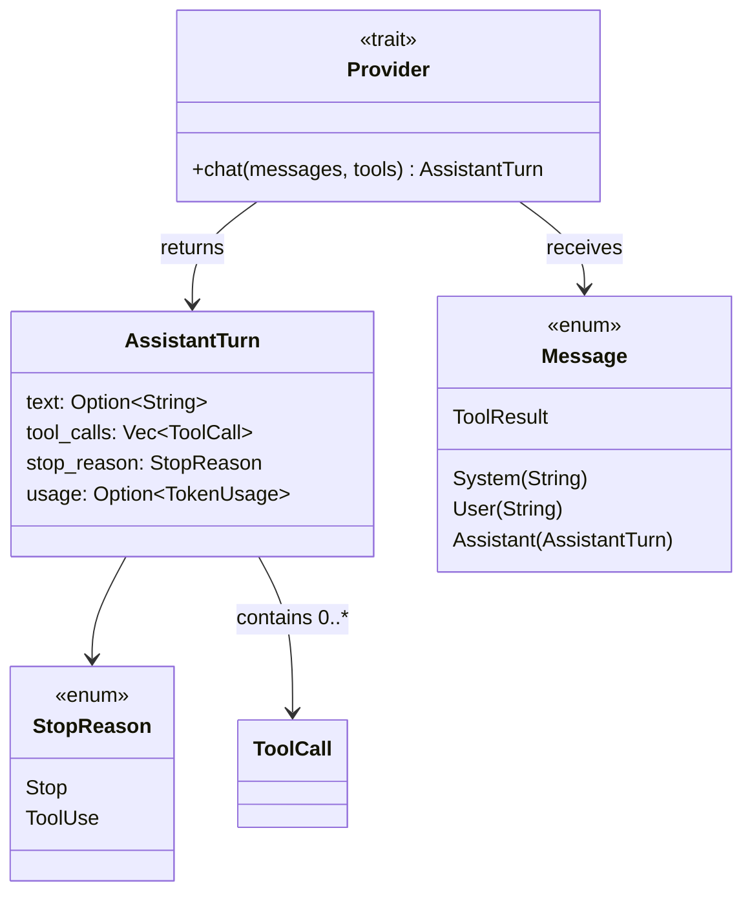

# 第 1 章：第一次 LLM 调用

> **需编辑的文件：** `src/mock.rs`
> **运行测试：** `cargo test -p mini-claw-code-starter test_mock_`
> **预计时间：** 15 分钟

构建 agent 之前，得先学会和 LLM 对话。这一章来实现 `MockProvider`，一个返回预设响应的假 LLM。不用 API key，不用 HTTP，不用网络。只有协议本身。

## 名词解释

写代码之前，先用一句话介绍第 1–3 章会遇到的各个类型。它们都已经在 `src/types.rs` 里定义好了，这份列表只是让这些名字不再陌生。第 4 章会深入讲解；现在每个类型一句话够了：

| 类型 | 含义 |
|------|------|
| `Message` | 对话条目的枚举：`System`、`User`、`Assistant`、`ToolResult`、`Attachment`、`Progress`。|
| `AssistantTurn` | LLM 的返回值：可选的 `text`、一个 `Vec<ToolCall>`、一个 `StopReason`、可选的 `TokenUsage`。|
| `StopReason` | `Stop`（LLM 完成了）或 `ToolUse`（它想调用工具）。|
| `ToolCall` | LLM 发起的工具调用请求：`id`、`name`、JSON `arguments`。|
| `ToolDefinition` | 工具的 JSON Schema 描述，发给 LLM 让它知道有哪些工具可用。|
| `Tool` | 带有 `definition()` 和 `call()` 的 trait，实现它就能给 agent 加新能力。|
| `ToolSet` | `HashMap<String, Box<dyn Tool>>`，按名称分发工具调用。|
| `Provider` | 带有 `chat()` 方法的 trait，对"能响应消息的 LLM"的抽象。|

之后哪个概念模糊了，随时回来查。第 4 章会从头带注释地重建所有这些类型。

## 目标

实现 `MockProvider`，满足：

1. 用 `VecDeque<AssistantTurn>` 的预设响应列表创建它。
2. 每次调用 `chat()` 返回队列里的下一个响应。
3. 响应全部消费完后返回错误。

## 协议

每次 LLM 交互都遵循同一个模式：



发送消息和可用工具列表，LLM 返回文本、工具调用或两者兼有，再加上 `StopReason` 告诉你下一步怎么做。

用 Rust 表示，就是一个 trait 加一个方法：

```rust
pub trait Provider: Send + Sync {
    fn chat(
        &self,
        messages: &[Message],
        tools: &[&ToolDefinition],
    ) -> impl Future<Output = anyhow::Result<AssistantTurn>> + Send;
}
```

## 核心类型

打开 `mini-claw-code-starter/src/types.rs`，这些类型已经写好了，读一遍理解协议：



LLM 返回 `AssistantTurn`：

```rust
pub struct AssistantTurn {
    pub text: Option<String>,          // what the LLM said
    pub tool_calls: Vec<ToolCall>,     // tools it wants to call
    pub stop_reason: StopReason,       // Stop or ToolUse
    pub usage: Option<TokenUsage>,     // token counts (optional)
}
```

两种结果：
- **`StopReason::Stop`** — LLM 完成了，从 `text` 读答案
- **`StopReason::ToolUse`** — LLM 想调用工具，从 `tool_calls` 读

就这些。Claude Code、Cursor、Copilot，每个 coding agent 都跑在这同一个协议上。

## 关键 Rust 概念：用 `Mutex` 实现内部可变性

`Provider` trait 接受 `&self` 而不是 `&mut self`，因为 provider 在异步任务间共享。但 `MockProvider` 需要修改响应队列。解法是 `Mutex<VecDeque<AssistantTurn>>`，通过共享引用也能修改队列。

```rust
pub struct MockProvider {
    responses: Mutex<VecDeque<AssistantTurn>>,
}
```

在 `&self` 方法里用 `Mutex` 包裹共享状态，这个模式在 async Rust 里随处可见。

## 实现

打开 `src/mock.rs`，能看到 struct 定义和两个 stub。

### 第一步：`new()`

把 `VecDeque` 包进 `Mutex`：

```rust
pub fn new(responses: VecDeque<AssistantTurn>) -> Self {
    Self {
        responses: Mutex::new(responses),
    }
}
```

### 第二步：`chat()`

锁 mutex，弹出队列头部的响应，把 `None` 转成错误：

```rust
async fn chat(
    &self,
    _messages: &[Message],
    _tools: &[&ToolDefinition],
) -> anyhow::Result<AssistantTurn> {
    self.responses
        .lock()
        .unwrap()
        .pop_front()
        .ok_or_else(|| anyhow::anyhow!("MockProvider: no more responses"))
}
```

三行逻辑。mock 完全忽略 `messages` 和 `tools`，只返回下一个预设响应。

## 运行测试

```bash
cargo test -p mini-claw-code-starter test_mock_
```

14 个测试验证你的 mock：
- **`test_mock_returns_text`** — 基本文本响应
- **`test_mock_returns_tool_calls`** — 包含工具调用的响应
- **`test_mock_steps_through_sequence`** — 多次调用保持 FIFO 顺序
- **`test_mock_empty_responses_exhausted`** — 队列为空时返回错误
- **`test_mock_ignores_messages_and_tools`** — mock 不看输入
- **`test_mock_long_sequence`** — 按顺序消费 10 个响应

## 刚才发生了什么

你实现了 `Provider` trait，每个 LLM 后端都得满足这个接口。`MockProvider` 是整本书的测试主力，所有测试都用它，不调真实 API。

之后（[第 5b 章](./ch05b-openrouter-streaming.md)）会看到 `OpenRouterProvider`，发真实 HTTP 请求。但 trait 一样。换掉 provider，其余代码无需改动。

## 核心要点

LLM 就是个函数：消息进去，（文本、工具调用、停止原因）出来。其他都是管道。

## 自我检测

{{#quiz ../quizzes/ch01.toml}}

---

[← 目录](./ch00-overview.md) · [第 2 章：第一次工具调用 →](./ch02-first-tool.md)
