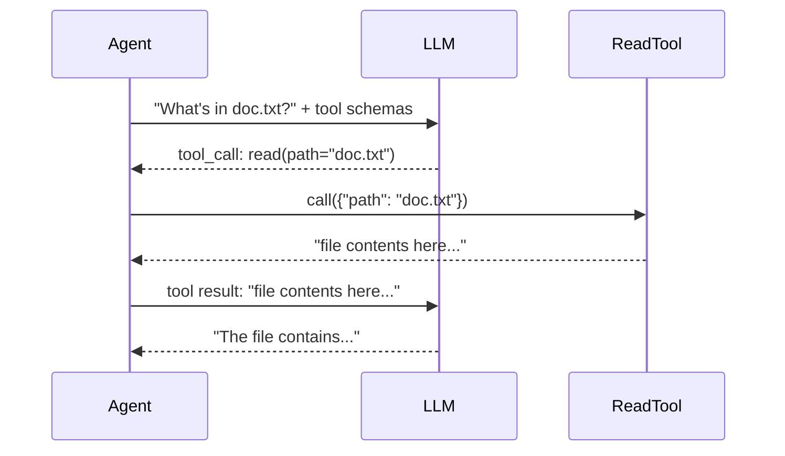
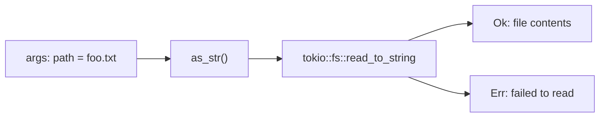

# 第 2 章：第一次工具调用

> **需编辑的文件：** `src/tools/read.rs`
> **运行测试：** `cargo test -p mini-claw-code-starter test_read_`
> **预计时间：** 15 分钟

LLM 不能读文件、跑命令、也不能上网。它只能生成文本。但它可以*请求你的代码*去做这些事。这就是工具。

## 目标

实现 `ReadTool`，满足：

1. 声明自己的名称、描述和参数 schema。
2. 以 `{"path": "some/file.txt"}` 调用时，读取文件并返回内容。
3. 参数缺失或文件不存在时报错。

## 工具调用的工作原理

LLM 不直接碰文件系统。它描述想要什么，你的代码去做：



LLM 看到描述每个工具的 JSON schema。决定用某个工具时，会输出包含工具名和参数的结构化请求。你的代码解析请求，运行真正的函数，把结果发回去。

## Tool trait

打开 `mini-claw-code-starter/src/types.rs`，找到 `Tool` trait：

```rust
#[async_trait::async_trait]
pub trait Tool: Send + Sync {
    fn definition(&self) -> &ToolDefinition;
    async fn call(&self, args: Value) -> anyhow::Result<String>;
}
```

两个方法：
- **`definition()`** 返回 JSON schema，告诉 LLM 这个工具的作用和参数
- **`call()`** 执行工具，返回字符串结果

### 为什么 `Tool` 用 `#[async_trait]`，而 `Provider` 不用？

这个分歧贯穿全书，值得现在就搞清楚：

- **`Tool` 用 `#[async_trait]`**，因为工具要异构存储在 `Box<dyn Tool>` 里（`ReadTool` 和 `BashTool` 共存于同一个 `HashMap`）。`Box<dyn …>` 要求*对象安全*，而 trait 里的普通 `async fn` 不满足这一点——它返回的匿名 future 类型编译器无法擦除。`#[async_trait]` 宏把 `async fn call(&self, …)` 改写成 `fn call(&self, …) -> Pin<Box<dyn Future + Send + '_>>`，就满足了。每次调用多一次堆分配，相比工具要做的 I/O，这点开销微不足道。
- **`Provider` 用 RPITIT**（return-position `impl Trait` in traits，Rust 1.75 稳定），因为我们只把它当泛型参数用——`SimpleAgent<P: Provider>`，从不用 `dyn Provider`。不需要对象安全，就能用零成本版本：不装箱、不分配，编译器为每个实现单态化出独立的 future 类型。

两句助记规则：

```text
stored as Box<dyn T>           → #[async_trait]  (boxed future, object-safe)
used as a generic P: Trait     → RPITIT          (zero-cost, not object-safe)
```

这就是全部权衡。[第 6 章](./ch06-tool-interface.md#async-styles) 会在你见过两个 trait 之后，并排展示完整的 `Provider` 签名再回顾一次。

## 实现

打开 `src/tools/read.rs`，能看到 struct 和两个 stub。

### 第一步：定义

用 JSON Schema 向 LLM 描述工具：

```rust
pub fn new() -> Self {
    Self {
        definition: ToolDefinition::new("read", "Read the contents of a file.")
            .param("path", "string", "Absolute path to the file", true),
    }
}
```

`.param()` 构建器添加参数，包括类型、描述和是否必填。LLM 看到这个 schema，就知道可以调用名为 `"read"` 的工具，传一个必填的字符串参数 `"path"`。

### 第二步：调用

从 JSON 参数里取出路径，读文件，返回内容：

```rust
async fn call(&self, args: Value) -> anyhow::Result<String> {
    let path = args["path"]
        .as_str()
        .context("missing 'path' argument")?;

    tokio::fs::read_to_string(path)
        .await
        .with_context(|| format!("failed to read '{path}'"))
}
```

三行逻辑。`args` 是 `serde_json::Value`，LLM 传来的已解析 JSON 参数。`context()` 和 `with_context()`（来自 `anyhow`）补充可读的错误信息。

数据流：



## 运行测试

```bash
cargo test -p mini-claw-code-starter test_read_
```

15 个测试验证你的工具：
- **`test_read_read_definition`** — schema 有正确的名称和必填参数
- **`test_read_read_file`** — 从临时目录读真实文件
- **`test_read_read_missing_file`** — 文件不存在时返回错误
- **`test_read_read_missing_arg`** — `path` 缺失时返回错误
- **`test_read_read_utf8_content`** — 多行内容处理正确
- **`test_read_read_empty_file`** — 读空文件不报错

## 套路

项目里每个工具都是同一个三步套路：

1. **定义** — `ToolDefinition::new("name", "description").param(...)`
2. **提取** — 从 JSON `Value` 里取参数
3. **执行** — 做实际工作，返回 `String`

后面章节写 `WriteTool`、`EditTool`、`BashTool` 都是这套。写过一个，其他的就会了。

## 核心要点

工具是"LLM 想读文件"和"文件真的被读了"之间的桥梁。LLM 把意图表达成结构化 JSON，你的代码负责执行。

## 自我检测

{{#quiz ../quizzes/ch02.toml}}

---

[← 第 1 章：第一次 LLM 调用](./ch01-first-llm-call.md) · [目录](./ch00-overview.md) · [第 3 章：Agentic 循环 →](./ch03-agentic-loop.md)
