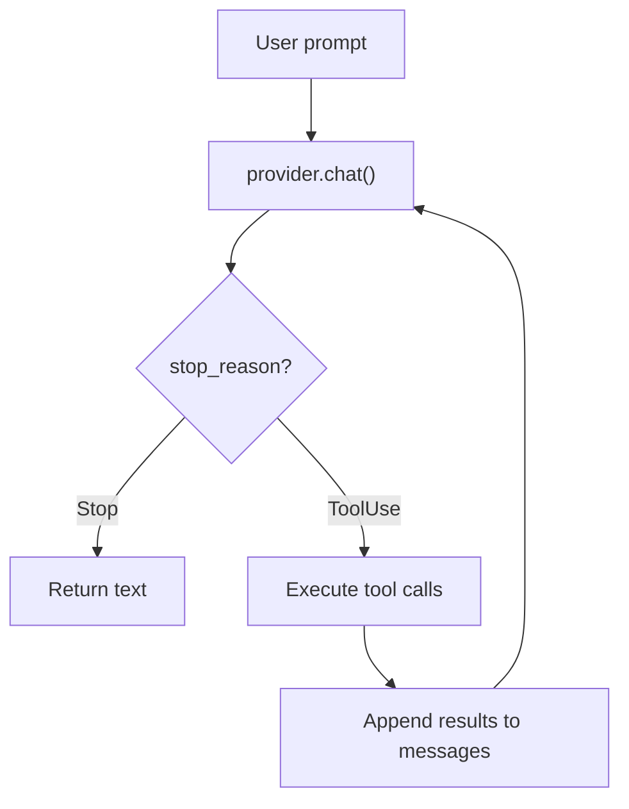
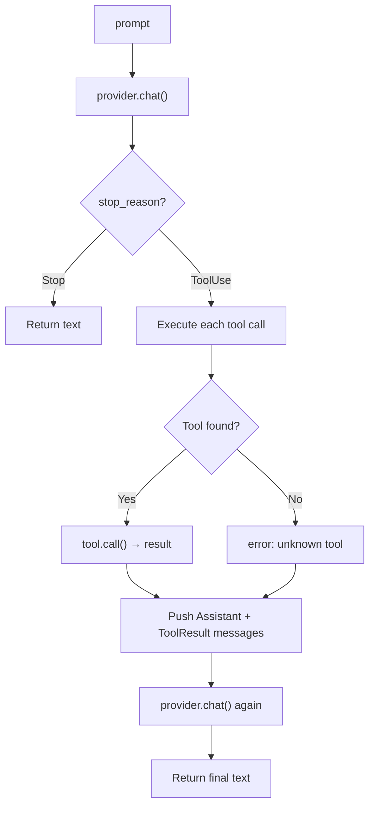

# 第 3 章：Agent 循环

> **需编辑的文件：** `src/agent.rs`
> **运行测试：** `cargo test -p mini-claw-code-starter test_single_turn_`（single_turn），`cargo test -p mini-claw-code-starter test_simple_agent_`（SimpleAgent）
> **预计时间：** 20 分钟

provider（和 LLM 通信）有了，工具（读文件）有了，现在把它们连起来。agent 就在这里活过来。

## 目标

实现两件事：

1. **`single_turn()`** — 处理一次 prompt，最多一轮工具调用
2. **`SimpleAgent`** — 把 `single_turn` 包进循环，持续跑直到 LLM 完成

### 第 3 章的范围（以及不在范围内的）

打开 `src/agent.rs`，能看到五个 `unimplemented!()` stub。只有四个是第 3 章的任务：

| Stub                      | 章节 | 说明                                               |
|---------------------------|---------|-----------------------------------------------------|
| `single_turn`             | 第 3 章     | 一次 prompt，最多一轮工具调用                  |
| `SimpleAgent::execute_tools` | 第 3 章  | 查找每个工具，收集 `(id, content)` 对    |
| `SimpleAgent::push_results`  | 第 3 章  | 推入 `Assistant` 轮，再逐个推入 `ToolResult`   |
| `SimpleAgent::chat`       | 第 3 章     | agent 主循环                                 |
| `SimpleAgent::run_with_history` | 第 7 章 | 基于事件的循环，**现在保持 stub 状态**      |

`run_with_history` / `run_with_events` 是第 7 章（`AgentEvent` 驱动执行）的内容。`test_simple_agent_` 不会调用它们，那里的 `unimplemented!()` 不会触发 panic。第 7 章引入事件模型之前，忽略它们即可。

## 核心思想

Claude Code、Cursor、Aider，每个编程 agent 都是这个循环：

```
loop {
    response = provider.chat(messages, tools)
    if response.stop_reason == Stop:
        return response.text
    for call in response.tool_calls:
        result = tools.execute(call)
        messages.append(result)
}
```

LLM 决定何时停止，你的代码照指令执行。



## 第一部分：single_turn()

从简单的开始。`single_turn()` 处理一次 prompt，最多一轮工具调用，暂时没有循环。

### Rust 关键概念：ToolSet

函数接受 `&ToolSet`，一个以名称为键的 `HashMap<String, Box<dyn Tool>>`，O(1) 查找：

```rust
pub async fn single_turn<P: Provider>(
    provider: &P,
    tools: &ToolSet,
    prompt: &str,
) -> anyhow::Result<String>
```

### 执行流程



### 实现

```rust
pub async fn single_turn<P: Provider>(
    provider: &P,
    tools: &ToolSet,
    prompt: &str,
) -> anyhow::Result<String> {
    let defs = tools.definitions();
    let mut messages = vec![Message::User(prompt.to_string())];

    let turn = provider.chat(&messages, &defs).await?;

    match turn.stop_reason {
        StopReason::Stop => Ok(turn.text.unwrap_or_default()),
        StopReason::ToolUse => {
            // Execute each tool call, collect results
            let mut results = Vec::new();
            for call in &turn.tool_calls {
                let content = match tools.get(&call.name) {
                    Some(t) => t.call(call.arguments.clone())
                        .await
                        .unwrap_or_else(|e| format!("error: {e}")),
                    None => format!("error: unknown tool `{}`", call.name),
                };
                results.push((call.id.clone(), content));
            }

            // Feed results back to the LLM
            messages.push(Message::Assistant(turn));
            for (id, content) in results {
                messages.push(Message::ToolResult { id, content });
            }

            let final_turn = provider.chat(&messages, &defs).await?;
            Ok(final_turn.text.unwrap_or_default())
        }
    }
}
```

三个关键细节：

1. **先收集结果，再推入 `Message::Assistant(turn)`** — push 会移走 `turn`，之后就没法借用 `turn.tool_calls` 了
2. **工具失败不崩溃** — 用 `unwrap_or_else` 捕获错误，以字符串返回。LLM 读到错误会自行调整
3. **未知工具返回错误字符串，不 panic** — LLM 可能幻觉出一个工具名，agent 要能优雅处理

### 测试

```bash
cargo test -p mini-claw-code-starter test_single_turn_
```

共 14 个测试，包括：
- **`test_single_turn_direct_response`** — LLM 直接响应，不调工具
- **`test_single_turn_one_tool_call`** — LLM 读文件，再回答
- **`test_single_turn_unknown_tool`** — LLM 调了个不存在的工具，收到错误，自行恢复
- **`test_single_turn_provider_error`** — provider 返回错误，正确传播

## 第二部分：SimpleAgent

`single_turn` 处理一轮。真正的 agent 要循环跑，直到 LLM 完成。这就是 `SimpleAgent`。

### 结构体

```rust
pub struct SimpleAgent<P: Provider> {
    provider: P,
    tools: ToolSet,
}
```

### 构造函数与构建器

```rust
pub fn new(provider: P) -> Self {
    Self { provider, tools: ToolSet::new() }
}

pub fn tool(mut self, t: impl Tool + 'static) -> Self {
    self.tools.push(t);
    self
}
```

构建器模式支持链式注册工具：

```rust
let agent = SimpleAgent::new(provider)
    .tool(ReadTool::new())
    .tool(WriteTool::new())
    .tool(BashTool::new());
```

### 旁注：谁来决定 `Stop` 还是 `ToolUse`？

是模型决定的。`StopReason` 不是我们从响应里算出来的，而是 LLM API 返回的字段，*描述模型做了什么*。模型输出纯文本并停止时，API 报告 `stop`（或 `end_turn`）；模型输出了一个或多个工具调用块、等待调用方执行时，API 报告 `tool_use`（OpenAI 叫 `tool_calls`）。`StopReason` enum 只是把这个 API 字段翻译成 Rust 类型，决策本身已经烘焙进模型的生成过程。

实际上，模型在一次前向传播中就做出决定：一旦开始写工具调用块，大多数 provider 就会强制响应在该块处终止并返回 `tool_use`。不会先产生文本，再单独决定要不要调工具。所以下面的循环看起来才这么简洁——不用猜停止原因，直接按它分发。

---

### 循环：`chat()`

这是把 `single_turn` 泛化成循环的版本。不再调两次 provider 后返回，而是持续跑到 `StopReason::Stop`：

```rust
pub async fn chat(&self, messages: &mut Vec<Message>) -> anyhow::Result<String> {
    let defs = self.tools.definitions();

    loop {
        let turn = self.provider.chat(messages, &defs).await?;

        match turn.stop_reason {
            StopReason::Stop => {
                let text = turn.text.clone().unwrap_or_default();
                messages.push(Message::Assistant(turn));
                return Ok(text);
            }
            StopReason::ToolUse => {
                let results = self.execute_tools(&turn.tool_calls).await;
                Self::push_results(messages, turn, results);
            }
        }
    }
}
```

注意：推入 `Message::Assistant(turn)` **之前**先 clone `turn.text`，push 会移走 `turn`。

**`run()`** 是便捷包装器：

```rust
pub async fn run(&self, prompt: &str) -> anyhow::Result<String> {
    let mut messages = vec![Message::User(prompt.to_string())];
    self.chat(&mut messages).await
}
```

辅助方法 `execute_tools()` 和 `push_results()` 把工具执行和消息构建分离出来，`agent.rs` 的 stub 里有它们的签名。

### 测试

```bash
cargo test -p mini-claw-code-starter test_simple_agent_
```

共 16 个测试，包括：
- **`test_simple_agent_simple_text`** — 单轮文本响应
- **`test_simple_agent_multi_step`** — LLM 读文件，再写出响应
- **`test_simple_agent_three_turn_loop`** — 读取 → 编辑 → 验证，三轮循环
- **`test_simple_agent_error_recovery`** — 工具失败，LLM 读到错误自行恢复

## 你做了什么

你搭出了一个编程 agent。

```rust
let agent = SimpleAgent::new(provider)
    .tool(ReadTool::new())
    .tool(WriteTool::new())
    .tool(BashTool::new());

let answer = agent.run("What files are in this directory?").await?;
```

agent 把 prompt 发给 LLM，LLM 调 `bash("ls")`，agent 执行，把输出反馈回去，LLM 汇总结果。这个循环能处理任意数量的工具调用、任意多轮。

这就是架构。其他一切——流式、权限、计划模式、子 agent——都建在这个循环之上。

## 自我检测

{{#quiz ../quizzes/ch03.toml}}

---

[← 第 2 章：第一次工具调用](./ch02-first-tool.md) · [目录](./ch00-overview.md) · [第 4 章：消息与类型 →](./ch04-messages-types.md)
