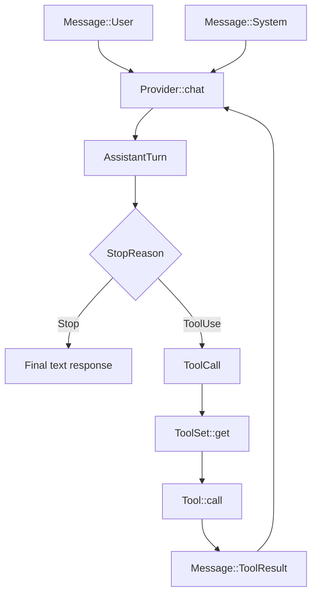

# 第 4 章：消息与类型

> **需要编辑的文件：** 无。starter 中的 `src/types.rs` 已预填完整。
> 本章是纯阅读，对已在使用的类型系统做一次深入梳理。
> **运行测试：** `cargo test -p mini-claw-code-starter test_mock_` 在本章前后均可通过，因为实际实现在 `src/mock.rs` 中——那是你在[第 1 章](./ch01-first-llm-call.md)填写的内容。这些测试验证的是 `types.rs` 中定义的类型结构，这就是我们在此将它们关联起来的原因。
> **预计时间：** 20 分钟（仅阅读）

## 目标

- 理解 `Message` enum 的四个变体（`System`、`User`、`Assistant`、`ToolResult`），每个对话参与者都有对应的类型表示。
- 理解 `ToolDefinition` 的构建器模式：为什么工具在构造时描述自己的 JSON Schema 参数，而不是手写 JSON。
- 理解 `ToolSet` 作为运行时注册表，让 agent 按名称分发工具调用。
- 理解 `Provider` trait 的 RPITIT 签名：为什么它能让任意 LLM 后端自由替换，而无需改动 agent 代码。

每个编程 agent 的核心都是一个对话循环。用户发言，模型回复，工具产生结果，结果再反馈给模型。构建这个循环之前，需要一套类型系统来表示对话中的每个参与者和每种载荷。

这一章梳理整个代码库所依赖的基础类型。`src/types.rs` 在 starter 中已经完整，不需要动手写代码。读通为止；动手编码从第 5a 章重新开始。

## 类型之间的关系



## 为什么需要丰富的消息类型？

看过原始的 LLM API（OpenAI、Anthropic），消息是带有 `role` 字段的 JSON 块：`"system"`、`"user"` 或 `"assistant"`。单轮聊天机器人够用，但编程 agent 还需要：

- **工具结果**：携带对应工具调用的 ID，让模型在单轮多工具时能对上请求和响应。
- **系统指令**：配置模型的行为。

Claude Code 把这些统一建模为单个 `Message` enum 的变体。我们的 starter 用了简化版，包含四个变体。

## 文件布局

所有类型都在一个文件：`src/types.rs`。包括 `Message` enum、`AssistantTurn`、`ToolDefinition`、`ToolCall`、`Tool` trait、`ToolSet`、`Provider` trait、`TokenUsage` 和 `StopReason`。

---

## 1.1 Message enum

包含四个变体的完整 enum：

```rust
pub enum Message {
    System(String),
    User(String),
    Assistant(AssistantTurn),
    ToolResult { id: String, content: String },
}
```

starter 用的是简单枚举变体，没有包装结构体，没有消息 ID，没有 serde 标签，没有构造函数——直接构造变体就好：

```rust
let msg = Message::User("Hello".to_string());
let sys = Message::System("You are a helpful assistant".to_string());
let result = Message::ToolResult {
    id: call_id.clone(),
    content: "file contents here".to_string(),
};
```

逐一看每个变体。

### System

```rust
Message::System(String)
```

System 消息携带由 agent 注入的指令，不是用户输入的内容。用来配置模型行为（比如"你是一个编程助手"）。

### User

```rust
Message::User(String)
```

直接明了——用户的输入，每轮一条。

### Assistant

```rust
Message::Assistant(AssistantTurn)
```

最丰富的变体。模型的响应包裹在 `AssistantTurn` 结构体中（下面会介绍）。模型可以返回文本、工具调用，或两者兼有。

### ToolResult

```rust
Message::ToolResult { id: String, content: String }
```

agent 执行工具后，将输出打包为 `ToolResult` 变体追加到对话中。`id` 字段将结果链回对应的 `ToolCall`——没有它，单轮多工具时模型就无法分辨哪个结果属于哪个调用。

注意 starter 中工具结果是纯字符串，没有 `is_truncated` 标志或独立结构体。

---

## 1.2 AssistantTurn

assistant 的响应捕获在 `AssistantTurn` 结构体中：

```rust
pub struct AssistantTurn {
    pub text: Option<String>,
    pub tool_calls: Vec<ToolCall>,
    pub stop_reason: StopReason,
    pub usage: Option<TokenUsage>,
}
```

模型可以返回文本、工具调用，或两者兼有。`text` 是 `Option<String>`，因为模型决定使用工具时，可能根本不产生人类可读的文本——只发出一个或多个 `ToolCall`。`stop_reason` 告诉 agent 循环是继续执行工具，还是把响应呈现给用户后停止。

`usage` 是 `Option<TokenUsage>`，在解析时从 API 响应中附加 token 计数。测试用的 mock provider 会把它设为 `None`。

---

## 1.3 StopReason

```rust
pub enum StopReason {
    /// The model finished — check `text` for the response.
    Stop,
    /// The model wants to use tools — check `tool_calls`.
    ToolUse,
}
```

这个小 enum 驱动整个 agent 循环。provider 解析 LLM 响应后：

- **`Stop`**：模型完成了，`text` 字段是给用户的最终答案。
- **`ToolUse`**：模型要调用工具——agent 查看 `tool_calls`，执行，追加结果，再次调用 provider。

agent 循环对 `stop_reason` 做 `match`，决定是中断还是继续。

---

## 1.4 ToolCall

```rust
pub struct ToolCall {
    pub id: String,
    pub name: String,
    pub arguments: Value,
}
```

LLM 以 `StopReason::ToolUse` 响应时，会包含一个或多个 `ToolCall`。每个条目包括：

- **`id`**：API 分配的唯一标识符（如 `"call_abc123"`），即 `ToolResultMessage::tool_use_id` 引用的值。
- **`name`**：调用哪个工具（如 `"bash"`、`"read"`、`"edit"`）。
- **`arguments`**：JSON 对象，形状与工具参数 schema 匹配。

agent 循环用 `name` 在 `ToolSet` 中查找工具，把 `arguments` 传给 `tool.call()`，然后将输出包装在 `id` 匹配的 `Message::ToolResult` 中。

---

## 1.5 ToolDefinition 与构建器模式

### Rust 概念：构建器模式

`ToolDefinition` 用的是*构建器模式*——Rust 常见惯用法，方法按值接收 `self` 并返回 `Self`，支持 `.param(...).param(...)` 这样的链式调用。每次调用消耗结构体并返回修改后的版本。Rust 的移动语义保证没有额外开销——无需克隆，无需引用计数，编译器把调用链优化成一系列原地修改。整个代码库里这个模式随处可见：`ToolSet::new().with(tool1).with(tool2)`，`SimpleAgent::new(provider).tool(bash)`。

每个工具都要用 JSON Schema 向 LLM 描述自身，让模型知道有哪些参数。`ToolDefinition` 持有这个 schema，提供构建器 API，不用手写 JSON：

```rust
pub struct ToolDefinition {
    pub name: &'static str,
    pub description: &'static str,
    pub parameters: Value,
}
```

构造函数初始化一个空对象 schema：

```rust
impl ToolDefinition {
    pub fn new(name: &'static str, description: &'static str) -> Self {
        Self {
            name,
            description,
            parameters: serde_json::json!({
                "type": "object",
                "properties": {},
                "required": []
            }),
        }
    }
}
```

### `.param()` — 添加简单参数

```rust
pub fn param(
    mut self,
    name: &str,
    type_: &str,
    description: &str,
    required: bool,
) -> Self {
    self.parameters["properties"][name] = serde_json::json!({
        "type": type_,
        "description": description
    });
    if required {
        self.parameters["required"]
            .as_array_mut()
            .unwrap()
            .push(Value::String(name.to_string()));
    }
    self
}
```

最常用的方法。大多数工具参数是简单类型——文件路径用 `"string"`，行偏移量用 `"number"`。按值接收 `self` 并返回，支持链式调用：

```rust
ToolDefinition::new("read", "Read a file from disk")
    .param("path", "string", "Absolute path to the file", true)
    .param("offset", "number", "Line number to start reading from", false)
    .param("limit", "number", "Maximum number of lines to read", false)
```

### `.param_raw()` — 添加复杂参数

```rust
pub fn param_raw(
    mut self,
    name: &str,
    schema: Value,
    required: bool,
) -> Self {
    self.parameters["properties"][name] = schema;
    if required {
        self.parameters["required"]
            .as_array_mut()
            .unwrap()
            .push(Value::String(name.to_string()));
    }
    self
}
```

有些参数需要更丰富的 schema——enum、数组、嵌套对象。`param_raw` 允许传入任意 `serde_json::Value` 作为 schema。比如一个编辑工具可能这样定义：

```rust
.param_raw("changes", serde_json::json!({
    "type": "array",
    "items": {
        "type": "object",
        "properties": {
            "old_string": { "type": "string" },
            "new_string": { "type": "string" }
        }
    }
}), true)
```

**在 `src/types.rs` 中实现 `ToolDefinition`。** starter 中没有专门针对构建器本身的单元测试——正确性由每个工具的 `_definition` 测试间接验证（如 `tests/read.rs` 中的 `test_read_read_definition`）。`cargo build -p mini-claw-code-starter` 能通过就是实际的检验。

---

## 1.6 Tool trait

核心抽象。每个工具——Bash、Read、Write、Edit——都实现这个 trait：

```rust
#[async_trait::async_trait]
pub trait Tool: Send + Sync {
    fn definition(&self) -> &ToolDefinition;
    async fn call(&self, args: Value) -> anyhow::Result<String>;
}
```

只有两个必需方法，刻意保持最简：

**`definition()`** 返回工具的 schema。注册工具时调用一次，每次 agent 向 LLM 发送工具定义时也会调用。返回引用（`&ToolDefinition`），因为定义在工具生命周期内是静态的。

**`call()`** 是执行入口。接收 LLM 提供的 JSON 参数，返回 `String` 结果（或错误）。标记为 `async`，因为大多数工具需要做 I/O——读文件、运行子进程、发 HTTP 请求。

注意 `call()` 返回 `anyhow::Result<String>`，不是 `ToolResult` 结构体。starter 将工具输出简化为纯字符串。工具失败时，可以返回 `Ok(format!("error: {e}"))` 让模型看到错误并恢复，或返回 `Err(e)` 处理无法恢复的情况。

该 trait 使用 `#[async_trait]` 并标记 `Send + Sync`，这样工具就能以 `Box<dyn Tool>` 存储在 `ToolSet` 中，并从异步上下文调用。为什么 `Tool` 用 `#[async_trait]` 而 `Provider` 用 RPITIT，参见[为什么有两种异步 trait 风格？](./ch06-tool-interface.md#async-styles)。

---

## 1.7 ToolSet

LLM 请求工具调用时，agent 需要按名称查找工具。`ToolSet` 是基于 `HashMap` 的注册表：

```rust
pub struct ToolSet {
    tools: HashMap<String, Box<dyn Tool>>,
}
```

关键方法：

```rust
impl ToolSet {
    pub fn new() -> Self {
        Self { tools: HashMap::new() }
    }

    /// Builder-style: add a tool and return self.
    pub fn with(mut self, tool: impl Tool + 'static) -> Self {
        self.push(tool);
        self
    }

    /// Add a tool, keyed by its definition name.
    pub fn push(&mut self, tool: impl Tool + 'static) {
        let name = tool.definition().name.to_string();
        self.tools.insert(name, Box::new(tool));
    }

    /// Look up a tool by name.
    pub fn get(&self, name: &str) -> Option<&dyn Tool> {
        self.tools.get(name).map(|t| t.as_ref())
    }

    /// Collect all tool schemas for the provider.
    pub fn definitions(&self) -> Vec<&ToolDefinition> {
        self.tools.values().map(|t| t.definition()).collect()
    }
}

impl Default for ToolSet {
    fn default() -> Self {
        Self::new()
    }
}
```

几个设计要点：

- **`with()` 支持链式调用**：`ToolSet::new().with(ReadTool::new()).with(BashTool::new())`。
- **`push()` 从工具定义中提取名称**，不需要手动传入——单一可信来源。
- **`definitions()`** 把所有 schema 收集为 `Vec`，provider 在每轮开始时发给 LLM。
- **`Box<dyn Tool>`** 是让异构存储成为可能的 trait 对象。`push`/`with` 上的 `'static` 约束确保工具存活足够长。

`ToolSet` 在 starter 中没有专属测试——由 `test_single_turn_*` 套件（第 3 章）和 `test_multi_tool_*` 套件（第 12 章）间接验证，两套测试都构建真实的 `ToolSet` 并断言定义被正确渲染。

---

## 1.8 TokenUsage

LLM API 在每次响应中报告 token 计数，用于成本感知和调试。

```rust
#[derive(Debug, Clone, Default)]
pub struct TokenUsage {
    pub input_tokens: u64,
    pub output_tokens: u64,
}
```

starter 用简化的 `TokenUsage`，只有输入和输出 token 计数，以 `Option<TokenUsage>` 形式存储在 `AssistantTurn` 中。测试中的 mock provider 设为 `None`，真实的 `OpenRouterProvider` 从 API 响应中填充它。

`Default` impl 由 `tests/cost_tracker.rs` 中的 `test_cost_tracker_token_usage_default` 覆盖（第 17 章还会再次用到）。单独运行：

```bash
cargo test -p mini-claw-code-starter test_cost_tracker_token_usage_default
```

---

## 1.9 Provider trait

### Provider trait

`Provider` trait 定义在 `src/types.rs`，对任意 LLM 后端进行抽象：

```rust
pub trait Provider: Send + Sync {
    fn chat<'a>(
        &'a self,
        messages: &'a [Message],
        tools: &'a [&'a ToolDefinition],
    ) -> impl Future<Output = anyhow::Result<AssistantTurn>> + Send + 'a;
}
```

与 `Tool` 不同，`Provider` 用 RPITIT（trait 中返回位置的 `impl Trait`）而非 `#[async_trait]`。完整权衡分析见[为什么有两种异步 trait 风格？](./ch06-tool-interface.md#async-styles)。

blanket impl 让 `Arc<P>` 也能当 `Provider` 用，后续需要在 agent 与子 agent 之间共享 provider 时必不可少：

```rust
impl<P: Provider> Provider for Arc<P> { ... }
```

`MockProvider` 在[第 5a 章](./ch05a-provider-foundations.md)实现，`OpenRouterProvider` 在[第 5b 章](./ch05b-openrouter-streaming.md)实现。

---

## 汇总

实现 `src/types.rs` 后，运行本章完整测试套件：

```bash
cargo test -p mini-claw-code-starter test_mock_
```

### 测试验证的内容

- **`test_mock_message_user`** — 构造 `Message::User`，验证持有预期字符串
- **`test_mock_message_system`** — 构造 `Message::System`，验证持有预期字符串
- **`test_mock_message_tool_result`** — 构造 `Message::ToolResult`，验证 `id` 和 `content` 均正确
- **`test_mock_assistant_turn`** — 构建带文本的 `AssistantTurn`，验证 `stop_reason` 为 `Stop`
- **`test_mock_tool_definition_builder`** — 用构建器添加参数，验证生成的 JSON schema 结构正确
- **`test_mock_tool_definition_optional_param`** — 添加可选参数，验证它不出现在 `required` 数组中
- **`test_mock_toolset_empty`** — 创建空 `ToolSet`，验证对任意名称 `get()` 返回 `None`
- **`test_mock_token_usage_default`** — 验证 `TokenUsage::default()` 将两个计数器都初始化为零

## 你构建了什么

这一章建立了整个 agent 的类型词汇：

- **`Message`**：四变体 enum，携带每种对话条目：系统指令、用户输入、assistant 响应、工具结果。
- **`AssistantTurn`**：模型的响应，含可选文本、工具调用、停止原因、可选 token 使用量。
- **`StopReason`**：驱动 agent 循环的二元信号：继续还是停止。
- **`ToolDefinition`**：JSON Schema 工具描述的构建器，LLM 用它了解可用工具。
- **`ToolCall`**：工具执行的请求端，通过 ID 与 `Message::ToolResult` 关联。
- **`Tool` trait`**：每个工具必须实现的最简异步接口：`definition()` 和 `call()`。
- **`ToolSet`**：基于 `HashMap` 的注册表，运行时按名称查找工具。
- **`Provider` trait`**：异步 LLM 抽象，对任意后端通用。
- **`TokenUsage`**：每次请求的 token 跟踪。

## 核心要点

整个 agent——工具、provider、循环本身——都建立在这一章定义的词汇上。把这些类型设计对（尤其是 `Message` enum 和 `StopReason`）决定了 agent 循环是简洁还是混乱。类型是契约，其他一切都是实现。

这些类型本身不做任何事情——它们是系统的名词。下一章实现 `MockProvider` 和 `OpenRouterProvider`，给这些类型它们的第一批动词。

## 自我检测

{{#quiz ../quizzes/ch04.toml}}

---

[← 第 3 章：Agent 循环](./ch03-agentic-loop.md) · [目录](./ch00-overview.md) · [第 5a 章：Provider 与流式基础 →](./ch05a-provider-foundations.md)
