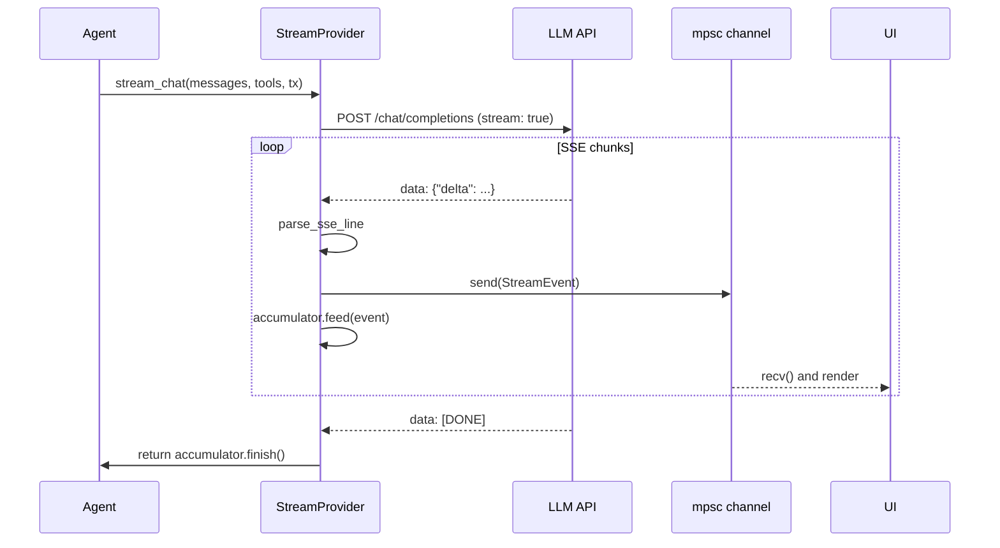

# 第 5a 章：Provider 与流式基础

> **需要编辑的文件：** `src/streaming.rs` — 所有标注 `TODO ch5a:` 的存根（`StreamingAgent` 除外，那是第 5b 章的内容）。
>
> `src/mock.rs` 中已有你在[第 1 章](./ch01-first-llm-call.md)填写的 `MockProvider` 存根；本章依赖那部分工作，但不会重新填写它。如果你从第 1 章跳过来，请先回去完成 `TODO ch1:` 的存根。
> **需要运行的测试：** `cargo test -p mini-claw-code-starter test_mock_` 和 `cargo test -p mini-claw-code-starter test_streaming_parse_ test_streaming_accumulator_`
> **预计用时：** 35 分钟

## 目标

- 重新审视 `MockProvider`（第 1 章构建的），把它当作 `Provider` trait 的典型示例，再以此引出下面的流式变体。
- 实现 `parse_sse_line`，把单行 SSE 转换为 `StreamEvent`。
- 实现 `StreamAccumulator`，把一系列增量重新组装为完整的 `AssistantTurn`。
- 实现 `MockStreamProvider`，让面向 UI 的代码无需真实 HTTP 连接就能测试。
- 搞清楚异步代码中 `std::sync::Mutex` 和 `tokio::sync::Mutex` 各自的适用场景。

第 4 章定义了流经 agent 的数据。这一章（以及下一章）把这些类型变成真正能*驱动*数据的东西——LLM 后端。工作分两半：

- **第 5a 章（本章）：** 抽象与可测试的基础——trait、mock provider、SSE 解析、流积累。
- **[第 5b 章](./ch05b-openrouter-streaming.md)：** 真实 HTTP provider（`OpenRouterProvider`），以及把流 channel 接入 agent 循环的 `StreamingAgent`。

把流式*管道*（本章）和*网络与编排*（下一章）分开，各部分可以独立测试。

---

## 流式端到端工作原理

下图是完整系统的预览。`StreamingAgent` 和 `OpenRouter API` 两个方框暂时不用管——它们属于第 5b 章。本章负责其他所有方框。



## 为什么需要 trait？

coding agent 需要调用 LLM，但具体调哪个不应该硬编码。测试时需要即时、确定的响应；生产环境需要通过 HTTP 流式传输。`Provider` trait 提供了这条接缝。

Claude Code 内部用的是类似的抽象——每次 LLM 调用都经过 provider 接口，后端（Anthropic API、Bedrock、Vertex）的选择在启动时确定。

## Provider trait（RPITIT）

完整 trait 如下：

```rust
pub trait Provider: Send + Sync {
    fn chat<'a>(
        &'a self,
        messages: &'a [Message],
        tools: &'a [&'a ToolDefinition],
    ) -> impl Future<Output = anyhow::Result<AssistantTurn>> + Send + 'a;
}
```

几点值得注意：

**没有 `#[async_trait]`。** `Provider` trait 用的是*返回位置 `impl Trait` in traits*（RPITIT）——Rust 1.75 稳定。写 `fn chat(...) -> impl Future<...>` 而不是 `async fn chat(...)`，可以显式控制生命周期和 `Send` 约束；trait 中的 `async fn` 不总能推断返回的 future 满足 `Send`，会阻止在多线程运行时上 spawn。显式的 `impl Future<...> + Send + 'a` 签名解决了这个问题，同时避免 `#[async_trait]` 需要的堆分配。

第 6 章的 `Tool` trait 出于相反的原因用了 `#[async_trait]`——为了异构存储的对象安全性。何时选哪种风格的完整解释见[为什么有两种异步 trait 风格？](./ch06-tool-interface.md#async-styles)。一句话版本在[第 2 章](./ch02-first-tool.md)。

**为什么 trait 本身需要 `Send + Sync`？** agent 循环会通过共享引用（以及后来的 `Arc`）持有 `P: Provider`。`Sync` 让多个任务共享 provider，`Send` 让它跨线程传递。

**到处都有生命周期 `'a`。** 返回的 future 借用了 `&self` 和输入切片。绑定到单一生命周期 `'a`，告诉编译器这个 future 存活时间不超过那些借用，避免 `'static` 要求。

`Provider` trait 已在 `src/types.rs` 中定义（第 4 章）。starter 把它和消息类型放在一起，因为所有内容都在平铺布局中。

## `Arc<P>` 的 blanket impl

紧接在 `Provider` trait 下方，starter 中有：

```rust
impl<P: Provider> Provider for Arc<P> {
    fn chat<'a>(
        &'a self,
        messages: &'a [Message],
        tools: &'a [&'a ToolDefinition],
    ) -> impl Future<Output = anyhow::Result<AssistantTurn>> + Send + 'a {
        (**self).chat(messages, tools)
    }
}
```

意思是：如果 `P` 是 `Provider`，那么 `Arc<P>` 也是 `Provider`。通过 `Arc` 解引用后委托给内部值。

这有什么用？之后构建子 agent 时，主 agent 和子 agent 会共享同一个 provider。克隆 `Arc` 代价低廉，blanket impl 意味着泛型于 `P: Provider` 的子 agent 代码，无论拿到的是裸 provider 还是共享 provider，行为完全一致。没有它，就得额外的类型管道来传递共享 provider。

`Provider` trait 和 `Arc<P>` blanket impl 都已在 `src/types.rs` 中。

---

## MockProvider

对真实 API 测试 agent 既慢又贵，还不确定。`MockProvider` 让你脚本化精确的响应，验证 agent 能否正确处理。

```rust
use std::collections::VecDeque;
use std::sync::Mutex;

pub struct MockProvider {
    responses: Mutex<VecDeque<AssistantTurn>>,
}

impl MockProvider {
    pub fn new(responses: VecDeque<AssistantTurn>) -> Self {
        Self {
            responses: Mutex::new(responses),
        }
    }
}

impl Provider for MockProvider {
    async fn chat(
        &self,
        _messages: &[Message],
        _tools: &[&ToolDefinition],
    ) -> anyhow::Result<AssistantTurn> {
        self.responses
            .lock()
            .unwrap()
            .pop_front()
            .ok_or_else(|| anyhow::anyhow!("MockProvider: no more responses"))
    }
}
```

### Rust 概念：`std::sync::Mutex` vs `tokio::sync::Mutex`

`Provider` trait 接受 `&self` 而不是 `&mut self`，因为 provider 是共享的。但我们需要修改队列。用哪个 `Mutex`？

经验法则：临界区很简单时（锁内没有 `.await`）用 `std::sync::Mutex`；需要在 `.await` 点持有锁时用 `tokio::sync::Mutex`。这里的临界区只是一个 `pop_front`——单次指针操作。用 `tokio::sync::Mutex` 会增加不必要的开销（它是会让出运行时的异步感知锁）。`std::sync::Mutex` 更轻量，也完全安全，因为锁从不会被持有足够长的时间来阻塞运行时。

设计要点：

- **`VecDeque`**：响应按 FIFO 顺序消费。第一次调用 `chat` 返回第一个响应，第二次返回第二个，以此类推。
- **`Mutex`**：包裹队列，让 `&self` 方法能修改它。为什么选 `std::sync::Mutex`，见上面的 Rust 概念说明。
- **耗尽时报错**：测试脚本了三个响应但 agent 第四次调用 `chat`，会得到错误而不是静默 panic。能捕获循环次数超出预期的 agent 循环。

### 测试策略

`MockProvider` 是所有测试的基础。脚本化精确的响应序列后，可以测试：

- **单轮：** 一个带 `StopReason::Stop` 的响应
- **工具调用循环：** 第一个响应带 `StopReason::ToolUse` 和工具调用，agent 执行后发送结果，第二个响应带 `StopReason::Stop`
- **多轮序列：** 任意数量的脚本化轮次
- **错误处理：** 空队列返回错误

典型测试：

```rust
#[tokio::test]
async fn mock_returns_text() {
    let provider = MockProvider::new(VecDeque::from([AssistantTurn {
        text: Some("Hello!".into()),
        tool_calls: vec![],
        stop_reason: StopReason::Stop,
        usage: None,
    }]));
    let turn = provider.chat(&[Message::User("Hi".into())], &[]).await.unwrap();
    assert_eq!(turn.text.as_deref(), Some("Hello!"));
}
```

注意测试忽略了 `messages` 输入——mock 不检查 agent 发送的内容。这是有意为之。测试的是 agent 面对已知 provider 响应时的*行为*，不是 provider 理解 prompt 的能力。

### 你的任务

打开 starter 中的 `src/mock.rs`，里面是带有 `unimplemented!()` 存根的 `MockProvider` struct。填写 `new()` 和 `Provider` impl。

---

## StreamEvent

定义流式 trait 之前，先建立描述 LLM 发回增量块的词汇：

```rust
#[derive(Debug, Clone, PartialEq)]
pub enum StreamEvent {
    /// A fragment of the model's text response.
    TextDelta(String),
    /// The beginning of a tool call (carries the call ID and tool name).
    ToolCallStart {
        index: usize,
        id: String,
        name: String,
    },
    /// A fragment of a tool call's JSON arguments.
    ToolCallDelta {
        index: usize,
        arguments: String,
    },
    /// The stream is complete.
    Done,
}
```

四个变体直接对应 OpenAI 流式 API：

- **TextDelta**：模型自然语言输出的片段（如 `"Hello"`，然后是 `" world"`）。
- **ToolCallStart**：模型开始了一个工具调用。`index` 标识哪次调用（一个轮次可以请求多个工具），`id` 是服务器分配的关联 ID，`name` 是工具名称。
- **ToolCallDelta**：该 `index` 处调用的 JSON 参数片段。参数增量到达，因为模型逐 token 生成 JSON。
- **Done**：流结束信号。

`index` 字段很重要，因为流式传输会交错来自多个工具调用的片段，消费者需要知道每个片段属于哪个调用。

## StreamProvider trait

```rust
pub trait StreamProvider: Send + Sync {
    fn stream_chat<'a>(
        &'a self,
        messages: &'a [Message],
        tools: &'a [&'a ToolDefinition],
        tx: mpsc::UnboundedSender<StreamEvent>,
    ) -> impl Future<Output = anyhow::Result<AssistantTurn>> + Send + 'a;
}
```

设计上用的是**基于 channel 的**流式模型，而不是返回 `AsyncIterator` 或 `Stream`。调用方创建 `tokio::sync::mpsc::unbounded_channel()`，把发送端传给 `stream_chat`，从接收端读取事件——通常在独立任务中渲染到终端。

方法本身在流完成后仍然返回完整组装好的 `AssistantTurn`。这意味着 agent 循环总是得到干净的 `AssistantTurn`，不管有没有启用流式传输。channel 是 UI 的旁路。

为什么用 `UnboundedSender` 而不是有界 channel？流式事件很小，到达速度受限于网络。瓶颈在 API 而非消费者，背压没有必要。无界 channel 让 API 更简洁。

`StreamEvent` enum 和 `StreamProvider` trait 都在 starter 的 `src/streaming.rs` 中。

---

## MockStreamProvider

`MockStreamProvider` 包装 `MockProvider`，从每个预设响应中合成 `StreamEvent`。这让你无需真实 HTTP 连接就能测试消费流事件的 UI 代码。

struct 包装 `MockProvider`，其 `stream_chat` impl 分三步：

1. 委托给 `self.inner.chat()` 获取预设的 `AssistantTurn`
2. 分解为事件：文本**逐字符**作为 `TextDelta` 发送，每个工具调用发送 `ToolCallStart` + 单个 `ToolCallDelta`，最后发送 `Done`
3. 原样返回原始 `AssistantTurn`

完整实现：

```rust
pub struct MockStreamProvider {
    inner: MockProvider,
}

impl MockStreamProvider {
    pub fn new(responses: VecDeque<AssistantTurn>) -> Self {
        Self {
            inner: MockProvider::new(responses),
        }
    }
}

impl StreamProvider for MockStreamProvider {
    async fn stream_chat(
        &self,
        messages: &[Message],
        tools: &[&ToolDefinition],
        tx: mpsc::UnboundedSender<StreamEvent>,
    ) -> anyhow::Result<AssistantTurn> {
        let turn = self.inner.chat(messages, tools).await?;

        // Synthesize stream events from the complete turn
        if let Some(ref text) = turn.text {
            for ch in text.chars() {
                let _ = tx.send(StreamEvent::TextDelta(ch.to_string()));
            }
        }
        for (i, call) in turn.tool_calls.iter().enumerate() {
            let _ = tx.send(StreamEvent::ToolCallStart {
                index: i,
                id: call.id.clone(),
                name: call.name.clone(),
            });
            let _ = tx.send(StreamEvent::ToolCallDelta {
                index: i,
                arguments: call.arguments.to_string(),
            });
        }
        let _ = tx.send(StreamEvent::Done);

        Ok(turn)
    }
}
```

这样就不用重复响应队列逻辑——`inner.chat()` 处理 `VecDeque` 的弹出。`let _ = tx.send(...)` 有意忽略发送错误：接收方被 drop 了，没人在监听，这没问题。

### 你的任务

在 `src/streaming.rs` 中填写 `MockStreamProvider::new()` 及其 `stream_chat()` 存根。

---

## Server-Sent Events 与 `parse_sse_line`

真实 provider 请求 `stream: true` 时，API 返回 [Server-Sent Events](https://developer.mozilla.org/en-US/docs/Web/API/Server-sent_events/Using_server-sent_events)（SSE）流。SSE 是基于 HTTP 的简单文本协议：

```
data: {"choices":[{"delta":{"content":"Hello"},"finish_reason":null}]}

data: {"choices":[{"delta":{"content":" world"},"finish_reason":null}]}

data: [DONE]
```

每个事件是一行以 `data: ` 开头、后跟 JSON 载荷（或特殊字符串 `[DONE]`）的文本。事件之间用空行分隔。就这些——没有帧，没有长度前缀，只有换行符分隔的文本。这种简洁性正是 SSE 成为 LLM 流式传输标准的原因。

`parse_sse_line` 处理单行：

```rust
pub fn parse_sse_line(line: &str) -> Option<Vec<StreamEvent>> {
    let data = line.strip_prefix("data: ")?;
    if data == "[DONE]" {
        return Some(vec![StreamEvent::Done]);
    }

    let chunk: ChunkResponse = serde_json::from_str(data).ok()?;
    let choice = chunk.choices.into_iter().next()?;
    let mut events = Vec::new();

    if let Some(text) = choice.delta.content
        && !text.is_empty()
    {
        events.push(StreamEvent::TextDelta(text));
    }

    if let Some(tool_calls) = choice.delta.tool_calls {
        for tc in tool_calls {
            if let Some(id) = tc.id {
                let name = tc.function
                    .as_ref()
                    .and_then(|f| f.name.clone())
                    .unwrap_or_default();
                events.push(StreamEvent::ToolCallStart {
                    index: tc.index,
                    id,
                    name,
                });
            }
            if let Some(ref func) = tc.function
                && let Some(ref args) = func.arguments
                && !args.is_empty()
            {
                events.push(StreamEvent::ToolCallDelta {
                    index: tc.index,
                    arguments: args.clone(),
                });
            }
        }
    }

    if events.is_empty() { None } else { Some(events) }
}
```

逐步解析：

1. **去除 `data: ` 前缀。** 不以 `data: ` 开头的行（如 `event: ping` 或空行）返回 `None`——不是数据事件。
2. **检查 `[DONE]`。** OpenAI 标准的流结束哨兵，返回 `Done` 事件。
3. **将 JSON 解析为 `ChunkResponse`。** JSON 格式错误时，`.ok()?` 静默跳过。有意为之——SSE 流偶尔包含 keep-alive ping 或格式错误的块，崩溃比丢弃一个 token 更糟。
4. **提取文本增量。** `delta.content` 字段是文本片段，空字符串跳过。
5. **提取工具调用事件。** 单个块可以同时包含 `ToolCallStart`（`id` 字段存在，表示新调用）和 `ToolCallDelta`（`arguments` 存在）。`if let ... && let ...` 是 Rust 的 let-chains 特性，2024 edition 稳定。

### Rust 概念：let-chains

`if let Some(ref func) = tc.function && let Some(ref args) = func.arguments` 把两个模式匹配合并为单个 `if` 表达式。有 let-chains 之前，需要嵌套的 `if let` 块或带元组的 `match`。let-chains 把嵌套展平，条件更易读。`ref` 借用匹配的值而不是移动，这里是必要的，因为 `tc` 在 `if let` 之后还会被使用。

测试验证了解析器的三种情况：文本增量行产生 `StreamEvent::TextDelta("Hello")`，`data: [DONE]` 产生 `StreamEvent::Done`，`event: ping` 或空字符串等非数据行返回 `None`。

### 你的任务

`parse_sse_line` 函数及其 SSE 反序列化类型（`ChunkResponse`、`ChunkChoice`、`Delta`、`DeltaToolCall`、`DeltaFunction`）在 `src/streaming.rs` 中。填写 `parse_sse_line` 存根。

---

## StreamAccumulator

流式传输为 UI 提供实时输出，但 agent 循环需要完整的 `AssistantTurn` 才能决定下一步。`StreamAccumulator` 弥合这个差距——事件到达时收集，最后生成完整消息。

```rust
pub struct StreamAccumulator {
    text: String,
    tool_calls: Vec<PartialToolCall>,
}

struct PartialToolCall {
    id: String,
    name: String,
    arguments: String,
}
```

两个关键方法：

```rust
impl StreamAccumulator {
    pub fn new() -> Self {
        Self {
            text: String::new(),
            tool_calls: Vec::new(),
        }
    }

    pub fn feed(&mut self, event: &StreamEvent) {
        match event {
            StreamEvent::TextDelta(s) => self.text.push_str(s),
            StreamEvent::ToolCallStart { index, id, name } => {
                // Ensure the Vec is large enough for this index
                while self.tool_calls.len() <= *index {
                    self.tool_calls.push(PartialToolCall {
                        id: String::new(),
                        name: String::new(),
                        arguments: String::new(),
                    });
                }
                self.tool_calls[*index].id = id.clone();
                self.tool_calls[*index].name = name.clone();
            }
            StreamEvent::ToolCallDelta { index, arguments } => {
                if let Some(tc) = self.tool_calls.get_mut(*index) {
                    tc.arguments.push_str(arguments);
                }
            }
            StreamEvent::Done => {}
        }
    }

    pub fn finish(self) -> AssistantTurn {
        let text = if self.text.is_empty() {
            None
        } else {
            Some(self.text)
        };
        let tool_calls: Vec<ToolCall> = self
            .tool_calls
            .into_iter()
            .filter(|tc| !tc.name.is_empty())
            .map(|tc| ToolCall {
                id: tc.id,
                name: tc.name,
                arguments: serde_json::from_str(&tc.arguments)
                    .unwrap_or(Value::Null),
            })
            .collect();
        let stop_reason = if tool_calls.is_empty() {
            StopReason::Stop
        } else {
            StopReason::ToolUse
        };
        AssistantTurn {
            text,
            tool_calls,
            stop_reason,
            usage: None,
        }
    }
}
```

设计说明：

- **`feed` 增量追加。** 文本片段拼接到 `self.text`，工具调用参数按索引拼接到 `PartialToolCall::arguments`。
- **稀疏索引处理。** `ToolCallStart` 中的 `while` 循环用空条目填充 vector，使得即使 vector 只有一个元素，`index: 2` 也能正常工作。`finish` 中的 `filter(|tc| !tc.name.is_empty())` 去除这些占位符。
- **延迟 JSON 解析。** 参数在流式传输期间以字符串片段形式到达，`finish` 只在流结束后才把拼接好的字符串解析为 `serde_json::Value`，格式错误时回退到 `Value::Null`。
- **`stop_reason` 由工具调用派生。** 有工具调用通过过滤器则为 `ToolUse`，否则为 `Stop`。`usage` 为 `None`，因为大多数流式 API 不在每个块中包含 token 计数。

accumulator 测试（`test_streaming_accumulator_text`、`test_streaming_accumulator_tool_call`）分别提供两个文本增量，或一个工具调用开始加两个参数片段，验证拼接结果符合预期。

### 你的任务

`StreamAccumulator` 和 `PartialToolCall` 在 `src/streaming.rs` 中。填写 `new()`、`feed()` 和 `finish()` 存根。

---

## 运行测试

```bash
cargo test -p mini-claw-code-starter test_mock_
cargo test -p mini-claw-code-starter test_streaming_parse_
cargo test -p mini-claw-code-starter test_streaming_accumulator_
```

### 这些测试验证的内容

**`test_mock_`**（MockProvider）：

- **`test_mock_mock_returns_text`** — 脚本化单个文本响应，验证 `chat()` 返回它
- **`test_mock_mock_exhausted`** — 对空队列调用 `chat()`，验证返回错误

**`test_streaming_parse_`**（SSE 解析器）：

- **`test_streaming_parse_text_delta`** — 提供带文本内容的 `data:` 行，验证生成 `TextDelta` 事件
- **`test_streaming_parse_done`** — 提供 `data: [DONE]`，验证生成 `Done` 事件
- **`test_streaming_parse_non_data_lines`** — 提供 `event: ping` 等非数据行，验证返回 `None`

**`test_streaming_accumulator_`**（流重组）：

- **`test_streaming_accumulator_text`** — 提供两个 `TextDelta` 事件，验证拼接结果
- **`test_streaming_accumulator_tool_call`** — 提供 `ToolCallStart` 和两个 `ToolCallDelta` 片段，验证重组为带已解析 JSON 参数的有效 `ToolCall`

其他所有测试（`test_openrouter_`、`test_streaming_streaming_agent_`、`test_streaming_stream_chat_`）属于[第 5b 章](./ch05b-openrouter-streaming.md)。

---

## 关键要点

provider 层把 agent 与任何具体的 LLM 后端解耦。`MockProvider` 让测试快速且确定；`StreamProvider` trait 通过 channel 输出增量事件，方法本身仍然返回干净的 `AssistantTurn`；`StreamAccumulator` 是桥梁，让 UI 在 token 到达时就能看到，而 agent 循环看到的是完整消息。

这一章的所有内容都可以在无网络的情况下测试。接下来[第 5b 章](./ch05b-openrouter-streaming.md)把这些原语接入真实的 HTTP provider，并将事件 channel 接通 agent 循环。

## 自我检测

{{#quiz ../quizzes/ch05a.toml}}

---

[← 第 4 章：消息与类型](./ch04-messages-types.md) · [目录](./ch00-overview.md) · [第 5b 章：OpenRouter 与 StreamingAgent →](./ch05b-openrouter-streaming.md)
