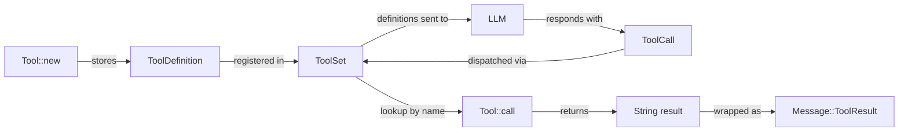

# 第 6 章：工具接口

> **需要编辑的文件：** 无。本章是 `Tool` trait 的概念性讲解。下方的 `EchoTool` 动手示例可以在练习文件里从头写，也可以在 Rust Playground 里试试；starter 里没有 `echo.rs` 桩，[第 2 章](./ch02-first-tool.md)的 `test_read_*` 测试也不受任何影响。
> **阅读用时：** 25 分钟

## 目标

- 理解为什么 `Tool` trait 用 `#[async_trait]`（对象安全，支持异构存储），而 `Provider` 用 RPITIT（零开销泛型）。
- 实现一个具体的 `EchoTool`，走完完整的工具生命周期：schema 定义、trait 实现、注册和执行。
- 验证 `ToolSet` 能正确注册工具并向 LLM 返回其定义。

上一章我们接入了 LLM provider，给 agent 装上了嘴。但一个只会输出文字的模型，就像一个只谈代码、从不动键盘的程序员。本章给 agent 装上双手。

第 4 章已经定义了工具类型——`ToolDefinition`、`Tool` trait 和 `ToolSet`。本章深入理解这些类型的设计理由，弄清 `#[async_trait]` 与 RPITIT 的关键区别，然后通过实现第一个具体工具 `EchoTool` 把所有内容串起来。

## 工具生命周期



## 设计背景：Claude Code 如何建模工具

Claude Code 的 TypeScript 代码库用泛型类型 `Tool<Input, Output, Progress>` 定义工具。每个工具带一个用于输入验证的 Zod schema，返回丰富的结构化输出（有时含用于终端渲染的 React 元素），还能在长时间运行时发出进度事件。生产环境有超过 40 个工具，每个都带权限元数据、cost hint 和 UI 集成。

我们保留其形态，但去掉繁琐仪式。Rust 版本：

| Claude Code（TypeScript）           | mini-claw-code-starter（Rust）                |
|-------------------------------------|----------------------------------------------|
| `Tool<Input, Output, Progress>`     | `trait Tool`（无泛型）                        |
| Zod schema 用于输入验证              | `serde_json::Value` + builder                |
| 丰富的 `ToolResult<T>`             | `anyhow::Result<String>`                     |
| React 渲染进度                       | （未实现）                                   |
| 40+ 个工具，带 Zod 验证              | 5 个工具，带 JSON schema                     |
| `isReadOnly`、`isDestructive` 等    | （未实现——保持最简）                          |

关键简化：去掉泛型参数和安全性/展示方法。Claude Code 需要 `<Input, Output, Progress>` 是因为每个工具有不同的强类型输入形态，并渲染不同的 UI。用 `serde_json::Value` 做输入、`String` 做输出，无需类型擦除魔法就能把异构工具存进同一个集合。

<a id="async-styles"></a>

## 为什么有两种 async trait 风格？（`#[async_trait]` vs RPITIT）

这是类型系统里最重要的设计决策，值得深入理解。同样的权衡贯穿本书所有 async trait——`Provider`、`Tool`、`StreamProvider`、`Hook`、`SafetyCheck`。读一遍本节就够；其他章节会链接回这里。

先看第 4 章的 `Provider` trait：

```rust
pub trait Provider: Send + Sync {
    fn chat<'a>(
        &'a self,
        messages: &'a [Message],
        tools: &'a [&'a ToolDefinition],
    ) -> impl Future<Output = anyhow::Result<AssistantTurn>> + Send + 'a;
}
```

这里用的是 **RPITIT**（return-position `impl Trait` in traits），Rust 1.75 稳定的特性。编译器为每个实现生成唯一的 future 类型，零开销，不需要装箱。

但 RPITIT 有个限制：它让 trait 不具备对象安全性。无法写 `Box<dyn Provider>`，因为编译器在编译期需要知道具体的 future 类型。对于 provider 这没问题——用泛型参数（`struct SimpleAgent<P: Provider>`），具体类型始终已知。

工具不同。我们需要存储异构工具集合——`BashTool`、`ReadTool`、`WriteTool`，全进同一个 `HashMap`。这需要 `Box<dyn Tool>`，进而需要对象安全性。对象安全性要求 async 方法返回已知类型，而非不透明的 `impl Future`。

`async-trait` crate 的 `#[async_trait]` 宏解决了这个问题：把 `async fn call(...)` 改写为返回 `Pin<Box<dyn Future<...> + Send + '_>>` 的方法。装箱有小额开销（每次工具调用一次堆分配），但工具调用的 I/O 开销远大于此。

```
Provider: 泛型参数 P       -> RPITIT（零开销，不具备对象安全性）
Tool:     存储于 Box<dyn>  -> #[async_trait]（装箱 future，具备对象安全性）
```

这种拆分是刻意的设计选择。如果 Rust 未来稳定 `dyn async fn`，可以完全放弃 `async_trait`。在此之前，双策略方式兼顾了两者的优点。

注意，[第 5a 章](./ch05a-provider-foundations.md)的 `MockProvider` 实现里直接写了 `async fn chat(...)`。这是因为 Rust 1.75+ 允许在 trait 实现中用 `async fn`，即使 trait 签名用的是 RPITIT 形式，编译器会正确脱糖。`Tool` 实现也一样——写 `async fn call(...)`，`#[async_trait]` 宏处理其余部分。

### 决策规则：下一个 trait 用哪种方案？

对任何新的 async trait，只问一个问题："我需要把这个 trait 的不同具体类型存入同一个集合吗？"这一个问题决定一切：

```
                  你需要在某处使用 Box<dyn MyTrait> 吗？
                                 │
                 ┌──────────────┴───────────────┐
                 ▼                              ▼
               需要                            不需要
                 │                              │
                 ▼                              ▼
   #[async_trait::async_trait]          trait MyTrait {
   trait MyTrait: Send + Sync {            fn do_it(&self)
       async fn do_it(&self)                 -> impl Future<...> + Send;
         -> Result<...>;                  }
   }                                      // 调用者使用 `impl MyTrait` 或
   // 调用者使用 Box<dyn MyTrait>         // 泛型参数 `<T: MyTrait>`
```

倾向 `#[async_trait]` 的信号：

- 需要 `Vec<Box<dyn MyTrait>>`、`HashMap<K, Box<dyn MyTrait>>` 或类似的运行时异构容器。（`ToolSet` 正是这样做的。）
- 需要从函数中返回 `Box<dyn MyTrait>`，调用者不需要知道具体类型。
- 希望用户能在运行时插入新实现（比如动态注册表或插件系统）。

倾向 RPITIT 的信号：

- 每个调用者在编译期都知道具体实现。`SimpleAgent<P: Provider>` 这样的结构体对每个 provider 只单态化一次。
- 吞吐量足够重要，不想为每次调用承担一次装箱 future 的分配开销。
- trait 有很多 `async` 方法，不希望 `async_trait` 在每个方法上都插一个 `Box`。

本书定义的每个 trait 都恰好落在某一侧：`Provider` / `StreamProvider` / `SafetyCheck` 通过泛型参数单态化（RPITIT）；`Tool` / `HookHandler` / `InputHandler` 以 `Box<dyn _>` 存储于异构集合（`#[async_trait]`）。在自己的扩展中新增 trait 时，按上述问题走一遍，不用再纠结了。

## 为什么工具错误永远不会终止 agent

工具失败不等于 agent 失败。如果 LLM 请求读取一个不存在的文件，正确的行为是告诉它 "error: file not found"，让它自行恢复——换条路径、问用户，或者继续前进。如果真正的 `Err(...)` 逃逸到 agent 循环顶层，就会*终止*对话，几乎从来不是我们想要的结果。

这种行为依赖 `Tool` 实现与 agent 循环之间的约定：

1. **工具**返回 `anyhow::Result<String>`。失败时用 `bail!("原因")` 或 `?` 传播（`context.read_to_string(...).with_context(|| ...)?`）。第 9 章的文件工具里大量用到 `bail!`。
2. **agent 循环**用 `.unwrap_or_else(|e| format!("error: {e}"))` 捕获工具错误，再把结果打包为 `Message::ToolResult`。LLM 始终收到字符串——要么是成功输出，要么是格式化后的错误。

所以在工具内部写的是惯用 Rust（`?`、`bail!`、`anyhow::Context`）；从 LLM 的视角看，每种结果都是字符串。真正会逃逸 agent 循环的，只有确实不可恢复的情况——与 provider 通信的网络故障、序列化 bug、panic——这些都不该由工具实现自身产生。

第 14 章会看到一个小变体：`SafeToolWrapper` 直接捕获安全检查错误并返回 `Ok("error: safety check failed: ...")`，而不是让错误继续传播。效果等价（agent 循环本来也会以同样方式格式化 `Err`），但作为前置过滤器时，能让包装器的错误处理保持自包含。

## 动手实践：构建 EchoTool

实现第一个具体工具。我们来写个最简化的 `EchoTool`，接收 `text` 参数并原样返回。这涵盖完整的生命周期：定义 schema、实现 trait、注册到 `ToolSet`。

### 第 1 步：结构体与定义

```rust
struct EchoTool {
    def: ToolDefinition,
}

impl EchoTool {
    fn new() -> Self {
        Self {
            def: ToolDefinition::new("echo", "Echo the input")
                .param("text", "string", "Text to echo", true),
        }
    }
}
```

`ToolDefinition` 在构造函数里创建一次，作为字段存储。schema 告诉 LLM："这个工具叫 `echo`，接收一个名为 `text` 的必填字符串参数。"

### 第 2 步：实现 Tool trait

```rust
#[async_trait::async_trait]
impl Tool for EchoTool {
    fn definition(&self) -> &ToolDefinition {
        &self.def
    }

    async fn call(&self, args: Value) -> anyhow::Result<String> {
        let text = args["text"].as_str().unwrap_or("(no text)");
        Ok(text.to_string())
    }
}
```

几点说明：

- `definition()` 返回对存储的 `ToolDefinition` 的引用。
- `call()` 从 JSON `args` 里提取 `text`。如果键不存在或不是字符串，回退到 `"(no text)"` 而非 panic。对 LLM 提供的参数始终保持防御性。
- `call()` 返回 `anyhow::Result<String>`——普通字符串，不是 `ToolResult` 结构体。starter 保持工具输出简单。
- 只有两个必须实现的方法。没有安全标志、没有验证、没有摘要——starter 的 `Tool` trait 是最简化的。

### 第 3 步：注册与使用

```rust
let tools = ToolSet::new().with(EchoTool::new());

// agent 循环会这样做：
let defs = tools.definitions();
// ... 将 defs 发送给 LLM，得到一个 ToolCall ...

let tool = tools.get("echo").unwrap();
let result = tool.call(serde_json::json!({"text": "hello"})).await?;
assert_eq!(result, "hello");
```

完整的往返流程：定义发给 LLM，LLM 生成 `ToolCall`，按名称查找工具，调用它，把结果返回。

## 最简 trait

starter 的 `Tool` trait 只有两个必须实现的方法：

| 方法 | 用途 |
|--------|---------|
| `definition()` | 返回工具的 JSON Schema 描述 |
| `call()` | 执行工具并返回字符串结果 |

没有默认方法、没有安全标志、没有验证钩子。这是有意为之——starter 保持简单，让你专注于 agent 循环机制。Claude Code 真实的工具系统加了 `is_read_only()`、`is_destructive()`、`validate_input()` 等，但构建可运行的 agent 不需要这些。

## 与 Claude Code 的对比

Claude Code 的工具系统规模大得多：

- **40+ 个工具**，涵盖文件操作、git、搜索、浏览器、notebook、MCP 等。我们实现 5 个。
- **Zod schema** 提供运行时验证与 TypeScript 类型推断。我们用带 builder 的 `serde_json::Value`。
- **React 渲染**——工具可以返回 React 元素，在终端渲染丰富的 UI（diff、表格、进度条）。我们返回纯字符串。
- **进度事件**——工具在执行过程中发出类型化的进度事件。我们有 `activity_description()` 用于简单的 spinner。
- **工具分组与权限**——工具按权限分组，带有允许/拒绝列表。第 13 章会构建权限系统，但会更简单。
- **cost hint**——工具可以声明预估的 token 开销，帮助 context manager 做决策。第 4 章的 `TokenUsage` 类型在消息层面追踪 token，但不在单个工具上携带 cost hint。

尽管有这些差异，核心协议是相同的：LLM 看到工具 schema，决定调用某个，agent 执行它，结果返回给 LLM。其他一切——验证、权限、进度、渲染——都是围绕这个循环的编排。理解 `Tool` trait 就理解了 Claude Code 完整系统的基础。

## 实现说明

本章无需创建新的源文件。`EchoTool` 只存在于测试文件（`src/tests/ch3.rs`）中。任务是验证第 4 章构建的类型——`Tool`、`ToolDefinition`、`ToolSet`——能与具体工具实现正确协作。`test_read_` 测试通过，类型定义就是正确的。

## 运行测试

```bash
cargo test -p mini-claw-code-starter test_read_
```

### 测试验证内容

- **`test_read_read_definition`** —— `ReadTool` 从其 `ToolDefinition` 生成正确的名称和非空描述，且 `"path"` 参数是必填项
- **`test_read_read_file`** —— 以有效路径调用时返回文件内容，验证参数提取和返回值
- **`test_read_read_missing_file`** —— 以不存在的路径调用时返回错误
- **`test_read_read_missing_arg`** —— 不带参数调用时返回错误

## 核心要点

`Tool` trait 刻意保持最简——只有 `definition()` 和 `call()`。每个工具，从简单的 echo 到复杂的 bash 执行器，都实现同一个两方法接口。agent 循环不需要知道工具做什么，只需按名称查找并调用它。

## 小结

本章聚焦于第 4 章定义的工具类型背后的*原因*：

- **`#[async_trait]` vs RPITIT** —— 关键区别。工具需要对象安全性以支持异构存储；provider 需要零开销泛型。双策略方式兼顾两者。
- **工具错误永远不会终止 agent** —— 工具用 `bail!` 或 `?` 以惯用 Rust 方式编写；agent 循环用 `.unwrap_or_else` 将错误转换为字符串，LLM 读取后做出调整。
- **EchoTool** —— 第一个具体工具，演示完整生命周期：schema 定义、trait 实现、注册、执行。

下一章构建 `SimpleAgent`——把 provider 和工具连成可运行 agent 的循环。

## 自测

{{#quiz ../quizzes/ch06.toml}}

---

[← 第 5b 章：OpenRouter 与 StreamingAgent](./ch05b-openrouter-streaming.md) · [目录](./ch00-overview.md) · [第 7 章：Agentic 循环（深度解析）→](./ch07-query-engine.md)
