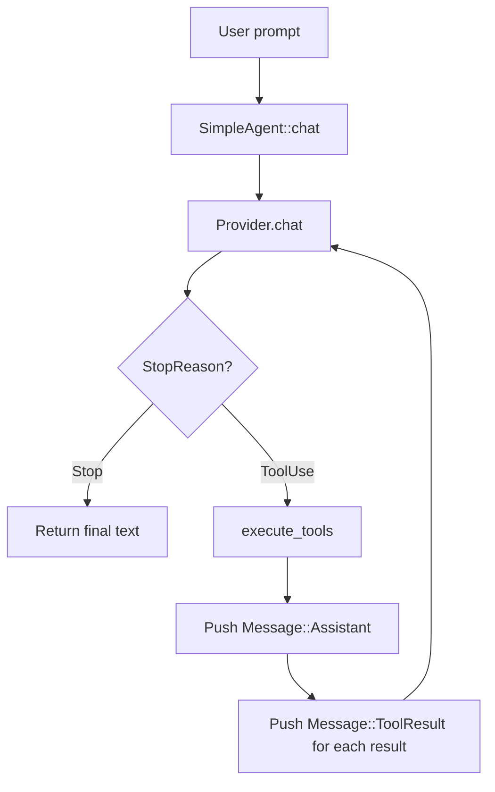

# 第 7 章：Agentic 循环（深度解析）

> **需要编辑的文件：** `src/agent.rs` —— 本章只有 `run_with_history` 桩是新内容。`single_turn`、`execute_tools` 和 `chat` 已在[第 3 章](./ch03-agentic-loop.md)中实现；本章是对你已经构建的循环的深度讲解，加上一个发出事件的薄层新变体。
> **需要运行的测试：** 第 3 章的测试同样适用（`cargo test -p mini-claw-code-starter test_single_turn_`，`cargo test -p mini-claw-code-starter test_simple_agent_`）；starter 中没有专门针对 `run_with_history` 的测试——通过运行[第 5b 章](./ch05b-openrouter-streaming.md)中的示例并观察事件流来手动验证。
> **预计用时：** 45 分钟

## 目标

- 带着细致的控制流、消息顺序和边界情况分析，重新审视[第 3 章](./ch03-agentic-loop.md)的 `SimpleAgent::chat`。不是重新实现它——而是理解你已经写下的代码。
- 重新审视 `execute_tools`，弄清楚工具错误为何变成结果字符串而非继续传播——理由与[第 6 章](./ch06-tool-interface.md)解释的约定紧密相连。
- 实现唯一*新的*部分：`run_with_history`——主循环的事件发出变体，每轮结束后通过 channel 发送一个 `AgentEvent`，供后续章节构建的 UI 层观察进度。
- 理解消息顺序：为什么 `Message::Assistant` 必须在对应的 `Message::ToolResult` 之前入队。

这是一切融会贯通的章节。

前几章构建了词汇（消息）、嘴巴（provider）和双手（工具）。现在来构建大脑——将它们全部串联起来的循环。`SimpleAgent` 是编码 agent 的核心。它接收用户提示，与 LLM 对话，执行工具，将结果反馈回去，持续运转直到任务完成。

每个编码 agent——Claude Code、Cursor、Aider、OpenCode——都有某种版本的这个循环。细节各异（流式、权限、压缩），骨架是相同的。把这个做对，你就有了可运行的 agent。本书后续的一切都是在此之上的精化。

## SimpleAgent 做什么

用一句话概括完整的 agent 生命周期：**提示 LLM，检查它是否想使用工具，执行这些工具，将结果返回，重复，直到 LLM 表示完成。**

就这些。`SimpleAgent` 实现这个循环。它拥有三样东西：

1. 一个 **provider** —— LLM 后端（来自[第 5a 章](./ch05a-provider-foundations.md) / [5b 章](./ch05b-openrouter-streaming.md)）
2. 一个**工具集** —— 已注册的工具（来自第 6 章）
3. 一个 **config** —— 安全限制与行为开关



读过 Claude Code 源码的话，这对应于 query engine 和 `query` 函数。我们的版本剥离了流式、权限、钩子和压缩——这些留到后续章节——只保留纯粹的控制流。

## SimpleAgent 结构体

starter 的 `SimpleAgent` 比生产引擎更精简——没有 config 结构体、没有最大轮次限制、没有截断。只有 provider 和工具：

```rust
pub struct SimpleAgent<P: Provider> {
    provider: P,
    tools: ToolSet,
}
```

泛型参数 `P: Provider`，让同一个 agent 在生产环境中与 `OpenRouterProvider` 协同，在测试中与 `MockProvider` 协同。builder 模式让配置很流畅：

```rust
let agent = SimpleAgent::new(provider)
    .tool(BashTool::new())
    .tool(ReadTool::new())
    .tool(WriteTool::new());
```

没有意外。有趣的部分在于实际运行的方法。

## execute_tools：工具调度辅助函数

处理主循环之前，先需要一个辅助函数，接受来自 LLM 的 `ToolCall` 切片并生成结果。这就是 `execute_tools`：

```rust
async fn execute_tools(&self, calls: &[ToolCall]) -> Vec<(String, String)> {
    let mut results = Vec::with_capacity(calls.len());
    for call in calls {
        let result = match self.tools.get(&call.name) {
            Some(t) => {
                t.call(call.arguments.clone())
                    .await
                    .unwrap_or_else(|e| format!("error: {e}"))
            }
            None => format!("error: unknown tool `{}`", call.name),
        };
        results.push((call.id.clone(), result));
    }
    results
}
```

两个阶段：

1. **工具查找** —— 如果 LLM 幻觉出一个不存在的工具名称，返回错误字符串。模型看到 `"error: unknown tool \`foo\`"` 后可以恢复。这种情况比你想象的更常见，尤其是较小的模型。

2. **执行** —— 运行工具。如果失败，`.unwrap_or_else(|e| format!("error: {e}"))` 将错误转换为模型可读的字符串。

注意返回类型：`Vec<(String, String)>` —— (调用 ID, 结果字符串) 的对儿。没有 `ToolResult` 结构体、没有截断、没有验证。starter 保持简单。

关键设计决策：**工具错误变成结果，而非 panic**。agent 循环不会因工具失败而崩溃。模型读取错误，调整方法，再试一次。

## chat() 方法：核心循环

就是这里。Agentic 循环。仔细读——比你预期的要短。

```rust
pub async fn chat(&self, messages: &mut Vec<Message>) -> anyhow::Result<String> {
    let defs = self.tools.definitions();

    loop {
        let turn = self.provider.chat(messages, &defs).await?;

        match turn.stop_reason {
            StopReason::Stop => {
                let text = turn.text.clone().unwrap_or_default();
                messages.push(Message::Assistant(turn));
                return Ok(text);
            }
            StopReason::ToolUse => {
                let results = self.execute_tools(&turn.tool_calls).await;
                messages.push(Message::Assistant(turn));
                for (id, content) in results {
                    messages.push(Message::ToolResult { id, content });
                }
            }
        }
    }
}
```

逐一拆解。

### 工具定义：只收集一次

```rust
let defs = self.tools.definitions();
```

在循环外收集工具定义。迭代之间它们不会改变——工具集在 agent 的生命周期内是固定的。每次调用 `provider.chat()` 都包含这些定义，让 LLM 知道哪些工具可用。

### 调用 provider

```rust
let turn = self.provider.chat(messages, &defs).await?;
```

将完整的消息历史和工具定义发送给 LLM。`?` 将 provider 错误（网络故障、认证错误、限流）直接传播给调用者。provider 错误对 agent 循环来说不可恢复——需要人工干预。

### 匹配停止原因

```rust
match turn.stop_reason {
    StopReason::Stop => { /* 最终答案 */ }
    StopReason::ToolUse => { /* 工具调度 */ }
}
```

LLM 告诉我们它为什么停止生成。两种可能：

- **`Stop`** —— 模型完成了，有最终的文字答案。提取它，将 assistant 消息推入历史，返回。
- **`ToolUse`** —— 模型想使用工具，在 `tool_calls` 里填了一个或多个调用。执行它们，推入结果，循环。

### 两个分支

**`StopReason::Stop`** —— 克隆文本，将 assistant 消息推入历史，返回。对话以 `Assistant` 消息结束，为下一轮用户输入做好准备。

**`StopReason::ToolUse`** —— 执行工具，然后按以下确切顺序推入消息：

1. **首先**，`Message::Assistant(turn)` —— assistant 的响应，包含其工具调用
2. **然后**，为每个工具结果推入 `Message::ToolResult { id, content }`

这个顺序很重要。LLM API 要求工具结果紧跟在请求它们的 assistant 消息之后。每个 `ToolResult` 通过 `id` 字段与其 `ToolCall` 关联。顺序错了，provider 会拒绝请求。

推入结果后，循环继续。下一次迭代将完整历史——包括工具调用及其结果——发回给 LLM。模型看到发生了什么，决定下一步怎么做。

### Rust 概念：所有权与 &mut Vec\<Message\>

调用者拥有消息历史，以 `&mut Vec<Message>` 的形式传入。这是刻意的 Rust 所有权决策——agent 在调用期间以可变方式借用历史，所有权留在调用者手中。另一种方式是让 agent 拥有 `Vec`，但那样调用者在调用后就无法检查历史了，多轮对话也需要把 `Vec` 移入移出 agent。`&mut` 是最简洁的方案：agent 向调用者的 vec 推入消息，调用者事后保留完全控制权。

具体来说，这样设计有三个好处：

1. **多轮对话** —— 调用者可以推入新的 `Message::User(...)` 并再次调用 `chat()`。agent 带着完整上下文从断点继续。
2. **检查** —— `chat()` 返回后，调用者可以检查完整的消息历史，查看每一次工具调用、每个结果、每个中间步骤。
3. **持久化** —— 调用者可以将消息序列化到磁盘，用于会话保存/恢复。

## run()：便捷包装器

大多数时候只想发送一个提示并获得响应，这就是 `run()`：

```rust
pub async fn run(&self, prompt: &str) -> anyhow::Result<String> {
    let mut messages = vec![Message::User(prompt.to_string())];
    self.chat(&mut messages).await
}
```

两行代码。用用户提示创建新的消息历史，委托给 `chat()`。调用结束后消息历史被丢弃——如果需要保留，直接使用 `chat()`。

## AgentEvent：让循环可观测

`chat()` 方法在 agent 完成时返回。对测试没问题，但真实的 UI 需要在循环运行时显示进度。正在调用哪个工具？运行了多久？完成了吗？

`AgentEvent` 枚举对这些更新进行建模：

```rust
#[derive(Debug)]
pub enum AgentEvent {
    /// LLM 流式传输的文本块（仅流式模式）。
    TextDelta(String),
    /// 正在调用一个工具。
    ToolCall { name: String, summary: String },
    /// agent 已完成并给出最终响应。
    Done(String),
    /// agent 遇到错误。
    Error(String),
}
```

四个变体覆盖生命周期：

| 事件 | 时机 | UI 用途 |
|-------|------|--------|
| `TextDelta` | LLM 流式传输文本块 | 追加到终端输出 |
| `ToolCall` | 正在调用工具 | 显示："    [bash: ls -la]" |
| `Done` | agent 循环完成 | 展示最终答案 |
| `Error` | 不可恢复错误 | 显示错误消息 |

注意：starter 将 `ToolStart`/`ToolEnd` 合并为单一的 `ToolCall` 事件。`summary` 字段由 `src/agent.rs` 中的 `tool_summary()` 辅助函数生成，它查找常见参数键（`command`、`path`、`question`）并格式化为类似 `[bash: ls -la]` 的形式。

## run_with_events / run_with_history

这两个方法复现了核心循环逻辑，但通过 `tokio::sync::mpsc::UnboundedSender<AgentEvent>` channel 发出事件。调用者创建 channel，传入 sender，从 receiver 消费事件——通常在独立任务中驱动 UI。

```rust
pub async fn run_with_events(
    &self,
    prompt: &str,
    events: mpsc::UnboundedSender<AgentEvent>,
) {
    let messages = vec![Message::User(prompt.to_string())];
    self.run_with_history(messages, events).await;
}
```

`run_with_history` 的结构与 `chat()` 相同，但穿插了事件发送。它取得消息 vec 的所有权并返回完整历史。错误作为 `AgentEvent::Error` 发送，而非通过 `?` 传播。

与 `chat()` 的主要区别：

1. **provider 错误**用 `match` 捕获而非 `?`，作为 `AgentEvent::Error` 发送。
2. **ToolCall** 事件在每次工具调用时触发，用 `tool_summary()` 辅助函数生成单行描述。
3. **Done** 事件在推入最终 assistant 消息之前触发，UI 能立即获取文本。

注意 `let _ = events.send(...)` 模式。如果 receiver 已被丢弃（UI 任务崩溃或提前退出），发送会失败。忽略这个错误，因为无论是否有人在监听，agent 都应该完成其工作。

### 在实践中使用事件

调用者创建无界 channel，将 sender 传给 agent，从 receiver 读取事件——通常在独立任务中：

```rust
let (tx, mut rx) = tokio::sync::mpsc::unbounded_channel();

let agent_handle = tokio::spawn(async move {
    agent.run_with_events("Fix the bug in main.rs", tx).await
});

while let Some(event) = rx.recv().await {
    match event {
        AgentEvent::ToolCall { summary, .. } => println!("{summary}"),
        AgentEvent::Done(text) => { println!("{text}"); break; }
        AgentEvent::Error(e) => { eprintln!("Error: {e}"); break; }
        _ => {}
    }
}
```

这种双任务模式是 TUI 的构建基础。UI 任务渲染事件；agent 任务运行循环。它们通过 channel 通信。

## 错误处理哲学

agent 有两种截然不同的错误处理策略，边界是刻意设计的。

### 工具错误变成结果

工具失败——执行错误、未知工具——错误变成模型看到的字符串结果，就像普通的工具结果一样。循环继续，模型读取错误并做出调整。

```
工具错误流程：
  LLM 请求 bash("some_command")
  -> 工具返回 Err(e)
  -> unwrap_or_else 转换为 "error: {e}"
  -> 作为 Message::ToolResult { id, content: "error: ..." } 推入
  -> LLM 看到错误，尝试不同的方法
```

这对健壮的 agent 至关重要。模型会犯错，工具因合理原因失败，agent 应该恢复而不是崩溃。

### provider 错误向上传播

provider 失败——网络超时、认证错误、限流、响应格式错误——错误通过 `?`（在 `chat()` 中）或 `AgentEvent::Error`（在 `chat_with_events()` 中）向上传播。循环停止。

```
provider 错误流程：
  agent 调用 provider.chat()
  -> provider 返回 Err(网络超时)
  -> chat() 返回 Err(网络超时)
  -> 调用者处理它（重试、显示错误等）
```

provider 错误不是 agent 的责任。它们需要人工或系统级干预（检查 API key、等待限流解除、修复网络）。agent 不尝试恢复。

## 消息历史管理

消息推入历史的顺序至关重要。一次工具使用轮次之后：

```rust
StopReason::ToolUse => {
    let results = self.execute_tools(&turn.tool_calls).await;
    messages.push(Message::Assistant(turn));    // 1. Assistant 消息（含 tool_calls）
    for (id, content) in results {
        messages.push(Message::ToolResult { id, content });  // 2. 工具结果
    }
}
```

最终的消息序列如下：

```
[User]        "What files are in src/?"
[Assistant]   tool_calls: [bash("ls src/")]      <- 包含工具调用
[ToolResult]  "main.rs\nlib.rs\n"                <- 通过调用 ID 关联
[Assistant]   "There are two files: ..."          <- 下一次 LLM 响应
```

为什么是这个顺序？

1. **API 要求**：Claude API（以及 OpenAI 兼容 API）要求 `tool_result` 消息紧跟在生成对应 `tool_use` 的 `assistant` 消息之后。违反此要求会导致 400 错误。

2. **ID 关联**：每个 `Message::ToolResult` 有一个 `id`，与前面 assistant 消息中某个 `ToolCall.id` 匹配。当存在多个并行工具调用时，LLM 用它将结果与请求对应起来。

3. **为下一轮提供上下文**：LLM 需要看到自己的工具调用以理解它请求了什么，也需要看到结果以了解发生了什么。两者都必须在历史中出现，供下一次 `provider.chat()` 调用使用。

## 整合起来：完整追踪

追踪一个真实场景。用户问："What is 2 + 3?"

agent 注册了一个 `AddTool`。mock provider 被配置为先返回一次工具调用，再返回最终答案。

**第 0 轮：**
```
messages: [User("What is 2 + 3?")]
  -> provider.chat() 返回：ToolUse, tool_calls: [add(a=2, b=3)]
  -> execute_tools: AddTool.call({a:2, b:3}) -> Ok("5")
  -> 推入：Assistant(tool_calls: [add(a=2, b=3)])
  -> 推入：ToolResult { id: "call_1", content: "5" }
```

**第 1 轮：**
```
messages: [User, Assistant, ToolResult]
  -> provider.chat() 返回：Stop, text: "The sum is 5"
  -> 推入：Assistant(text: "The sum is 5")
  -> 返回 Ok("The sum is 5")
```

两次 provider 调用，一次工具执行，干净退出。最终消息历史有 4 条：User、Assistant（含工具调用）、ToolResult、Assistant（含文本）。

## 与 Claude Code 的对比

我们的 `SimpleAgent` 是教学实现。Claude Code 的真实 agent 复杂得多：

| 功能 | 我们的 agent | Claude Code |
|---------|-----------|-------------|
| 核心循环 | `loop { match stop_reason }` | 相同模式，但在每个阶段都有 async 钩子 |
| 流式 | 独立的 `run_with_events` | 集成的 SSE 流式与 `StreamProvider` |
| 权限 | 无 | 每次工具调用前都检查完整的权限流水线 |
| 最大轮次 | 无 | 可配置的循环迭代上限 |
| 截断 | 无 | 工具结果大小限制 |
| 压缩 | 无 | 接近 token 限制时自动压缩 |
| 钩子 | 无 | 工具执行前后的钩子，支持 shell 命令执行 |
| 并发 | 顺序执行工具 | 对安全工具并行执行 |
| 错误恢复 | 工具错误作为结果 | 相同，加上对短暂 provider 错误的重试逻辑 |

好消息是：架构是相同的。右列的每个功能都插入同一个循环结构。权限在 `execute_tools` 中调用 `t.call()` 之前检查。压缩在 token 数量较高时在循环顶部运行。钩子在工具执行前后触发。

## 测试

运行测试以验证实现：

```bash
cargo test -p mini-claw-code-starter test_single_turn_  # single_turn 测试
cargo test -p mini-claw-code-starter test_simple_agent_  # SimpleAgent 测试
```

### 测试验证内容

**单轮测试（test_single_turn_）：**

- **`test_single_turn_direct_response`** —— provider 以 `StopReason::Stop` 返回文本；验证 agent 直接返回该文本
- **`test_single_turn_one_tool_call`** —— provider 先返回工具调用再返回最终答案；验证 agent 执行工具并返回最终文本
- **`test_single_turn_unknown_tool`** —— provider 请求一个未注册的工具；验证 agent 返回错误字符串（而非 panic），循环继续

**SimpleAgent 测试（test_simple_agent_）：**

- **`test_simple_agent_text_response`** —— 带一个返回文本的 provider 调用 `run()`；验证响应字符串
- **`test_simple_agent_single_tool_call`** —— provider 编排一次工具调用后跟最终答案；验证 agent 正确循环并返回最终文本
- **`test_simple_agent_unknown_tool`** —— provider 请求一个未注册的工具；验证 agent 返回错误字符串（而非 panic），循环继续
- **`test_simple_agent_multi_step_loop`** —— provider 编排两次工具调用后跟最终答案；验证 agent 正确循环经过多轮工具轮次

## 实现清单

打开 starter 的 `src/agent.rs`。每个方法都有带文档注释的 `unimplemented!()` 桩。需要填写以下内容：

1. **`SimpleAgent::new`** —— 用 provider 和空的 `ToolSet` 初始化。

2. **`SimpleAgent::tool`** —— 将工具推入 `self.tools`，返回 `self`。

3. **`execute_tools`** —— 查找每个工具，执行，捕获错误。返回 `Vec<(String, String)>`。

4. **`chat`** —— 核心循环。调用 provider，匹配停止原因，调度工具，推入消息，循环。

5. **`run`** —— 用 `Message::User(prompt)` 创建消息，委托给 `chat`。

6. **`run_with_history`** —— 与 `chat` 相同的循环，但通过 channel 发出 `AgentEvent`。将错误处理为事件而非 `?`。

7. **`run_with_events`** —— 创建消息，委托给 `run_with_history`。

从 `new` 和 `tool` 开始。然后实现 `execute_tools`——可以通过 `run` 隐式测试它。接着是 `chat`，然后 `run`。把事件相关方法留到最后。

## 核心要点

Agentic 循环出奇地小——一个 `loop`，一个对 `StopReason` 的 `match`，以及一个调度工具调用的辅助函数。生产 agent 添加的每个功能（权限、流式、压缩、钩子）都插入这同一个骨架。理解了 `chat()`，你就理解了每一个编码 agent 的架构。

## 你现在拥有了什么

完成本章后，你有了可运行的编码 agent。不是完整的——还没有真实的工具（那些在后续章节中出现）——但核心循环已经完成。可以注册任何实现了 `Tool` trait 的工具，指向任何实现了 `Provider` 的 provider，agent 将自主循环直到得出答案。

这是后续一切所依赖的骨架。之后添加的每个功能——真实工具如 Bash 和 Read、权限、流式——都插入你刚刚构建的循环中。

## 自测

{{#quiz ../quizzes/ch07.toml}}

---

[← 第 6 章：工具接口](./ch06-tool-interface.md) · [目录](./ch00-overview.md) · [第 8 章：系统提示 →](./ch08-system-prompt.md)
