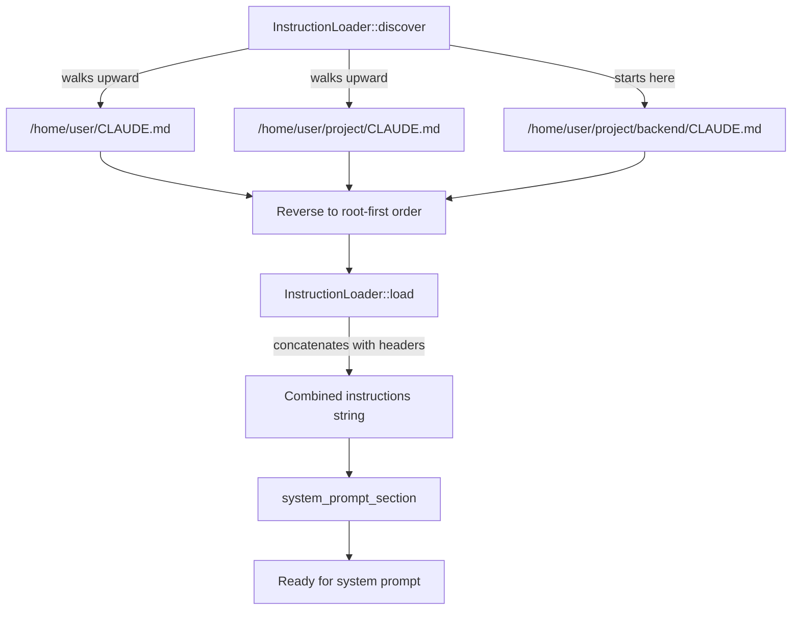

# 第 8 章：系统提示词

> **需要编辑的文件：** `src/instructions.rs`
> **运行测试：** `cargo test -p mini-claw-code-starter instructions`（InstructionLoader）
> **预计用时：** 25 分钟

每个基于 LLM 的 agent 都以系统提示词开头——一段不可见的前言，塑造模型产生的每一个回复。粗糙的提示词只能给你一个聊天机器人。精心设计的提示词则能给你一个遵守安全规则、正确使用工具、并能适应当前项目的编程 agent。

Claude Code 的系统提示词超过 900 行组装文本。它不是单一字符串，而是由**模块化片段**构建而成——身份标识、安全规则、工具 schema、环境信息、项目说明——启动时由构建器拼接在一起。某些片段在不同会话间永不改变（工具 schema、核心说明）；另一些则每次都不同（工作目录、git 状态、CLAUDE.md 内容）。这种区分不是表面文章——它是**prompt 缓存**的基础，这项优化可以显著降低成本和延迟。

本章构建 `InstructionLoader`——通过向上遍历文件系统来发现项目特定 CLAUDE.md 文件的组件。我们还会讨论系统提示词架构的概念（片段、静态/动态拆分、prompt 缓存），这些是 Claude Code 等生产级 agent 所采用的方案。starter 聚焦于指令加载部分，这是最具实用价值、值得从头实现的组件。

## 目标

在 `src/instructions.rs` 中实现 `InstructionLoader`，使其满足：

1. `InstructionLoader` 向上遍历文件系统，发现并加载 CLAUDE.md 文件。
2. `load()` 将发现的文件连接成带有标题的单一字符串。
3. `system_prompt_section()` 将加载的指令包装成可插入系统提示词的形式。

## 指令加载的工作原理



## 为什么系统提示词对 agent 至关重要

原始的 LLM 只是文本补全器。它根本不知道自己能运行 bash 命令、读取文件或编辑代码——除非你告诉它。系统提示词就是告诉它这些的地方。

对于编程 agent，系统提示词必须做好以下几件事：

- **身份标识**："你是一个可以使用工具的编程 agent。"没有这条，模型可能拒绝工具调用，或表现得像通用助手。
- **安全规则**："不要删除工作目录之外的文件。不要引入安全漏洞。"安全规则约束了模型会尝试做什么。
- **工具 schema**：所有可用工具的 JSON schema 定义。模型需要这些信息才知道*如何*调用工具——接受哪些参数、哪些是必填的、期望什么类型。
- **环境信息**：工作目录、操作系统、shell、git 状态。这些上下文能防止模型对环境进行猜测。
- **项目说明**：CLAUDE.md 文件的内容，告诉模型项目约定、推荐的模式以及需要避免的事项。

Claude Code 在每次对话前将所有这些内容组装成一个系统提示词。各片段按特定顺序排列，缓存边界将会变化的部分与不会变化的部分分隔开来。

## 概念：片段与缓存边界

先了解 Claude Code 等生产级 agent 如何组织系统提示词，再深入代码。这些概念指导设计，尽管我们的 starter 采用了更简单的方式。

### Prompt 片段

生产级系统提示词由**模块化片段**构建——身份标识、安全规则、工具 schema、环境信息、项目说明。每个片段是命名的文本块，渲染为：

```text
# identity
You are a coding agent. You help users with software engineering tasks
using the tools available to you.
```

标题帮助 LLM 解析 prompt 结构，检查组装后的 prompt 时也便于调试。

### 静态 vs. 动态：缓存边界

LLM API 调用代价不菲。系统提示词中的每个 token 在每次请求时都会被处理。Claude 的 prompt 缓存功能允许将 prompt 的一个前缀标记为可缓存——API 处理一次后缓存内部状态，并在后续请求中复用。对于长 prompt，这最多可将延迟降低 85%，成本降低 90%。

但缓存只对**前缀**有效。被缓存的前缀中有任何字节发生变化，缓存就会失效。所以需要把稳定的部分放在前面，变化的部分放在后面：

```text
+---------------------------------------+
| Static sections (cacheable)           |
|  - Identity                           |
|  - Safety instructions                |
|  - Tool schemas                       |
|                                       |
|  [these rarely change]                |
+-------- CACHE BOUNDARY ---------------+
| Dynamic sections (per-session)        |
|  - Working directory                  |
|  - Git status                         |
|  - CLAUDE.md instructions             |
|  - Custom user instructions           |
|                                       |
|  [these change every session]         |
+---------------------------------------+
```

Claude Code 将这个边界称为 `SYSTEM_PROMPT_DYNAMIC_BOUNDARY`。边界以上的内容附带缓存控制头发送，边界以下的内容在每次请求时都是新鲜的。

生产级 agent 会实现一个 `SystemPromptBuilder`，维护静态和动态片段的独立列表，分别渲染两部分，并支持感知缓存的 provider。这些类型（`SystemPromptBuilder`、`PromptSection`）在本章中只是概念——starter 不包含它们。starter 实现的是 `src/instructions.rs` 中的 `InstructionLoader`，这是最具实用价值、值得从头构建的组件。

## InstructionLoader：发现 CLAUDE.md

Claude Code 从 CLAUDE.md 文件中加载项目特定的指令。这些文件让用户按项目自定义 agent 的行为——偏好的编码风格、测试命令、需要避免的事项。agent 从当前工作目录向上遍历文件系统来发现这些文件。

打开 `src/instructions.rs`，以下是 starter 的桩代码：

```rust
pub struct InstructionLoader {
    file_names: Vec<String>,
}

impl InstructionLoader {
    pub fn new(file_names: &[&str]) -> Self {
        unimplemented!("Convert file_names to Vec<String>")
    }

    pub fn default_files() -> Self {
        Self::new(&["CLAUDE.md", ".mini-claw/instructions.md"])
    }

    pub fn discover(&self, start_dir: &Path) -> Vec<PathBuf> {
        unimplemented!(
            "Walk up from start_dir, collect matching files, reverse for root-first order"
        )
    }

    pub fn load(&self, start_dir: &Path) -> Option<String> {
        unimplemented!("Discover files, read each, join with headers showing source path")
    }

    pub fn system_prompt_section(&self, start_dir: &Path) -> Option<String> {
        unimplemented!("Call load(), wrap with instruction preamble")
    }
}
```

加载器通过文件名参数化来确定搜索目标。默认配置查找 `CLAUDE.md` 和 `.mini-claw/instructions.md`。

### Rust 概念：从借用切片到所有权集合

构造函数接受 `&[&str]`——借用的字符串切片的借用切片——并将其转换为 `Vec<String>`。这是 Rust 在 API 边界处的常见模式：接受借用数据以保持灵活性（调用方可以传入字符串字面量、`&String` 或任何解引用为 `&str` 的类型），但内部存储所有权数据，使结构体没有生命周期参数，可以独立于创建者存活。

### 实现 `new()`

构造函数将 `&[&str]` 切片转换为所有权的 `String` 值：

```rust
pub fn new(file_names: &[&str]) -> Self {
    Self {
        file_names: file_names.iter().map(|s| s.to_string()).collect(),
    }
}
```

### `discover()`——向上遍历

`discover()` 方法从给定目录开始，向文件系统根部方向遍历，检查每个目录中是否存在目标文件：

```rust
pub fn discover(&self, start_dir: &Path) -> Vec<PathBuf> {
    let mut found = Vec::new();
    let mut dir = Some(start_dir.to_path_buf());

    while let Some(current) = dir {
        for name in &self.file_names {
            let candidate = current.join(name);
            if candidate.is_file() {
                found.push(candidate);
            }
        }
        dir = current.parent().map(|p| p.to_path_buf());
    }

    found.reverse(); // Root-first order
    found
}
```

遍历从起始目录收集文件直到根目录，然后反转列表，使根级别的文件排在前面。这个顺序很重要：全局指令出现在项目特定指令之前，LLM 最后看到的是最具体的指令（最接近用户 prompt 的位置）。

以位于 `/home/user/project/backend` 的项目为例：

```text
/home/user/CLAUDE.md                  <-- 全局偏好
/home/user/project/CLAUDE.md          <-- 项目约定
/home/user/project/backend/CLAUDE.md  <-- 后端特定规则
```

`discover()` 之后，向量按该顺序包含这些文件：全局的在前，最具体的在后。

### `load()`——读取与连接

`load()` 方法调用 `discover()`，读取每个文件，并将它们连接成单一字符串。每个文件的内容前加上 `# Instructions from <path>` 标题，让 LLM 知道每个块来自何处。文件之间用 `---` 分隔符隔开。空文件或不可读的文件会被静默跳过。如果根本不存在任何指令文件，`load()` 返回 `None`。

两个文件的输出如下所示：

```text
# Instructions from /home/user/CLAUDE.md

Use American English. Prefer explicit error handling.

---

# Instructions from /home/user/project/CLAUDE.md

Run tests with `cargo test`. Never modify generated files.
```

### `system_prompt_section()`——为 prompt 包装

`system_prompt_section()` 方法调用 `load()` 并用指令前言包装结果。这会产生一个可插入系统提示词的字符串。如果找不到指令文件，则返回 `None`。

确切的前言应为：

```rust
format!(
    "The following project instructions were loaded automatically. \
     Follow them carefully:\n\n{content}"
)
```

测试检查输出中是否包含子字符串 `"project instructions"`，因此前言文本必须包含这些词。

## 在系统提示词中使用 InstructionLoader

在生产级 agent 中，指令加载器接入 prompt 组装流水线。加载的指令始终是动态的——取决于 agent 从哪个目录启动。

用 `InstructionLoader` 构建简单系统提示词的方式：

```rust
let mut prompt = String::from("You are a coding agent.\n\n");

let loader = InstructionLoader::default_files();
if let Some(section) = loader.system_prompt_section(Path::new(cwd)) {
    prompt.push_str(&section);
}
```

更复杂的 agent 会将静态和动态片段分离以实现 prompt 缓存（参见上面的概念讨论），但这种简单方法足以让你起步。

## Claude Code 的实现方式

Claude Code 的 prompt 组装遵循相同的原则，只是规模更大。它的系统提示词包括身份标识、安全规则、工具 schema、行为准则、环境详情、多层级的 CLAUDE.md 指令以及会话元数据——通常超过 900 行。

没有 prompt 缓存，每次 API 调用都要重新处理所有这些内容。Claude Code 用 `SYSTEM_PROMPT_DYNAMIC_BOUNDARY` 标记来标识缓存边界。provider 在此边界处拆分系统消息，将前缀附带 `cache_control: { type: "ephemeral" }` 发送。API 缓存前缀的内部表示，并在后续请求中复用，通常覆盖 80% 以上的 prompt。

作为扩展，你可以构建一个 `SystemPromptBuilder`，维护静态和动态片段的独立列表，分别渲染两部分，并让感知缓存的 provider 在边界处拆分 prompt。starter 聚焦于指令加载部分，这是最具实用价值的组件。

## 运行测试

运行 InstructionLoader 测试：

```bash
cargo test -p mini-claw-code-starter instructions
```

### 测试验证的内容

- **`test_instructions_instruction_loader_discover`**：创建包含 CLAUDE.md 文件的临时目录，验证 `discover()` 能找到它。
- **`test_instructions_instruction_loader_load`**：相同的设置，验证 `load()` 返回文件内容。
- **`test_instructions_instruction_loader_no_files`**：不存在任何指令文件时，`load()` 返回 `None`。

## 小结

你构建了指令加载基础设施：

- **`InstructionLoader`** 通过向上遍历文件系统发现 CLAUDE.md 文件，以根优先的顺序连接它们，全局指令出现在项目特定指令之前。
- **`system_prompt_section()`** 将发现的指令包装成可插入系统提示词的形式。

你还学习了生产级系统提示词架构的核心概念：

- **Prompt 片段**将系统提示词分解为命名的模块化块。
- **缓存边界**将会变化的内容与不会变化的内容分隔开，从而实现 prompt 缓存——这项单一优化对于长 prompt 可以将成本和延迟降低一个数量级。每个生产级 agent 都会这样做。

作为扩展，你可以实现 `PromptSection` 和 `SystemPromptBuilder` 类型来从结构上管理静态/动态拆分。参考实现（`mini-claw-code`）展示了一种方法。

## 核心要点

系统提示词不是单一字符串——它是模块化片段的组合，排列方式使稳定内容在前（从而启用 prompt 缓存），会话特定内容在后。`InstructionLoader` 是这个组合中最简单却最面向用户的部分：让每个项目都能通过普通 Markdown 文件来自定义 agent 的行为。

## 下一步

在[第 9 章：文件工具](./ch09-file-tools.md)中，实现让 agent 与文件系统交互的工具——读取、写入和编辑文件。这些工具的 schema 最终将出现在系统提示词的静态部分中。

## 自测

{{#quiz ../quizzes/ch08.toml}}

---

[← 第 7 章：agent 循环（深度解析）](./ch07-query-engine.md) · [目录](./ch00-overview.md) · [第 9 章：文件工具 →](./ch09-file-tools.md)
