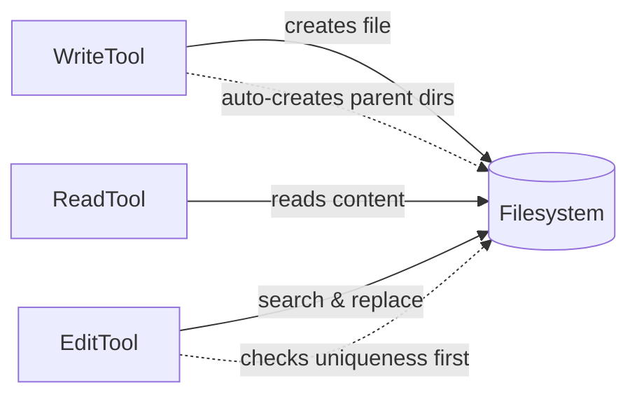
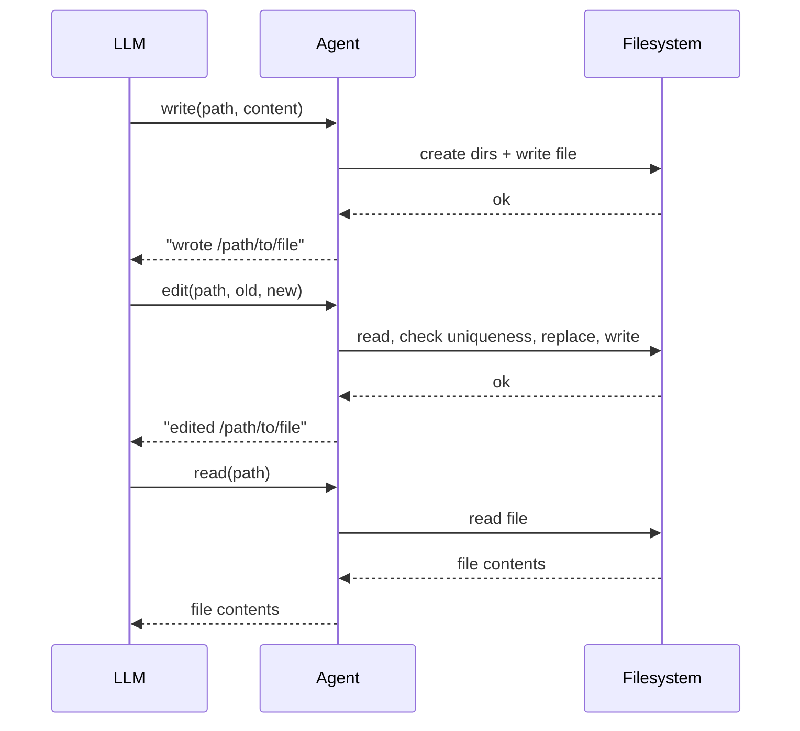

# 第 9 章：文件工具

> **需要编辑的文件：** `src/tools/write.rs`、`src/tools/edit.rs`
> （`TODO ch9:` 桩代码）。`src/tools/read.rs` 早在[第 2 章](./ch02-first-tool.md)已完成——本章把它作为基准，对比写入和编辑两个工具的设计取舍。
> **运行测试：** `cargo test -p mini-claw-code-starter test_read_`（ReadTool）、`cargo test -p mini-claw-code-starter test_write_`（WriteTool）、`cargo test -p mini-claw-code-starter test_edit_`（EditTool）
> **预计用时：** 50 分钟

## 目标

- 重新审视 `ReadTool`（第 2 章已构建），理解其极简设计与生产工具中行号、offset/limit 之间的权衡。
- 实现 `WriteTool`，自动创建父目录，省去 agent 额外调用 `mkdir` 的步骤。
- 实现带唯一性检查的 `EditTool`，让 agent 能对现有文件做精确的字符串替换。
- 理解为什么 starter 中工具错误以 `Err(...)` 形式返回（agent 循环将其转为 LLM 可读、可恢复的消息——详细原理见[第 6 章 §"为什么工具错误绝不终止 agent"](./ch06-tool-interface.md#why-tool-errors-never-terminate-the-agent)）。

无法触及文件系统的编程 agent，不过是个自命不凡的聊天机器人。描述代码改动、建议修复、解释算法，它都能做——但真正动手，什么都干不了。第 6 章的工具给了 agent 一双手；本章给这双手握上点东西：文件。

文件操作是任何编程 agent 工具集的根基。Claude Code 内置了读取、写入、编辑工具（以及更多），Cursor、Aider、OpenCode 各有各的版本。操作本身很简单（读字节、写字节、查找替换），但设计选择决定了 agent 能否可靠地修改代码库，还是会在自己的编辑上绊跟头。本章实现全部三个工具：`ReadTool`、`WriteTool`、`EditTool`。

## 文件工具如何协同工作





---

## 6.1 ReadTool

`ReadTool` 是最简单的文件工具：接收路径，用 `tokio::fs::read_to_string` 读文件，以字符串返回原始内容。没有行号，没有 offset/limit，没有任何转换。starter 和参考实现（`mini-claw-code/src/tools/read.rs`）都如此——刻意保持极简，给本章剩余部分（写入、编辑）留出空间。

### 设计讨论：生产 agent 为何要做得更多

Claude Code 这类生产 agent 走得更远。它们的读取工具通常给每行加行号（`cat -n` 风格），并通过 `offset` 和 `limit` 参数支持部分读取。原因有两点：

- **行号给 LLM 一套坐标系。** "替换第 42 行的字符串"是精确的，"替换函数中间某处的字符串"不是。这对编辑工具尤为重要——模型必须给出精确的匹配字符串，行号帮它找准位置、复制正确片段。
- **offset/limit 保护上下文窗口。** 一个 5 万行的生成文件可能耗尽模型的上下文配额。分页读取让 LLM 按需取用，不必把整个预算花在一个文件上。

本书的 starter 和参考实现都没有这两项特性——刻意留白，以保持核心 `Tool` 实现在十余行以内。想添加的话，这是本章末尾列出的扩展练习之一。

### starter 桩代码

打开 `src/tools/read.rs`：

```rust
use anyhow::Context;
use serde_json::Value;

use crate::types::*;

pub struct ReadTool {
    definition: ToolDefinition,
}

impl Default for ReadTool {
    fn default() -> Self {
        Self::new()
    }
}

impl ReadTool {
    /// Create a new ReadTool with its JSON schema definition.
    ///
    /// The schema should declare one required parameter: "path" (string).
    pub fn new() -> Self {
        unimplemented!(
            "Create a ToolDefinition with name \"read\" and a required \"path\" parameter"
        )
    }
}

#[async_trait::async_trait]
impl Tool for ReadTool {
    fn definition(&self) -> &ToolDefinition {
        &self.definition
    }

    async fn call(&self, _args: Value) -> anyhow::Result<String> {
        unimplemented!(
            "Extract \"path\" from args, read file with tokio::fs::read_to_string, return contents"
        )
    }
}
```

需要填写两个方法：

1. **`new()`**：构建名为 `"read"`、带必填 `"path"` 参数的 `ToolDefinition`。
2. **`call()`**：提取路径，读取文件，返回内容。

### 实现 ReadTool

**定义。** 一个必填参数：`path`。LLM 将其视为 JSON Schema，知道必须提供 `path`。

```rust
pub fn new() -> Self {
    Self {
        definition: ToolDefinition::new("read", "Read the contents of a file.")
            .param("path", "string", "Absolute path to the file", true),
    }
}
```

**`call()` 方法。** 读取文件，以 `String` 返回内容：

```rust
async fn call(&self, args: Value) -> anyhow::Result<String> {
    let path = args["path"]
        .as_str()
        .context("missing 'path' argument")?;

    let content = tokio::fs::read_to_string(path)
        .await
        .with_context(|| format!("failed to read '{path}'"))?;

    Ok(content)
}
```

### Rust 概念：用 anyhow::Context 丰富错误信息

`.context("missing 'path' argument")?` 和 `.with_context(|| format!("failed to read '{path}'"))` 用人类可读的消息包装底层错误。`context()` 接受静态字符串；`with_context()` 接受闭包处理动态消息（`?` 路径未触发时不产生分配）。两者都返回 `anyhow::Error`，并将原始错误链接在下方——完整的错误消息读起来像 `"failed to read 'foo.rs': No such file or directory"`。这种链式错误让 `anyhow` 的信息足够丰富，无需自定义错误类型。

注意 `call()` 返回 `anyhow::Result<String>`，而非 `ToolResult`。starter 的 `Tool` trait 经过简化——工具成功时返回普通字符串，遇到错误（参数缺失、I/O 故障）则返回 `Err(...)`。agent 循环负责把错误转换为 LLM 可见的消息。

**可能的扩展。** 生产级 `ReadTool` 会添加 `offset` 和 `limit` 参数支持部分读取，并以制表符分隔的行号格式化输出（类似 `cat -n`）。本书参考实现均未包含，两者都是范围清晰的好练习。

### 输出示例

给定一个包含三行的文件：

```
alpha
beta
gamma
```

工具返回原始文件内容：

```
alpha
beta
gamma
```

这是最简单的方式。生产工具在此基础上扩展行号和部分读取，对大文件和给 LLM 精确行引用都很有价值——详见上方的设计讨论。

---

## 6.2 WriteTool

写文件概念上很简单：接受路径和内容，把内容写进去。但有个实际细节影响很大：自动创建父目录。

LLM 写入 `src/handlers/auth/middleware.rs` 时，`src/handlers/auth/` 可能还不存在。朴素的实现会报"没有这样的文件或目录"。agent 随后得调用 `bash("mkdir -p ...")` 再重试，浪费一次工具调用，还会让模型困惑。不如直接静默处理掉。

### starter 桩代码

打开 `src/tools/write.rs`：

```rust
use anyhow::Context;
use serde_json::Value;

use crate::types::*;

pub struct WriteTool {
    definition: ToolDefinition,
}

impl Default for WriteTool {
    fn default() -> Self {
        Self::new()
    }
}

impl WriteTool {
    /// Schema: required "path" and "content" parameters.
    pub fn new() -> Self {
        unimplemented!(
            "Use ToolDefinition::new(name, description).param(...).param(...)"
        )
    }
}

#[async_trait::async_trait]
impl Tool for WriteTool {
    fn definition(&self) -> &ToolDefinition {
        &self.definition
    }

    async fn call(&self, _args: Value) -> anyhow::Result<String> {
        unimplemented!(
            "Extract path and content, create parent dirs, write file, return format!(\"wrote {path}\")"
        )
    }
}
```

### 实现 WriteTool

**定义。** 两个必填参数：`path` 和 `content`。

```rust
pub fn new() -> Self {
    Self {
        definition: ToolDefinition::new("write", "Write content to a file, creating directories as needed")
            .param("path", "string", "Absolute path to write to", true)
            .param("content", "string", "Content to write", true),
    }
}
```

**`call()` 方法。** 提取参数、创建父目录、写文件，返回确认字符串：

```rust
async fn call(&self, args: Value) -> anyhow::Result<String> {
    let path = args["path"]
        .as_str()
        .context("missing 'path' argument")?;
    let content = args["content"]
        .as_str()
        .context("missing 'content' argument")?;

    // Create parent directories
    if let Some(parent) = std::path::Path::new(path).parent() {
        if !parent.as_os_str().is_empty() {
            tokio::fs::create_dir_all(parent).await?;
        }
    }

    tokio::fs::write(path, content).await?;

    Ok(format!("wrote {path}"))
}
```

返回值是 `format!("wrote {path}")`，一个简单的确认字符串。agent 看到它就知道写入成功了。

### 代码详解

**两个必填参数。** `path` 和 `content` 都是必填的，没有可选行为，两者缺一不可。

**自动创建目录。** `create_dir_all` 是关键设计。等价于 `mkdir -p`——目录已存在则无操作，中间目录缺失则全部创建。守卫条件 `!parent.as_os_str().is_empty()` 处理路径没有父组件的边缘情况（如裸文件名 `"file.txt"`），否则 `create_dir_all("")` 会报错。

**覆写语义。** `tokio::fs::write` 文件已存在时覆写，不存在时创建，没有追加模式，没有冲突检测。这是有意为之——该工具是全量写入，不是合并。要修改现有文件，用 EditTool。

**确认字符串。** 返回 `"wrote /path/to/file"`，让模型知道写入成功。

---

## 6.3 EditTool

EditTool 是三者中最有意思的，也传授了本书最重要的设计理念：**错误是值，不是异常**。

它对文件做查找替换：接受路径、要查找的 `old_string`、要替换成的 `new_string`。关键约束：`old_string` 在文件中必须恰好出现一次。零次匹配意味着模型的字符串有误；多于一次意味着替换有歧义，不知道该改哪个。

这两种情况都是预期的失败模式，不是 bug。模型经常稍微搞错字符串（缺少空格、缩进不对、上次编辑后内容已过时）。工具必须清晰地报告这些失败，让模型自我纠正。

### starter 桩代码

打开 `src/tools/edit.rs`：

```rust
use anyhow::{Context, bail};
use serde_json::Value;

use crate::types::*;

pub struct EditTool {
    definition: ToolDefinition,
}

impl Default for EditTool {
    fn default() -> Self {
        Self::new()
    }
}

impl EditTool {
    /// Schema: required "path", "old_string", "new_string" parameters.
    pub fn new() -> Self {
        unimplemented!(
            "Use ToolDefinition::new(name, description).param(...).param(...).param(...)"
        )
    }
}

#[async_trait::async_trait]
impl Tool for EditTool {
    fn definition(&self) -> &ToolDefinition {
        &self.definition
    }

    async fn call(&self, _args: Value) -> anyhow::Result<String> {
        unimplemented!(
            "Extract args, read file, verify old_string appears exactly once, replace, write back"
        )
    }
}
```

### 实现 EditTool

**定义。** 三个必填参数：`path`、`old_string`、`new_string`。

```rust
pub fn new() -> Self {
    Self {
        definition: ToolDefinition::new(
            "edit",
            "Replace an exact string in a file. The old_string must appear exactly once.",
        )
        .param("path", "string", "Absolute path to the file to edit", true)
        .param("old_string", "string", "The exact string to find", true)
        .param("new_string", "string", "The replacement string", true),
    }
}
```

**`call()` 方法。** 读文件、检查唯一性、替换、写回：

```rust
async fn call(&self, args: Value) -> anyhow::Result<String> {
    let path = args["path"]
        .as_str()
        .context("missing 'path' argument")?;
    let old = args["old_string"]
        .as_str()
        .context("missing 'old_string' argument")?;
    let new = args["new_string"]
        .as_str()
        .context("missing 'new_string' argument")?;

    let content = tokio::fs::read_to_string(path)
        .await
        .with_context(|| format!("failed to read '{path}'"))?;

    let count = content.matches(old).count();
    if count == 0 {
        bail!("old_string not found in '{path}'");
    }
    if count > 1 {
        bail!("old_string appears {count} times in '{path}', must be unique");
    }

    let updated = content.replacen(old, new, 1);
    tokio::fs::write(path, &updated).await?;

    Ok(format!("edited {path}"))
}
```

成功时返回 `format!("edited {path}")`。

### 代码详解

**三个必填参数。** `path`、`old_string`、`new_string` 都是必填的。模型必须明确指定查找什么、替换成什么。没有正则，没有基于行号的编辑，没有 diff 格式，就是纯字符串替换。简单是优点——明确，模型容易用对。

**唯一性检查。** 这是工具的核心：

```rust
let count = content.matches(old).count();
if count == 0 {
    bail!("old_string not found in '{path}'");
}
if count > 1 {
    bail!("old_string appears {count} times in '{path}', must be unique");
}
```

### Rust 概念：bail! 宏

`bail!("old_string not found in '{path}'")` 是 `return Err(anyhow::anyhow!("..."))` 的简写，立即从函数返回带指定消息的错误。它是 `anyhow` crate 的一部分，在任何返回 `anyhow::Result` 的函数中都可以用。与 `?`（传播已有错误）不同，`bail!` 在原地创建新错误。

两个分支都通过 `bail!` 返回错误。在 starter 简化的 `Tool` trait 中，工具从 `call()` 返回 `anyhow::Result<String>`。工具返回 `Err` 时，agent 循环将其转为 LLM 可见的错误消息，模型随后用正确的字符串重试。

### 简化 trait 中的错误处理

starter 的 `Tool` trait 从 `call()` 返回 `anyhow::Result<String>`，错误处理很直接——任何失败都用 `bail!()` 或 `?`，agent 循环负责把错误转为 LLM 可读的消息。

在 agent 的 `execute_tools` 方法中，工具调用这样处理：

```rust
match tool.call(call.arguments.clone()).await {
    Ok(result) => result,
    Err(e) => format!("error: {e}"),
}
```

`call()` 返回的 `Err` 变成类似 `"error: old_string not found in 'foo.rs'"` 的字符串。模型看到后知道换个字符串重试。

更复杂的设计（Claude Code 所采用的）区分了可恢复的工具级错误（作为成功值返回）和真正的 I/O 故障（作为 `Err` 返回）。starter 对两者统一使用 `Err`，agent 循环以相同方式处理。

---

## 6.4 集成：写入、编辑、读取

这些工具的真正威力来自组合使用。典型的 agent 工作流：

1. **写入**新文件
2. **编辑**修复 bug 或精化代码
3. **读取**验证结果

以工具调用的形式呈现：

```
Agent: I'll create the handler file.
-> write(path: "/tmp/project/handler.rs", content: "fn main() { println!(\"hello\"); }")
<- "wrote /tmp/project/handler.rs"

Agent: Let me update the greeting.
-> edit(path: "/tmp/project/handler.rs", old_string: "hello", new_string: "goodbye")
<- "edited /tmp/project/handler.rs"

Agent: Let me verify the change.
-> read(path: "/tmp/project/handler.rs")
<- "fn main() { println!(\"goodbye\"); }"
```

每个工具做一件事，清晰地传达结果。agent 看到每步输出，决定下一步。编辑失败（字符串错误）时，agent 看到错误，用正确的字符串重试。

写入-编辑-读取正是 Claude Code 在实践中修改文件的方式。不生成完整文件再覆写——那会丢失被修改部分以外的内容。而是对需要更改的具体行做精确编辑，再读取结果确认。这样更可靠，diff 也更小。

---

## 6.5 Claude Code 的实现方式

Claude Code 的文件工具遵循相同协议，但更为精细：

**读取**支持图片和 PDF。检测二进制文件并适当渲染（base64 编码的图片作为多模态内容块发送）。截断策略基于 token 计数而非字符计数，文件为空时会发出警告。

**写入**检查受保护的文件。Claude Code 维护一份永不覆写的文件列表（`.env`、`credentials.json` 等）并阻止写入。还与权限系统集成，在特定模式下覆写现有文件前需要用户批准。

**编辑**功能更强大。支持单次调用中进行多处编辑，有 diff 预览模式，处理编码检测，并验证编辑结果在语法上有效（对支持的语言）。唯一性检查也更细致，会考虑匹配项周围的上下文行以消除歧义。

但核心协议与你刚构建的完全相同：结构体持有定义，`Tool` trait 提供接口，`call` 方法做实际工作，agent 循环调度并收集结果。理解这三个简单工具，就有了理解 Claude Code 完整工具集的基础。

---

## 6.6 工具文件组织

三个工具都在 `src/tools/`，与后续章节要构建的其他工具放在一起。starter 的模块结构：

```
src/tools/
  mod.rs    -- re-exports all tools
  ask.rs    -- AskTool (bonus)
  bash.rs   -- BashTool (Chapter 10)
  edit.rs   -- EditTool
  read.rs   -- ReadTool
  write.rs  -- WriteTool
```

`mod.rs` 桶文件重新导出所有内容：

```rust
mod ask;
mod bash;
mod edit;
mod read;
mod write;

pub use ask::*;
pub use bash::BashTool;
pub use edit::EditTool;
pub use read::ReadTool;
pub use write::WriteTool;
```

这样使用者可以写 `use crate::tools::{ReadTool, WriteTool, EditTool}`，无需深入各个模块。

---

## 6.7 测试

运行文件工具测试：

```bash
cargo test -p mini-claw-code-starter test_read_   # ReadTool
cargo test -p mini-claw-code-starter test_write_  # WriteTool
cargo test -p mini-claw-code-starter test_edit_   # EditTool
```

cargo test 的过滤器是子字符串匹配，不支持 OR，无法一次调用组合多个前缀。分三条命令分别运行，或去掉所有前缀用通配命令一次看完：
`cargo test -p mini-claw-code-starter -- --test-threads=1`。

各测试验证的内容：

### ReadTool 测试（在 `test_read_` 中）

- **`test_read_read_definition`**：检查工具定义的名称是否为 "read"。
- **`test_read_read_file`**：读取文件，验证内容出现在输出中。
- **`test_read_read_missing_file`**：尝试读取不存在的文件，验证结果是 `Err`。

### WriteTool 测试（在 `` 中）

- **`test_write_creates_file`**：向新文件写入内容，验证结果包含确认信息，并读回文件确认内容。
- **`test_write_creates_dirs`**：写入嵌套目录中的文件，所有中间目录自动创建。
- **`test_write_overwrites_existing`**：向已有内容的文件写入，验证旧内容被替换。

### EditTool 测试（在 `` 中）

- **`test_edit_replaces_string`**：编辑文件中的字符串，验证结果显示 "edited" 且文件已更新。
- **`test_edit_not_found`**：尝试替换不存在的字符串，验证结果是 `Err`。
- **`test_edit_not_unique`**：尝试替换多次出现的字符串，验证错误提到了歧义性。

---

## 小结

三个工具，一种模式。本章每个工具都遵循相同结构：

1. **结构体**，带 `definition: ToolDefinition` 字段。
2. **`new()` 构造函数**，用第 4 章的参数构建器构建定义。
3. **`Tool` 实现**，包含 `definition()` 和 `call()`。

这种模式可扩展。第 10 章加入 Bash 时，结构完全相同，只有 `call()` 的逻辑不同。这就是 `Tool` trait 的威力：统一接口，让每个工具从 agent 角度看都是可互换的。

本章核心经验：

- **自动化显而易见的事。** `WriteTool` 自动创建父目录，省去一次浪费的工具调用。
- **检查唯一性。** `EditTool` 要求旧字符串恰好出现一次。零次匹配说明模型字符串有误，多次匹配说明替换有歧义。
- **错误干净传播。** 工具返回 `anyhow::Result<String>`，agent 循环捕获错误并转为 LLM 可读、可恢复的消息。

## 核心要点

文件工具是 agent 操作代码库的双手。读取、写入、编辑三工具的划分，给了 LLM 针对不同操作的清晰动词，而非一个臃肿的"文件"工具。`EditTool` 的唯一性检查是最重要的设计决策：强制 LLM 提供无歧义的匹配，及早发现错误，从而实现可靠的自我纠正。

[第 10 章：Bash 工具](./ch10-bash-tool.md)将构建 agent 武器库中最强大（也最危险）的工具——可以运行任意 shell 命令。

## 自测

{{#quiz ../quizzes/ch09.toml}}

---

[← 第 8 章：系统提示词](./ch08-system-prompt.md) · [目录](./ch00-overview.md) · [第 10 章：Bash 工具 →](./ch10-bash-tool.md)
