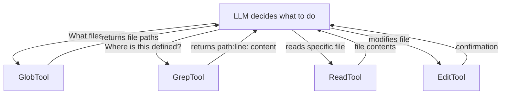

# 第 11 章：搜索工具

> **需要编辑的文件：** （扩展章节——starter 中无桩代码）
> **测试：** starter 中无测试。GlobTool 和 GrepTool 属于扩展工具。
> **预计时间：** 25 分钟（只读）

## 目标

- 理解为什么文件发现（GlobTool）和内容搜索（GrepTool）是两个独立工具，各有不同的参数 schema。
- 实现 `GlobTool`，让 agent 能用 `glob` crate 按名称模式查找文件。
- 实现支持递归目录遍历、正则匹配和可选文件类型过滤的 `GrepTool`。
- 了解在工具实现中何时用异步辅助函数、何时用同步辅助函数（I/O 密集型文件读取 vs. 快速目录遍历）。

只能读取已知文件的 coding agent，就像从不使用 `find` 或 `grep` 的开发者。给它具体的文件路径，它会忠实地读；把它丢进陌生的代码库，它就成了睁眼瞎。无法发现哪些文件存在，无法搜索函数定义，无法找出某个类型被使用的所有地方。没有搜索，LLM 只能猜文件路径——而且会猜错。

搜索工具解决了这个问题。本章探讨两个：**GlobTool** 按名称模式查找文件，**GrepTool** 按正则搜索文件内容。二者共同赋予 LLM 导航任意代码库的能力，无论规模多大、多么陌生。它们是 agent 的眼睛。

## 搜索工具在 agent 工作流中的位置



> **注意：** 搜索工具在本书中属于扩展内容——starter（`mini-claw-code-starter`）和参考实现（`mini-claw-code`）均未内置 `GlobTool` 或 `GrepTool`。如果你想添加，需要从头创建 `src/tools/glob.rs` 和 `src/tools/grep.rs`，并在 `src/tools/mod.rs` 中注册。两个工具的完整参考代码均在下文内联展示——把本章看作带注释的实现演练，而非填写桩代码的练习。

## 两个工具，两个问题

glob 和 grep 的分工对应 LLM 在探索代码时提出的两类截然不同的问题：

1. **"有哪些文件？"** — GlobTool。LLM 知道自己想要 Rust 文件、测试文件或配置文件，但不知道确切路径。`**/*.rs` 或 `tests/*.toml` 这样的 glob 模式能给出答案。

2. **"这个东西定义在哪里？"** — GrepTool。LLM 知道一个函数名、一个类型或一条错误信息，需要找到它在哪个文件的哪一行。`fn parse_sse_line` 或 `struct QueryConfig` 这样的正则模式能给出答案。

Claude Code 将它们设计为独立工具，正是基于这个原因。服务不同目的，接收不同输入，LLM 根据当前已知信息在二者之间做出选择。合并为一个工具只会模糊接口——LLM 不得不判断自己是在做名称搜索还是内容搜索，参数 schema 也会变得别扭。

---

## GlobTool

GlobTool 是两者中较简单的。接收 glob 模式，可选地限定在某个基础目录，返回所有匹配的文件路径。

### 文件布局

实现位于 `src/tools/glob.rs`，完整代码如下：

```rust
use async_trait::async_trait;
use serde_json::Value;

use crate::types::*;

pub struct GlobTool {
    definition: ToolDefinition,
}

impl GlobTool {
    pub fn new() -> Self {
        Self {
            definition: ToolDefinition::new("glob", "Find files matching a glob pattern")
                .param("pattern", "string", "Glob pattern (e.g. \"**/*.rs\")", true)
                .param(
                    "path",
                    "string",
                    "Base directory to search in (default: current directory)",
                    false,
                ),
        }
    }
}

impl Default for GlobTool {
    fn default() -> Self {
        Self::new()
    }
}

#[async_trait]
impl Tool for GlobTool {
    fn definition(&self) -> &ToolDefinition {
        &self.definition
    }

    async fn call(&self, args: Value) -> anyhow::Result<String> {
        let pattern = args["pattern"]
            .as_str()
            .ok_or_else(|| anyhow::anyhow!("missing 'pattern' argument"))?;

        let base = args
            .get("path")
            .and_then(|v| v.as_str())
            .unwrap_or(".");

        let full_pattern = if pattern.starts_with('/') || pattern.starts_with('.') {
            pattern.to_string()
        } else {
            format!("{base}/{pattern}")
        };

        let entries: Vec<String> = glob::glob(&full_pattern)
            .map_err(|e| anyhow::anyhow!("invalid glob pattern: {e}"))?
            .filter_map(|entry| entry.ok())
            .map(|p| p.display().to_string())
            .collect();

        if entries.is_empty() {
            Ok("no files matched".to_string())
        } else {
            Ok(entries.join("\n"))
        }
    }
}
```

### 实现逐段讲解

**工具定义。** 两个参数：`pattern`（必填）和 `path`（可选）。模式是标准 glob——`*.rs` 匹配当前目录下的 Rust 文件，`**/*.rs` 递归匹配所有 Rust 文件，`src/**/*.toml` 匹配 `src/` 下的 TOML 文件。`path` 设置基础目录，省略时默认为 `"."（当前工作目录）。

**模式构造。** `call` 方法根据基础目录和用户提供的模式构建完整 glob 模式。模式已经以 `/` 或 `.` 开头时，视为绝对路径或相对路径直接使用；否则在前面拼接基础目录：`format!("{base}/{pattern}")`。以 `{"pattern": "*.rs", "path": "/home/user/project"}` 调用时，生成 glob `/home/user/project/*.rs`。

**`glob` crate。** 使用 `glob` crate（已在 `Cargo.toml` 中）进行实际匹配。`glob::glob()` 返回 `Result<PathBuf>` 条目的迭代器，用 `filter_map` 配合 `entry.ok()` 静默跳过失败的路径（权限错误、损坏的符号链接）。剩余路径转为显示字符串后收集。

**输出格式。** 匹配路径以换行符连接，每行一个路径。没有匹配时返回 `"no files matched"` 而非空字符串。这对 LLM 很重要：明确的 "no files matched" 告知它模式有效但没有找到文件，从而提示尝试不同模式。空字符串则含义模糊。

---

## GrepTool

GrepTool 更复杂。用正则搜索文件内容，可选地限定在某个目录并按文件类型过滤。输出遵循经典 grep 格式：`path:line_no: content`。

### 完整实现

以下是 `src/tools/grep.rs`：

```rust
use std::path::Path;

use async_trait::async_trait;
use serde_json::Value;

use crate::types::*;

pub struct GrepTool {
    definition: ToolDefinition,
}

impl GrepTool {
    pub fn new() -> Self {
        Self {
            definition: ToolDefinition::new("grep", "Search file contents using a regex pattern")
                .param("pattern", "string", "Regex pattern to search for", true)
                .param(
                    "path",
                    "string",
                    "File or directory to search in (default: current directory)",
                    false,
                )
                .param(
                    "include",
                    "string",
                    "Glob pattern to filter files (e.g. \"*.rs\")",
                    false,
                ),
        }
    }
}

impl Default for GrepTool {
    fn default() -> Self {
        Self::new()
    }
}

#[async_trait]
impl Tool for GrepTool {
    fn definition(&self) -> &ToolDefinition {
        &self.definition
    }

    async fn call(&self, args: Value) -> anyhow::Result<String> {
        let pattern = args["pattern"]
            .as_str()
            .ok_or_else(|| anyhow::anyhow!("missing 'pattern' argument"))?;

        let re = regex::Regex::new(pattern)
            .map_err(|e| anyhow::anyhow!("invalid regex pattern: {e}"))?;

        let search_path = args
            .get("path")
            .and_then(|v| v.as_str())
            .unwrap_or(".");

        let include_pattern = args.get("include").and_then(|v| v.as_str());
        let include_glob = include_pattern
            .map(|p| glob::Pattern::new(p))
            .transpose()
            .map_err(|e| anyhow::anyhow!("invalid include pattern: {e}"))?;

        let path = Path::new(search_path);
        let mut matches = Vec::new();

        if path.is_file() {
            search_file(&re, path, &mut matches).await;
        } else if path.is_dir() {
            let mut entries = Vec::new();
            collect_files(path, &include_glob, &mut entries);
            entries.sort();
            for file_path in entries {
                search_file(&re, &file_path, &mut matches).await;
            }
        } else {
            anyhow::bail!("path does not exist: {search_path}");
        }

        if matches.is_empty() {
            Ok("no matches found".to_string())
        } else {
            Ok(matches.join("\n"))
        }
    }
}

/// Search a single file for regex matches and append formatted results.
async fn search_file(re: &regex::Regex, path: &Path, matches: &mut Vec<String>) {
    let Ok(content) = tokio::fs::read_to_string(path).await else {
        return; // Skip binary/unreadable files
    };
    let display = path.display();
    for (line_no, line) in content.lines().enumerate() {
        if re.is_match(line) {
            matches.push(format!("{display}:{}: {line}", line_no + 1));
        }
    }
}

/// Recursively collect files from a directory, optionally filtering by glob.
fn collect_files(
    dir: &Path,
    include: &Option<glob::Pattern>,
    out: &mut Vec<std::path::PathBuf>,
) {
    let Ok(entries) = std::fs::read_dir(dir) else {
        return;
    };
    for entry in entries.flatten() {
        let path = entry.path();
        if path.is_dir() {
            // Skip hidden directories
            if path
                .file_name()
                .is_some_and(|n| n.to_string_lossy().starts_with('.'))
            {
                continue;
            }
            collect_files(&path, include, out);
        } else if path.is_file() {
            if let Some(glob) = include {
                let name = path
                    .file_name()
                    .map(|n| n.to_string_lossy().to_string())
                    .unwrap_or_default();
                if !glob.matches(&name) {
                    continue;
                }
            }
            out.push(path);
        }
    }
}
```

### 实现逐段讲解

内容较多，逐步拆解。

**工具定义。** 三个参数：`pattern`（必填，正则）、`path`（可选，文件或目录）、`include`（可选，文件名 glob 过滤）。LLM 可能以 `{"pattern": "fn main"}` 搜索当前目录，也可能以 `{"pattern": "TODO", "path": "src/", "include": "*.rs"}` 只搜索 `src/` 下的 Rust 文件。

**正则编译。** 模式提前编译为 `regex::Regex`。LLM 提供无效正则时（缺少闭合括号、错误转义），立即返回错误，而非在搜索途中崩溃。`regex` crate 支持完整的 Rust 正则语法——字符类、量词、交替、捕获组。

**include 过滤器。** `include` 参数是 glob 模式，不是正则。使用与 GlobTool 相同的 `glob` crate，将其编译为 `glob::Pattern`。

### Rust 概念：Option::transpose

`.transpose()` 将 `Option<Result<T>>` 转换为 `Result<Option<T>>`。这是处理可能失败的可选操作的常用 Rust 惯用法。没有 `transpose`，需要用 `match` 或 `if let` 分别处理 `Some(Ok(...))`、`Some(Err(...))` 和 `None` 三种情况；有了它，可以用 `?` 传播错误，得到干净的 `Option<T>`。`x.map(fallible_fn).transpose()?` 的含义：如果存在，尝试该操作；失败则传播错误；不存在则产生 `None`。

**三路路径分发。** 搜索路径可以是文件、目录或不存在：

- **文件**：只搜索那一个文件。LLM 已知要看哪个文件时这样调用。
- **目录**：递归收集所有文件（如果提供了 `include` 则过滤），排序后逐一搜索，确保输出有序。
- **不存在**：通过 `bail!` 返回错误。agent 循环捕获后向 LLM 报告 `"error: path does not exist: /nonexistent/path"`，模型可以尝试其他路径恢复。

**输出格式。** 每条匹配格式化为 `path:line_no: content`，遵循经典 grep 惯例。行号从 1 开始（人类和 LLM 都期望第一行是第 1 行，不是第 0 行）。没有匹配时返回 `"no matches found"`——明确胜于空白。

---

## 辅助函数设计

### Rust 概念：辅助函数中异步与同步的选择

两个辅助函数——`search_file` 和 `collect_files`——有意采用了不同的签名。理解其中原因，可以揭示实用的 Rust 异步模式。决策规则很简单：**函数执行可能阻塞的 I/O（读取文件内容）就用异步；执行快速的元数据操作（列出目录条目）就保持同步。** 把所有东西都变成异步"以防万一"只会增加复杂度——递归异步函数需要 `Pin<Box<dyn Future>>` 或 `async_recursion` crate——而当操作本身已经很快时，这样做毫无收益。

### `search_file` 是异步的

```rust
async fn search_file(re: &regex::Regex, path: &Path, matches: &mut Vec<String>) {
    let Ok(content) = tokio::fs::read_to_string(path).await else {
        return; // Skip binary/unreadable files
    };
    let display = path.display();
    for (line_no, line) in content.lines().enumerate() {
        if re.is_match(line) {
            matches.push(format!("{display}:{}: {line}", line_no + 1));
        }
    }
}
```

该函数从磁盘读文件，涉及 I/O。使用 `tokio::fs::read_to_string` 而非 `std::fs::read_to_string`，可以在等待文件系统时让异步运行时处理其他工作。在支持并发工具执行的真实 agent 中，这一点很重要——慢速 NFS 挂载或大文件不应阻塞整个运行时。

`let Ok(content) = ... else { return; }` 模式是静默退出。文件无法读取时——是二进制文件、指向已删除文件的符号链接，或用户缺少权限——直接跳过。这对搜索工具是正确行为。LLM 问的是"这个模式出现在哪里"，答案只应包含实际能检查的文件。为目录树中每个不可读文件报告错误，只会让有用结果淹没在噪音中。

### `collect_files` 是同步的

```rust
fn collect_files(
    dir: &Path,
    include: &Option<glob::Pattern>,
    out: &mut Vec<std::path::PathBuf>,
) {
    let Ok(entries) = std::fs::read_dir(dir) else {
        return;
    };
    for entry in entries.flatten() {
        let path = entry.path();
        if path.is_dir() {
            if path
                .file_name()
                .is_some_and(|n| n.to_string_lossy().starts_with('.'))
            {
                continue;
            }
            collect_files(&path, include, out);
        } else if path.is_file() {
            if let Some(glob) = include {
                let name = path
                    .file_name()
                    .map(|n| n.to_string_lossy().to_string())
                    .unwrap_or_default();
                if !glob.matches(&name) {
                    continue;
                }
            }
            out.push(path);
        }
    }
}
```

目录遍历很快——只读取元数据，不读取文件内容。变成异步会增加复杂度（递归异步函数需要装箱），却没有实质性的性能提升。同步的 `std::fs::read_dir` 在这里完全够用。

三个值得注意的细节：

**跳过隐藏目录。** 名称以 `.` 开头的目录整个跳过。排除了 `.git`、`.cargo`、`.vscode`、以点前缀隐藏的 `node_modules` 等——这些几乎不是 LLM 想搜索的地方。没有这个过滤，对项目目录的 grep 会把大部分时间花在扫描 `.git/objects`——数千个二进制 blob 文件，不会产生任何有用匹配。

**`include` 过滤器。** 存在时，glob 模式只对文件*名称*（不是完整路径）匹配。`"*.rs"` 匹配 `src/main.rs`，检查的是 `main.rs` 本身。这符合直觉——LLM 说"只搜索 Rust 文件"时，指的是以 `.rs` 结尾的文件，无论在目录树的哪一层。

**排序。** 收集完所有文件后，在搜索前排序。确保输出顺序确定。没有排序，`read_dir` 以文件系统顺序返回条目，在不同操作系统乃至同一系统的不同运行间都会不同。确定性的输出让测试可靠，也让 LLM 的体验保持一致。

---

## 为什么要设计成两个独立工具

你可能会想：为什么不用一个带 mode 参数的 `SearchTool`？答案在于 LLM 的决策方式。

LLM 在 schema 中看到两个独立工具——一个叫 `glob` 描述为"按模式查找文件"，一个叫 `grep` 描述为"用正则搜索文件内容"——能立刻将意图映射到正确的工具。"找所有测试文件"对应 glob；"找 `parse_sse_line` 的定义位置"对应 grep。

带 `mode: "files" | "content"` 参数的合并工具增加了一层决策。LLM 需要更仔细地阅读 schema，理解 mode 字段，还要正确填写。对于较小的模型，这层额外的间接性会导致错误——以错误的 mode 调用，或完全省略 mode 参数。

Claude Code 保持它们分开，我们也一样。

还有个实际原因：两者的参数集不同。Glob 接收 glob 模式和基础路径；Grep 接收正则模式、路径和 include 过滤器。合并意味着 LLM 总会看到与当前操作无关的参数，既浪费上下文 token，也增加混淆的可能性。

---

## Claude Code 的做法

我们的实现是核心协议——不到 200 行捕获了本质行为。Claude Code 的生产版本要复杂得多。

**Claude Code 的 Glob** 内部使用 ripgrep 以提升速度。在拥有数十万文件的大型代码库中，`glob` crate 的纯 Rust 实现可能较慢。Ripgrep 的目录遍历器针对这种场景做了优化，遵守 `.gitignore` 规则并并行化遍历。Claude Code 的 Glob 还支持按修改时间排序结果（最近修改的文件优先，通常正是 LLM 想要的），并限制结果数量，避免淹没上下文窗口。

**Claude Code 的 Grep** 同样有所增强。支持上下文行（`-A`、`-B`、`-C` 标志）以显示周边代码，帮助 LLM 理解匹配内容，无需额外的 `read` 调用。提供多种输出模式：显示匹配行（默认）、只显示文件路径（用于统计）或显示每个文件的匹配数量。文件类型过滤使用 ripgrep 的内置类型系统而非 glob 模式，`--type rust` 知道 `.rs` 文件、`Cargo.toml` 和 `build.rs`，无需用户拼写 glob。

我们的版本省略了所有这些，使用 `glob` crate 而非 ripgrep，没有上下文行、没有输出模式、没有结果限制。但拥有正确的协议：LLM 发送模式，得到可解析格式的匹配结果。其余都是优化。之后想升级，`Tool` trait 接口保持不变——只有 `call()` 的内部实现会改变。

---

## 测试

GlobTool 和 GrepTool 是扩展工具，starter 和参考实现均未为它们提供测试。以下断言描述的是*你*在构建这些工具时应当编写的测试用例——它们是工具应当满足的契约。将工具代码复制到 `mini-claw-code-starter/src/tools/` 并编写这些测试后，可以通过以下命令运行：

<!-- book-filter-check: skip-block -->
```bash
cargo test -p mini-claw-code-starter grep
```

推荐的测试用例：

### GlobTool 测试

**`test_grep_glob_find_files`**：创建包含 `a.rs`、`b.rs` 和 `c.txt` 的临时目录，glob 匹配 `*.rs`，验证两个 `.rs` 文件出现在结果中，`.txt` 文件不出现。

**`test_grep_glob_recursive`**：创建临时目录，根目录有 `top.rs`，子目录 `sub/` 有 `deep.rs`，glob 匹配 `**/*.rs`，验证两个文件都被找到，确认递归下降有效。

**`test_grep_glob_no_matches`**：创建包含 `file.txt` 的临时目录，glob 匹配 `*.xyz`，验证结果包含 `"no files matched"`。

**`test_grep_glob_definition`**：验证工具定义的名称为 `"glob"`。

### GrepTool 测试

**`test_grep_grep_single_file`**：创建包含 `fn main()` 和 `println!("hello")` 的文件，grep 搜索 `"println"`，验证匹配结果包含内容和正确行号（`:2:`）。

**`test_grep_grep_directory`**：创建两个文件，均包含 `fn foo()`，对目录 grep 搜索 `"fn foo"`，验证两个文件都出现在结果中。

**`test_grep_grep_with_include`**：创建 `code.rs` 和 `data.txt`，均包含 `"hello world"`，带 `include: "*.rs"` 进行 grep，验证结果中只出现 `.rs` 文件。

**`test_grep_grep_no_matches`**：创建文件并 grep 不存在的模式，验证结果包含 `"no matches found"`。

**`test_grep_grep_regex`**：创建包含 `foo123`、`bar456`、`baz789` 的文件，用正则 `\d{3}`（三个数字）进行 grep，验证三行都匹配，确认支持真正的正则而非普通字符串匹配。

**`test_grep_grep_nonexistent_path`**：对不存在的路径进行 grep，验证结果是错误。

**`test_grep_grep_definition`**：验证工具定义的名称为 `"grep"`。

---

## 小结

本章添加了两个让 agent 能够发现和导航代码的搜索工具：

- **GlobTool** 按名称模式查找文件。接收 `**/*.rs` 这样的 glob，每行返回一个匹配路径。使用 `glob` crate 进行模式匹配，未提供基础路径时默认当前目录。

- **GrepTool** 按正则搜索文件内容。接收 `fn main` 这样的模式，以 `path:line_no: content` 格式返回匹配结果。支持限定到文件或目录，以及通过 `include` 参数按文件类型过滤。两个辅助函数分工明确：`search_file`（异步，处理 I/O）和 `collect_files`（同步，遍历目录树）。

- **两个工具都是只读的。** 从不修改文件系统。在带安全标志的生产 agent 中，会被标记为只读且并发安全。

- **分开设计是刻意为之。** Glob 回答"有哪些文件"，Grep 回答"内容在哪里"。两个目的明确的工具，比一个带模式切换的工具更易于 LLM 正确使用。

- **这些是扩展工具。** starter 不包含 GlobTool 或 GrepTool 的桩代码。如果你想添加，按照上面展示的模式从头创建文件，并在 `src/tools/mod.rs` 中注册。

## 核心要点

搜索工具让 coding agent 从只能编辑已知文件，变成能够探索和理解陌生代码库。两工具分工（glob 负责名称，grep 负责内容）直接对应开发者导航代码时的两个问题："有哪些文件？"和"这个东西在哪里？"保持分开，为 LLM 提供清晰、无歧义的接口来回答各自的问题。

有了搜索工具，agent 可以自主探索陌生的代码库。面对"找出并修复 parser 中的 bug"这样的 prompt，它可以 glob 源文件、grep parser 代码、读取相关文件，然后用第 9 章的 write 和 edit 工具进行修改。工具套件正在趋于完整。

## 自我检测

{{#quiz ../quizzes/ch11.toml}}

---

[← 第 10 章：Bash 工具](./ch10-bash-tool.md) · [目录](./ch00-overview.md) · [第 12 章：工具注册表 →](./ch12-tool-registry.md)
