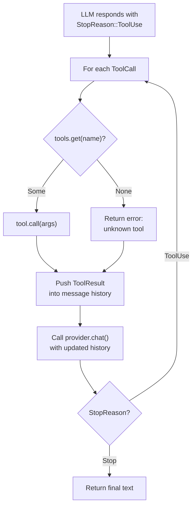

# 第 12 章：工具注册表

> **需要编辑的文件：** `src/types.rs`（ToolSet）
> **需要运行的测试：** `cargo test -p mini-claw-code-starter test_multi_tool_`（集成测试）
> **预计时间：** 30 分钟

五个工具，一个 `SimpleAgent`。本章把它们连起来。

## 目标

- 实现 `default_tools()` 辅助函数，把所有工具装进一个 `ToolSet`，让 agent 能按名称找到并分发它们。
- 把 `ToolSet` 接入 `SimpleAgent`，让 LLM 看到所有工具的 schema，agent 能把调用派发到正确的工具。
- 优雅处理未知工具调用，返回错误字符串让 LLM 自行恢复。
- 跑完整的集成测试套件，验证真实工具在 agent 循环里产生真实副作用。

前几章你逐一构建了让 agent 与外部世界交互的工具——文件读写（第 9 章）、命令执行（第 10 章）、可选的模式搜索（第 11 章）。每个工具实现了 `Tool` trait，有 JSON schema，返回 `String`。但它们各自孤立。agent 无法发现它们，无法把 schema 暴露给 LLM，也无法按名称派发调用。

工具注册表就是这座桥。它把所有可用工具统一存放在一个 `ToolSet` 里，把 schema 暴露给 LLM，再按名称把调用路由到正确的实现。本章结束后，你将拥有功能完整的编程 agent，能读文件、写文件、编辑文件、执行命令——完整的工具循环，用的是真实工具，不再是测试替身。

```bash
cargo test -p mini-claw-code-starter test_multi_tool_
```

---

## 模块布局

所有工具实现放在 `src/tools/` 下，每个工具一个文件：

```
src/tools/
  mod.rs       -- 重新导出所有内容
  ask.rs       -- AskTool（额外功能）
  bash.rs      -- BashTool
  edit.rs      -- EditTool
  read.rs      -- ReadTool
  write.rs     -- WriteTool
```

`mod.rs` 是个扁平的桶文件（barrel file）：

```rust
mod ask;
mod bash;
mod edit;
mod read;
mod write;

pub use ask::*;
pub use bash::BashTool;
pub use edit::EditTool;
pub use read::ReadTool;
pub use write::WriteTool;
```

每个工具是独立的文件，只有一个公开结构体。`mod.rs` 重新导出这些结构体，下游代码直接写 `use crate::tools::{ReadTool, WriteTool}`，不用深入各子模块。

这种扁平结构是刻意的。不存在把 `ReadTool`、`WriteTool`、`EditTool` 归在一起的 `tools/file/mod.rs`。原因：工具总是被单独引用——注册的是 `ReadTool::new()`，不是 `FileTools::all()`。扁平结构让导入路径短，心智模型也更简单。5 个工具时这显然没问题。Claude Code 有 40 多个工具，依然用类似的扁平布局——每个工具是自己的模块，只有一个导出。

---

### Rust 核心概念：trait 对象与动态分发

`ToolSet` 把工具存为 `Box<dyn Tool>`——一种抹去具体类型的 trait 对象。这样 `ReadTool`、`WriteTool`、`EditTool`、`BashTool` 尽管实现各异，通过指针后都成了同一种类型。`HashMap<String, Box<dyn Tool>>` 是背后的数据结构：把工具名称映射到 trait 对象，agent 在运行时就能按字符串名称查找任意工具。

这就是*动态分发*。agent 调用 `tool.call(args)` 时，编译器在编译期不知道该调哪个 `call()` 方法，而是通过 vtable——附在 trait 对象上的函数指针表——在运行时找到正确实现。代价是每次调用多一次指针间接寻址，与工具执行的 I/O 和网络操作相比，这点开销可以忽略不计。

---

## 构建 ToolSet

你在第 4 章定义的 `ToolSet` 是个带构建器 API 的 `HashMap<String, Box<dyn Tool>>`。现在正式用起来。下面是组装标准工具集的辅助函数：

```rust
fn default_tools() -> ToolSet {
    ToolSet::new()
        .with(ReadTool::new())
        .with(WriteTool::new())
        .with(EditTool::new())
        .with(BashTool::new())
}
```

四次 `.with()` 调用，每个工具一次。每次调用构造工具，从 `ToolDefinition` 里提取名称，插入内部 `HashMap`。构建器模式意味着顺序无关——工具按名称为键，不按位置。（`AskTool` 需要 `InputHandler`，需要用户输入时单独注册。）

构建完成后，`ToolSet` 支持 agent 所需的操作：

```rust
let tools = default_tools();

// 按名称查找工具（返回 Option<&dyn Tool>）
let read = tools.get("read").unwrap();

// 获取 LLM 所需的所有 schema
let defs: Vec<&ToolDefinition> = tools.definitions();
```

`definitions()` 是 `SimpleAgent` 在每轮循环开始时调用的方法，用来告诉 LLM 哪些工具可用。每个定义包含工具的名称、描述和参数的 JSON Schema。LLM 用这些信息决定何时调用哪个工具、怎么调。

`get()` 是 agent 在派发时调用的——LLM 说 `"name": "read"`，agent 执行 `tools.get("read")`，用提供的参数调用返回工具的 `.call()` 方法。

---

## 工具分类（扩展概念）

工具不是生而平等的。starter 版本把 `Tool` trait 简化成只有 `definition()` 和 `call()`。但在生产级 agent 中，工具带有描述行为的元数据——是否只读、是否并发安全、是否具有破坏性。这些标志驱动权限引擎、计划模式和并发执行决策。

工具大致分三类：

### 只读工具：ReadTool（以及 GlobTool、GrepTool，如果加了的话）

这些工具只观察文件系统，不修改它。读文件、按 glob 列路径、用正则搜索内容——都没有副作用，可以并行运行，也可以在只读计划模式下安全运行。

### 写工具：WriteTool、EditTool

写入和编辑会修改文件，不是只读的。两次写入同一文件会产生竞争，所以不是并发安全的。但文件写入是可恢复的（git 可以回退），算不上破坏性操作。

### 破坏性工具：BashTool

BashTool 是最危险的。它能运行任意 shell 命令——`rm -rf /`、`git push --force`、`curl | sh`。生产级 agent 会把它标记为破坏性，需要用户明确批准。

### 为什么分类重要

在生产级 agent 中，分类组合成权限层次：

| 分类 | 计划模式 | 自动批准 | 默认模式 |
|------|---------|---------|---------|
| 只读 | 允许 | 允许 | 允许 |
| 写入 | 拒绝 | 允许 | 询问用户 |
| 破坏性 | 拒绝 | 询问用户 | 询问用户 |

starter 还没有实现这些分类——那是后续章节的扩展内容。目前 `SimpleAgent` 对 LLM 请求的每个工具调用都无条件执行。

---

## 工具分发流程

从 LLM 请求工具到结果返回的完整流程：



---

## 将工具接入 SimpleAgent

前几章的 `SimpleAgent` 通过构建器 API 接收工具，可以逐个添加：

```rust
let agent = SimpleAgent::new(provider)
    .tool(ReadTool::new())
    .tool(WriteTool::new())
    .tool(EditTool::new())
    .tool(BashTool::new());
```

`.tool()` 方法内部调用 `self.tools.push(t)`，从工具定义中提取名称并插入 `HashMap`。

构建完成后，agent 接管整个派发流程。LLM 以 `StopReason::ToolUse` 响应并带上一组 `ToolCall` 时，agent 会：

1. 在 `ToolSet` 中按名称查找每个工具
2. 调用 `call()` 执行工具
3. 把结果打包成 `Message::ToolResult` 追加到对话中

如果 LLM 请求注册表里不存在的工具，agent 返回 `"error: unknown tool \`foo\`"`。模型看到错误后可以调整。

---

## 集成：写入、读取、响应

`test_multi_tool_write_and_read_flow` 测试演示了使用真实工具的完整三轮交互。逐步追踪一下。

测试创建临时目录，为 `MockProvider` 预设三个响应：

```rust
let dir = tempfile::tempdir().unwrap();
let path = dir.path().join("test.txt");
let path_str = path.to_str().unwrap().to_string();

let provider = MockProvider::new(VecDeque::from([
    // 第 1 轮：写入文件
    AssistantTurn {
        text: None,
        tool_calls: vec![ToolCall {
            id: "c1".into(),
            name: "write".into(),
            arguments: json!({
                "path": path_str,
                "content": "hello from agent"
            }),
        }],
        stop_reason: StopReason::ToolUse,
        usage: None,
    },
    // 第 2 轮：读回文件
    AssistantTurn {
        text: None,
        tool_calls: vec![ToolCall {
            id: "c2".into(),
            name: "read".into(),
            arguments: json!({ "path": path_str }),
        }],
        stop_reason: StopReason::ToolUse,
        usage: None,
    },
    // 第 3 轮：最终回答
    AssistantTurn {
        text: Some("Done! I wrote and read the file.".into()),
        tool_calls: vec![],
        stop_reason: StopReason::Stop,
        usage: None,
    },
]));
```

agent 只注册需要的工具：

```rust
let agent = SimpleAgent::new(provider)
    .tool(ReadTool::new())
    .tool(WriteTool::new());
```

循环追踪：

**第 1 轮——写入。** agent 调用 `provider.chat()`，收到 `StopReason::ToolUse` 加上 `write` 工具调用。在 `ToolSet` 里查找 `"write"`，找到 `WriteTool`，用 `{"path": "/tmp/.../test.txt", "content": "hello from agent"}` 调用它。`WriteTool` 在磁盘上创建文件。agent 把 `Message::Assistant(turn)` 和 `Message::ToolResult` 追加到对话历史。

第 1 轮后的消息历史：
```
[User]         "write and read a file"
[Assistant]    tool_calls: [write(path, content)]
[ToolResult]   "wrote /tmp/.../test.txt"
```

**第 2 轮——读取。** agent 带着更新后的历史再次调用 `provider.chat()`。mock 返回 `read` 工具调用。agent 查找 `"read"`，用 `{"path": "/tmp/.../test.txt"}` 调用 `ReadTool`。`ReadTool` 读取上一轮 `WriteTool` 创建的文件，返回内容。

第 2 轮后的消息历史：
```
[User]         "write and read a file"
[Assistant]    tool_calls: [write(path, content)]
[ToolResult]   "wrote /tmp/.../test.txt"
[Assistant]    tool_calls: [read(path)]
[ToolResult]   "hello from agent"
```

**第 3 轮——最终回答。** agent 再次调用 `provider.chat()`。mock 返回 `StopReason::Stop` 加上文本。agent 追加最终的 assistant 消息，把文本返回给调用方。

测试验证两件事：返回文本包含 "Done!"，文件确实在磁盘上存在且内容正确。这证实了真实工具在 agent 循环里产生了真实副作用。

```rust
let result = agent.run("write and read a file").await.unwrap();
assert!(result.contains("Done!"));
assert_eq!(
    std::fs::read_to_string(&path).unwrap(),
    "hello from agent"
);
```

---

## 错误恢复：幻觉工具

`test_simple_agent_unknown_tool` 测试演示 LLM 请求不存在的工具时会发生什么。这不是假设——模型经常凭空编造工具名称，小模型或工具列表较长时尤其如此。

mock provider 预设了两个响应：

```rust
let provider = MockProvider::new(VecDeque::from([
    // LLM 产生了工具幻觉
    AssistantTurn {
        text: None,
        tool_calls: vec![ToolCall {
            id: "c1".into(),
            name: "imaginary_tool".into(),
            arguments: json!({}),
        }],
        stop_reason: StopReason::ToolUse,
        usage: None,
    },
    // LLM 看到错误后恢复
    AssistantTurn {
        text: Some("Sorry, that tool doesn't exist.".into()),
        tool_calls: vec![],
        stop_reason: StopReason::Stop,
        usage: None,
    },
]));

let agent = SimpleAgent::new(provider).tool(ReadTool::new());
let result = agent.run("do something").await.unwrap();
assert!(result.contains("doesn't exist"));
```

发生了什么：

**第 1 轮。** LLM 要求调用 `"imaginary_tool"`。agent 执行 `tools.get("imaginary_tool")`，得到 `None`，返回 `"error: unknown tool \`imaginary_tool\`"`。这条错误消息作为 `Message::ToolResult` 推入对话。循环继续。

**第 2 轮。** LLM 在对话历史里看到错误，生成一个承认错误的文本响应。agent 正常返回。

agent 没有崩溃，没有 panic，没有返回 `Err`。它把未知工具当作可恢复错误，让模型自行调整。这是生产级 agent 的正确行为。模型会出错，agent 得能扛住。

同样的模式也适用于其他失败场景：工具返回执行错误，或工具遭遇 I/O 失败。每种情况下，模型都会看到描述性错误消息，可以调整策略。

---

## Claude Code 是如何做的

Claude Code 的工具注册表规模大得多，但架构相同。

**规模。** Claude Code 注册了 40 多个工具，覆盖文件操作、git、浏览器、notebooks、MCP（Model Context Protocol）等。每个工具有权限元数据、成本提示和丰富的终端渲染。我们的五个工具（四个核心工具加 AskTool）覆盖了基本能力——协议相同，范围更小。

**动态注册。** 我们的 `ToolSet` 在启动时构建，之后不变。Claude Code 的注册表是动态的——用户配置 MCP 服务器时，MCP 工具在运行时被发现并注册。工具可以在会话中途出现或消失。你在第 4 章构建的 `ToolSet::push()` 支持这种模式，只是我们还没用到。

**工具分组。** Claude Code 把工具组织成权限组。文件工具、git 工具、shell 工具各有组级别的允许/拒绝规则。我们的扁平 `ToolSet` 更简单——权限引擎实现后会按工具元数据逐一检查。

**使用统计。** Claude Code 追踪每个工具的调用频率、每次调用耗时、每次结果消耗的 token 数。这些数据输入 TUI 状态显示，辅助成本估算。本书不涉及使用统计，不过第 4 章的 `TokenUsage` 类型提供了消息级别的起点。

差异归根结底，核心协议完全一样：LLM 看到工具 schema 列表，选择一个调用，agent 按名称查找工具、执行、把结果返回。权限、分组、统计、动态注册——都是围绕这次查找的编排。

---

## 测试

运行集成测试：

```bash
cargo test -p mini-claw-code-starter test_multi_tool_
```

主要测试：

- **test_multi_tool_write_and_read_flow** — agent 写入文件后读回，验证文件在磁盘上存在且内容正确。
- **test_multi_tool_edit_flow** — agent 用字符串替换编辑现有文件，读回结果。
- **test_multi_tool_bash_then_report** — agent 运行 shell 命令并报告输出。
- **test_multi_tool_write_edit_read_flow** — 完整流程：写入、编辑、读回。确认工具链正确衔接。
- **test_multi_tool_all_four_tools** — agent 在单次会话中使用 bash、write、edit、read，覆盖完整工具集。
- **test_multi_tool_multiple_writes** — agent 依次写入两个独立文件。
- **test_multi_tool_read_multiple_files** — agent 在单轮中并行读取两个文件。
- **test_multi_tool_five_step_conversation** — 五步流程（bash、write、read、edit、read），验证长多工具会话。
- **test_multi_tool_chat_basic** — 验证 `chat()` 方法处理简单纯文本响应。
- **test_multi_tool_chat_with_tool_call** — 验证 `chat()` 的工具派发和消息历史增长。
- **test_multi_tool_chat_multi_turn** — 用 `chat()` 进行两轮对话，消息历史持续累积。

---

## 关键要点

工具注册表本质上是一次 `HashMap` 查找：LLM 给出工具名称，agent 找到对应实现，调用它。名称派发加 trait 对象这层间接——让你能在不改动 agent 循环的情况下增删工具。

---

## 本章回顾

第二部分完成。四章下来，你构建了基本编程 agent 所需的全套工具：

- **ReadTool** 带行号、偏移量和限制地读取文件。
- **WriteTool** 创建和覆写文件，按需创建父目录。
- **EditTool** 在现有文件里精确执行字符串替换。
- **BashTool** 执行 shell 命令，支持超时和退出码报告。
- **GlobTool** 在目录树中按模式查找文件。
- **GrepTool** 用正则表达式搜索文件内容，支持上下文行。

本章通过 `ToolSet` 注册表把它们全部串联，接入 `SimpleAgent`。agent 现在可以接收用户提示，带上所有工具 schema 发给 LLM，执行模型请求的任意工具，循环直到模型给出最终答案。一个可运行的编程 agent，就此完成。

但能运行不等于安全。目前引擎对 LLM 请求的每个工具调用都无条件执行。模型说 `bash("rm -rf /")`，引擎就跑。模型用垃圾覆盖源文件，引擎就写。没有护栏，没有确认提示，没有安全检查。工具标志（`is_read_only`、`is_destructive`）存在，但没有任何东西来执行它们。

---

## 下一步

第三部分——安全与控制——给可运行的 agent 加上护栏，让它变得可信：

- **第 13 章：权限引擎** — 在执行前检查每个工具调用的系统。评估权限规则，遵守权限模式，必要时向用户询问。
- **第 14 章：安全检查** — 对工具参数的静态分析。在权限提示出现之前捕获危险模式（`rm -rf`、`git push --force`）。
- **第 15 章：Hook 系统** — 在工具执行前后运行 shell 命令的 pre-tool / post-tool hook。让用户强制执行自定义策略（编辑后运行 linter，阻止特定路径）。
- **第 16 章：计划模式** — 只有只读工具能运行的受限执行模式。agent 可以分析和规划，但不能修改。`is_read_only()` 在这里最终得到执行。

第二部分构建的工具是 agent 的双手。第三部分教它何时动手——以及何时该收手。

## 自我检测

{{#quiz ../quizzes/ch12.toml}}

---

[← 第 11 章：搜索工具](./ch11-search-tools.md) · [目录](./ch00-overview.md) · [第 13 章：权限引擎 →](./ch13-permissions.md)
