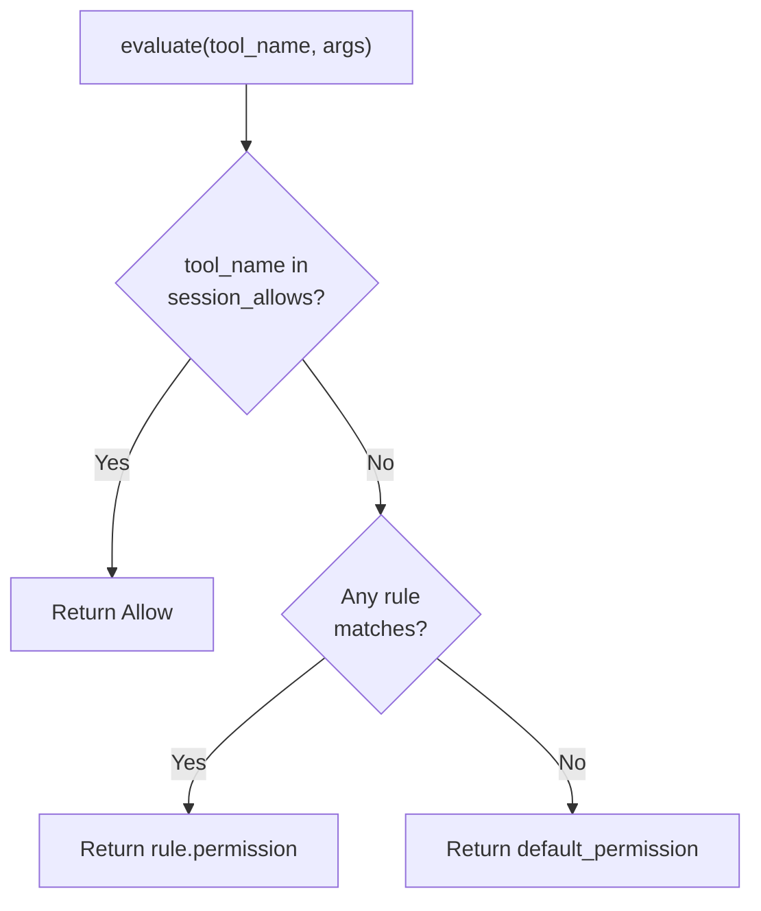

# 第 13 章：权限引擎

> **需要编辑的文件：** `src/permissions.rs`
> **需要运行的测试：** `cargo test -p mini-claw-code-starter permissions`
> **预计时间：** 40 分钟

你的 agent 会执行 LLM 告诉它的任何事情。

想一想这句话。第 1 至 12 章你构建了功能完整的编程 agent，多种工具齐备。LLM 可以读文件、写文件、编辑文件、执行任意 shell 命令。`SimpleAgent` 忠实派发模型请求的每个工具调用。模型说 `bash("rm -rf /")`，agent 就跑。模型用垃圾覆盖你的源文件，agent 就写。模型想从网上 `curl | sh` 点什么，agent 就 curl。LLM 的请求和工具的执行之间，什么都没有。

这对教程来说无所谓。对真实代码库上运行的软件，则不行。

第 13 章来改变这一点。我们构建 `PermissionEngine`——每次工具调用执行前的守门人。它夹在 `SimpleAgent` 和工具之间，对每次调用给出三种答案之一：静默允许、拒绝，或向用户请求批准。决定取决于配置的规则、默认权限，以及用户在本次会话中是否已批准过该工具。

这是第三部分"安全与控制"的第一章。本章结束后，agent 不再盲目服从 LLM，会先请示权限。

```bash
cargo test -p mini-claw-code-starter permissions
```

## 目标

- 用 `glob::Pattern` 实现 `PermissionRule::matches()`，让规则能用通配符匹配工具名称（如 `"mcp__*"` 匹配所有 MCP 工具）。
- 构建带三阶段评估流程的 `PermissionEngine`：会话批准、有序规则、默认权限。
- 为常用配置提供便捷构造函数（`ask_by_default`、`allow_all`）。
- 记录会话批准，用户一旦批准某个工具，本次会话剩余时间内持续有效。

---

## 问题：信任的光谱

不是每次工具调用的风险都一样。读文件无害。写文件可恢复（git 能回退）。运行 `rm -rf /` 是灾难。好的权限系统应该区别对待。

同时，不同用户想要的控制力度也不同。有人想批准每个操作，有人只想批准危险操作，有人在跑自动化流程、根本不要提示，还有人处于计划模式，agent 只能观察，不能修改。

两个维度：

1. **工具风险级别** — 这个工具有多危险？
2. **用户信任级别** — 用户想要多少控制？（权限规则和默认权限。）

权限引擎把两个维度合并成一个决策。规则用 glob 模式匹配工具名称，没有规则匹配时用默认权限兜底。这样用户就能精细控制哪些工具需要批准。

---

## 权限类型

权限系统在 `src/permissions.rs` 里引入了几个新类型，逐一过一遍。

### Permission：决策

```rust
#[derive(Debug, Clone, PartialEq)]
pub enum Permission {
    /// Tool call is allowed without asking.
    Allow,
    /// Tool call is blocked without asking.
    Deny,
    /// User must be prompted for approval.
    Ask,
}
```

三个变体，对应每种可能结果。`Allow` 表示立即执行——无提示，无延迟。`Deny` 表示完全阻止——工具不会运行。`Ask` 表示暂停，向用户显示提示。

starter 里 `Deny` 和 `Ask` 是没有字符串载荷的单元变体。工具调用被拒绝或需要批准时，由调用方负责向用户或模型提供上下文。

### PermissionRule：匹配工具名称

```rust
#[derive(Debug, Clone)]
pub struct PermissionRule {
    /// Glob pattern matching tool names (e.g. "bash", "write", "*").
    pub tool_pattern: String,
    /// The permission to assign when the pattern matches.
    pub permission: Permission,
}
```

规则让用户给特定工具分配权限。`PermissionRule` 用 glob 模式（`glob::Pattern` crate）匹配工具名称，分配权限：始终允许、始终拒绝或始终询问。

比如，你可以加一条规则无需提示就允许 `write`——因为你在这个项目里信任模型写文件。或者加一条完全拒绝 `bash` 的规则——这是以读取为主的分析任务，不想有任何命令执行。

`matches()` 方法用 `glob::Pattern` 匹配：

```rust
impl PermissionRule {
    pub fn new(tool_pattern: impl Into<String>, permission: Permission) -> Self {
        Self {
            tool_pattern: tool_pattern.into(),
            permission,
        }
    }

    /// Check if this rule matches a tool name.
    /// Uses glob::Pattern for pattern matching, falling back to
    /// exact string comparison if the pattern is invalid.
    pub fn matches(&self, tool_name: &str) -> bool {
        // Your implementation: use glob::Pattern::new(&self.tool_pattern)
        unimplemented!()
    }
}
```

规则优先于默认权限。关键的设计原则：具体的覆盖比通用策略更优先。

---

## PermissionEngine

类型定义好之后，构建引擎本身。打开 `src/permissions.rs`：

```rust
pub struct PermissionEngine {
    rules: Vec<PermissionRule>,
    default_permission: Permission,
    /// Session-level overrides (tool calls the user has already approved).
    session_allows: std::collections::HashSet<String>,
}
```

三个字段：

- **`rules`** — 有序的权限规则列表。第一个匹配的规则获胜。
- **`default_permission`** — 没有规则匹配时的兜底权限。交互场景通常是 `Permission::Ask`，旁路模式是 `Permission::Allow`。
- **`session_allows`** — 用户在本次会话中已批准的工具名称集合。

构造函数提供常见配置：

```rust
impl PermissionEngine {
    pub fn new(rules: Vec<PermissionRule>, default_permission: Permission) -> Self {
        // Your implementation: store rules, default_permission, and empty session_allows HashSet
        unimplemented!()
    }

    /// Create an engine that asks for everything by default.
    pub fn ask_by_default(rules: Vec<PermissionRule>) -> Self {
        Self::new(rules, Permission::Ask)
    }

    /// Create an engine that allows everything (no permission checks).
    pub fn allow_all() -> Self {
        Self::new(vec![], Permission::Allow)
    }
}
```

`ask_by_default()` 是标准交互配置——没有规则覆盖的工具都提示用户。`allow_all()` 是旁路模式——没有规则，没有提示。会话批准从空开始，随着用户与 agent 交互逐渐积累。

---

## 评估流程

引擎核心是 `evaluate` 方法。接收工具名称和参数，返回 `Permission`。三个阶段按顺序执行，第一个给出明确答案的阶段获胜。



```rust
pub fn evaluate(&self, tool_name: &str, _args: &Value) -> Permission {
    // Stage 1: session approvals
    if self.session_allows.contains(tool_name) {
        return Permission::Allow;
    }

    // Stage 2: rules in order (first match wins)
    for rule in &self.rules {
        if rule.matches(tool_name) {
            return rule.permission.clone();
        }
    }

    // Stage 3: default
    self.default_permission.clone()
}
```

逐阶段过一遍。

### 第一阶段：会话批准

```rust
if self.session_allows.contains(tool_name) {
    return Permission::Allow;
}
```

用户在当前会话中已批准过的工具，直接允许。会话批准在用户对 `Ask` 提示回答"是"时记录。一旦批准，该工具在本次会话剩余时间内无需再提示。

会话批准是按工具的，不是全局的。批准 `write` 不会批准 `bash`。这是有意为之——用户应该为每个信任的工具单独做决定。

### 第二阶段：权限规则

```rust
for rule in &self.rules {
    if rule.matches(tool_name) {
        return rule.permission.clone();
    }
}
```

没有会话批准匹配，检查配置的规则。规则按顺序评估——第一条 `matches()` 返回 true 的规则获胜。

关键设计选择：**第一个匹配的规则获胜**。如果有两条规则：

```
1. bash  -> Deny
2. *     -> Allow
```

`bash` 命中规则 1 被拒绝；其他所有工具命中规则 2 被允许。顺序反过来，规则 2 先匹配一切，规则 1 永远不会触发。

`matches()` 用 `glob::Pattern` 匹配，比简单字符串比较表达力更强。`"bash"` 只匹配 `"bash"`；`"*"` 匹配一切；`"file_*"` 匹配 `"file_read"`、`"file_write"` 等。

### 第三阶段：默认权限

```rust
self.default_permission.clone()
```

没有会话批准匹配，也没有规则匹配，回退到构建时设置的默认权限。`ask_by_default()` 是 `Permission::Ask`，`allow_all()` 是 `Permission::Allow`。

---

### Rust 核心概念：`glob::Pattern` crate

`glob` crate 提供文件系统风格的模式匹配。`glob::Pattern::new("mcp__*")` 编译一个模式，`.matches("mcp__fs__read")` 拿它测试字符串。主要操作符：`*`（匹配任意字符序列）、`?`（匹配任意单个字符）、`[abc]`（匹配集合中任意字符）。与正则表达式不同，glob 模式故意简单——匹配整个字符串而非子字符串，没有回溯。快，且对工具名称匹配来说直观。

`Pattern::new()` 返回 `Result`，因为模式字符串可能语法无效（如未闭合的括号）。回退到精确字符串比较处理这种边缘情况。

---

## 用 glob 做模式匹配

`PermissionRule::matches()` 用 `glob` crate 匹配：

```rust
pub fn matches(&self, tool_name: &str) -> bool {
    glob::Pattern::new(&self.tool_pattern)
        .map(|p| p.matches(tool_name))
        .unwrap_or(self.tool_pattern == tool_name)
}
```

两种情况：

- **有效的 glob 模式** — `glob::Pattern::new()` 成功，用 glob 语义匹配工具名称：`"*"` 匹配一切，`"file_*"` 匹配 `"file_read"`、`"file_write"` 等，`"bash"` 只匹配 `"bash"`。
- **无效的 glob** — 回退到精确字符串比较。这是安全网——实际使用中工具名称模式很简单，基本总是有效的。

用 `glob::Pattern` 而非手写匹配，获得完整的 glob 语义——字符类（`[abc]`）、备选和正确的通配符处理——无需自定义代码。

---

## 会话批准

`evaluate` 返回 `Permission::Ask` 时，调用方（通常是 `SimpleAgent` 或 UI 层）提示用户。用户同意，调用方记录批准：

```rust
pub fn record_session_allow(&mut self, tool_name: &str) {
    self.session_allows.insert(tool_name.to_string());
}
```

后续对同一工具的 `evaluate` 调用会在 `session_allows` 集合（第一阶段）里找到它，直接返回 `Permission::Allow`，不再提示。

引擎还提供了几个检查结果的便捷方法：

```rust
pub fn is_allowed(&self, tool_name: &str, args: &Value) -> bool {
    matches!(self.evaluate(tool_name, args), Permission::Allow)
}

pub fn needs_approval(&self, tool_name: &str, args: &Value) -> bool {
    matches!(self.evaluate(tool_name, args), Permission::Ask)
}
```

会话批准有三个值得强调的特性：

1. **按工具，不是全局的。** 批准 `write` 不批准 `bash`。每个工具是独立的信任决策。
2. **会话范围，不持久化。** 批准存在内存里，进程退出就消失。没有文件，没有数据库。重启 agent，重新开始。
3. **优先级高于规则。** starter 里会话批准先检查（第一阶段），所以批准覆盖任何规则。这是有意的简化——用户说"是"之后，无论规则如何，该工具在本次会话中都被批准了。

---

## 综合起来：完整追踪

追踪一个实际场景，看看流程端到端怎么工作。

用户用 `ask_by_default` 启动 agent，设置一条规则：`write` 始终允许。

```rust
let engine = PermissionEngine::ask_by_default(vec![
    PermissionRule::new("write", Permission::Allow),
]);
```

LLM 依次发起三次工具调用：

**调用 1：`read("src/main.rs")`**

```
第一阶段："read" 不在 session_allows 中。-> 继续
第二阶段：规则 "write" 不匹配 "read"。没有更多规则。-> 继续
第三阶段：默认权限是 Ask。-> Ask
```

结果：`Ask`。UI 提示用户。（注意：starter 里工具上没有 `is_read_only()` 标志，读取工具走的和其他工具一样的流程。）

**调用 2：`write("src/main.rs", ...)`**

```
第一阶段："write" 不在 session_allows 中。-> 继续
第二阶段：规则 "write" 匹配 "write"。权限：Allow。-> Allow
```

结果：`Allow`。写入静默执行——规则覆盖了默认权限本会做的事（询问用户）。

**调用 3：`bash("cargo test")`**

```
第一阶段："bash" 不在 session_allows 中。-> 继续
第二阶段：规则 "write" 不匹配 "bash"。没有更多规则。-> 继续
第三阶段：默认权限是 Ask。-> Ask
```

结果：`Ask`。UI 提示用户。用户批准后，调用方调用 `engine.record_session_allow("bash")`，后续 bash 调用会在第一阶段直接允许。

---

## 引擎如何与 SimpleAgent 集成

`PermissionEngine` 设计为从 `SimpleAgent` 的工具执行流程内部调用。集成点在概念上很简单：

```
对于 LLM 的每次工具调用：
    1. 在 ToolSet 中查找工具
    2. 调用 permission_engine.evaluate(tool_name, args)
    3. 根据 Permission 匹配：
       - Allow  -> 执行工具
       - Deny   -> 向 LLM 返回错误字符串
       - Ask    -> 提示用户，然后执行或拒绝
```

完整接入留到后续章节。目前 `PermissionEngine` 是独立组件，接口干净：给它工具名称和参数，得到一个决策。这种分离让它可以独立测试——第 10 章的测试正是这样做的。

---

## Claude Code 是如何做的

Claude Code 的权限系统架构相同，粒度更细。

**权限模式。** Claude Code 有相同的核心模式——默认交互模式、自动批准模式、计划模式。模式通过 CLI 标志（`--dangerously-skip-permissions` 旁路，`--plan` 计划模式）或会话中交互式设置。

**工具分组。** Claude Code 不用单个工具标志，而是把工具组织成权限组。文件工具、git 工具、shell 工具、MCP 工具各有组级别策略。一条规则可以允许或拒绝整个组。我们基于 glob 的模式用 `"file_*"` 这样的写法实现类似效果。

**按路径规则。** Claude Code 的规则不只匹配工具名称，还能匹配工具参数——特别是文件路径。"允许写入 `src/**`"这样的规则允许源目录内的写入，阻止其他位置。我们的规则只匹配工具名称，更简单但精度较低。

**会话批准。** Claude Code 的会话批准机制相同——用户批准一个工具后，本次会话持续有效。批准按工具名称存在内存里，会话重置时清除。

**分层评估。** 评估流程相同：检查会话批准，匹配规则，回退默认值。排序确保具体策略覆盖通用策略，与我们的实现一样。

两个系统的核心洞见相同：权限引擎是从 `(rules, session_state, default_permission)` 到 `Permission` 的函数。不执行工具，不修改状态（会话批准除外），只回答一个问题：这次工具调用该继续吗？

---

## 测试

运行权限引擎测试：

```bash
cargo test -p mini-claw-code-starter permissions
```

主要测试：

- **test_permissions_allow_all** — `allow_all()` 对每个工具返回 `Allow`，确认旁路模式正常。
- **test_permissions_ask_by_default** — 没有规则的 `ask_by_default()` 对任何工具返回 `Ask`。
- **test_permissions_rule_matching** — 针对 `read`、`bash`、`write` 的三条明确规则各返回对应权限。
- **test_permissions_glob_pattern** — glob 规则 `"mcp__*"` 匹配 `"mcp__fs__read"` 但不匹配 `"read"`。
- **test_permissions_first_rule_wins** — 针对 `"bash"` 的两条规则（Allow 再 Deny），第一个匹配获胜，返回 Allow。
- **test_permissions_session_allow** — `record_session_allow("bash")` 之后，之前返回 Ask 的工具现在返回 Allow。
- **test_permissions_session_allow_per_tool** — 批准 `"read"` 不会批准 `"write"`——会话批准是按工具的。
- **test_permissions_is_allowed** / **test_permissions_needs_approval** — 便捷方法正确反映底层 `evaluate()` 的结果。
- **test_permissions_wildcard_rule** — `"*"` 规则覆盖所有工具的默认权限。
- **test_permissions_deny_overrides_default** — 针对 `"dangerous"` 的 Deny 规则即使在默认为 Allow 时也阻止它。

---

## 关键要点

权限引擎是从 `(tool_name, rules, session_state, default)` 到 `Permission` 的纯函数。不执行工具，不与用户交互，只回答"该继续吗？"这种分离让它易于测试，也可以在不同 UI 上下文中复用。

---

## 本章回顾

本章构建了 `PermissionEngine`——LLM 请求与工具之间的守门人。关键思想：

- **三种结果** — `Allow`、`Deny`、`Ask`。每次工具调用在运行前得到其中一种。
- **有序流程** — 会话批准优先，然后规则，然后默认权限。具体策略优于通用策略。
- **Glob 模式规则** — 规则用 `glob::Pattern` 匹配工具名称。第一个匹配的规则获胜，给用户精细控制哪些工具需要批准。
- **会话批准** — 用户说"是"，该工具本次会话获批。按工具，在内存，不持久化。
- **便捷构造函数** — 交互场景用 `ask_by_default()`，旁路模式用 `allow_all()`。

引擎是纯逻辑——不执行工具，不与用户交互，接受工具名称和参数，返回决策。可测试，可组合，易于推理。

---

## 下一步

权限引擎根据*工具是什么*和*用户处于什么模式*决定调用是否运行。但它不看*工具被要求做什么*。bash 工具不管跑 `ls` 还是 `rm -rf /` 都是 bash 工具；write 工具不管目标是 `src/main.rs` 还是 `.env` 都是 write 工具。

第 14 章加入安全检查——对工具参数的静态分析，在权限提示出现之前捕获危险模式。它根据允许目录校验路径，把文件名与受保护模式（`.env`、`.git/config`）对比，过滤 bash 命令中的危险模式（`rm -rf /`、`sudo`、fork bomb）。安全检查包装工具，让危险调用在执行前就被阻止。

## 自我检测

{{#quiz ../quizzes/ch13.toml}}

---

[← 第 12 章：工具注册表](./ch12-tool-registry.md) · [目录](./ch00-overview.md) · [第 14 章：安全检查 →](./ch14-safety.md)
