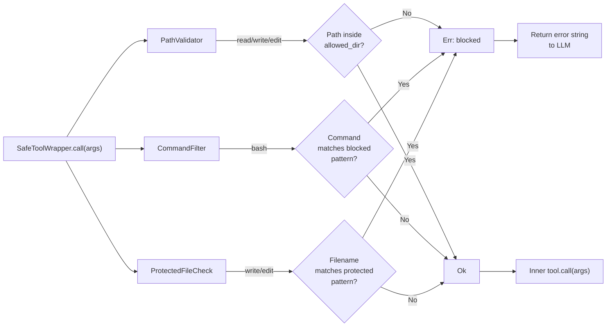

# 第 14 章：安全检查

> **需要编辑的文件：** `src/safety.rs`
> **运行测试：** `cargo test -p mini-claw-code-starter safety`
> **预计用时：** 40 分钟

第 13 章的权限引擎拦截每一次工具调用——决定是允许、拒绝还是在执行前询问用户。但判断依据是*工具本身*，不是*参数*。自动模式下，`write` 调用不管目标是 `src/main.rs` 还是 `.env` 都会放行。默认模式下，`bash` 调用不管命令是 `ls` 还是 `rm -rf /` 都会提示用户。权限引擎知道*谁在敲门*，却不查看对方带来了什么。

安全检查填补这个空缺。`SafetyChecker` 在权限引擎运行*之前*对工具参数做静态分析，检查实际要写入的路径或实际要执行的命令，阻止那些无论权限模式如何都属于危险的操作。这是纵深防御：即使权限引擎会放行某次调用，安全检查器仍然可以拒绝。

为什么要两层？因为它们防御的失败模式不同。权限引擎防止 LLM 执行用户未授权的操作；安全检查器防止 LLM 执行*永远不安全*的操作——写入 `.env`、运行 `rm -rf /`、执行 fork bomb。设了旁路模式的用户是在说"我信任这个 agent"，安全检查器则说"信任也有边界"。

```bash
cargo test -p mini-claw-code-starter safety
```

## 目标

- 实现 `PathValidator`，把文件操作限制在单个目录树内，阻止 `../../etc/passwd` 之类的路径穿越攻击。
- 实现 `CommandFilter`，用 glob 模式匹配阻止危险 shell 命令（`rm -rf /`、`sudo`、fork bomb）。
- 实现 `ProtectedFileCheck`，防止对匹配受保护模式的敏感文件（`.env`、`.git/config`）进行写入和编辑。
- 通过 `SafeToolWrapper` 把所有检查串联，任何单项安全检查失败都阻止工具调用，并向 LLM 返回描述性错误信息。

---

## SafetyCheck trait 及其实现

安全系统位于 `src/safety.rs`。参考实现用的是单个 `SafetyChecker` 结构体，starter 改用基于 trait 的设计：三个职责单一的实现，加一个包装器。

### SafetyCheck trait

```rust
pub trait SafetyCheck: Send + Sync {
    fn check(&self, tool_name: &str, args: &Value) -> Result<(), String>;
}
```

每个安全检查实现此 trait。接收工具名称和参数，返回 `Ok(())` 表示放行，返回 `Err(reason)` 表示阻止。trait 要求 `Send + Sync`，因为安全检查存储在 `SafeToolWrapper` 内部，而 `SafeToolWrapper` 实现了 `Tool` trait，可能被多个异步任务共享。

### Rust 核心概念：`Send + Sync` trait 约束

`SafetyCheck` 上的 `Send + Sync` 约束是必要的。工具存储在 `Box<dyn Tool>` 里，放在 agent 持有的 `HashMap` 中。在 tokio 这样的异步运行时，agent 的 future 可能在线程间移动。`Send` 意味着类型可被转移到另一个线程；`Sync` 意味着 `&self` 引用可在线程间共享。两者合在一起，保证安全检查能从任何异步任务调用，不产生数据竞争。缺少这些约束，编译器会拒绝把 `Box<dyn SafetyCheck>` 存入 `SafeToolWrapper`，因为 `SafeToolWrapper` 本身必须是 `Send + Sync` 才能满足 `Tool` trait 的要求。

### PathValidator

```rust
pub struct PathValidator {
    allowed_dir: PathBuf,
    raw_dir: PathBuf,
}
```

`PathValidator` 把文件操作限制在单个目录树内。构造时规范化允许目录，之后把每个路径参数与之对比。即使 LLM 执意要求，agent 也无法写入 `/etc/passwd` 或编辑 `~/.ssh/authorized_keys`。

`validate_path` 方法把相对路径相对于 `raw_dir` 解析为绝对路径，规范化结果（新文件则规范化其父目录），再用 `starts_with` 与 `allowed_dir` 对比。`SafetyCheck` 的实现只对带 `path` 参数的工具（`read`、`write`、`edit`）生效。

### CommandFilter

```rust
pub struct CommandFilter {
    blocked_patterns: Vec<glob::Pattern>,
}
```

`CommandFilter` 根据一组阻止 glob 模式检查 bash 命令。`rm -rf /` 删除一切，`sudo` 提升权限，`:(){:|:&};:` 是让系统崩溃的 fork bomb。无论什么上下文，这些命令都不该运行。

`default_filters()` 构造函数提供了合理的默认值：

```rust
pub fn default_filters() -> Self {
    Self::new(&[
        "rm -rf /".into(),
        "rm -rf /*".into(),
        "sudo *".into(),
        "> /dev/sda*".into(),
        "mkfs.*".into(),
        "dd if=*of=/dev/*".into(),
        ":(){:|:&};:".into(),
    ])
}
```

### ProtectedFileCheck

```rust
pub struct ProtectedFileCheck {
    patterns: Vec<glob::Pattern>,
}
```

`ProtectedFileCheck` 阻止对匹配受保护 glob 模式的文件进行写入和编辑。同时检查完整路径和仅文件名，所以 `.env` 这样的模式无论目录如何都能匹配 `/project/.env`。

---

## SafeToolWrapper

`SafeToolWrapper` 是把安全检查与工具系统连接起来的桥梁：

```rust
pub struct SafeToolWrapper {
    inner: Box<dyn Tool>,
    checks: Vec<Box<dyn SafetyCheck>>,
}
```

用 `Vec<Box<dyn SafetyCheck>>` 包装一个 `Box<dyn Tool>`。调用 `call()` 时先运行所有安全检查。任何检查返回 `Err`，包装器返回 `Ok(format!("error: safety check failed: {reason}"))` ——注意是带错误信息字符串的 `Ok`，不是 `Err`。原因：在 starter 里 `Tool::call` 返回 `anyhow::Result<String>`，安全拒绝不是系统错误，而是受控拒绝，LLM 应该看到并据此调整。

```rust
#[async_trait]
impl Tool for SafeToolWrapper {
    fn definition(&self) -> &ToolDefinition {
        self.inner.definition()
    }

    async fn call(&self, args: Value) -> anyhow::Result<String> {
        // Run all safety checks. If any returns Err, return the error as a string.
        // Otherwise, call the inner tool.
        unimplemented!()
    }
}
```

`with_check` 便捷构造函数用于包装单个检查：

```rust
pub fn with_check(tool: Box<dyn Tool>, check: impl SafetyCheck + 'static) -> Self {
    Self::new(tool, vec![Box::new(check)])
}
```

这种设计让安全检查可以自由组合。可以同时用 `PathValidator`、`CommandFilter`、`ProtectedFileCheck` 包装一个工具——每个检查独立运行，任何一个失败都阻止调用。

---

## 检查的分发流程



每个 `SafetyCheck` 实现通过匹配 `check` 方法里的 `tool_name` 参数决定自己适用哪些工具：

- **`PathValidator`** — 对 `read`、`write`、`edit` 生效。提取 `path` 参数，对照允许目录校验。
- **`CommandFilter`** — 仅对 `bash` 生效。提取 `command` 参数，与阻止模式对比。
- **`ProtectedFileCheck`** — 对 `write`、`edit` 生效。提取 `path` 参数，把完整路径和文件名分别与受保护模式对比。

不匹配任何检查的工具直接放行。`read` 这样的只读工具会被 `PathValidator` 检查（强制目录边界），但不会被 `ProtectedFileCheck` 检查（读取 `.env` 本身不危险——危险在于*写入*敏感文件）。

每个检查对不处理的工具返回 `Ok(())`，用无关检查包装工具是无害的——直接放行。

---

## 路径校验

`PathValidator::validate_path` 实现目录包含检查：

```rust
pub fn validate_path(&self, path: &str) -> Result<(), String> {
    let target = Path::new(path);

    // Step 1: resolve to absolute path
    let resolved = if target.is_absolute() {
        target.to_path_buf()
    } else {
        self.raw_dir.join(target)
    };

    // Step 2: canonicalize (resolves symlinks and ..)
    let canonical = if resolved.exists() {
        resolved.canonicalize()
            .map_err(|e| format!("cannot resolve path: {e}"))?
    } else {
        // For new files, canonicalize the parent directory
        let parent = resolved.parent().ok_or("invalid path")?;
        if parent.exists() {
            let mut c = parent.canonicalize()
                .map_err(|e| format!("cannot resolve parent: {e}"))?;
            if let Some(filename) = resolved.file_name() {
                c.push(filename);
            }
            c
        } else {
            return Err(format!("parent directory does not exist: {}",
                parent.display()));
        }
    };

    // Step 3: check containment
    if canonical.starts_with(&self.allowed_dir) {
        Ok(())
    } else {
        Err(format!("path {} is outside allowed directory {}",
            canonical.display(), self.allowed_dir.display()))
    }
}
```

关键步骤：

1. **解析相对路径**：相对于 `raw_dir` 得到绝对路径。
2. **规范化**目标路径。文件已存在直接规范化；不存在则规范化父目录再追加文件名。这处理了在已有目录中写新文件的常见情况。
3. **用 `starts_with`** 与规范化的 `allowed_dir` 对比。

比简单前缀匹配更健壮——规范化会解析 `..` 和符号链接。`/project/../etc/passwd` 被解析为 `/etc/passwd`，与 `/project` 的 `starts_with` 检查直接失败。

---

## 受保护文件的模式匹配

`ProtectedFileCheck` 用 `glob::Pattern` 匹配。对每次 `write` 或 `edit` 调用，提取路径参数，把完整路径和仅文件名分别与每个模式对比：

```rust
fn check(&self, tool_name: &str, args: &Value) -> Result<(), String> {
    match tool_name {
        "write" | "edit" => {
            if let Some(path) = args.get("path").and_then(|v| v.as_str()) {
                for pattern in &self.patterns {
                    // Check full path and filename separately
                    if pattern.matches(path)
                        || pattern.matches(
                            Path::new(path).file_name()
                                .unwrap_or_default()
                                .to_str().unwrap_or(""),
                        )
                    {
                        return Err(format!(
                            "file `{path}` is protected (matches pattern `{}`)",
                            pattern.as_str()
                        ));
                    }
                }
                Ok(())
            } else {
                Ok(())
            }
        }
        _ => Ok(()),
    }
}
```

同时检查完整路径和文件名很重要。`.env` 这样的模式不管写成完整路径 glob 还是简单文件名，都应该匹配 `/project/.env`。`glob::Pattern` crate 负责实际匹配，提供包括通配符和字符类在内的完整 glob 语义。

---

## 命令过滤

`CommandFilter::is_blocked` 根据阻止 glob 模式检查命令：

```rust
pub fn is_blocked(&self, command: &str) -> Option<&str> {
    // Trim command, check against each pattern, return matching pattern
    unimplemented!()
}
```

与参考实现的子串匹配不同，starter 用 `glob::Pattern` 匹配命令，模式表达能力更强——`"sudo *"` 匹配任何以 `sudo` 开头后接参数的命令，`"rm -rf /*"` 匹配特定危险模式。

`SafetyCheck` 的实现只对 `bash` 工具生效：

```rust
fn check(&self, tool_name: &str, args: &Value) -> Result<(), String> {
    // Only check 'bash' tool, extract command, call is_blocked
    unimplemented!()
}
```

所有基于模式的方法都有类似局限：可能产生误报（阻止匹配某模式的无害命令）和漏报（遗漏用不同语法表达的危险命令）。对教程而言，模式匹配是合适的权衡——在不引入 shell 解析复杂性的前提下展示了架构。

---

## Claude Code 是怎么做的

Claude Code 的安全检查更复杂，在多个层面运行：

**带解析的命令分类。** 不是子串匹配，而是结合正则表达式和 shell AST 解析对命令分类。能识别 `rm -rf /`、`rm -r -f /`、`command rm -rf /` 是同一操作，能解析管道和重定向，分别检查管道里的每个命令。我们的方法是平铺字符串扫描——没有结构，没有解析。

**路径规范化与符号链接解析。** 目录检查前先解析 `../`、`~`、环境变量和符号链接。`$HOME/../../../etc/passwd` 这样的路径被规范化为 `/etc/passwd` 再检查。我们的实现直接用路径字面值——精心构造的含 `../` 的路径可能绕过允许目录检查。

**感知 Git 的受保护路径。** Claude Code 决定保护内容时会考虑 git 状态。未被跟踪的 `.env` 文件比被跟踪的受到更强保护——未被跟踪说明它很可能包含被有意排除在版本控制外的真实密钥。我们的实现对所有 `.env` 文件一视同仁。

**严重性级别。** Claude Code 区分应*警告*和应*阻止*的操作。写入 `.env` 可能产生用户可覆盖的警告，运行 `rm -rf /` 是无条件阻止。我们的 `Permission::Deny` 只有单一严重性——阻止，不可覆盖。

这个差距是有意为之的。子串匹配和基于前缀的路径检查易于理解，易于测试。它们展示的是安全检查的*架构*——一个在权限引擎运行前检查参数的独立层——不引入 shell 解析和路径解析的复杂性。理解了 `SafetyChecker` 在流水线中的位置，就理解了 Claude Code 安全系统的位置。各个检查的复杂度只是实现细节。

---

## 安全检查在流水线中的位置

下面展示安全检查和权限引擎如何组合，呈现完整图景。starter 里安全检查通过 `SafeToolWrapper` 内嵌在工具内部。SimpleAgent 派发工具调用时：

```
LLM requests tool call
    |
    v
PermissionEngine.evaluate(tool_name, args)
    |--- Deny? --> block, return error to LLM
    |--- Ask?  --> prompt user
    |--- Allow? --> continue
    v
SafeToolWrapper.call(args)
    |--- SafetyCheck fails? --> return Ok("error: ...") to LLM
    |--- All checks pass?   --> continue
    v
Inner Tool.call(args)
    |
    v
Return result to LLM
```

权限引擎先运行（决定工具是否该跑），安全检查在工具调用内部运行。`SafeToolWrapper` 即使在权限引擎放行的情况下，也会捕获危险参数。包装器返回错误*字符串*（不是 `Err`），让 LLM 看到拒绝原因并调整策略。

这意味着安全检查是内层防御。即使用 `allow_all()` 权限模式，用 `SafeToolWrapper` 包装的工具仍然阻止写入 `.env` 或匹配 `rm -rf /` 的命令。安全包装器是任何权限配置都无法突破的底线。

---

## 测试

运行安全检查测试：

```bash
cargo test -p mini-claw-code-starter safety
```

关键测试：

- **test_safety_path_within_allowed** — 允许目录内的文件通过校验。
- **test_safety_path_outside_allowed** — 允许目录为临时目录时，`/etc/passwd` 被拒绝。
- **test_safety_path_traversal_blocked** — `../../etc/passwd` 路径穿越被解析并拒绝。
- **test_safety_path_new_file_in_allowed** — 允许目录中尚不存在的新文件通过校验。
- **test_safety_safety_check_read_tool** — PathValidator 对 `read` 工具生效，校验 path 参数。
- **test_safety_safety_check_ignores_bash** — PathValidator 跳过 `bash` 工具（没有 `path` 参数可检查）。
- **test_safety_command_filter_blocks_rm_rf** — `rm -rf /` 和 `rm -rf /*` 均被捕获。
- **test_safety_command_filter_blocks_sudo** — `sudo rm file` 匹配 `sudo *` 模式。
- **test_safety_command_filter_allows_safe** — `ls -la`、`echo hello`、`cargo test` 正常放行。
- **test_safety_protected_file_blocks_env** — 写入 `.env` 和 `.env.local` 被阻止。
- **test_safety_protected_file_allows_normal** — 写入 `src/main.rs` 正常放行。
- **test_safety_wrapper_blocks_on_check_failure** — 检查失败时，`SafeToolWrapper` 返回 `"error: safety check failed"` 字符串。
- **test_safety_wrapper_allows_valid_call** — 所有检查通过时，`SafeToolWrapper` 透传给内层工具。
- **test_safety_custom_blocked_commands** — 自定义阻止模式（`docker rm *`、`npm publish*`）正常工作。

---

## 核心要点

安全检查检查的是工具*参数*，不是工具*身份*。权限引擎问"这个工具是否该运行？"，安全检查问"这次具体调用危险吗？"两层通过纵深防御组合：即使所有权限都已授予，`SafeToolWrapper` 仍然阻止写入 `.env` 和匹配 `rm -rf /` 的命令。

---

## 小结

安全系统在 LLM 和工具执行之间增加了第二道防线：

- **基于 trait 的设计** — `SafetyCheck` trait 允许可组合的独立检查。`PathValidator`、`CommandFilter`、`ProtectedFileCheck` 各司其职。
- **参数级检查** — 与检查工具身份的权限引擎不同，安全检查审查实际参数：哪个文件被写入，哪个命令被执行。
- **SafeToolWrapper** — 用 `Vec<Box<dyn SafetyCheck>>` 包装任意 `Box<dyn Tool>`。失败时返回 `Ok("error: ...")`，不是 `Err`，让 LLM 看到拒绝原因并作出调整。
- **基于 glob 的匹配** — `CommandFilter` 和 `ProtectedFileCheck` 都用 `glob::Pattern` 匹配，无需自定义代码即可实现丰富匹配。
- **路径规范化** — `PathValidator` 在检查前规范化路径，防止通过 `..` 或符号链接绕过。
- **纵深防御** — 安全检查在工具调用内部运行。即使用 `allow_all()` 权限模式，被包装的工具仍然强制安全规则。

这一架构——可组合的、检查参数的、包装工具的检查——展示了 Claude Code 所用的同款纵深防御模式。

## 下一步

[第 15 章：Hook 系统](./ch15-hooks.md)中，你将构建 pre-tool 和 post-tool hook——在工具执行前后运行的 shell 命令。hook 让用户强制执行内置安全检查器之外的自定义策略：每次编辑后运行 linter、阻止写入特定目录、记录每条 bash 命令。安全检查器是内置守卫，hook 是用户定义的守卫。

## 自测

{{#quiz ../quizzes/ch14.toml}}

---

[← 第 13 章：权限引擎](./ch13-permissions.md) · [目录](./ch00-overview.md) · [第 15 章：Hook →](./ch15-hooks.md)
