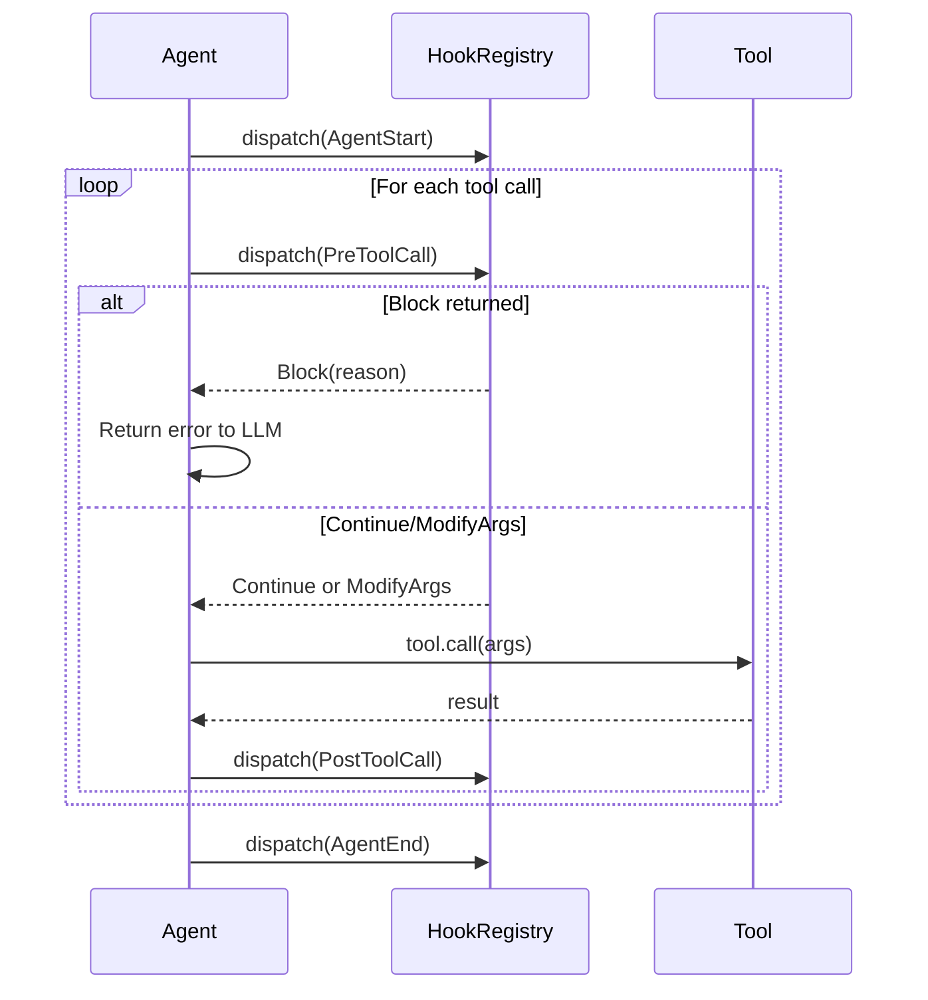

# 第 15 章：Hook 系统

> **需要编辑的文件：** `src/hooks.rs`
> **运行测试：** `cargo test -p mini-claw-code-starter hooks`
> **预计用时：** 40 分钟

第 13 章的权限引擎决定工具调用是否执行。第 14 章的安全检查在用户看到提示之前就捕获危险模式。但这两个系统都内嵌在 agent 里——强制执行的是你这位开发者在编译时选择的规则。用户的需求呢？

用户有 agent 作者无法预料的策略。团队可能要求把每条 bash 命令记录到审计文件。某个项目可能要求文件写入只能发生在特定目录。CI 流水线可能需要每次编辑后运行 linter。这些不是"防止 `rm -rf /`"意义上的安全检查——它们是在运行时扩展 agent 行为的工作流 hook。

本章构建 hook 系统。Hook 是事件驱动的：在关键生命周期节点（工具调用前、工具调用后、agent 启动时、agent 结束时）触发，可以观察、修改或阻止执行。基于 trait 的设计意味着任何人都可以实现 hook——用于调试的日志 hook、用于策略执行的阻止 hook、把决策委托给外部命令的 shell hook。

```bash
cargo test -p mini-claw-code-starter hooks
```

## 目标

- 定义 `HookEvent` 枚举，包含四个生命周期节点（`AgentStart`、`PreToolCall`、`PostToolCall`、`AgentEnd`），每个节点携带相关上下文数据。
- 实现 `Hook` trait 和 `HookRegistry` 分发逻辑：`Block` 短路退出，`ModifyArgs` 累积，`Continue` 为默认值。
- 构建三个具体 hook：`LoggingHook`（观察所有事件）、`BlockingHook`（拒绝特定工具）、`ShellHook`（委托给外部命令）。
- 确保 hook 正确组合——注册顺序决定优先级，阻止 hook 阻止后续 hook 运行。

---

## 事件模型

写代码之前，先定义 hook 何时触发。第 7 章的 agent 循环有清晰的生命周期：

```
User prompt arrives
  -> AgentStart
  -> Provider returns tool calls
    -> PreToolCall (for each tool)
    -> Tool executes
    -> PostToolCall (for each tool)
  -> Provider returns final answer
  -> AgentEnd
```



四个事件，四个外部代码可以介入的节点：

| 事件 | 触发时机 | Hook 可执行的操作 |
|------|----------|------------------|
| `AgentStart` | 第一次调用 provider 之前 | 记录 prompt、初始化状态 |
| `PreToolCall` | 每次工具执行之前 | 阻止调用、修改参数 |
| `PostToolCall` | 每次工具执行之后 | 记录结果、触发后续操作 |
| `AgentEnd` | 最终响应之后 | 记录响应、清理状态 |

这种不对称是有意为之的。`PreToolCall` 可以阻止或修改，因为工具还没跑——还有时间介入。`PostToolCall` 无法阻止，工具已经跑完，阻止毫无意义，只能观察。

---

## 核心类型

打开 `src/hooks.rs`。模块定义三种类型：`HookEvent`、`HookAction` 和 `Hook` trait。

### HookEvent

```rust
#[derive(Debug, Clone)]
pub enum HookEvent {
    PreToolCall {
        tool_name: String,
        args: Value,
    },
    PostToolCall {
        tool_name: String,
        args: Value,
        result: String,
    },
    AgentStart {
        prompt: String,
    },
    AgentEnd {
        response: String,
    },
}
```

每个变体携带与其生命周期节点相关的数据。`PreToolCall` 携带工具名称和参数——hook 决定是否允许或修改调用所需的一切。`PostToolCall` 额外包含结果字符串。`AgentStart` 和 `AgentEnd` 分别携带用户 prompt 和最终响应。

枚举派生了 `Clone`，因为 `HookRegistry` 通过共享引用（`&HookEvent`）依次把事件传给每个 hook。需要存储事件的 hook（如 `LoggingHook`）会克隆；只需检查事件的 hook（如 `BlockingHook`）直接借用，不克隆。

### HookAction

```rust
#[derive(Debug, Clone, PartialEq)]
pub enum HookAction {
    Continue,
    Block(String),
    ModifyArgs(Value),
}
```

三种可能响应，按严重程度排列：

- **`Continue`** — 默认值。hook 没有异议，执行正常继续。
- **`Block(reason)`** — 停止工具调用。原因字符串作为错误消息返回给 LLM，让它明白调用为何被拒绝，从而调整策略。
- **`ModifyArgs(new_args)`** — 在执行前替换工具参数。这是 hook 在不完全阻止调用的情况下注入默认值、规范化路径或强制约束的方式。

`HookAction` 派生了 `PartialEq`，测试可以用 `assert_eq!` 断言特定动作。这纯粹是测试便利——运行时用模式匹配，不用相等性检查。

### Hook trait

```rust
#[async_trait]
pub trait Hook: Send + Sync {
    async fn on_event(&self, event: &HookEvent) -> HookAction;
}
```

一个方法。接收事件引用，返回动作。trait 要求 `Send + Sync`，因为 hook 存储在 `HookRunner` 内部，runner 可能被多个异步任务共享。`async_trait` 属性处理对返回 future 进行 box 的常规操作。

与第 6 章的 `Tool` trait 模式相同——一个接受结构化输入、返回结构化输出的单一异步方法。区别在于范围：工具与外部世界交互（文件系统、shell），hook 与 agent 自身的执行交互。

---

## HookRegistry

单个 hook 有用，但真正的价值在于组合。`HookRegistry` 持有 hook 列表，按顺序把事件分发给它们。

```rust
pub struct HookRegistry {
    hooks: Vec<Box<dyn Hook>>,
}

impl HookRegistry {
    pub fn new() -> Self {
        Self { hooks: Vec::new() }
    }

    pub fn register(&mut self, hook: impl Hook + 'static) {
        self.hooks.push(Box::new(hook));
    }

    pub fn with(mut self, hook: impl Hook + 'static) -> Self {
        self.register(hook);
        self
    }

    pub fn is_empty(&self) -> bool {
        self.hooks.is_empty()
    }
}
```

构建器 API 很眼熟——与第 4 章的 `ToolSet` 相同。`with()` 获取所有权并返回 `self` 支持链式调用；`register()` 用 `&mut self` 适合命令式代码。两者都接受 `impl Hook + 'static`，把具体类型 box 成 trait 对象。

### dispatch 方法

动作如何组合，是有趣的地方：

```rust
pub async fn dispatch(&self, event: &HookEvent) -> HookAction {
    // Iterate hooks in order
    // If any hook returns Block, return Block immediately
    // If any hook returns ModifyArgs, remember the new args
    // If all hooks return Continue (and no ModifyArgs), return Continue
    unimplemented!()
}
```

三条规则：

1. **`Block` 短路退出。** 任何 hook 返回 `Block`，注册表立即停止并返回该动作。后续 hook 不会看到该事件。这是正确行为——策略说"不允许 bash"，就没必要再问日志 hook 的意见。

2. **`ModifyArgs` 累积。** 多个 hook 返回 `ModifyArgs`，最后一个生效。每个修改参数的 hook 覆盖之前的修改。简单但有效——需要更复杂组合（合并参数对象）时，在单个 hook 里封装逻辑即可。

3. **`Continue` 是默认值。** 没有 hook 表态，执行照常进行。空注册表始终返回 `Continue`。

顺序求值意味着优先级由注册顺序决定。先注册的 hook 先运行。想让阻止 hook 优先于日志 hook，先注册它。

---

## 内置 hook

模块提供三个现成的 hook，每个展示不同的使用模式。

### LoggingHook

```rust
pub struct LoggingHook {
    log: std::sync::Mutex<Vec<String>>,
}

impl LoggingHook {
    pub fn new() -> Self {
        Self {
            log: std::sync::Mutex::new(Vec::new()),
        }
    }

    pub fn messages(&self) -> Vec<String> {
        self.log.lock().unwrap().clone()
    }
}

#[async_trait]
impl Hook for LoggingHook {
    async fn on_event(&self, event: &HookEvent) -> HookAction {
        // Format as "pre:{tool_name}", "post:{tool_name}", "agent:start", "agent:end"
        unimplemented!()
    }
}
```

最简单的 hook：记录每个事件的简短描述，从不干预。始终返回 `Continue`，永远不阻止或修改任何操作。`Mutex<Vec<String>>` 提供内部可变性——`on_event` 方法接受 `&self`（不是 `&mut self`），所以需要锁才能向 vector 里推入数据。

### Rust 核心概念：异步代码中用 `Mutex` 实现内部可变性

`Hook` trait 要求 `&self`（不是 `&mut self`），因为注册表通过共享引用持有 hook。但 `LoggingHook` 需要修改内部日志。解决方案是 `std::sync::Mutex<Vec<String>>`——一个提供互斥访问的锁。`on_event` 调用 `self.log.lock().unwrap()` 时，获得对 `Vec` 的独占访问，推入一条消息，守卫离开作用域时释放锁。

为什么用 `std::sync::Mutex` 而不是 `tokio::sync::Mutex`？锁只在 `push` 操作期间被持有——微秒级，临界区内没有 `.await`。标准库的 `Mutex` 对短暂的同步临界区更快。只有需要跨越 `.await` 点持有锁时，才需要 `tokio::sync::Mutex`。

starter 里 `LoggingHook` 记录字符串描述而不是克隆的事件。格式简洁：`"pre:bash"`、`"post:write"`、`"agent:start"`、`"agent:end"`。这让测试断言更简单——比较字符串而不是匹配枚举变体。

`LoggingHook` 在测试中很有价值。用一个 `LoggingHook` 构建注册表，触发一些事件，检查记录了什么。测试正是这样做的。

### BlockingHook

```rust
pub struct BlockingHook {
    blocked_tools: Vec<String>,
    reason: String,
}

impl BlockingHook {
    pub fn new(blocked_tools: Vec<String>, reason: impl Into<String>) -> Self {
        Self {
            blocked_tools,
            reason: reason.into(),
        }
    }
}

#[async_trait]
impl Hook for BlockingHook {
    async fn on_event(&self, event: &HookEvent) -> HookAction {
        if let HookEvent::PreToolCall { tool_name, .. } = event {
            if self.blocked_tools.iter().any(|b| b == tool_name) {
                return HookAction::Block(self.reason.clone());
            }
        }
        HookAction::Continue
    }
}
```

策略 hook：接受工具名称列表，阻止任何匹配的 `PreToolCall` 事件。其他事件——`PostToolCall`、`AgentStart`、`AgentEnd`，以及不在列表中工具的 pre-tool 事件——都作为 `Continue` 放行。

模式匹配是有意为之的。hook 只检查 `PreToolCall` 事件。被阻止工具的 `PostToolCall`，什么都不做——工具已经跑完，阻止毫无意义。这正是事件模型表里的不对称，在代码里得到了执行。

可以用 `BlockingHook` 实现工作区级别策略。比如，只读项目阻止 `write`、`edit`、`bash`：

```rust
let hook = BlockingHook::new(
    vec!["write".into(), "edit".into(), "bash".into()],
    "this workspace is read-only",
);
```

LLM 在工具结果里看到阻止原因，本次会话剩余时间内切换到只读工具。

### ShellHook

```rust
pub struct ShellHook {
    command: String,
    tool_pattern: Option<glob::Pattern>,
}

impl ShellHook {
    pub fn new(command: impl Into<String>) -> Self {
        Self {
            command: command.into(),
            tool_pattern: None,
        }
    }

    pub fn for_tool(mut self, pattern: &str) -> Self {
        self.tool_pattern = glob::Pattern::new(pattern).ok();
        self
    }

    fn matches_tool(&self, tool_name: &str) -> bool {
        match &self.tool_pattern {
            Some(pattern) => pattern.matches(tool_name),
            None => true,
        }
    }
}
```

`ShellHook` 弥合 Rust 代码与外部命令之间的差距。策略不在 Rust 里实现，而是委托给 shell 命令。命令通过退出码表达决策。

`for_tool` 构建器方法用 glob 模式限制 hook 触发的工具范围。不用它，hook 对所有工具触发。`ShellHook::new("cargo fmt --check").for_tool("write")` 只在调用 write 工具时触发。

`on_event` 实现处理 `PreToolCall` 和 `PostToolCall` 事件：

```rust
#[async_trait]
impl Hook for ShellHook {
    async fn on_event(&self, event: &HookEvent) -> HookAction {
        // Only handle PreToolCall and PostToolCall events
        // Check matches_tool() first
        // Run: tokio::process::Command::new("sh").arg("-c").arg(&self.command).output()
        // Exit code 0 -> Continue, non-zero -> Block with stderr
        unimplemented!()
    }
}
```

执行流程：

1. **提取工具名称。** 只处理 `PreToolCall` 和 `PostToolCall` 事件；`AgentStart` 和 `AgentEnd` 立即返回 `Continue`。

2. **检查工具模式。** 设了 `tool_pattern` 且不匹配工具名称，返回 `Continue`。

3. **运行命令。** 用 `tokio::process::Command` 启动 `sh -c <command>`。

4. **解释退出码。** 非零退出意味着"阻止此调用"，stderr 被捕获并包含在阻止原因里；零退出意味着 `Continue`。

一个具体示例——每次文件编辑后运行 linter：

```rust
let hook = ShellHook::new("cargo fmt --check")
    .for_tool("write");
```

---

## Claude Code 是怎么做的

Claude Code 的 hook 系统采用相同的事件驱动架构，但通过 `settings.json` 声明式配置，不用写 Rust 代码。

在 Claude Code 里，hook 定义为带匹配器和命令的 JSON 对象：

```json
{
  "hooks": {
    "PreToolUse": [
      {
        "matcher": "bash",
        "command": "/path/to/check-bash-command.sh"
      }
    ],
    "PostToolUse": [
      {
        "matcher": "*",
        "command": "echo 'Tool $TOOL_NAME completed'"
      }
    ]
  }
}
```

matcher 字段支持对工具名称使用 glob 模式。command 字段是通过环境变量接收上下文的 shell 命令——与我们的 `ShellHook` 模式相同。pre-tool hook 非零退出阻止调用。Claude Code 的 hook 还能通过向 stdout 写 JSON 来修改工具参数，agent 会解析并应用。

我们基于 trait 的方式通过不同机制提供相同的可扩展性。hook 是实现 `Hook` trait 的 Rust 类型，而不是 JSON 配置。好处是编译时类型安全，以及能写含复杂逻辑的 hook（`BlockingHook` 对工具名称列表匹配；`LoggingHook` 记录结构化事件）。代价是添加新 hook 要写 Rust 代码，不是编辑配置文件。

`ShellHook` 弥合了这个差距——委托给外部命令，与 Claude Code 的 JSON 配置 hook 一样。生产 agent 可能会结合两种方式：核心策略用内置 hook（Rust 实现），用户自定义用 shell hook（运行时配置）。

---

## 测试

运行 hook 系统测试：

```bash
cargo test -p mini-claw-code-starter hooks
```

关键测试：

- **test_hooks_logging_hook** — LoggingHook 为 PreToolCall 事件记录 `"pre:bash"` 并返回 Continue。
- **test_hooks_logging_hook_multiple_events** — LoggingHook 按顺序记录所有四种事件类型：`["agent:start", "pre:read", "post:read", "agent:end"]`。
- **test_hooks_blocking_hook** — BlockingHook 对 bash PreToolCall 返回 `Block("bash is disabled")`。
- **test_hooks_blocking_hook_allows_other_tools** — BlockingHook 对不在阻止列表中的工具返回 Continue。
- **test_hooks_registry_dispatch_continue** — 只有 LoggingHook 的注册表返回 Continue。
- **test_hooks_registry_dispatch_block** — 先注册 LoggingHook 再注册 BlockingHook 的注册表对 bash 返回 Block。
- **test_hooks_registry_multiple_hooks_order** — 对于未被阻止的事件，两个 hook 都会被调用。
- **test_hooks_registry_block_short_circuits** — BlockingHook 触发后，其后注册的 hook 不会被调用。
- **test_hooks_registry_is_empty** — 验证注册前后的 `is_empty()`。
- **test_hooks_post_tool_event** — LoggingHook 把 PostToolCall 事件正确格式化为 `"post:write"`。

---

## 核心要点

hook 系统是带三种可能响应的事件总线：观察（Continue）、干预（Block）或转换（ModifyArgs）。注册顺序决定优先级，Block 立即短路。用户由此获得清晰的扩展点，无需修改 agent 核心循环即可执行自定义策略。

---

## 小结

本章添加了事件驱动的 hook 系统，让外部代码能在运行时观察、修改、阻止 agent 行为：

- **`HookEvent`** 定义四个生命周期节点：`AgentStart`、`PreToolCall`、`PostToolCall`、`AgentEnd`。每个节点携带与 agent 循环中该节点相关的上下文。

- **`HookAction`** 定义三种响应：`Continue`（正常继续）、`Block`（以某个原因取消工具调用）、`ModifyArgs`（替换工具参数）。pre 和 post 事件之间的不对称在 hook 实现中得到了执行——只有 pre-tool hook 才能有意义地阻止。

- **`HookRegistry`** 按顺序把事件分发给 hook。`Block` 立即短路；`ModifyArgs` 累积（最后写入者获胜）；`Continue` 是空注册表的默认值。

- **`LoggingHook`** 把所有事件记录在 `Mutex<Vec<HookEvent>>` 里，用于调试和测试，从不干预执行。

- **`BlockingHook`** 在 `PreToolCall` 事件上按名称阻止特定工具，忽略其他一切。

- **`ShellHook`** 通过 `tokio::process::Command` 委托给外部 shell 命令。非零退出阻止调用。`for_tool()` 方法用 `glob::Pattern` 限制触发命令的工具范围。

hook 系统完成了安全与控制层。权限引擎（第 13 章）执行基于模式的访问规则。安全检查（第 14 章）静态捕获危险模式。Hook（本章）为那些过于具体或过于动态而难以硬编码的策略提供了逃生通道。

---

## 下一步

第 16 章——计划模式——把第三部分的所有内容串联起来。计划模式是受限执行模式，只有只读工具能运行。agent 可以读文件、搜索代码、推理任务，但不能写入、编辑或执行命令。权限引擎检查工具类别；安全检查校验参数；hook 触发供观察；但不会发生任何破坏性操作。这是终极护栏：agent 规划，用户审查，然后才开始执行。

## 自测

{{#quiz ../quizzes/ch15.toml}}

---

[← 第 14 章：安全检查](./ch14-safety.md) · [目录](./ch00-overview.md) · [第 16 章：计划模式 →](./ch16-plan-mode.md)
