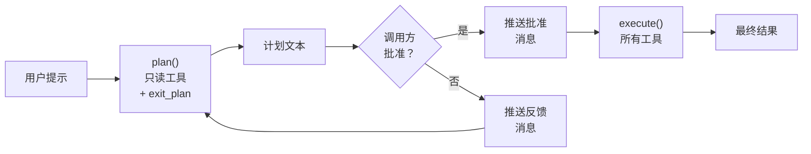

# 第 16 章：Plan 模式

> **需要编辑的文件：** `src/planning.rs`
> **运行的测试：** `cargo test -p mini-claw-code-starter plan`
> **预计用时：** 50 分钟

agent 现在能读文件、写代码、跑 shell 命令，还有权限系统、安全检查和钩子保护。但有个问题：它一口气把所有事都做完。模型读完文件立刻重写，跑完测试接着往下走——整个过程不间断。模型一旦误解了任务，在你开口说"等等，我不是这个意思"之前，代码库已经被改过了。

Plan 模式把 agent 循环拆成两个阶段来解决这个问题。第一阶段，agent 只用只读工具分析任务——读文件、搜代码、列目录，生成计划。第二阶段，调用方（你，或你的 UI）审查计划，批准后 agent 才用全量工具执行。先思考，再行动。这条建议对人和 agent 同样适用。

这不是纸上谈兵。Claude Code 内置了 plan 模式，用户明确批准计划之前，agent 只能做只读操作。所有严肃的编程 agent 都有类似机制——在提交修改前，让模型先推理一遍。你在第 12 章给工具设置的 `is_read_only()` 标志，就是为这一刻准备的。

```bash
cargo test -p mini-claw-code-starter plan
```

## 目标

- 构建有两个独立阶段的 `PlanAgent`：`plan()`（只读工具）和 `execute()`（全量工具）。
- 实现 `exit_plan` 虚拟工具，让 LLM 明确发出"规划完毕"信号，无需 `StopReason::Stop`。
- 规划阶段用两层写保护：过滤工具定义让 LLM 看不到写工具，执行时再兜底拦截写工具调用。
- 两个阶段共享消息历史，执行阶段拥有规划阶段的完整上下文。

---

## 为什么要单独的 agent？

可以把 plan 模式做成 `SimpleAgent` 上的一个标志——加个 `plan_mode: bool` 字段，在 `execute_tools` 里检查，按需过滤定义。能跑，但把两个关注点混在了一起。`SimpleAgent` 是通用 agent 循环。Plan 模式是更高层的工作流，有独立的阶段、转换逻辑，还有个不在工具集里的虚拟工具。混在一块会让两者都变乱。

`PlanAgent` 是独立的结构体，封装同样的构建块——一个 provider、一个 `ToolSet`——但以不同方式编排。`plan()` 和 `execute()` 分别实现两个阶段，调用方控制它们之间的切换。这样 `SimpleAgent` 保持简洁，`PlanAgent` 对自己的工作流有完全控制。

Claude Code 的做法类似：plan 模式设置 `PermissionMode::Plan`，由权限引擎强制执行（只有只读工具通过）。UI 显示"Plan Mode"横幅和 agent 的计划，再请求批准。我们的 `PlanAgent` 用调用方驱动的批准方式封装了同样的两阶段模式。

---

## PlanAgent 结构体

```rust
use std::collections::HashSet;

use tokio::sync::mpsc;

use crate::agent::{AgentEvent, tool_summary};
use crate::streaming::{StreamEvent, StreamProvider};
use crate::types::*;

pub struct PlanAgent<P: StreamProvider> {
    provider: P,
    tools: ToolSet,
    read_only: HashSet<&'static str>,
    plan_system_prompt: String,
    exit_plan_def: ToolDefinition,
}
```

五个字段，各有明确职责：

- **`provider`** — LLM 后端。注意 `StreamProvider` 约束，`PlanAgent` 在 plan/execute 循环内部用流式传输。
- **`tools`** — 完整工具集。规划阶段只暴露一部分；执行阶段全部可用。
- **`read_only`** — 规划阶段允许的工具名称集合。只有列出的工具在 plan 阶段可用。
- **`plan_system_prompt`** — 规划阶段注入的系统提示词，默认值由 `DEFAULT_PLAN_PROMPT` 常量提供。
- **`exit_plan_def`** — 虚拟 `exit_plan` 工具的 `ToolDefinition`。注入 plan 阶段的工具列表，但不存在于 `ToolSet`。它是信号，不是真实工具。

### 构建器

构建器遵循与 `SimpleAgent` 相同的 `new()` + 链式调用模式。`new()` 创建 `exit_plan_def`，描述告诉模型它的作用。该定义没有参数——模型只需调用它来发出"规划完毕"信号。

```rust
let agent = PlanAgent::new(provider)
    .tool(ReadTool::new())
    .tool(WriteTool::new())
    .read_only(&["read"])
    .plan_prompt("You are a security auditor.");
```

`PlanAgent` 特有的两个构建器方法：

- **`read_only(&[&'static str])`** — 设置规划阶段允许的工具名称。调用 `.read_only(&["bash", "read"])` 后，规划阶段只有 `bash` 和 `read` 可用。适合需要在分析阶段执行命令（如 `git log` 或 `cargo test --dry-run`）的专业工作流。

- **`plan_prompt(impl Into<String>)`** — 替换默认规划系统提示词。默认提示说"你处于规划模式，用可用工具探索代码库并制定计划。"自定义提示可以让 agent 专注于特定方向：安全审计、性能分析、迁移规划。

---

## 两个阶段

`PlanAgent` 的核心是 `plan()` 和 `execute()` 两个方法。结构与 `SimpleAgent` 的 `chat()` 相同，但工具集不同，终止条件也不同。两个方法都接受 `mpsc::UnboundedSender<AgentEvent>`，用于把事件流式传回调用方。



调用方驱动转换。`plan()` 返回后，调用方可以：
1. 向用户展示计划
2. 把 `Message::user("Approved. Go ahead.")` 推入消息历史
3. 用同一个消息向量调用 `execute()`

也可以拒绝计划，推送反馈，再次调用 `plan()`。`PlanAgent` 不在乎——没有内置 UI，没有批准对话框。它是工作流 agent，不是用户界面。

---

## 阶段一：plan()

规划阶段跑受限的 agent 循环，只有只读工具和虚拟 `exit_plan` 工具可用。`plan()` 和 `execute()` 都委托给共享的 `run_loop()` 方法：

```rust
pub async fn plan(
    &self,
    messages: &mut Vec<Message>,
    events: mpsc::UnboundedSender<AgentEvent>,
) -> anyhow::Result<String> {
    // Inject system prompt if needed
    // Call run_loop with Some(&self.read_only)
    unimplemented!()
}

pub async fn execute(
    &self,
    messages: &mut Vec<Message>,
    events: mpsc::UnboundedSender<AgentEvent>,
) -> anyhow::Result<String> {
    // Call run_loop with None (no restrictions)
    unimplemented!()
}
```

`run_loop()` 是共享 agent 循环。`allowed` 为 `Some` 时，只有这些工具加上 `exit_plan` 可用；`allowed` 为 `None` 时，全部工具可用：

以下是 `run_loop` 的完整实现：

```rust
async fn run_loop(
    &self,
    messages: &mut Vec<Message>,
    allowed: Option<&HashSet<&'static str>>,
    events: mpsc::UnboundedSender<AgentEvent>,
) -> anyhow::Result<String> {
    // Step 1: filter tool definitions
    let all_defs = self.tools.definitions();
    let defs: Vec<&ToolDefinition> = match allowed {
        Some(names) => {
            let mut filtered: Vec<&ToolDefinition> = all_defs
                .into_iter()
                .filter(|d| names.contains(d.name))
                .collect();
            filtered.push(&self.exit_plan_def);
            filtered
        }
        None => all_defs,
    };

    loop {
        // Step 2: stream the LLM response (forward text deltas to UI)
        let (stream_tx, mut stream_rx) = mpsc::unbounded_channel();
        let events_clone = events.clone();
        let forwarder = tokio::spawn(async move {
            while let Some(event) = stream_rx.recv().await {
                if let StreamEvent::TextDelta(ref text) = event {
                    let _ = events_clone.send(AgentEvent::TextDelta(text.clone()));
                }
            }
        });

        let turn = self.provider.stream_chat(messages, &defs, stream_tx).await?;
        let _ = forwarder.await;

        // Step 3: match on stop reason
        match turn.stop_reason {
            StopReason::Stop => {
                let text = turn.text.clone().unwrap_or_default();
                let _ = events.send(AgentEvent::Done(text.clone()));
                messages.push(Message::Assistant(turn));
                return Ok(text);
            }
            StopReason::ToolUse => {
                let mut results = Vec::with_capacity(turn.tool_calls.len());

                for call in &turn.tool_calls {
                    // Handle exit_plan
                    if allowed.is_some() && call.name == "exit_plan" {
                        let text = turn.text.clone().unwrap_or_default();
                        let _ = events.send(AgentEvent::Done(text.clone()));
                        messages.push(Message::Assistant(turn));
                        messages.push(Message::ToolResult {
                            id: call.id.clone(),
                            content: "Plan submitted for review.".into(),
                        });
                        return Ok(text);
                    }

                    // Block tools not in allowed set
                    if let Some(names) = allowed {
                        if !names.contains(call.name.as_str()) {
                            results.push((
                                call.id.clone(),
                                format!("error: tool `{}` is not available in planning mode",
                                    call.name),
                            ));
                            continue;
                        }
                    }

                    // Execute allowed tools
                    let content = match self.tools.get(&call.name) {
                        Some(t) => t.call(call.arguments.clone()).await
                            .unwrap_or_else(|e| format!("error: {e}")),
                        None => format!("error: unknown tool `{}`", call.name),
                    };
                    results.push((call.id.clone(), content));
                }

                messages.push(Message::Assistant(turn));
                for (id, content) in results {
                    messages.push(Message::ToolResult { id, content });
                }
            }
        }
    }
}
```

结构与 `SimpleAgent` 的 chat 循环一致——相同的循环、相同的 provider 调用、相同的停止原因匹配。不过 `PlanAgent` 通过 `StreamProvider` 在内部使用流式传输，有三点不同：

### 1. 系统提示词注入

进入循环前，`plan()` 把规划系统提示词插入消息历史的位置 0（如果还没有），告诉模型它处于规划模式。

### 2. 过滤工具定义

plan 阶段只把 `read_only` 集合中的工具加上 `exit_plan` 发给模型。模型在 schema 里看不到写工具，自然没有理由调用它们。

### 3. exit_plan 退出口

模型调用 `exit_plan` 时，plan 阶段立即结束。循环把助手消息和合成工具结果（"Plan submitted for review."）推入历史，然后返回。合成结果是必须的——API 要求每次工具调用都有对应结果，缺了它下次 provider 调用会因请求格式错误而失败。

plan 阶段有两种退出方式：
- **`StopReason::Stop`** — 模型直接产生文本响应，隐式退出。
- **`exit_plan` 工具调用** — 模型明确发出信号，显式退出。

两种方式都返回计划文本（如果模型把计划放在工具调用参数里而非文本中，则可能为空）。

---

## exit_plan 工具

`exit_plan` 工具值得单独说明，因为它很特殊。它不是真实工具，不在 `ToolSet` 里，没有 `call()` 方法。它只是一个有名称和描述的 `ToolDefinition`，注入 plan 阶段的工具列表，让模型把它当成选项。

为什么不直接依赖 `StopReason::Stop`？理论上可以：告诉模型"规划完毕后，以纯文本输出计划然后停止。"但实践中这与大多数指令微调模型根深蒂固的两种行为相抗衡。

1. **工具可见时，模型会持续使用。** 给模型 `read`、`glob`、`grep` 和用户提示，它会愉快地花十轮探索代码库，然后才产生任何叙述性输出。没有自然的停止梯度——再来一次 `grep` 总是合理的。没有刻意的停止信号，规划阶段就会一直拖。
2. **纯文本停止很容易被误读为未完成。** 以"接下来，我需要检查 X 是如何连接的"结束一轮的模型，即使 `stop_reason == Stop`，也在暗示"我还在工作"。调用方很难区分已完成的计划和中途暂停的想法。

`exit_plan` 绕开了这两个问题。它是模型必须*主动选择调用*的工具，代表明确的承诺（"我准备好了"）。计划文本作为参数携带，计划和停止信号在同一条结构化消息中一起到达。而且它占据模型已经习惯的工具调用槽位，行为能与循环的其余部分自然组合。这是用工具 schema 表达的社会契约。

模型调用 `exit_plan` 时，循环按名称检测到它，推送助手消息，找到调用 ID，推送内容为"Plan submitted for review."的合成 `ToolResult`。合成结果很重要——消息协议要求每个 `ToolCall` 都有匹配的 `ToolResult`，少了它下次 API 调用会因请求格式错误失败。

---

## 阶段二：execute()

执行阶段是带完整工具集的标准 agent 循环。没有过滤，没有虚拟工具，没有特殊终止。`execute()` 调用 `run_loop(messages, None, events)`——`allowed` 传 `None` 意味着所有工具可用。

关键点：`execute()` 接收与 `plan()` 相同的 `&mut Vec<Message>`。规划阶段的消息历史——系统提示词、用户请求、只读工具调用、计划文本——全都还在。模型带着完整的分析和决策上下文进入执行阶段。这种连续性正是两阶段模式有效的原因。模型不是从头开始，而是从停下的地方继续。

`plan()` 和 `execute()` 之间，调用方通常推送一条用户消息：

```rust
let (tx, _rx) = mpsc::unbounded_channel();
let plan = agent.plan(&mut messages, tx.clone()).await?;
println!("Plan: {plan}");

// User approves
messages.push(Message::user("Approved. Go ahead."));

let result = agent.execute(&mut messages, tx).await?;
```

批准消息成为执行上下文的一部分，模型看到它就知道自己有权限进行修改。

---

## 纵深防御：工具过滤

plan 阶段用两层保护防止写操作：

### 第一层：定义过滤

提供了 `allowed` 集合时，`run_loop` 过滤发给模型的工具 schema。只有名称在集合中的工具才被包含，加上 `exit_plan`。

模型在 schema 里看不到某工具，就没有理由调用它。这是主防线——消除诱惑。

### 第二层：执行守卫

即使模型以某种方式请求了被阻止的工具（幻觉、提示注入，或对 schema 的创意解读），`run_loop` 也会捕获。每次工具调用有三种处理：

1. **`exit_plan` 特殊处理** — 模型调用 `exit_plan` 时，循环立即返回计划文本，同时推送合成工具结果保持消息历史有效。

2. **被阻止的工具返回错误** — 工具不在 `allowed` 集合中时，不执行，向模型返回错误字符串。模型看到错误，理解约束，做出调整。

3. **允许的工具正常执行** — 查找、调用、返回结果，与 `SimpleAgent` 的工具执行流程相同。

两层都失效，写操作才能在规划阶段溜过。

### Rust 关键概念：`HashSet<&'static str>` 实现零成本字符串集合

`read_only` 字段用 `&'static str` 而非 `String`。集合中存放的是程序整个生命周期内都有效的字符串字面量引用——无需堆分配，无需克隆。`'static` 生命周期告诉编译器这些字符串永远不会失效，对 `"read"` 或 `"bash"` 这样的字符串字面量来说始终成立。代价是只能放入编译时已知的字符串，不能放入动态生成的字符串。工具名称始终在编译时确定，这正是理想选择。

### read_only 集合

`read_only` 字段是包含规划阶段允许工具名称的 `HashSet<&'static str>`，通过 `read_only()` 构建器方法设置：

```rust
pub fn read_only(mut self, names: &[&'static str]) -> Self {
    self.read_only = names.iter().cloned().collect();
    self
}
```

参考实现可以回退到检查工具上的 `is_read_only()` 标志，但 starter 要求明确命名允许的工具——starter 的 `Tool` trait 上没有 `is_read_only()` 或 `is_destructive()` 方法，这样更简单。

---

## 系统提示词注入

plan 阶段注入系统消息告诉模型它处于规划模式，由 `maybe_inject_plan_prompt()` 处理：

```rust
fn maybe_inject_plan_prompt(&self, messages: &mut Vec<Message>) {
    // Don't inject if a system message already exists
    let has_system = messages
        .first()
        .is_some_and(|m| matches!(m, Message::System(_)));

    if !has_system {
        messages.insert(0, Message::System(self.plan_system_prompt.clone()));
    }
}
```

三个设计决策：

1. **尊重现有系统提示词** — 检查位置 0 是否已有 `Message::System`。如果调用方已设置系统提示词（如"你是安全审计员"），plan 模式尊重它而不覆盖。`plan()` 被调用两次时，第二次会找到现有消息并跳过注入。

2. **位置 0** — 规划提示词插入消息列表开头，在所有现有消息之前。位置 0 的系统提示词对模型行为影响最强。

3. **自定义或默认** — 构建器调用过 `plan_prompt()` 则用那段文本，否则默认值告诉模型它处于规划模式、应使用只读工具，完成时调用 `exit_plan`。

---

## 完整的 plan-execute 流程

用一个实际场景来追踪整个流程。用户想把源文件复制到新位置。

**设置：**

```rust
let engine = PlanAgent::new(provider)
    .tool(ReadTool::new())
    .tool(WriteTool::new());

let mut messages = vec![Message::user("Copy src.txt to dst.txt")];
```

**Plan 阶段** — `plan()` 注入规划系统提示词，把定义过滤为 `[read, exit_plan]`（write 被排除），进入循环。模型调用 `read(path="src.txt")`，看到内容，返回"我将把 src.txt 复制到 dst.txt。"

**批准** — 调用方打印计划，推送用户消息：

```rust
println!("Plan: {}", plan);
messages.push(Message::user("Approved. Go ahead."));
```

**Execute 阶段** — `execute()` 暴露全部工具。模型调用 `write(path="dst.txt", content="source content")`，文件在磁盘上创建，模型返回"完成！文件已复制。"

最终消息历史包含完整追踪：规划系统提示词、用户请求、只读分析、计划文本、批准、写操作、最终确认。模型在每一步都有完整上下文。

---

## 事件流：plan_with_events()

与 `SimpleAgent` 一样，`PlanAgent` 有事件流变体。plan/execute 方法接受 `mpsc::UnboundedSender<AgentEvent>`，阶段运行时发出 `ToolCall`、`TextDelta`、`Done` 和 `Error` 事件。模式与 agent 模块的 `run_with_events()` 相同。

TUI 可以用它在 agent 规划阶段读取文件时显示加载指示器，计划文本流式传输时展示，调用 `execute()` 前提示用户批准。

---

## Claude Code 的实现方式

Claude Code 的 plan 模式遵循同样的两阶段模式，但与权限系统的集成更深。

| 特性 | 我们的 PlanAgent | Claude Code |
|------|----------------|-------------|
| 工具过滤 | 显式只读集合 | `PermissionMode::Plan` 标志 |
| UI 集成 | 调用方驱动（无内置 UI） | TUI 中的"Plan Mode"横幅 |
| 批准流程 | 调用方推送用户消息 | 带批准/拒绝的 UI 对话框 |
| 系统提示词 | 带 `plan_mode` 标签的消息 | 特定模式的提示词段落 |
| 退出信号 | `exit_plan` 虚拟工具 | 权限引擎中的模式转换 |
| 写阻断 | 两层（定义 + 执行） | 权限引擎拒绝非只读操作 |

最大的区别在于执行发生的位置。Claude Code 里权限引擎负责——plan 模式只是另一种拒绝非只读工具调用的权限模式，`SimpleAgent` 完全不需要知道 plan 模式。我们的方式更简单、更自包含：关于 plan 模式的所有内容都在一个结构体里，代价是对"半 plan"模式（允许部分写操作）的灵活性较低。

---

## 测试

运行 plan 模式测试：

```bash
cargo test -p mini-claw-code-starter plan
```

关键测试：

- **test_plan_plan_text_response** — LLM 以 `StopReason::Stop` 响应时，plan 阶段直接返回文本。
- **test_plan_plan_with_read_tool** — plan 阶段允许 `read` 工具调用并返回计划文本。
- **test_plan_plan_blocks_write_tool** — plan 阶段阻止 `write` 工具调用，向 LLM 返回错误，并验证文件未在磁盘上创建。
- **test_plan_plan_blocks_edit_tool** — plan 阶段阻止 `edit` 工具调用，原始文件保持不变。
- **test_plan_execute_allows_write_tool** — execute 阶段允许写操作，文件在磁盘上创建。
- **test_plan_full_plan_then_execute** — 完整两阶段流程：plan 读取文件，execution 写入新文件。
- **test_plan_message_continuity** — 消息历史在 plan 和 execute 阶段之间正确增长（系统 + 用户 + 助手消息累积）。
- **test_plan_read_only_override** — 自定义 `read_only(&["read"])` 将 `bash` 排除在 plan 阶段之外。
- **test_plan_streaming_events_during_plan** — plan 阶段通过通道发出 `TextDelta` 和 `Done` 事件。
- **test_plan_exit_plan_tool** — 虚拟 `exit_plan` 工具结束规划并注入合成工具结果。
- **test_plan_system_prompt_injected** — plan 阶段在位置 0 插入 `PLANNING MODE` 系统消息。
- **test_plan_system_prompt_not_duplicated** — 调用 `plan()` 两次不会重复系统提示词。
- **test_plan_exit_plan_not_in_execute** — execute 阶段中，`exit_plan` 被视为未知工具。
- **test_plan_custom_plan_prompt** — 自定义 plan 提示词替换默认规划指令。
- **test_plan_full_flow_with_exit_plan** — 端到端：规划时读取，exit_plan，批准，执行时写入。

---

## 核心要点

Plan 模式是调用方驱动的关注点分离：agent 先用只读工具分析，调用方审查并批准，agent 再用全量工具执行。同一份消息历史流经两个阶段，执行阶段拥有规划阶段的完整上下文。

---

## 回顾

Plan 模式完成了第三部分——安全与控制。四章下来，你构建了把鲁莽 agent 变成有纪律 agent 的各个层次：

- **第 13 章：权限引擎** — 执行前对每次工具调用检查权限规则。根据工具和模式来询问、允许或拒绝。
- **第 14 章：安全检查** — 工具参数的静态分析，在权限提示出现前捕获危险模式。
- **第 15 章：钩子系统** — 前置和后置工具钩子，实现自定义策略。编辑后运行 linter，阻止某些路径，执行项目规则。
- **第 16 章：Plan 模式** — 将分析与行动分离的两阶段工作流。agent 先读取和推理，仅在批准后才进行修改。

关键的架构洞察是**调用方驱动的批准**。`PlanAgent` 不提示用户、不显示对话框、不对 UI 做任何假设。它运行计划，返回文本，然后等待。调用方决定下一步做什么。这种关注点分离——引擎逻辑与用户交互——使同一个 `PlanAgent` 能在 CLI、TUI、Web 界面或测试框架中工作。

---

## 下一步

第三部分为 agent 提供了安全与控制。第四部分——配置——构建使 agent 具有项目感知能力的系统：

- **第 17 章：设置层级** — 从全局默认值到项目特定覆盖的分层配置。
- **第 18 章：项目指令** — 加载和组装 CLAUDE.md 文件，告诉 agent 如何处理这个特定代码库。

第三部分的安全基础设施保护 agent 免于造成伤害。第四部分的配置基础设施教它做好事情。

## 自我检测

{{#quiz ../quizzes/ch16.toml}}

---

[← 第 15 章：钩子](./ch15-hooks.md) · [目录](./ch00-overview.md) · [第 17 章：设置层级 →](./ch17-settings.md)
