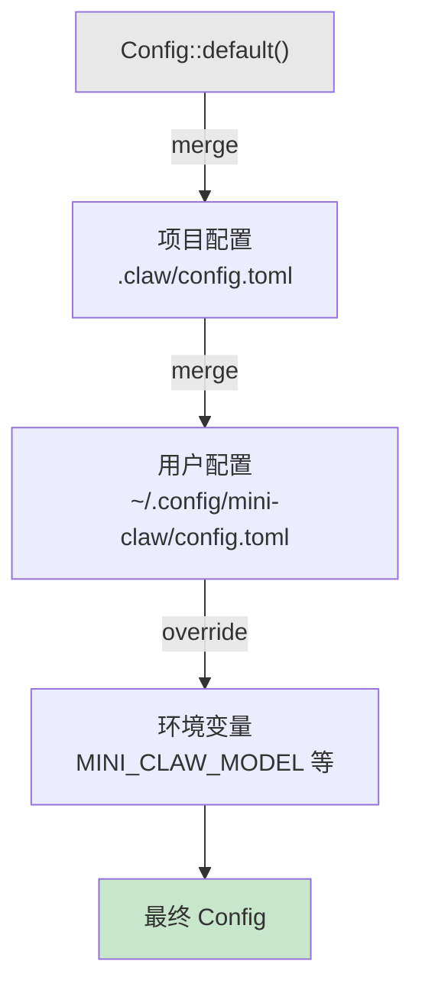

# 第 17 章：设置层级

> **需要编辑的文件：** `src/config.rs`、`src/usage.rs`
> **运行的测试：** `cargo test -p mini-claw-code-starter config`（Config、ConfigLoader）、`cargo test -p mini-claw-code-starter cost_tracker`（CostTracker）
> **预计用时：** 60 分钟

agent 现在能工作了。读文件、写代码、跑命令、检查权限、执行安全规则，plan 模式下还能限制自身。但这些行为全是硬编码的。模型名称是字符串字面量。被阻止的命令列表嵌在源码里。最大上下文窗口是个常量。想改任何一个，就得重新编译。

真正的工具不是这样运作的。在 Rust 项目上用 Claude Code 的开发者和在 Python 单体仓库上工作的开发者需要不同的设置。CI 流水线需要与交互式会话不同的默认值。通过自托管代理路由的用户需要不同的 base URL。agent 必须可配置——配置必须来自多个来源，按优先级分层，让项目设置覆盖用户设置，环境变量覆盖一切。

本章构建 4 层配置层级和成本追踪器。完成后，`config`（配置）和 `cost_tracker`（成本追踪器）的测试都应该通过。

```bash
cargo test -p mini-claw-code-starter config  # Config, ConfigLoader
cargo test -p mini-claw-code-starter cost_tracker  # CostTracker
```

## 目标

- 定义带 serde 默认值的 `Config` 结构体，使部分 TOML 文件能反序列化为完整配置。
- 定义 `ConfigOverlay` 结构体，字段类型为 `Option<T>`，让加载器能区分"字段未在 TOML 中设置"和"字段被明确设置为默认值"。
- 实现 `merge()` 函数，规则只有一条：overlay 中的每个 `Some(_)` 替换基础配置中对应的值。
- 构建 `ConfigLoader`，按优先级顺序组装四个层（默认值、项目配置、用户配置、环境变量）。
- 实现 `CostTracker`，累积 token 计数并根据每百万 token 定价计算运行成本估算。

---

## 为什么要分层？

单个配置文件很简单：一个 `config.toml`，一个真相来源，搞定。但在实践中它马上就会失效：

- **用户偏好**（模型选择和 API base URL 等）应该在所有项目中跟随你。不应该在每个仓库都写 `model = "anthropic/claude-sonnet-4-20250514"`。
- **项目设置**（被阻止的命令和受保护的文件模式等）特定于某个代码库。Node 项目可能阻止 `rm -rf node_modules`，Rust 项目阻止 `cargo publish --allow-dirty`。
- **环境覆盖**让 CI 流水线无需修改配置文件即可注入设置。GitHub Actions 工作流中的 `MINI_CLAW_MODEL=anthropic/claude-haiku-3-20250414` 可以切到更便宜的模型做自动化检查。
- **默认值**在完全未配置时提供合理的行为。

解决方案是分层配置。每层可以设置任意字段，优先级更高的层覆盖更低的层，某层未设置的字段向下透传到下一层。

```
优先级（从高到低）：

  1. 环境变量    MINI_CLAW_MODEL, MINI_CLAW_BASE_URL, MINI_CLAW_MAX_TOKENS
  2. 用户配置    ~/.config/mini-claw/config.toml
  3. 项目配置    .claw/config.toml
  4. 默认值      硬编码在代码中
```

Claude Code 用的是同一套方式。其层级为：CLI 标志 > 环境 > 用户设置 > 项目设置 > 默认值。合并逻辑更复杂——支持按键覆盖和数组合并策略——但架构相同。



---

## Config 结构体

所有配置存储在 `src/config/mod.rs` 的单个 `Config` 结构体中：

```rust
use std::path::{Path, PathBuf};

use serde::{Deserialize, Serialize};

#[derive(Debug, Clone, Serialize, Deserialize)]
pub struct Config {
    #[serde(default = "default_model")]
    pub model: String,

    #[serde(default = "default_base_url")]
    pub base_url: String,

    #[serde(default = "default_max_tokens")]
    pub max_context_tokens: u64,

    #[serde(default = "default_preserve_recent")]
    pub preserve_recent: usize,

    #[serde(default)]
    pub allowed_directory: Option<String>,

    #[serde(default)]
    pub protected_patterns: Vec<String>,

    #[serde(default)]
    pub blocked_commands: Vec<String>,

    #[serde(default)]
    pub instructions: Option<String>,
}
```

八个字段，涵盖三类：provider 设置、安全设置、agent 行为。

### Provider 设置

**`model`** 标识使用哪个 LLM。默认为 `"anthropic/claude-sonnet-4-20250514"`，一个 OpenRouter 模型路径。用户通过不同 provider 路由或想用更便宜的模型测试时可以覆盖它。

**`base_url`** 是 API 端点。默认指向 OpenRouter（`https://openrouter.ai/api/v1`）。跑本地代理、企业网关或其他 OpenAI 兼容 API 的用户改成指向自己的端点。

**`max_context_tokens`** 将上下文窗口限制在 200,000 个 token。压缩引擎读取此值来决定何时摘要旧消息。不同模型有不同的上下文限制——Haiku 支持 200K，但自托管模型可能只能处理 8K。

### 安全设置

**`allowed_directory`** 将文件操作限制在单个目录树内。设置后，Write、Edit 和 Read 工具拒绝触碰此路径之外的任何内容。简单但有效的沙箱——在 CI 中很有用，agent 只应该修改检出目录。

**`protected_patterns`** 是不能被写入的文件的 glob 模式列表。项目可能保护 `*.lock` 文件、`.env` 或 `Cargo.toml`，防止 agent 意外修改构建关键文件。

**`blocked_commands`** 列出 bash 工具拒绝的命令子字符串。命令中出现任何被阻止的子字符串，执行就被拒绝。这是第 14 章安全检查的配置入口。

### Agent 行为

**`preserve_recent`** 控制压缩引擎保留多少条最近消息。压缩时，引擎摘要较旧的消息，但保留最近的 `preserve_recent` 条不变，让模型有新鲜的上下文。默认 10 条大约对应最近 2-3 轮工具调用。

**`instructions`** 将自定义文本注入系统提示词。这是放置项目特定指导的地方——"始终使用 async/await"、"公共 API 中优先使用 Vec 而非 slice"、"测试必须使用 mock provider"。第 18 章构建完整的指令系统，此字段是其配置入口。

### Rust 关键概念：`#[serde(default)]` 实现部分反序列化

serde 的 `default` 属性让部分配置文件得以工作。TOML 文件省略某字段时，serde 通常会因"缺少字段"而失败。`#[serde(default = "function_name")]` 属性告诉 serde 调用指定函数而不是失败。默认为 `None` 或空 `Vec` 的字段用更简单的 `#[serde(default)]`，它调用 `Default::default()`。这个模式在 Rust 配置中很惯用：每个字段有合理默认值，用户只需指定想要更改的内容。另一种方式——要求配置文件中包含每个字段——会让部分配置变得不可能。

### 默认函数与 serde 技巧

每个有非平凡默认值的字段用一个命名函数：

```rust
fn default_model() -> String {
    "anthropic/claude-sonnet-4-20250514".into()
}

fn default_base_url() -> String {
    "https://openrouter.ai/api/v1".into()
}

fn default_max_tokens() -> u64 {
    200_000
}

fn default_preserve_recent() -> usize {
    10
}
```

`#[serde(default = "default_model")]` 属性告诉 serde，TOML 输入中缺少 `model` 字段时调用 `default_model()`。这让部分配置文件得以工作。只设置了 `blocked_commands` 的项目配置仍然能反序列化为完整的 `Config`——每个省略的字段都获得默认值。

默认为"空"的字段（`Option<String>`、`Vec<String>`）用更简单的 `#[serde(default)]`，它调用 `Default::default()`——`Option` 对应 `None`，集合对应空 `Vec`。

`Config` 的 `Default` 实现与这些函数完全对应：

```rust
impl Default for Config {
    fn default() -> Self {
        Self {
            model: default_model(),
            base_url: default_base_url(),
            max_context_tokens: default_max_tokens(),
            preserve_recent: default_preserve_recent(),
            allowed_directory: None,
            protected_patterns: Vec::new(),
            blocked_commands: Vec::new(),
            instructions: None,
        }
    }
}
```

同时拥有 `Default` 实现和 serde 默认值是有意为之的。`Config::default()` 在代码中使用——构造基础配置、在合并逻辑中与默认值比较。`#[serde(default = "...")]` 属性在反序列化时使用。两者必须保持一致，共享同一套命名函数来保证这一点。

---

## overlay：区分"未设置"与"设置为默认值"

写合并函数前，需要一种方式回答 `Config` 本身无法回答的问题：**这个字段是否真的在 TOML 文件中被设置了？**

一种自然的第一尝试是"将 overlay 值与 `Config::default()` 比较——如果不同，说明被设置了。"这个启发式是错的，无法区分两种不同情况：

1. 用户没有在 TOML 中设置该字段。
2. 用户*确实*设置了该字段，但值恰好等于默认值。

情况 2 并非假设。如果默认 `model` 是 `"anthropic/claude-sonnet-4-20250514"`，而用户在用户配置中明确写了 `model = "anthropic/claude-sonnet-4-20250514"` 来断言它（无论项目如何覆盖），"与默认值比较"的启发式会默默地把它当作"未设置"，保留前一层的值。最后写入者获胜的原则被违反了。

解决方案是在类型系统中编码"已设置"与"未设置"。引入第二个结构体——`ConfigOverlay`——其字段为 `Option<T>`。Serde 将缺失的 TOML 键反序列化为 `None`，将存在的键反序列化为 `Some(value)`，不需要值比较。

```rust
#[derive(Debug, Clone, Default, Deserialize)]
#[serde(default)]
pub struct ConfigOverlay {
    pub model: Option<String>,
    pub base_url: Option<String>,
    pub max_context_tokens: Option<u64>,
    pub preserve_recent: Option<usize>,
    pub allowed_directory: Option<String>,
    pub protected_patterns: Option<Vec<String>>,
    pub blocked_commands: Option<Vec<String>>,
    pub instructions: Option<String>,
}
```

结构体级别的 `#[serde(default)]` 告诉 serde，TOML 输入中缺少的任何字段回退到 `Default::default()`——而 `Option<T>` 的 `Default::default()` 是 `None`。这正是我们想要的"键缺失 → `None`"映射，无需逐个字段注解。

两个结构体扮演互补角色。`Config` 是完全解析的输出：每个字段都有值，下游所有人读取时无需关心值是如何得到的。`ConfigOverlay` 是传输格式：相同形状的部分可选视图，仅在合并层时使用。

即使是 `Vec<T>` 字段也变成了 `Option<Vec<T>>`。这很重要——TOML 中设置 `protected_patterns = []` 的 overlay 意味着"清空列表"，与"根本没有提到列表"不同。`Option<Vec<T>>` 能清晰表示两种情况，裸 `Vec<T>` 则不能。

## 合并逻辑

有了 overlay，合并变得统一：overlay 中的每个 `Some(_)` 替换基础配置中对应的字段，每个 `None` 保持基础配置不变。

```rust
pub fn merge(base: Config, overlay: ConfigOverlay) -> Config {
    Config {
        model: overlay.model.unwrap_or(base.model),
        base_url: overlay.base_url.unwrap_or(base.base_url),
        max_context_tokens: overlay.max_context_tokens.unwrap_or(base.max_context_tokens),
        preserve_recent: overlay.preserve_recent.unwrap_or(base.preserve_recent),
        allowed_directory: overlay.allowed_directory.or(base.allowed_directory),
        protected_patterns: overlay.protected_patterns.unwrap_or(base.protected_patterns),
        blocked_commands: overlay.blocked_commands.unwrap_or(base.blocked_commands),
        instructions: overlay.instructions.or(base.instructions),
    }
}
```

两种模式覆盖所有字段：

- `unwrap_or(base.x)` 用于 `Config` 中持有具体值的字段（如 `String`、`u64`、`Vec<String>`）。overlay 有 `Some(v)` 时结果是 `v`，否则保留基础值。
- `.or(base.x)` 用于 `Config` 上已经是 `Option<T>` 的字段（`allowed_directory`、`instructions`）。`Option::or` 返回找到的第一个 `Some(_)`。

合并逻辑就这些。没有值比较，没有每字段的特殊情况。后来的层设置某字段时总是获胜，不管值是否与默认值一致、是否与前一层相同，或是否为空。

### 集合：替换，而非追加

overlay 设置了 `protected_patterns` 或 `blocked_commands` 时，其值完全替换基础配置。追加的方式意味着每层都向列表中添加内容，无法移除来自较低层的条目。替换让每个提到该字段的层都能完全控制其内容。

考虑这样的场景：项目层保护 `.env` 和 `.secret`，而用户配置也设置了 `protected_patterns = [".credentials"]`。替换策略意味着只有 `.credentials` 受保护——项目的模式消失了。因为项目配置先加载（优先级最低），用户配置后加载（优先级更高），用户配置的模式替换了项目的模式。对大多数设置而言这是合理的——用户比项目作者更了解自己的环境。

想要追加语义，可以用扩展集合的方式：

```rust
// Append（我们不这样做）：
if let Some(extra) = overlay.protected_patterns {
    base.protected_patterns.extend(extra);
}
```

Claude Code 根据字段不同支持两种策略。我们的实现保持简单，只用替换，而 overlay 的 `Option<Vec<T>>` 类型使"层没有提到此字段"与"层明确将其设置为空列表"保持区别。

---

## ConfigLoader：组装各层

`ConfigLoader` 编排完整的合并流水线：

```rust
pub struct ConfigLoader {
    project_dir: Option<PathBuf>,
}

impl ConfigLoader {
    pub fn new() -> Self {
        Self { project_dir: None }
    }

    pub fn project_dir(mut self, dir: impl Into<PathBuf>) -> Self {
        self.project_dir = Some(dir.into());
        self
    }

    pub fn load(&self) -> Config {
        let mut config = Config::default();

        // Layer 1: Project config (.claw/config.toml)
        if let Some(ref dir) = self.project_dir {
            let project_path = dir.join(".claw").join("config.toml");
            if let Some(overlay) = Self::load_file(&project_path) {
                config = Self::merge(config, overlay);
            }
        }

        // Layer 2: User config (~/.config/mini-claw/config.toml)
        if let Some(user_dir) = dirs::config_dir() {
            let user_path = user_dir.join("mini-claw").join("config.toml");
            if let Some(overlay) = Self::load_file(&user_path) {
                config = Self::merge(config, overlay);
            }
        }

        // Layer 3: Environment variables (highest priority)
        config = Self::apply_env(config);

        config
    }
}
```

构建器模式让调用方可以选择指定项目目录。在真实 agent 中，这是用户调用工具时的工作目录。在测试中，这是临时目录。

### 加载顺序很重要

`load()` 从最低优先级到最高优先级依次应用各层：

1. 从 `Config::default()` 开始——绝对基线。
2. 合并项目配置（`.claw/config.toml`）——项目特定覆盖。
3. 合并用户配置（`~/.config/mini-claw/config.toml`）——用户范围偏好。
4. 应用环境变量——最终覆盖。

每次合并以当前累积的配置作为基础，以新层作为 overlay。非默认的 overlay 值替换基础值。用户配置优先于项目配置，环境变量优先于一切。

`dirs::config_dir()` 调用用 `dirs` crate 查找平台适当的配置目录——Linux 上是 `~/.config`，macOS 上是 `~/Library/Application Support`，Windows 上是 `%APPDATA%`。Linux 上遵循 XDG 基础目录规范，其他平台遵循各自的平台惯例。

### 加载单个文件

```rust
pub fn load_file(path: &Path) -> Option<ConfigOverlay> {
    let content = std::fs::read_to_string(path).ok()?;
    toml::from_str(&content).ok()
}
```

两行，两个可能的失败点，都用 `.ok()?` 处理：

1. 文件可能不存在——`read_to_string` 返回 `Err`，`.ok()` 转换为 `None`，`?` 返回 `None`。
2. 文件可能包含无效 TOML——`toml::from_str` 返回 `Err`，同样的链式处理。

注意返回类型是 `Option<ConfigOverlay>` 而非 `Option<Config>`。加载器特意解析为部分类型——这是 `merge` 后来知道文件实际提到了哪些字段的方式。

返回 `Option<_>` 而非 `Result<_, Error>` 是有意为之的。缺失的配置文件不是错误——是正常情况。大多数用户不会有用户配置文件，大多数项目不会有 `.claw/config.toml`。加载器应该静默跳过缺失的文件并应用默认值。无效的 TOML 可以说值得报告，但为了简单起见我们同样处理。生产实现会在解析失败时记录警告，同时仍回退到默认值。

`toml` crate 处理反序列化。因为 `ConfigOverlay` 上的每个字段都是带 `#[serde(default)]` 的 `Option<T>`，只设置一个字段的 TOML 文件也能干净地解析——其他字段都变成 `None`：

```toml
# 这是有效的配置文件：
model = "anthropic/claude-haiku-3-20250414"
```

这会反序列化为 `model: Some(...)` 且其他所有字段为 `None` 的 `ConfigOverlay`。`merge` 应用它时，只有 `model` 在基础配置上被修改。

### 环境变量覆盖

```rust
fn apply_env(mut config: Config) -> Config {
    if let Ok(model) = std::env::var("MINI_CLAW_MODEL") {
        config.model = model;
    }
    if let Ok(url) = std::env::var("MINI_CLAW_BASE_URL") {
        config.base_url = url;
    }
    if let Ok(tokens) = std::env::var("MINI_CLAW_MAX_TOKENS") {
        if let Ok(n) = tokens.parse::<u64>() {
            config.max_context_tokens = n;
        }
    }
    config
}
```

环境变量是最简单的层——没有文件，没有解析，没有合并逻辑。变量存在时，其值替换该字段；不存在时，字段保持不变。

只有三个字段支持环境变量：`model`、`base_url` 和 `max_context_tokens`。这些是 CI 和脚本场景中最常被覆盖的字段。`blocked_commands` 和 `protected_patterns` 等安全字段被有意排除——不希望被攻破的环境变量禁用安全规则。

注意 `MINI_CLAW_MAX_TOKENS` 的双重解析：先用 `std::env::var` 获取字符串，再用 `.parse::<u64>()` 转换为数字。字符串不是有效整数时，解析静默失败，保留现有值。不会崩溃，没有错误消息。这是处理环境变量的正确行为——`MINI_CLAW_MAX_TOKENS=abc` 中的拼写错误不应该使 agent 崩溃。

---

## CostTracker：了解你的花费

每次 LLM API 调用都要花钱。成本取决于两个因素：发送了多少 token（输入）以及模型生成了多少 token（输出）。不同模型的定价差异很大——Claude Sonnet 大约每百万输入 token 3 美元、每百万输出 token 15 美元，Haiku 则便宜了一个数量级。

编程 agent 每次会话会进行多次 API 调用。复杂任务可能跑 20-30 个工具调用轮次，每次都发送完整的对话历史。没有追踪，根本不知道一次会话花了 0.02 美元还是 2.00 美元。`CostTracker` 在整个会话中累积 token 计数并计算运行成本。

```rust
pub struct CostTracker {
    input_tokens: u64,
    output_tokens: u64,
    turn_count: u64,
    input_price_per_million: f64,
    output_price_per_million: f64,
}
```

五个字段。前三个是随每次 API 调用增长的累积器，后两个是根据模型定价在构建时设置的常量。

### 构建

```rust
impl CostTracker {
    pub fn new(input_price_per_million: f64, output_price_per_million: f64) -> Self {
        Self {
            input_tokens: 0,
            output_tokens: 0,
            turn_count: 0,
            input_price_per_million,
            output_price_per_million,
        }
    }
}
```

调用方提供定价。Claude Sonnet 用 `CostTracker::new(3.0, 15.0)`，Haiku 用 `CostTracker::new(0.25, 1.25)`。这将追踪器与特定模型的知识分离——它只计算 token 并乘以费率。

### 记录使用量

```rust
pub fn record(&mut self, usage: &crate::types::TokenUsage) {
    self.input_tokens += usage.input_tokens;
    self.output_tokens += usage.output_tokens;
    self.turn_count += 1;
}
```

每次 provider 响应后调用。`TokenUsage` 结构体（来自第 4 章）携带每次请求的 token 计数，追踪器累积并递增轮次计数器。

注意 `record` 接受 `TokenUsage` 的引用而非所有权。调用方通常将使用量附加在 `AssistantTurn` 上，不应为了记录成本而放弃它。

### 计算成本

```rust
pub fn total_cost(&self) -> f64 {
    let input_cost = self.input_tokens as f64 * self.input_price_per_million / 1_000_000.0;
    let output_cost = self.output_tokens as f64 * self.output_price_per_million / 1_000_000.0;
    input_cost + output_cost
}
```

直接的算术运算。输入 token 乘以每百万 token 的输入价格，除以一百万；输出同理；两者相加。结果以美元为单位。

100 个输入 token（3 美元/M）和 50 个输出 token（15 美元/M）的会话：

```
input:  100 * 3.0  / 1,000,000 = 0.0003
output:  50 * 15.0 / 1,000,000 = 0.00075
total:                           0.00105
```

即 0.00105 美元——大约十分之一美分。典型的交互式会话花费 0.05 到 0.50 美元，具体取决于复杂性和模型选择。

### 摘要格式化

```rust
pub fn summary(&self) -> String {
    format!(
        "tokens: {} in + {} out | cost: ${:.4}",
        self.input_tokens,
        self.output_tokens,
        self.total_cost()
    )
}
```

生成类似 `"tokens: 5000 in + 1000 out | cost: $0.0300"` 的字符串。四位小数提供亚分精度。TUI 会在状态栏中显示这个——对本次会话花费的持续提醒。

### 重置

```rust
pub fn reset(&mut self) {
    self.input_tokens = 0;
    self.output_tokens = 0;
    self.turn_count = 0;
}
```

将累积器清零，但保留定价。在同一会话中开始新的逻辑任务时很有用，或者在多对话 agent 中做每次对话的成本追踪。

### 访问器方法

追踪器通过只读方法暴露累积器：

```rust
pub fn total_input_tokens(&self) -> u64 { self.input_tokens }
pub fn total_output_tokens(&self) -> u64 { self.output_tokens }
pub fn turn_count(&self) -> u64 { self.turn_count }
```

UI 和日志系统可以读取状态而无需修改。字段本身是私有的——修改它们的唯一方式是通过 `record()` 和 `reset()`，保持记账一致性。

---

## 综合运用：示例配置文件

项目的 `.claw/config.toml` 可能的样子：

```toml
model = "anthropic/claude-sonnet-4-20250514"
max_context_tokens = 100000

protected_patterns = [".env", "*.lock", "secrets/*"]
blocked_commands = ["rm -rf /", "git push --force"]

instructions = "Always run cargo fmt after editing Rust files."
```

用户的 `~/.config/mini-claw/config.toml`：

```toml
model = "anthropic/claude-sonnet-4-20250514"
base_url = "https://my-proxy.example.com/v1"
```

两者都存在时，加载器这样合并：

1. **默认值** — 所有字段获得默认值。
2. **项目配置**解析为 `ConfigOverlay`，文件中提到的键（`model`、`max_context_tokens`、`protected_patterns`、`blocked_commands`、`instructions`）各有一个 `Some(_)`。`merge` 将每个应用到基础配置。
3. **用户配置**解析为 overlay，`model` 和 `base_url` 各有一个 `Some(_)`。即使其 `model` 值恰好与默认值相同，这也不再重要——overlay 说该字段被设置了，所以它替换项目的值。`base_url` 同样替换默认值。
4. **环境** — 设置了 `MINI_CLAW_MODEL` 的话，覆盖一切。

最终配置拥有项目的安全规则、用户的模型和代理 URL，以及其余字段的默认值。每层只贡献它知道的内容，不需要重复它不关心的内容；某层设置的值恰好与默认值一致时，也不会被静默忽略。

---

## Claude Code 的实现方式

Claude Code 有类似的 4 层层级：项目设置、用户设置、环境、默认值。细节上有些值得关注的差异。

**格式。** Claude Code 用 JSON（`settings.json`、`settings.local.json`）而非 TOML。JSON 对 Web 开发者（Claude Code 的主要受众）更熟悉，并与 TypeScript 自然集成。我们用 TOML，因为它是 Rust 生态系统标准——每位 Rust 开发者每天都在读 `Cargo.toml`。

**合并复杂度。** Claude Code 支持按键覆盖策略。某些字段追加（权限规则在层间累积），某些替换（模型名称），某些使用首次写入语义（项目指令优先于相同键的用户指令）。我们的合并逻辑只用一种策略：overlay 设置的每个字段替换基础值，包括集合。更简单，但涵盖了常见情况。

**成本追踪。** Claude Code 按模型追踪成本，支持缓存感知定价。API 报告 `cache_read_tokens` 时，这些 token 以较低费率计费（通常比普通输入 token 便宜 90%）。我们的 `CostTracker` 忽略缓存，对所有输入 token 一视同仁。添加缓存感知定价意味着扩展 `record()` 以接受 `cache_read_tokens` 并应用单独的费率，但架构不会改变。

**验证。** Claude Code 在加载时验证设置——未知键产生警告，类型不匹配产生错误。我们的 `load_file` 静默丢弃无法解析的文件。生产实现会进行验证并报告。

尽管有这些差异，分层架构是相同的。设置从通用（默认值）流向特定（环境），每层覆盖前一层。`Config` 结构体是整个 agent 的单一真相来源，传给每个需要了解如何运作的子系统。

---

## 测试

运行测试：

```bash
cargo test -p mini-claw-code-starter config  # Config, ConfigLoader
cargo test -p mini-claw-code-starter cost_tracker  # CostTracker
```

注意：Config 和 ConfigLoader 测试在 `config` 中（沿用 V1 编号，配置是第 16 章）。CostTracker 测试在 `cost_tracker` 中（V1 token 追踪章节）。

关键配置测试（`config`）：

- **test_config_default_config** — `Config::default()` 产生预期的模型、token 限制和非空安全默认值。
- **test_config_load_from_toml** — 包含 `model` 和 `max_context_tokens` 的 TOML 字符串正确反序列化。
- **test_config_default_fills_missing_fields** — 只有 `model` 的 TOML 文件仍然获得 `preserve_recent`、`instructions` 等的默认值。
- **test_config_load_nonexistent_path** — 从不存在的路径加载返回 `None` 而不是崩溃。
- **test_config_mcp_server_config** — MCP server 配置通过 TOML 正确往返。
- **test_config_hooks_config** — 钩子配置（命令、工具模式、超时）从 TOML 反序列化。
- **test_config_env_override** — 设置 `MINI_CLAW_MODEL` 环境变量覆盖已加载配置中的模型。
- **test_config_protected_patterns_default** — 默认配置在受保护模式中包含 `.env` 和 `.git/**`。

关键成本追踪器测试（`cost_tracker`）：

- **test_cost_tracker_empty_tracker** — 新追踪器从零 token、零回合、零成本开始。
- **test_cost_tracker_record_single_turn** — 记录一个回合递增输入/输出 token 和回合计数器。
- **test_cost_tracker_accumulates_across_turns** — 三次 `record()` 调用正确累积总计。
- **test_cost_tracker_cost_calculation** — 以 3 美元/15 美元每百万计，100 万输入 + 100 万输出 token = 18.00 美元。
- **test_cost_tracker_cost_small_numbers** — 1000 个输入 + 200 个输出 token = 0.006 美元。
- **test_cost_tracker_summary_format** — `summary()` 产生预期的 `"tokens: N in + N out | cost: $X.XXXX"` 格式。
- **test_cost_tracker_reset** — `reset()` 将累积器清零但保留定价。

---

## 核心要点

分层配置让每一层（默认值、项目、用户、环境）只贡献它知道的内容。把形状拆分为完全解析的 `Config` 和部分 `ConfigOverlay`（字段为 `Option<T>`）将"该字段是否被设置？"这个问题放入类型系统：`None` 意味着文件没有提到它，`Some(v)` 意味着提到了——不管 `v` 是什么。合并只有一条规则：每个 `Some(_)` 替换基础值。

---

## 回顾

本章构建了 agent 其余部分依赖的两个子系统。

- **`Config`** 在单个结构体中保存每个可配置参数。Serde 的 `#[serde(default)]` 属性使部分 TOML 文件工作——只设置想要更改的内容。

- **`ConfigOverlay`** 是 `Config` 的部分对应物：每个字段都是 `Option<T>`。`None` 表示字段未在该层中设置，`Some(v)` 表示已设置——即使 `v` 恰好等于默认值，也能保持区别。

- **`ConfigLoader`** 实现 4 层合并流水线：默认值、项目配置、用户配置、环境变量。每个文件层被解析为 `ConfigOverlay` 并以单一规则应用：每个 `Some(_)` 替换基础值。

- **`CostTracker`** 在会话中累积 token 使用量并根据每百万 token 定价计算估算成本。`summary()` 方法产生 TUI 显示的单行状态字符串。

- **合并策略**是关键设计决策。在类型系统中编码"已设置与未设置"（而非从值猜测）保证了最后写入者获胜，并使显式重置——清空列表、重新断言默认值——正确工作。

- **环境变量**被有意限制为三个字段。`blocked_commands` 和 `protected_patterns` 等安全关键设置应来自已检入版本控制或明确管理的配置文件，而非可能被操纵的环境变量。

---

## 下一步

配置告诉 agent *如何*运作。第 18 章——项目指令——告诉它*知道什么*。`Config` 中的 `instructions` 字段只是个字符串。指令系统从项目树中读取 CLAUDE.md 文件，将它们与用户指令合并，并注入系统提示词。设置和指令共同使 agent 具有情境感知能力——它根据每个项目调整行为和知识。

## 自我检测

{{#quiz ../quizzes/ch17.toml}}

---

[← 第 16 章：Plan 模式](./ch16-plan-mode.md) · [目录](./ch00-overview.md) · [第 18 章：项目指令 →](./ch18-instructions.md)
