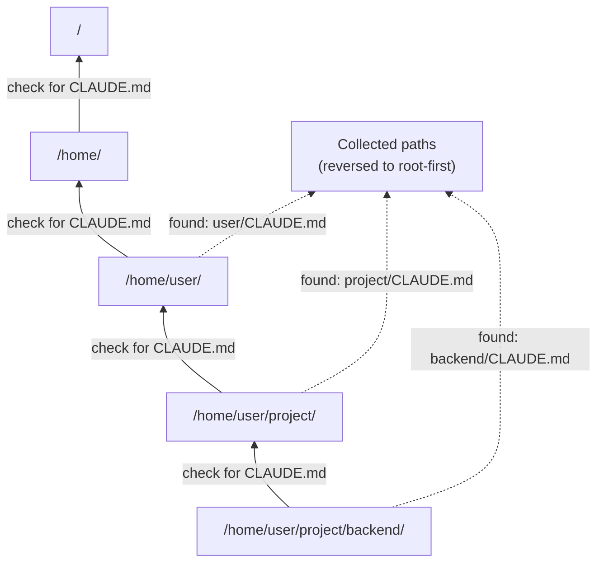

# 第 18 章：项目指令与上下文管理

> **需要编辑的文件：** `src/context.rs`
> **运行的测试：** `cargo test -p mini-claw-code-starter instructions`（InstructionLoader）、`cargo test -p mini-claw-code-starter context_manager`（ContextManager）
> **预计时间：** 40 分钟

本章收尾了两个让 agent 长会话稳定运行的关键模块：

- **`InstructionLoader`**（第 8 章已实现）通过向上遍历文件系统发现 CLAUDE.md 文件。本章重新审视它，看清楚它的输出如何在会话启动时注入到对话中。
- **`ContextManager`**（本章新增）在 token 预算耗尽时对旧轮次进行摘要，将对话保持在模型的上下文窗口以内。这是需要你填写实现的部分。

第 17 章加入了 `Config`，一套分层配置体系。其中一个字段是 `instructions: Option<String>`——用户可以放在 TOML 配置文件中并注入到系统提示词的自定义文本。

本章将三者串联起来。agent 由此变得*项目感知*（从 `/home/user/project/backend` 启动与从 `/home/user/other` 启动会加载不同的 CLAUDE.md 文件），同时变得*会话持久*（20 轮的调试会话不会撞上上下文限制）。

```bash
cargo test -p mini-claw-code-starter instructions  # InstructionLoader
cargo test -p mini-claw-code-starter context_manager  # ContextManager
```

## 目标

- 理解 `InstructionLoader` 的输出和 `Config.instructions` 如何在会话启动时作为系统消息注入。
- 实现 `ContextManager::record`，使每轮的 token 用量累计到运行总数中。
- 实现 `ContextManager::compact`，在预算耗尽时用 LLM 生成的摘要替换消息历史的中间部分，同时完整保留系统提示词和最近的消息。
- 理解为什么系统提示词（包含发现的 CLAUDE.md 内容）必须在压缩时保持不变——它是 LLM 每轮都需要的那条消息。

---

## 会话级流水线

完整流程如下。会话启动时，指令被发现并推入消息历史。会话过程中，`ContextManager` 监测 token 用量，在预算耗尽时压缩历史的中间部分。

```
  ┌─────────────────────────────┐
  │  Filesystem                 │      (at session start)
  │                             │
  │  /home/user/CLAUDE.md       │──┐
  │  /home/user/project/        │  │
  │    CLAUDE.md                │──┤  InstructionLoader::discover()
  │    backend/                 │  │  walks upward, collects paths
  │      CLAUDE.md              │──┤
  │      .claw/instructions.md  │──┘
  └─────────────────────────────┘
              │
              ▼
  ┌─────────────────────────────┐
  │  InstructionLoader::load()  │
  │  concatenates with headers  │
  │  and --- separators         │
  └─────────────────────────────┘
              │
              ▼
  ┌─────────────────────────────┐
  │  messages[0] = System(      │      (injected once, never edited)
  │    "# Instructions from ... │
  │     <concatenated CLAUDE>"  │
  │  )                          │
  └─────────────────────────────┘
              │
              ▼  (agent loop: User → Assistant → ToolResult → ...)
              │
  ┌─────────────────────────────┐
  │  ContextManager             │      (runs after every turn)
  │                             │
  │  .record(usage)             │  ← accumulate input + output tokens
  │  .should_compact()          │  ← tokens_used >= max_tokens?
  │                             │
  │  On trigger:                │
  │    keep  messages[0]        │  ← the system/instructions message
  │    ask   provider to        │
  │          summarise middle   │  ← LLM call with the old transcript
  │    keep  last N messages    │
  │                             │
  │  Result: short history,     │
  │  same system prompt.        │
  └─────────────────────────────┘
```

两点需要注意。

**指令在会话内是稳定的。** 只加载一次，成为第一条系统消息，之后不再修改。从不同目录启动会得到不同的 `messages[0]`，但会话一旦开始，指令内容就固定了。用户通常不会在聊天过程中编辑 CLAUDE.md。

**上下文管理是会话级的，不是提示词级的。** 压缩不是在"系统提示词"中插入新段落，而是通过对中间部分进行摘要来重写消息历史。系统提示词（携带你的指令）被有意排除在压缩之外——它始终是锚点。

---

## 重新审视 InstructionLoader

第 8 章已经构建过它了。现在在实际流水线中使用，重新审视代码，设计决策在上下文中会更加清晰。

### 结构体

```rust
pub struct InstructionLoader {
    file_names: Vec<String>,
}
```

加载器不硬编码要查找哪些文件，接受文件名列表，`default_files()` 将列表设为 `["CLAUDE.md", ".claw/instructions.md"]`。这意味着测试时可以换不同的文件名，或者不修改加载器就能添加项目特定的替代文件。

```rust
impl InstructionLoader {
    pub fn new(file_names: &[&str]) -> Self {
        Self {
            file_names: file_names.iter().map(|s| s.to_string()).collect(),
        }
    }

    pub fn default_files() -> Self {
        Self::new(&["CLAUDE.md", ".claw/instructions.md"])
    }
}
```

### 发现：向上遍历



`discover()` 从给定目录开始，向文件系统根目录方向遍历。在每个目录中检查列表中的每个文件名：

```rust
pub fn discover(&self, start_dir: &Path) -> Vec<PathBuf> {
    let mut found = Vec::new();
    let mut dir = Some(start_dir.to_path_buf());

    while let Some(current) = dir {
        for name in &self.file_names {
            let candidate = current.join(name);
            if candidate.is_file() {
                found.push(candidate);
            }
        }
        dir = current.parent().map(|p| p.to_path_buf());
    }

    found.reverse(); // Root-first order
    found
}
```

末尾的 `found.reverse()` 是关键的设计选择。遍历自然地从最具体到最通用收集文件（起始目录在前，根目录在后），反转后变成从根目录到具体目录的顺序。

三个层级都有 CLAUDE.md 文件时，`discover("/home/user/project/backend")` 返回的向量为：

```
[0] /home/user/CLAUDE.md               ← global preferences
[1] /home/user/project/CLAUDE.md       ← project conventions
[2] /home/user/project/backend/CLAUDE.md ← subdirectory rules
```

全局偏好排在最前面，最具体的规则排在最后。LLM 读取系统提示词时，最后出现的指令影响力最强——与 CSS 优先级原则相同：通用规则在前，覆盖规则在后。

### 加载：读取、过滤、拼接

`load()` 调用 `discover()`，读取每个文件，拼接结果：

```rust
pub fn load(&self, start_dir: &Path) -> Option<String> {
    let paths = self.discover(start_dir);
    if paths.is_empty() {
        return None;
    }

    let mut sections = Vec::new();
    for path in &paths {
        if let Ok(content) = std::fs::read_to_string(path) {
            let content = content.trim().to_string();
            if !content.is_empty() {
                sections.push(format!(
                    "# Instructions from {}\n\n{}",
                    path.display(),
                    content
                ));
            }
        }
    }

    if sections.is_empty() {
        None
    } else {
        Some(sections.join("\n\n---\n\n"))
    }
}
```

三个细节：

**标题。** 每个文件的内容前加上 `# Instructions from <path>`，告诉 LLM 每个块来自哪里，帮它解决不同层级之间的矛盾。

**分隔符。** 文件之间用 `\n\n---\n\n` 连接——markdown 中的水平线，为 LLM 在指令块之间提供清晰的边界。

**跳过空文件。** CLAUDE.md 存在但为空或只有空白字符时，静默跳过。在空段落上浪费上下文 token 毫无意义。

**返回 `None`。** 找不到指令文件，或者全部为空，`load()` 返回 `None` 而不是 `Some("")`，让调用方可以完全跳过添加指令段落。

---

## 指令层级

指令可以来自多个来源。完整层级结构，从最宽泛到最具体：

```
Source                              Priority    Section type
──────────────────────────────────────────────────────────────
/home/user/CLAUDE.md                lowest      file (root-first)
/home/user/project/CLAUDE.md        ↓           file
/home/user/project/backend/CLAUDE.md ↓          file
.claw/instructions.md               ↓           file (alternative)
Config.instructions                 highest     config
```

基于文件的指令由 `InstructionLoader` 发现，按从根到子目录的顺序排列。基于配置的指令来自 `Config` 结构体的 `instructions` 字段——从 `.claw/config.toml` 或 `~/.config/mini-claw/config.toml` 加载。

两者都成为系统提示词中的动态段落。文件指令先添加，配置指令后添加。LLM 从上到下读取提示词，冲突时配置指令拥有最终话语权。

### 为什么要有两个来源？

CLAUDE.md 文件提交到版本控制，代表项目所有成员共享的团队约定。"用 `cargo test` 运行测试。""不要修改自动生成的文件。""使用 edition 2024。"

配置指令是本地的。放在 `.claw/config.toml`（可能提交也可能不提交）或用户主目录的配置文件（从不提交）。它们代表个人偏好或临时覆盖。"始终解释你的推理过程。""本次会话专注于性能而非可读性。"

---

### 关键 Rust 概念：用 `if let` 链式处理可选流水线步骤

连接代码用 `if let Some(instructions) = loader.load(...)` 条件性地添加段落。这是 Rust 中处理可选流水线步骤的惯用写法：`InstructionLoader::load()` 返回 `Option<String>`——不存在指令文件时返回 `None`，存在时返回 `Some(text)`。`if let` 绑定解构 `Option`，只在有值时执行主体。类似地，`Config.instructions` 是 `Option<String>`，`if let Some(ref inst) = config.instructions` 只在配置有指令时才添加段落。提示词构建器永远不会添加空段落——系统提示词的长度恰好是所需的长度。

---

## 将它们连接在一起

会话启动是 `InstructionLoader` 与 `Config.instructions` 相遇的地方。两者最终都成为对话开头的系统消息：

```rust
let loader = InstructionLoader::default_files();
let mut messages: Vec<Message> = Vec::new();

// File-based instructions (CLAUDE.md, root-first).
if let Some(instructions) = loader.load(Path::new(cwd)) {
    messages.push(Message::System(instructions));
}

// Config-based instructions get the last word.
if let Some(ref inst) = config.instructions {
    messages.push(Message::System(inst.clone()));
}
```

`Message::System` 是本书通篇用于 agent 指令的变体。两个来源都成为历史开头的系统消息，按优先级排列：全局 → 项目 → 子目录 → 配置。LLM 从上到下读取，出现分歧时后面的消息覆盖前面的。

本书不维护结构化的"提示词构建器"来将身份 / 安全 / 环境 / 指令作为命名段落跟踪。生产级 agent（如 Claude Code）会这样做：详见下方的侧边栏。本章剩余内容的重点是：指令现在位于 `messages` 的开头，agent 循环不会再次触及它们。

### 侧边栏：生产级 agent 中的提示词构建器（概念性）

Claude Code 和类似的 agent 将系统提示词分成命名段落——身份、安全、工具 schema、环境、指令——并以**缓存边界**将列表一分为二。边界以上的内容在各轮中保持稳定，可以被 provider 标记为可缓存；边界以下的内容可以变化，每轮重新发送。

示意图（starter 中不包含此内容）：

```
# identity, safety, tool schemas       ← cached prefix, stable across turns
# ──── cache boundary ─────────
# environment, instructions            ← dynamic suffix, may change
```

这种设计在成本和延迟上有实际收益：长而稳定的前缀只处理一次，可以复用。starter 没有显式建模这一点，因为我们的 `Message::System` 消息已经存放在一个列表中；provider 侧的缓存（若已实现）可以以该列表的前缀为键。

本章剩余部分聚焦于 starter 实际建模的内容：会话运行较长时，保持对话足够短以适应上下文窗口。这个任务属于 `ContextManager`。

---

## `ContextManager`：压缩算法

starter 的 `ContextManager` 位于 `src/context.rs`，有三项职责：

1. **追踪 token 用量**（`record`）：将每次 provider 调用的输入 + 输出 token 累加到运行计数器中。
2. **决定何时行动**（`should_compact`）：计数器达到配置的预算时返回 `true`。
3. **按需重写历史**（`compact`）：将旧消息折叠为 LLM 生成的单条摘要，同时保留锚点。

### 结构体

```rust
pub struct ContextManager {
    max_tokens: u64,
    preserve_recent: usize,
    tokens_used: u64,
}
```

两个旋钮，一个状态。

- `max_tokens` — 软限制。`tokens_used` 达到它时触发压缩。设置在模型硬上下文限制以下留有余量，以便在缩减之前还有空间完成下一轮。
- `preserve_recent` — 压缩时保持不变的尾部消息数量。这些消息携带即时的对话上下文——最后一个用户轮次、刚刚发出的工具调用、即将推理的工具结果。对它们摘要会破坏下一轮。
- `tokens_used` — 运行总数，每次 provider 调用后由 `record` 更新。

### 记录与触发

`record` 很简单——只是累加：

```rust
pub fn record(&mut self, usage: &TokenUsage) {
    self.tokens_used += usage.input_tokens + usage.output_tokens;
}
```

`should_compact` 与预算比较：

```rust
pub fn should_compact(&self) -> bool {
    self.tokens_used >= self.max_tokens
}
```

agent 循环在每次 provider 调用后调用 `record`，然后调用 `maybe_compact`，后者只在达到阈值时才调用 `compact`。实际上压缩很少发生：大多数轮次都在预算以内，什么也不做。

### 压缩：头部 + 摘要 + 尾部

`compact` 将消息历史分成三个切片：

```
messages = [ head        | middle        | recent          ]
           <-- keep ---->|<-- summarise->|<-- keep intact ->
```

- **head** — 开头的 `Message::System`（如果存在）。这是 CLAUDE.md 派生指令所在的地方，始终保留。
- **middle** — head 与最后 `preserve_recent` 条消息之间的所有内容，是被摘要的部分。
- **recent** — 最后 `preserve_recent` 条消息，始终保留。

middle 被渲染为紧凑的对话记录（`"User: ..."`、`"Assistant: ..."`、`"  [tool: name]"`、`"  Tool result: <preview>"`），连同简短指令（"用 2-3 句话摘要，保留关键事实和决策"）一起发送给 provider，结果成为一条合成系统消息：`Message::System("[Conversation summary]: ...")`。

重建后的向量为 `[head, summary, ...recent]`。40 条消息的对话折叠为大约 1 + 1 + `preserve_recent` 条消息。

### `/= 3` token 重置

压缩之后，不重新分词就无法确切知道新历史使用了多少 token。但我们知道新历史比旧历史短得多，继续按压缩前的总量累积会立即触发另一次压缩。粗略的代理：

```rust
self.tokens_used /= 3;
```

经验来看，将长历史压缩到 `[system, summary, N recent]` 可以将 token 数量减少大约 3–5 倍。除以 3 是保守估计，让 agent 持续运行，直到真实 token 数量重新攀升到预算。更精确的实现会从新的 `messages` 向量重新计数 token；这个代理对于 starter 来说已经足够好，且保持了代码简洁。

### 为什么用摘要而不是截断？

显而易见的替代方案是直接丢弃旧消息。这很便宜（不需要额外的 LLM 调用），但会丢失信息。用户在第 3 轮说"全程使用 snake_case"，你在第 40 轮丢弃了它，agent 就会忘记。摘要以每次压缩多一次 LLM 往返的代价，保留了被丢弃范围内的决策和事实。由于压缩很少发生，这个权衡有利于摘要。

为什么摘要用*系统*消息而不是用户或助手消息？因为摘要是元上下文，不是任何一方说过的话。系统框架告诉 LLM"这是背景信息，不是活跃的发言轮次"，与它的使用方式相符。

---

## Claude Code 是怎么做的

Claude Code 通过从工作目录向上遍历发现 CLAUDE.md 文件，采用了与我们相同的向上遍历模式。但它的指令系统在几个方面更加复杂。

**用户级指令。** Claude Code 支持 `~/.claude/CLAUDE.md` 作为全局指令文件。我们的 `InstructionLoader` 天然实现了同样的效果：向上遍历到达主目录并找到了 CLAUDE.md，它就会被包含进来，无需特殊处理。

**基于配置的工具规则。** Claude Code 的 `.claude/settings.json` 指定每个工具的权限规则。这些规则配置的是权限引擎（第 13 章），而不是提示词。我们的 `Config` 用 `allowed_directory`、`protected_patterns` 和 `blocked_commands` 保持了更简洁的实现。

**记忆文件。** Claude Code 支持跨会话积累事实的持久记忆。记忆与指令一起加载，但管理方式不同。本书在记忆功能之前结束，但指令加载器是扩展到记忆功能的天然切入点。

**指令验证。** Claude Code 会在不同层级的指令相互矛盾时发出警告。我们的实现信任 LLM 用从根到子目录的顺序解决矛盾——更具体的指令排在后面，因此优先级更高。

核心模式是相同的：发现文件，按顺序加载，作为动态提示词段落注入。其他一切都是完善和改进。

---

## 测试

运行测试：

```bash
cargo test -p mini-claw-code-starter instructions  # InstructionLoader
cargo test -p mini-claw-code-starter context_manager  # ContextManager
```

注意：InstructionLoader 的测试在 `instructions` 中（第 8 章构建，本章重新审视）。ContextManager 的测试在 `context_manager` 中（本章新增）。

关键 InstructionLoader 测试（`instructions`）：

- **test_instructions_discover_in_current_dir** — 在起始目录中找到 CLAUDE.md。
- **test_instructions_discover_in_parent** — 向上遍历并在父目录中找到 CLAUDE.md。
- **test_instructions_no_files_found** — 路径中任何地方都不存在指令文件时，返回空列表。
- **test_instructions_load_content** — `load()` 返回包含文件内容的 `Some`。
- **test_instructions_load_empty_file** — `load()` 对空的 CLAUDE.md 返回 `None`（不浪费 token）。
- **test_instructions_multiple_file_names** — 在同一目录中同时发现 `CLAUDE.md` 和 `.mini-claw/instructions.md`。
- **test_instructions_system_prompt_section** — `system_prompt_section()` 用"项目指令"标题包装内容。
- **test_instructions_default_files** — `default_files()` 构造函数不会 panic。

关键上下文测试（`context_manager`）：

- **test_context_manager_below_threshold_no_compact** — 低于 token 阈值时，上下文管理器不触发压缩。
- **test_context_manager_triggers_at_threshold** — 记录的 token 超过阈值时触发压缩。
- **test_context_manager_compact_preserves_system_prompt** — 压缩后，系统提示词仍作为第一条消息保留。
- **test_context_manager_compact_preserves_recent** — 最近的 N 条消息在压缩后完整保留。

---

## 核心要点

指令在会话启动时注入一次，压缩在会话中途按需运行。`messages[0]` 的系统消息是锚点：它携带使当前项目有别于其他项目的指令，在每次压缩中完整保留，agent 永远不会失去根基。

---

## 回顾

本章连接了三个模块：

- **`InstructionLoader`** 通过向上遍历文件系统发现 CLAUDE.md 文件，以带有标题和分隔符的从根到子目录的顺序拼接。全局偏好在前，子目录覆盖规则在后。

- **`Config.instructions`** 从第 17 章构建的分层配置提供可选的第二块指令，追加在基于文件的块之后，拥有最终话语权。

- **`ContextManager`** 追踪 token 用量，在预算耗尽时将消息历史的中间部分压缩为 LLM 生成的摘要。它保留开头的系统消息（你的指令）和尾部的 `preserve_recent` 条消息（你当前的对话上下文）。

启动流水线为：发现指令文件，用拼接后的内容构建一条 `Message::System`，可选地从 `Config.instructions` 追加另一条 `Message::System`，然后运行正常的 agent 循环。每次 provider 调用后，循环调用 `record` 和 `maybe_compact`；短会话中压缩从不触发，长会话中根据需要触发多次。

---

## 延伸探索

这是当前系列的最后一章。基础已经就绪：消息、provider、工具、agent 循环、提示词、权限、安全、钩子、plan 模式、设置和指令。

可以自行探索的自然扩展方向：

- **持久记忆** — agent 在一次会话中学到的事实，下次会话还能回忆起来。记忆文件与指令一起加载，但管理方式不同：指令由人类编写，记忆由 agent 自身编写。
- **Token 和成本追踪** — 对 provider 进行插桩，汇总每次会话的 token 使用量并在 TUI 中展示。
- **更智能的压缩** — 我们的 `ContextManager` 使用单次摘要和粗略的 `/= 3` token 重置。生产级替代方案包括层级摘要（摘要的摘要）以及对新历史重新分词以获得精确计数。
- **会话与恢复** — 将消息历史序列化到磁盘，使对话可以暂停并恢复。
- **MCP（模型上下文协议）** — 在运行时从外部 MCP 服务器加载工具，而不是在启动时硬编码。
- **子 agent** — 为限定范围的子任务生成具有过滤工具集的子 agent。

## 检验自己

{{#quiz ../quizzes/ch18.toml}}

---

[← 第 17 章：设置层级](./ch17-settings.md) · [目录](./ch00-overview.md)
