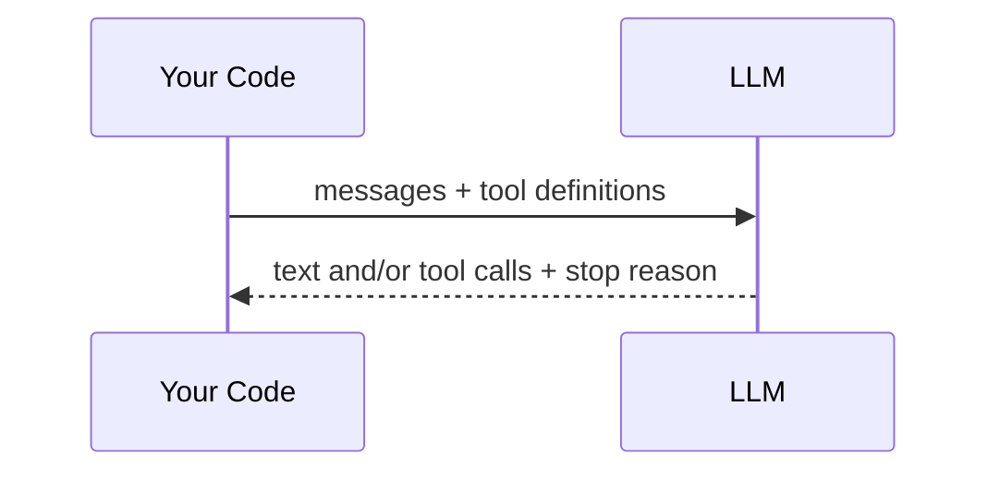
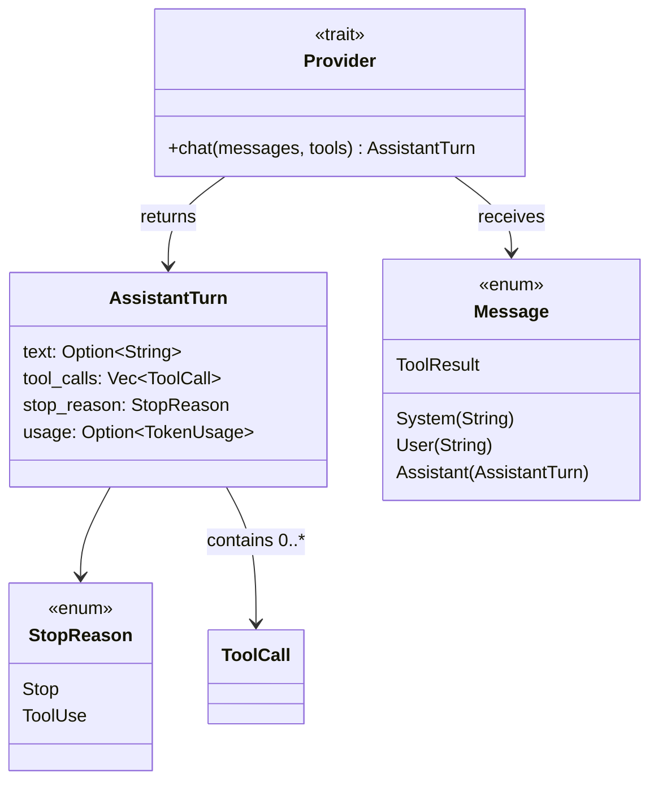

# Chapter 1: Your First LLM Call

> **File(s) to edit:** `src/mock.rs`
> **Test to run:** `cargo test -p mini-claw-code-starter test_ch1_`
> **Estimated time:** 15 min

Before building an agent, you need to talk to an LLM. In this chapter you will implement a `MockProvider` — a fake LLM that returns canned responses. No API key, no HTTP, no network. Just the protocol.

## Goal

Implement `MockProvider` so that:

1. You create it with a `VecDeque<AssistantTurn>` of canned responses.
2. Each call to `chat()` returns the next response in sequence.
3. If all responses have been consumed, it returns an error.

## The protocol

Every LLM interaction follows the same pattern:



You send messages and a list of available tools. The LLM responds with text, tool calls, or both — plus a `StopReason` telling you what to do next.

In Rust, that is one trait with one method:

```rust
pub trait Provider: Send + Sync {
    fn chat(
        &self,
        messages: &[Message],
        tools: &[&ToolDefinition],
    ) -> impl Future<Output = anyhow::Result<AssistantTurn>> + Send;
}
```

## The core types

Open `mini-claw-code-starter/src/types.rs`. These types are already defined for you — read them to understand the protocol:



The LLM responds with an `AssistantTurn`:

```rust
pub struct AssistantTurn {
    pub text: Option<String>,          // what the LLM said
    pub tool_calls: Vec<ToolCall>,     // tools it wants to call
    pub stop_reason: StopReason,       // Stop or ToolUse
    pub usage: Option<TokenUsage>,     // token counts (optional)
}
```

Two outcomes:
- **`StopReason::Stop`** — the LLM is done, read `text` for the answer
- **`StopReason::ToolUse`** — the LLM wants to call tools, read `tool_calls`

That's it. Every coding agent — Claude Code, Cursor, Copilot — runs on this exact protocol.

## Key Rust concept: `Mutex` for interior mutability

The `Provider` trait takes `&self` (not `&mut self`) because providers are shared across async tasks. But `MockProvider` needs to mutate its response queue. The solution is `Mutex<VecDeque<AssistantTurn>>` — it lets you mutate the queue through a shared reference.

```rust
pub struct MockProvider {
    responses: Mutex<VecDeque<AssistantTurn>>,
}
```

This pattern — `Mutex` around shared state in a `&self` method — appears throughout async Rust.

## The implementation

Open `src/mock.rs`. You'll see the struct definition and two stubs.

### Step 1: `new()`

Wrap the `VecDeque` in a `Mutex`:

```rust
pub fn new(responses: VecDeque<AssistantTurn>) -> Self {
    Self {
        responses: Mutex::new(responses),
    }
}
```

### Step 2: `chat()`

Lock the mutex, pop the front response, convert `None` to an error:

```rust
async fn chat(
    &self,
    _messages: &[Message],
    _tools: &[&ToolDefinition],
) -> anyhow::Result<AssistantTurn> {
    self.responses
        .lock()
        .unwrap()
        .pop_front()
        .ok_or_else(|| anyhow::anyhow!("MockProvider: no more responses"))
}
```

Three lines of logic. The mock ignores `messages` and `tools` entirely — it just returns the next canned response.

## Run the tests

```bash
cargo test -p mini-claw-code-starter test_ch1_
```

14 tests verify your mock:
- **`test_ch1_returns_text`** — basic text response
- **`test_ch1_returns_tool_calls`** — response with tool calls
- **`test_ch1_steps_through_sequence`** — FIFO order across multiple calls
- **`test_ch1_empty_responses_exhausted`** — error when queue is empty
- **`test_ch1_ignores_messages_and_tools`** — mock doesn't look at inputs
- **`test_ch1_long_sequence`** — 10 responses consumed in order

## What just happened

You implemented the `Provider` trait — the interface every LLM backend must satisfy. The `MockProvider` is your testing workhorse. Every test in this entire course uses it instead of calling a real API.

Later (Chapter 5) you'll see `OpenRouterProvider`, which makes real HTTP calls. But the trait is the same. Swap the provider, and the rest of the code doesn't change.

## Key takeaway

An LLM is a function: `messages in → (text, tool_calls, stop_reason) out`. Everything else is plumbing.

---

[← Contents](./ch00-overview.md) · [Chapter 2: Your First Tool Call →](./ch02-first-tool.md)
