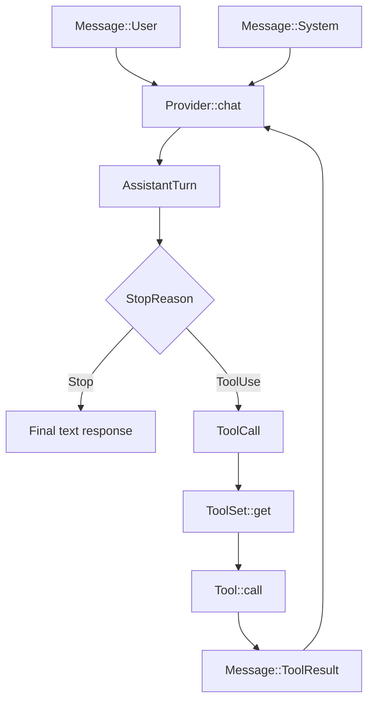

# Chapter 1: Messages & Types

> **File(s) to edit:** `src/types.rs` (pre-filled in starter)
> **Test to run:** `cargo test -p mini-claw-code-starter test_ch1_`

## Goal

- Define the `Message` enum with four variants (`System`, `User`, `Assistant`, `ToolResult`) so that every conversation participant has a typed representation.
- Implement the `ToolDefinition` builder so that tools can describe their JSON Schema parameters without hand-writing JSON.
- Implement `ToolSet` so that the agent can register and look up tools by name at runtime.
- Define the `Provider` trait using RPITIT so that any LLM backend can be swapped in without changing agent code.

Every coding agent is, at its core, a loop over a conversation. The user speaks, the model replies, tools produce results, and those results go back to the model. Before we can build that loop, we need a type system that represents every participant and every kind of payload in the conversation.

In this chapter you will implement the foundational types that the rest of the codebase depends on. By the end, `cargo test -p mini-claw-code-starter test_ch1_` should pass.

## How the types connect



## Why a rich message type?

If you look at a raw LLM API (OpenAI, Anthropic), messages are JSON blobs with a `role` field: `"system"`, `"user"`, or `"assistant"`. That is fine for a one-shot chatbot, but a coding agent needs more:

- **Tool results** that carry the ID of the tool call they answer, so the model can correlate request and response.
- **System instructions** that configure the model's behavior.

Claude Code models all of these as variants of a single `Message` enum. Our starter uses a simplified version with four variants.

## File layout

All types live in a single file: `src/types.rs`. This includes the `Message` enum, `AssistantTurn`, `ToolDefinition`, `ToolCall`, `Tool` trait, `ToolSet`, `Provider` trait, `TokenUsage`, and `StopReason`.

---

## 1.1 The Message enum

Here is the full enum with its four variants:

```rust
pub enum Message {
    System(String),
    User(String),
    Assistant(AssistantTurn),
    ToolResult { id: String, content: String },
}
```

The starter uses plain enum variants instead of wrapper structs. There are no message IDs, no serde tags, no constructors -- you construct variants directly:

```rust
let msg = Message::User("Hello".to_string());
let sys = Message::System("You are a helpful assistant".to_string());
let result = Message::ToolResult {
    id: call_id.clone(),
    content: "file contents here".to_string(),
};
```

Let's walk through each variant.

### System

```rust
Message::System(String)
```

System messages carry instructions injected by the agent, not typed by the user. They configure the model's behavior (e.g., "You are a coding assistant").

### User

```rust
Message::User(String)
```

Straightforward -- the human's input. One message per turn.

### Assistant

```rust
Message::Assistant(AssistantTurn)
```

This is the richest variant. The model's response is wrapped in an `AssistantTurn` struct (described below). The model can return text, tool calls, or both.

### ToolResult

```rust
Message::ToolResult { id: String, content: String }
```

After the agent executes a tool, it packages the output into a `ToolResult` variant and appends it to the conversation. The `id` field links this result back to the specific `ToolCall` it answers -- without this, the model cannot correlate which result belongs to which call when multiple tools run in a single turn.

Note that in the starter, tool results are simple strings. There is no `is_truncated` flag or separate struct.

---

## 1.2 AssistantTurn

The assistant's response is captured in an `AssistantTurn` struct:

```rust
pub struct AssistantTurn {
    pub text: Option<String>,
    pub tool_calls: Vec<ToolCall>,
    pub stop_reason: StopReason,
    pub usage: Option<TokenUsage>,
}
```

The model can return text, tool calls, or both. `text` is `Option<String>` because when the model decides to use a tool, it may produce no human-readable text at all -- it just emits one or more `ToolCall` entries. The `stop_reason` tells the agent loop whether to execute tools and continue, or to present the response to the user and stop.

The `usage` field is `Option<TokenUsage>` because we attach token counts at parse time from the API response. Mock providers in tests may leave it as `None`.

---

## 1.3 StopReason

```rust
pub enum StopReason {
    /// The model finished — check `text` for the response.
    Stop,
    /// The model wants to use tools — check `tool_calls`.
    ToolUse,
}
```

This tiny enum drives the entire agent loop. When the provider parses the LLM response:

- **`Stop`** means the model is done -- its `text` field contains the final answer for the user.
- **`ToolUse`** means the model wants to invoke tools -- the agent should look at `tool_calls`, execute them, append the results, and call the provider again.

The agent loop uses `match` on `stop_reason` to decide whether to break or continue.

---

## 1.4 ToolCall

```rust
pub struct ToolCall {
    pub id: String,
    pub name: String,
    pub arguments: Value,
}
```

When the LLM responds with `StopReason::ToolUse`, it includes one or more `ToolCall` entries. Each has:

- **`id`** -- a unique identifier assigned by the API (e.g., `"call_abc123"`). This is what `ToolResultMessage::tool_use_id` references.
- **`name`** -- which tool to invoke (e.g., `"bash"`, `"read"`, `"edit"`).
- **`arguments`** -- a JSON object whose shape matches the tool's parameter schema.

The agent loop uses `name` to look up the tool in the `ToolSet`, passes `arguments` to `tool.call()`, and wraps the output in a `Message::ToolResult` whose `id` matches the `ToolCall`'s `id`.

---

## 1.5 ToolDefinition and the builder pattern

### Rust concept: the builder pattern

The `ToolDefinition` uses the *builder pattern* -- a common Rust idiom where
methods take `self` by value and return `Self`, enabling method chaining like
`.param(...).param(...)`. Each call consumes the struct and returns a modified
version. This works because Rust's move semantics mean there is no overhead --
no cloning, no reference counting. The compiler optimizes the chain into a
series of in-place mutations. You will see this pattern throughout the codebase:
`ToolSet::new().with(tool1).with(tool2)`, `SimpleAgent::new(provider).tool(bash)`.

Every tool must describe itself to the LLM with a JSON Schema so the model knows what parameters are available. `ToolDefinition` holds this schema and provides a builder API for constructing it without hand-writing JSON:

```rust
pub struct ToolDefinition {
    pub name: &'static str,
    pub description: &'static str,
    pub parameters: Value,
}
```

The constructor initializes an empty object schema:

```rust
impl ToolDefinition {
    pub fn new(name: &'static str, description: &'static str) -> Self {
        Self {
            name,
            description,
            parameters: serde_json::json!({
                "type": "object",
                "properties": {},
                "required": []
            }),
        }
    }
}
```

### `.param()` -- add a simple parameter

```rust
pub fn param(
    mut self,
    name: &str,
    type_: &str,
    description: &str,
    required: bool,
) -> Self {
    self.parameters["properties"][name] = serde_json::json!({
        "type": type_,
        "description": description
    });
    if required {
        self.parameters["required"]
            .as_array_mut()
            .unwrap()
            .push(Value::String(name.to_string()));
    }
    self
}
```

This is the workhorse. Most tool parameters are simple types -- a `"string"` for a file path, a `"number"` for a line offset. The builder takes `self` by value and returns it, enabling chained calls:

```rust
ToolDefinition::new("read", "Read a file from disk")
    .param("path", "string", "Absolute path to the file", true)
    .param("offset", "number", "Line number to start reading from", false)
    .param("limit", "number", "Maximum number of lines to read", false)
```

### `.param_raw()` -- add a complex parameter

```rust
pub fn param_raw(
    mut self,
    name: &str,
    schema: Value,
    required: bool,
) -> Self {
    self.parameters["properties"][name] = schema;
    if required {
        self.parameters["required"]
            .as_array_mut()
            .unwrap()
            .push(Value::String(name.to_string()));
    }
    self
}
```

Some parameters need richer schemas -- enums, arrays, nested objects. `param_raw` lets you pass an arbitrary `serde_json::Value` as the schema. For example, an edit tool might define:

```rust
.param_raw("changes", serde_json::json!({
    "type": "array",
    "items": {
        "type": "object",
        "properties": {
            "old_string": { "type": "string" },
            "new_string": { "type": "string" }
        }
    }
}), true)
```

**Implement `ToolDefinition`** in `src/types.rs`, then verify:

```bash
cargo test -p mini-claw-code-starter test_ch1_tool_definition_builder
cargo test -p mini-claw-code-starter test_ch1_tool_definition_optional_param
```

---

## 1.6 The Tool trait

This is the central abstraction. Every tool -- Bash, Read, Write, Edit -- implements this trait:

```rust
#[async_trait::async_trait]
pub trait Tool: Send + Sync {
    fn definition(&self) -> &ToolDefinition;
    async fn call(&self, args: Value) -> anyhow::Result<String>;
}
```

Just two required methods -- this is deliberately minimal:

**`definition()`** returns the tool's schema. This is called once when registering tools and whenever the agent needs to send tool definitions to the LLM. It returns a reference (`&ToolDefinition`) because the definition is static for the lifetime of the tool.

**`call()`** is the execution entry point. It receives the JSON arguments the LLM provided and returns a `String` result (or an error). This is `async` because most tools do I/O -- reading files, running subprocesses, making HTTP requests.

Note that `call()` returns `anyhow::Result<String>` -- not a `ToolResult` struct. The starter simplifies tool output to plain strings. If a tool fails, you can return `Ok(format!("error: {e}"))` to let the model see the error and recover, or return `Err(e)` for unrecoverable situations.

The trait is marked `Send + Sync` (required by `#[async_trait]` for object safety) so tools can be stored in the `ToolSet` and called from async contexts. The `#[async_trait]` macro desugars `async fn call(...)` into a method returning `Pin<Box<dyn Future>>`, which is needed because `ToolSet` stores tools as `Box<dyn Tool>`. You do not need to implement any concrete tools yet -- that comes in later chapters.

---

## 1.7 ToolSet

The agent needs to look up tools by name when the LLM requests a tool call. `ToolSet` is a `HashMap`-backed registry:

```rust
pub struct ToolSet {
    tools: HashMap<String, Box<dyn Tool>>,
}
```

The key methods:

```rust
impl ToolSet {
    pub fn new() -> Self {
        Self { tools: HashMap::new() }
    }

    /// Builder-style: add a tool and return self.
    pub fn with(mut self, tool: impl Tool + 'static) -> Self {
        self.push(tool);
        self
    }

    /// Add a tool, keyed by its definition name.
    pub fn push(&mut self, tool: impl Tool + 'static) {
        let name = tool.definition().name.to_string();
        self.tools.insert(name, Box::new(tool));
    }

    /// Look up a tool by name.
    pub fn get(&self, name: &str) -> Option<&dyn Tool> {
        self.tools.get(name).map(|t| t.as_ref())
    }

    /// Collect all tool schemas for the provider.
    pub fn definitions(&self) -> Vec<&ToolDefinition> {
        self.tools.values().map(|t| t.definition()).collect()
    }
}

impl Default for ToolSet {
    fn default() -> Self {
        Self::new()
    }
}
```

A few design points:

- **`with()` enables builder-style chaining**: `ToolSet::new().with(ReadTool::new()).with(BashTool::new())`.
- **`push()` extracts the name from the tool's definition**, so you never pass the name manually -- one source of truth.
- **`definitions()`** collects all schemas into a `Vec` that the provider sends to the LLM at the start of each turn.
- **`Box<dyn Tool>`** is the trait object that makes heterogeneous storage possible. The `'static` bound on `push`/`with` ensures the tool lives long enough.

```bash
cargo test -p mini-claw-code-starter test_ch1_toolset_empty
```

---

## 1.8 TokenUsage

LLM APIs report token counts with each response. Tracking these is useful for cost awareness and debugging.

```rust
#[derive(Debug, Clone, Default)]
pub struct TokenUsage {
    pub input_tokens: u64,
    pub output_tokens: u64,
}
```

The starter uses a simplified `TokenUsage` with just input and output token counts. It is stored as `Option<TokenUsage>` in `AssistantTurn` -- mock providers in tests set it to `None`, while the real `OpenRouterProvider` populates it from the API response.

```bash
cargo test -p mini-claw-code-starter test_ch1_token_usage_default
```

---

## 1.9 The Provider trait

### Rust concept: RPITIT (return-position impl Trait in traits)

The `Provider` trait uses a feature stabilized in Rust 1.75 called RPITIT. Instead of `async fn chat(...)`, we write `fn chat(...) -> impl Future<...> + Send + 'a`. This lets the compiler generate a unique, zero-cost future type for each implementation -- no heap allocation, no `Box<dyn Future>`. The trade-off is that RPITIT makes the trait *not object-safe*: you cannot write `Box<dyn Provider>`. That is fine here because providers are always used as generic parameters (`struct SimpleAgent<P: Provider>`), not as trait objects.

The `Provider` trait is also defined in `src/types.rs`. It abstracts over any LLM backend:

```rust
pub trait Provider: Send + Sync {
    fn chat<'a>(
        &'a self,
        messages: &'a [Message],
        tools: &'a [&'a ToolDefinition],
    ) -> impl Future<Output = anyhow::Result<AssistantTurn>> + Send + 'a;
}
```

This uses RPITIT (return-position `impl Trait` in traits) instead of `#[async_trait]`. The `Provider` is always used as a generic parameter (`P: Provider`), never as `dyn Provider`, so we do not need object safety and can avoid the heap allocation that `async_trait` requires.

A blanket impl lets `Arc<P>` also be a `Provider`, which is needed later for sharing a provider between an agent and its subagents:

```rust
impl<P: Provider> Provider for Arc<P> { ... }
```

We will implement the `MockProvider` and `OpenRouterProvider` in Chapter 2.

---

## Putting it all together

After implementing `src/types.rs`, run the full chapter test suite:

```bash
cargo test -p mini-claw-code-starter test_ch1_
```

### What the tests verify

- **`test_ch1_message_user`** -- constructs a `Message::User` and verifies it holds the expected string
- **`test_ch1_message_system`** -- constructs a `Message::System` and verifies it holds the expected string
- **`test_ch1_message_tool_result`** -- constructs a `Message::ToolResult` and verifies both `id` and `content` are correct
- **`test_ch1_assistant_turn`** -- builds an `AssistantTurn` with text and verifies `stop_reason` is `Stop`
- **`test_ch1_tool_definition_builder`** -- uses the builder to add parameters and verifies the resulting JSON schema has the correct structure
- **`test_ch1_tool_definition_optional_param`** -- adds an optional parameter and verifies it does not appear in the `required` array
- **`test_ch1_toolset_empty`** -- creates an empty `ToolSet` and verifies `get()` returns `None` for any name
- **`test_ch1_token_usage_default`** -- verifies that `TokenUsage::default()` initializes both counters to zero

## What you built

This chapter established the type vocabulary for the entire agent:

- **`Message`** -- a four-variant enum carrying every kind of conversation entry: system instructions, user input, assistant responses, and tool results.
- **`AssistantTurn`** -- the model's response, containing optional text, tool calls, a stop reason, and optional token usage.
- **`StopReason`** -- the binary signal that drives the agent loop: keep going or stop.
- **`ToolDefinition`** -- a builder for JSON Schema tool descriptions that the LLM uses to understand what tools are available.
- **`ToolCall`** -- the request side of tool execution, linked by ID to `Message::ToolResult`.
- **`Tool` trait** -- the minimal async interface every tool must implement: `definition()` and `call()`.
- **`ToolSet`** -- a `HashMap`-backed registry for looking up tools by name at runtime.
- **`Provider` trait** -- the async LLM abstraction, generic over any backend.
- **`TokenUsage`** -- per-request token tracking.

## Key takeaway

The entire agent -- tools, providers, the loop itself -- is built on the vocabulary defined in this chapter. Getting these types right (especially the `Message` enum and `StopReason`) determines whether the agent loop is simple or tangled. The types are the contract; everything else is implementation.

None of these types do anything on their own -- they are the nouns of the system. In the next chapter, we will implement the `MockProvider` and `OpenRouterProvider`, giving these types their first verbs.
