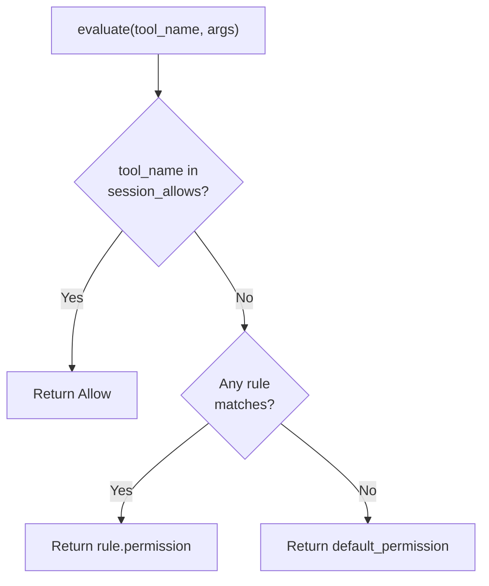

# Chapter 10: Permission Engine

> **File(s) to edit:** `src/permissions.rs`
> **Test to run:** `cargo test -p mini-claw-code-starter test_ch19`

Your agent does whatever the LLM tells it to.

Think about that for a moment. In Chapters 1-9 you built a fully functional coding agent with several tools. The LLM can read files, write files, edit files, and execute arbitrary shell commands. The SimpleAgent dutifully dispatches every tool call the model requests. If the model says `bash("rm -rf /")`, the agent runs it. If it writes garbage over your source files, the agent writes. If it decides to `curl | sh` something from the internet, the agent curls. There is nothing between the LLM's request and the tool's execution.

This is fine for a tutorial. It is not fine for software you run on your actual codebase.

Chapter 10 changes that. We build the `PermissionEngine` -- the gatekeeper that evaluates every tool call before it executes. It sits between the SimpleAgent and the tools, and for each call it returns one of three answers: allow it silently, deny it, or ask the user for approval. The decision depends on configured rules, a default permission, and whether the user has already approved this tool during the session.

This is the first chapter of Part III: Safety & Control. By the end of it, your agent will no longer blindly obey the LLM. It will ask permission first.

```bash
cargo test -p mini-claw-code-starter test_ch19
```

## Goal

- Implement `PermissionRule::matches()` using `glob::Pattern` so rules can match tool names with wildcards (e.g., `"mcp__*"` matches all MCP tools).
- Build the `PermissionEngine` with its three-stage evaluation pipeline: session approvals, then ordered rules, then default permission.
- Provide convenience constructors (`ask_by_default`, `allow_all`) for common configurations.
- Record session approvals so that once a user approves a tool, it stays approved for the rest of the session.

---

## The problem: a spectrum of trust

Not every tool call is equally risky. Reading a file is harmless. Writing a file is recoverable (you can revert with git). Running `rm -rf /` is catastrophic. A good permission system should treat these differently.

At the same time, not every user wants the same level of control. Some users want to approve every action. Some want to approve only dangerous ones. Some are running automated pipelines and want no prompts at all. And some are in planning mode, where the agent should only observe, never modify.

This gives us two dimensions to work with:

1. **Tool risk level** -- How dangerous is this tool?
2. **User trust level** -- How much control does the user want? (The permission rules and default permission.)

The permission engine combines both dimensions into a single decision. Rules match tool names using glob patterns, and a default permission applies when no rule matches. This gives users fine-grained control over which tools require approval.

---

## Permission types

The permission system introduces several new types in `src/permissions.rs`. Let's walk through each one.

### Permission: the decision

```rust
#[derive(Debug, Clone, PartialEq)]
pub enum Permission {
    /// Tool call is allowed without asking.
    Allow,
    /// Tool call is blocked without asking.
    Deny,
    /// User must be prompted for approval.
    Ask,
}
```

Three variants, one for each possible outcome. `Allow` means execute immediately -- no prompt, no delay. `Deny` means block the call entirely -- the tool never runs. `Ask` means pause and show the user a prompt.

In the starter, `Deny` and `Ask` are unit variants with no string payload. The caller is responsible for providing context to the user or the model when a tool call is denied or needs approval.

### PermissionRule: matching tool names

```rust
#[derive(Debug, Clone)]
pub struct PermissionRule {
    /// Glob pattern matching tool names (e.g. "bash", "write", "*").
    pub tool_pattern: String,
    /// The permission to assign when the pattern matches.
    pub permission: Permission,
}
```

Rules let users assign permissions to specific tools. A `PermissionRule` matches tool names with a glob pattern (using the `glob::Pattern` crate) and assigns a permission: always allow, always deny, or always ask.

For example, you might add a rule that allows `write` without prompting -- because you trust the model with file writes in this particular project. Or you might add a rule that denies `bash` entirely -- because this is a read-heavy analysis task and you want to prevent any command execution.

The `matches()` method uses `glob::Pattern` for matching:

```rust
impl PermissionRule {
    pub fn new(tool_pattern: impl Into<String>, permission: Permission) -> Self {
        Self {
            tool_pattern: tool_pattern.into(),
            permission,
        }
    }

    /// Check if this rule matches a tool name.
    /// Uses glob::Pattern for pattern matching, falling back to
    /// exact string comparison if the pattern is invalid.
    pub fn matches(&self, tool_name: &str) -> bool {
        // Your implementation: use glob::Pattern::new(&self.tool_pattern)
        unimplemented!()
    }
}
```

Rules take priority over the default permission. This is the key design principle: specific overrides beat general policies.

---

## The PermissionEngine

With the types defined, we can build the engine itself. Open `src/permissions.rs`:

```rust
pub struct PermissionEngine {
    rules: Vec<PermissionRule>,
    default_permission: Permission,
    /// Session-level overrides (tool calls the user has already approved).
    session_allows: std::collections::HashSet<String>,
}
```

Three fields:

- **`rules`** -- An ordered list of permission rules. First match wins.
- **`default_permission`** -- The fallback permission when no rule matches. Typically `Permission::Ask` for interactive use or `Permission::Allow` for bypass mode.
- **`session_allows`** -- A set of tool names the user has approved during this session.

The constructors provide common configurations:

```rust
impl PermissionEngine {
    pub fn new(rules: Vec<PermissionRule>, default_permission: Permission) -> Self {
        // Your implementation: store rules, default_permission, and empty session_allows HashSet
        unimplemented!()
    }

    /// Create an engine that asks for everything by default.
    pub fn ask_by_default(rules: Vec<PermissionRule>) -> Self {
        Self::new(rules, Permission::Ask)
    }

    /// Create an engine that allows everything (no permission checks).
    pub fn allow_all() -> Self {
        Self::new(vec![], Permission::Allow)
    }
}
```

`ask_by_default()` is the standard interactive configuration -- every tool that is not covered by a rule prompts the user. `allow_all()` is the bypass mode -- no rules, no prompts. Session approvals start empty and accumulate as the user interacts with the agent.

---

## The evaluate pipeline

The core of the engine is the `evaluate` method. It takes a tool name and the tool arguments, and returns a `Permission`. The pipeline has three stages, evaluated in order. The first stage that produces a definitive answer wins.



```rust
pub fn evaluate(&self, tool_name: &str, _args: &Value) -> Permission {
    // Stage 1: session approvals
    if self.session_allows.contains(tool_name) {
        return Permission::Allow;
    }

    // Stage 2: rules in order (first match wins)
    for rule in &self.rules {
        if rule.matches(tool_name) {
            return rule.permission.clone();
        }
    }

    // Stage 3: default
    self.default_permission.clone()
}
```

Let's walk through each stage.

### Stage 1: Session approvals

```rust
if self.session_allows.contains(tool_name) {
    return Permission::Allow;
}
```

If the user has already approved this tool during the current session, allow it immediately. Session approvals are recorded when the user says "yes" to an `Ask` prompt. Once approved, the tool runs without prompting for the rest of the session.

Session approvals are per-tool, not global. Approving `write` does not approve `bash`. This is deliberate -- the user should make a conscious choice for each tool they trust.

### Stage 2: Permission rules

```rust
for rule in &self.rules {
    if rule.matches(tool_name) {
        return rule.permission.clone();
    }
}
```

If no session approval matched, we check the configured rules. Rules are evaluated in order -- the first rule whose `matches()` method returns true wins.

This is a critical design choice: **first match wins**. If you have two rules:

```
1. bash  -> Deny
2. *     -> Allow
```

Then `bash` hits rule 1 and is denied. Everything else hits rule 2 and is allowed. If the order were reversed, rule 2 would match everything first and rule 1 would never fire.

The `matches()` method uses `glob::Pattern` for matching, which gives you more expressive patterns than simple string comparison. `"bash"` matches only `"bash"`. `"*"` matches everything. `"file_*"` matches `"file_read"`, `"file_write"`, etc.

### Stage 3: Default permission

```rust
self.default_permission.clone()
```

If no session approval matched and no rule matched, fall back to the default permission set at construction time. For `ask_by_default()`, this is `Permission::Ask`. For `allow_all()`, this is `Permission::Allow`.

---

### Key Rust concept: the `glob::Pattern` crate

The `glob` crate provides filesystem-style pattern matching. `glob::Pattern::new("mcp__*")` compiles a pattern, and `.matches("mcp__fs__read")` tests a string against it. The key operators are `*` (match any sequence of characters), `?` (match any single character), and `[abc]` (match any character in the set). Unlike regex, glob patterns are intentionally simple -- they match whole strings, not substrings, and have no backtracking. This makes them fast and easy to reason about for tool name matching.

The `Pattern::new()` call returns a `Result` because the pattern string might be syntactically invalid (e.g., an unclosed bracket). The fallback to exact string comparison handles this edge case gracefully.

---

## Pattern matching with glob

The `PermissionRule::matches()` method uses the `glob` crate for pattern matching:

```rust
pub fn matches(&self, tool_name: &str) -> bool {
    glob::Pattern::new(&self.tool_pattern)
        .map(|p| p.matches(tool_name))
        .unwrap_or(self.tool_pattern == tool_name)
}
```

Two cases:

- **Valid glob pattern** -- `glob::Pattern::new()` succeeds. The pattern is matched against the tool name using glob semantics: `"*"` matches everything, `"file_*"` matches `"file_read"`, `"file_write"`, etc., and `"bash"` matches only `"bash"`.
- **Invalid glob** -- Falls back to exact string comparison. This is a safety net -- in practice, tool name patterns are simple and always valid.

Using `glob::Pattern` instead of hand-rolled matching gives us full glob semantics -- character classes (`[abc]`), alternatives, and proper wildcard handling -- with no custom code.

---

## Session approvals

When `evaluate` returns `Permission::Ask`, the caller (typically the SimpleAgent or UI layer) prompts the user. If the user says yes, the caller records the approval:

```rust
pub fn record_session_allow(&mut self, tool_name: &str) {
    self.session_allows.insert(tool_name.to_string());
}
```

Subsequent calls to `evaluate` for the same tool will find it in the `session_allows` set (stage 1) and return `Permission::Allow` without prompting again.

The engine also provides convenience methods for checking permission outcomes:

```rust
pub fn is_allowed(&self, tool_name: &str, args: &Value) -> bool {
    matches!(self.evaluate(tool_name, args), Permission::Allow)
}

pub fn needs_approval(&self, tool_name: &str, args: &Value) -> bool {
    matches!(self.evaluate(tool_name, args), Permission::Ask)
}
```

Three properties of session approvals are worth emphasizing:

1. **Per-tool, not global.** Approving `write` does not approve `bash`. Each tool is a separate trust decision.
2. **Session-scoped, not persistent.** Approvals live in memory and vanish when the process exits. There is no file, no database, no persistence. If you restart the agent, you start with a clean slate.
3. **Above rules in priority.** In the starter, session approvals are checked first (stage 1), so an approval overrides any rule. This is a deliberate simplification -- once the user says yes, the tool is approved for the session regardless of rules.

---

## Putting it all together: a complete trace

Let's trace through a realistic scenario to see how the pipeline works end to end.

A user starts the agent with `ask_by_default` and one rule: `write` is always allowed.

```rust
let engine = PermissionEngine::ask_by_default(vec![
    PermissionRule::new("write", Permission::Allow),
]);
```

Now the LLM makes three tool calls in sequence. Here is what happens at each one:

**Call 1: `read("src/main.rs")`**

```
Stage 1: "read" not in session_allows. -> continue
Stage 2: Rule "write" does not match "read". No more rules. -> continue
Stage 3: Default permission is Ask. -> Ask
```

Result: `Ask`. The UI prompts the user. (Note: in the starter there are no `is_read_only()` flags on tools, so read tools go through the same pipeline as any other tool.)

**Call 2: `write("src/main.rs", ...)`**

```
Stage 1: "write" not in session_allows. -> continue
Stage 2: Rule "write" matches "write". Permission: Allow. -> Allow
```

Result: `Allow`. The write executes silently -- the rule overrides what the default permission would normally do (ask the user).

**Call 3: `bash("cargo test")`**

```
Stage 1: "bash" not in session_allows. -> continue
Stage 2: Rule "write" does not match "bash". No more rules. -> continue
Stage 3: Default permission is Ask. -> Ask
```

Result: `Ask`. The UI prompts the user. If the user approves, the caller calls `engine.record_session_allow("bash")`, and subsequent bash calls will be allowed via stage 1.

---

## How the engine integrates with the SimpleAgent

The `PermissionEngine` is designed to be called from inside the SimpleAgent's tool execution flow. The integration point is conceptually simple:

```
For each tool call from the LLM:
    1. Look up the tool in the ToolSet
    2. Call permission_engine.evaluate(tool_name, args)
    3. Match on the Permission:
       - Allow  -> execute the tool
       - Deny   -> return an error string to the LLM
       - Ask    -> prompt the user, then execute or deny
```

We will wire this up fully in later chapters. For now, the `PermissionEngine` is a standalone component with a clean interface: give it a tool name and arguments, get back a decision. This separation makes it testable in isolation -- which is exactly what the chapter 10 tests do.

---

## How Claude Code does it

Claude Code's permission system follows the same architecture but with more granularity.

**Permission modes.** Claude Code has the same core modes -- a default interactive mode, an auto-approve mode, and a plan mode. The mode is set via CLI flags (`--dangerously-skip-permissions` for bypass, `--plan` for plan mode) or interactively during the session.

**Tool groups.** Rather than individual tool flags, Claude Code organizes tools into permission groups. File tools, git tools, shell tools, and MCP tools each have group-level policies. A single rule can allow or deny an entire group. Our glob-based tool patterns achieve a similar effect with patterns like `"file_*"`.

**Per-path rules.** Claude Code's rules can match not just tool names but also tool arguments -- specifically file paths. A rule like "allow write to `src/**`" permits writes within the source directory but blocks writes elsewhere. Our rules match only on tool names, which is simpler but less precise.

**Session approvals.** Claude Code's session approval system works the same way -- once the user approves a tool, it stays approved for the session. The approval is per-tool-name, stored in memory, and cleared on session reset.

**Layered evaluation.** The evaluation pipeline is the same: check session approvals, then match rules, then fall back to defaults. The ordering ensures that specific policies override general ones, just as in our implementation.

The core insight is the same in both systems: the permission engine is a function from `(rules, session_state, default_permission)` to `Permission`. It does not execute tools. It does not modify state (except session approvals). It just answers the question: should this tool call proceed?

---

## Tests

Run the permission engine tests:

```bash
cargo test -p mini-claw-code-starter test_ch19
```

Note: The permission engine tests are in `test_ch19`, following the V1 chapter
numbering where permissions were Chapter 19.

Key tests:

- **test_ch19_allow_all** -- `allow_all()` returns `Allow` for every tool, confirming bypass mode works.
- **test_ch19_ask_by_default** -- `ask_by_default()` with no rules returns `Ask` for any tool.
- **test_ch19_rule_matching** -- Three explicit rules for `read`, `bash`, and `write` return their respective permissions.
- **test_ch19_glob_pattern** -- A glob rule `"mcp__*"` matches `"mcp__fs__read"` but not `"read"`.
- **test_ch19_first_rule_wins** -- Two rules for `"bash"` (Allow then Deny); first match wins, so Allow is returned.
- **test_ch19_session_allow** -- After `record_session_allow("bash")`, a tool that previously returned Ask now returns Allow.
- **test_ch19_session_allow_per_tool** -- Approving `"read"` does not approve `"write"` -- session approvals are per-tool.
- **test_ch19_is_allowed** / **test_ch19_needs_approval** -- Convenience methods correctly reflect the underlying `evaluate()` result.
- **test_ch19_wildcard_rule** -- A `"*"` rule overrides the default permission for all tools.
- **test_ch19_deny_overrides_default** -- A Deny rule for `"dangerous"` blocks it even when the default is Allow.

---

## Key takeaway

The permission engine is a pure function from `(tool_name, rules, session_state, default)` to `Permission`. It does not execute tools or interact with the user -- it just answers the question "should this proceed?" This separation makes it trivially testable and reusable across different UI contexts.

---

## Recap

In this chapter you built the `PermissionEngine` -- the gatekeeper between the LLM's requests and your tools. The key ideas:

- **Three outcomes** -- `Allow`, `Deny`, `Ask`. Every tool call gets one of these before it runs.
- **Ordered pipeline** -- Session approvals first, then rules, then default permission. Specific policies beat general ones.
- **Glob-pattern rules** -- Rules use `glob::Pattern` for tool name matching. The first matching rule wins. This gives users fine-grained control over which tools require approval.
- **Session approvals** -- Once the user says yes, that tool is approved for the session. Per-tool, in-memory, not persistent.
- **Convenience constructors** -- `ask_by_default()` for interactive use, `allow_all()` for bypass mode.

The engine is pure logic -- it does not execute tools, and it does not interact with the user. It takes a tool name and arguments, and returns a decision. This separation makes it testable, composable, and easy to reason about.

---

## What's next

The permission engine decides *whether* a tool call should run based on who the tool is and what mode the user is in. But it does not look at *what the tool is being asked to do*. A bash tool is bash whether it runs `ls` or `rm -rf /`. A write tool is a write tool whether it targets `src/main.rs` or `.env`.

Chapter 11 adds safety checks -- static analysis of tool arguments that catches dangerous patterns before the permission prompt even appears. It validates paths against allowed directories, matches filenames against protected patterns (`.env`, `.git/config`), and filters bash commands for blocked patterns (`rm -rf /`, `sudo`, fork bombs). Safety checks wrap tools so that dangerous calls are blocked before they execute.
