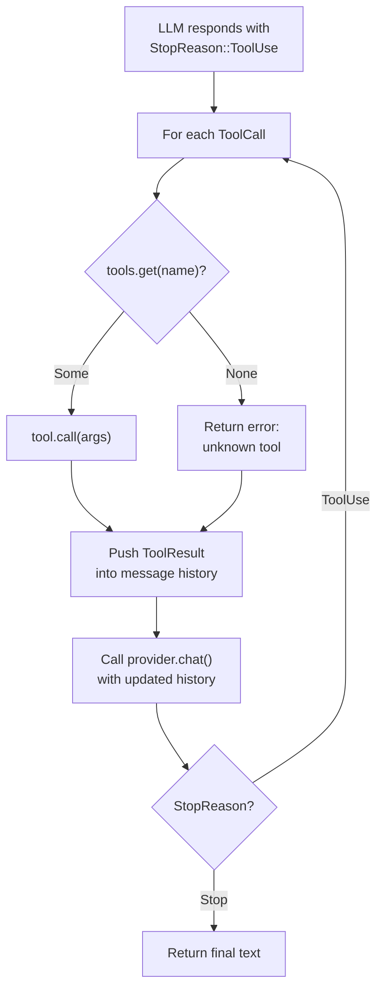

# Chapter 12: Tool Registry

> **File(s) to edit:** `src/types.rs` (ToolSet)
> **Test to run:** `cargo test -p mini-claw-code-starter test_ch7_` (integration tests)
> **Estimated time:** 30 min

You have five tools. You have a `SimpleAgent`. This chapter wires them together.

## Goal

- Build a `default_tools()` helper that assembles all tools into a single `ToolSet` so the agent can discover and dispatch them by name.
- Wire the `ToolSet` to `SimpleAgent` so the LLM sees all tool schemas and the agent dispatches calls to the correct tool.
- Handle unknown tool calls gracefully by returning an error string that lets the LLM recover.
- Run the full integration test suite proving that real tools execute with real side effects inside the agent loop.

Over the past chapters you built the individual tools that let your agent interact with the world -- file reading and writing (Chapter 9), command execution (Chapter 10), and optionally pattern search (Chapter 11). Each tool implements the `Tool` trait, has a JSON schema, and returns a `String`. But they exist in isolation. The agent has no way to discover them, expose their schemas to the LLM, or dispatch calls by name.

The tool registry is the bridge. It holds every available tool in a single `ToolSet`, exposes their schemas to the LLM so it knows what it can call, and dispatches incoming tool calls to the correct implementation by name. By the end of this chapter, you will have a fully functional coding agent that can read, write, edit, and execute commands -- the complete tool loop, now with real tools instead of test doubles.

```bash
cargo test -p mini-claw-code-starter test_ch7_
```

---

## The module layout

All tool implementations live under `src/tools/`, one file per tool:

```
src/tools/
  mod.rs       -- re-exports everything
  ask.rs       -- AskTool (Chapter 14)
  bash.rs      -- BashTool
  edit.rs      -- EditTool
  read.rs      -- ReadTool
  write.rs     -- WriteTool
```

The `mod.rs` is a flat barrel file:

```rust
mod ask;
mod bash;
mod edit;
mod read;
mod write;

pub use ask::*;
pub use bash::BashTool;
pub use edit::EditTool;
pub use read::ReadTool;
pub use write::WriteTool;
```

Every tool is a separate file with a single public struct. The `mod.rs` re-exports the structs so downstream code can write `use crate::tools::{ReadTool, WriteTool}` without reaching into individual modules.

The flat structure is deliberate. There is no `tools/file/mod.rs` grouping `ReadTool`, `WriteTool`, and `EditTool` together. Why? Because tools are always referenced individually -- you register `ReadTool::new()`, not `FileTools::all()`. A flat module keeps the import paths short and the mental model simple. When you have 5 tools this is obviously fine. Claude Code has 40+ tools and still uses a similar flat layout -- each tool is its own module with a single export.

---

### Key Rust concept: trait objects and dynamic dispatch

The `ToolSet` stores tools as `Box<dyn Tool>` -- a trait object that erases the concrete type. This means `ReadTool`, `WriteTool`, `EditTool`, and `BashTool` all become the same type behind a pointer, despite having different implementations. The `HashMap<String, Box<dyn Tool>>` is the collection that makes this work: it maps tool names to trait objects, so the agent can look up any tool by its string name at runtime.

This is *dynamic dispatch*. When the agent calls `tool.call(args)`, the compiler does not know at compile time which `call()` method to invoke. It uses a vtable -- a function pointer table attached to the trait object -- to find the correct implementation at runtime. The cost is one pointer indirection per call, which is negligible compared to the I/O and network operations the tools perform.

---

## Building a ToolSet

The `ToolSet` you defined in Chapter 4 is a `HashMap<String, Box<dyn Tool>>` with a builder API. Now we use it for real. Here is a helper function that assembles the standard tool set:

```rust
fn default_tools() -> ToolSet {
    ToolSet::new()
        .with(ReadTool::new())
        .with(WriteTool::new())
        .with(EditTool::new())
        .with(BashTool::new())
}
```

Four calls to `.with()`, one per tool. Each call constructs the tool, extracts its name from the `ToolDefinition`, and inserts it into the internal `HashMap`. The builder pattern means the order does not matter -- the tools are keyed by name, not position. (The `AskTool` requires an `InputHandler`, so it is registered separately when user input is needed.)

After construction, the `ToolSet` supports the operations the agent needs:

```rust
let tools = default_tools();

// Look up a tool by name (returns Option<&dyn Tool>)
let read = tools.get("read").unwrap();

// Get all schemas for the LLM
let defs: Vec<&ToolDefinition> = tools.definitions();
```

The `definitions()` method is what the `SimpleAgent` calls at the start of each loop iteration to tell the LLM which tools are available. Every definition includes the tool's name, description, and JSON Schema for its parameters. The LLM uses this information to decide when and how to call each tool.

The `get()` method is what the agent calls during tool dispatch -- the LLM says `"name": "read"`, the agent does `tools.get("read")`, and calls the returned tool's `.call()` method with the provided arguments.

---

## Tool categories (extension concept)

Not all tools are created equal. In the starter, the `Tool` trait is simplified
to just `definition()` and `call()`. But in a production agent, tools carry
metadata that classifies their behavior -- whether they are read-only,
concurrent-safe, or destructive. These flags drive the permission engine,
plan mode, and concurrent execution decisions.

Here is how the tools would be categorized:

### Read-only tools: ReadTool (and GlobTool, GrepTool if added)

These tools observe the filesystem without changing it. Reading a file, listing
paths by glob pattern, and searching content with regex -- none of these have
side effects. They are safe to run in parallel and safe to run in a read-only
plan mode.

### Write tools: WriteTool, EditTool

Write and Edit modify files, so they are not read-only. They are not
concurrent-safe because two writes to the same file would race. But they are
not destructive either -- file writes are recoverable (you can revert with git).

### Destructive tools: BashTool

The BashTool is the most dangerous. It can run arbitrary shell commands --
`rm -rf /`, `git push --force`, `curl | sh`. A production agent would mark it
as destructive, requiring explicit user approval.

### Why these categories matter

In a production agent, categories compose into a permission hierarchy:

| Category | Plan mode | Auto-approve | Default mode |
|----------|-----------|--------------|--------------|
| Read-only | Allowed | Allowed | Allowed |
| Write | Denied | Allowed | Ask user |
| Destructive | Denied | Ask user | Ask user |

The starter does not implement these categories yet -- that is an extension
topic for later chapters. For now, the `SimpleAgent` executes every tool call
the LLM requests without question.

---

## Tool dispatch flow

Here is the complete flow from the LLM requesting a tool to the result being sent back:



---

## Wiring tools to the SimpleAgent

The `SimpleAgent` from the earlier chapters accepts tools through its builder API. You can add tools one at a time:

```rust
let agent = SimpleAgent::new(provider)
    .tool(ReadTool::new())
    .tool(WriteTool::new())
    .tool(EditTool::new())
    .tool(BashTool::new());
```

The `.tool()` method calls `self.tools.push(t)` internally, which extracts the tool's name from its definition and inserts it into the `HashMap`.

Once constructed, the agent handles the full dispatch pipeline. When the LLM responds with `StopReason::ToolUse` and a list of `ToolCall`s, the agent:

1. Looks up each tool by name in the `ToolSet`
2. Executes the tool with `call()`
3. Packages the result as a `Message::ToolResult` and appends it to the conversation

If the LLM requests a tool that does not exist in the registry, the agent returns `"error: unknown tool \`foo\`"`. The model sees the error and can adjust.

---

## Integration: write, read, respond

The `test_ch7_write_and_read_flow` test demonstrates a complete three-turn interaction with real tools. Let's trace through it step by step.

The setup creates a temp directory and scripts a `MockProvider` with three responses:

```rust
let dir = tempfile::tempdir().unwrap();
let path = dir.path().join("test.txt");
let path_str = path.to_str().unwrap().to_string();

let provider = MockProvider::new(VecDeque::from([
    // Turn 1: write a file
    AssistantTurn {
        text: None,
        tool_calls: vec![ToolCall {
            id: "c1".into(),
            name: "write".into(),
            arguments: json!({
                "path": path_str,
                "content": "hello from agent"
            }),
        }],
        stop_reason: StopReason::ToolUse,
        usage: None,
    },
    // Turn 2: read it back
    AssistantTurn {
        text: None,
        tool_calls: vec![ToolCall {
            id: "c2".into(),
            name: "read".into(),
            arguments: json!({ "path": path_str }),
        }],
        stop_reason: StopReason::ToolUse,
        usage: None,
    },
    // Turn 3: final answer
    AssistantTurn {
        text: Some("Done! I wrote and read the file.".into()),
        tool_calls: vec![],
        stop_reason: StopReason::Stop,
        usage: None,
    },
]));
```

The agent is built with only the tools it needs:

```rust
let agent = SimpleAgent::new(provider)
    .tool(ReadTool::new())
    .tool(WriteTool::new());
```

Now trace the loop:

**Turn 1 -- Write.** The agent calls `provider.chat()`, gets back `StopReason::ToolUse` with a `write` tool call. It looks up `"write"` in the `ToolSet`, finds `WriteTool`, calls it with `{"path": "/tmp/.../test.txt", "content": "hello from agent"}`. The `WriteTool` creates the file on disk. The agent pushes the `Message::Assistant(turn)` and `Message::ToolResult` into the conversation history.

Message history after turn 1:
```
[User]         "write and read a file"
[Assistant]    tool_calls: [write(path, content)]
[ToolResult]   "wrote /tmp/.../test.txt"
```

**Turn 2 -- Read.** The agent calls `provider.chat()` again with the updated history. The mock returns a `read` tool call. The agent looks up `"read"`, calls `ReadTool` with `{"path": "/tmp/.../test.txt"}`. The `ReadTool` reads the file that `WriteTool` created in the previous turn and returns its content.

Message history after turn 2:
```
[User]         "write and read a file"
[Assistant]    tool_calls: [write(path, content)]
[ToolResult]   "wrote /tmp/.../test.txt"
[Assistant]    tool_calls: [read(path)]
[ToolResult]   "hello from agent"
```

**Turn 3 -- Final answer.** The agent calls `provider.chat()` one more time. The mock returns `StopReason::Stop` with text. The agent pushes the final assistant message and returns the text to the caller.

The test verifies two things: the returned text contains "Done!", and the file actually exists on disk with the expected content. This confirms that real tools executed with real side effects inside the agent loop.

```rust
let result = agent.run("write and read a file").await.unwrap();
assert!(result.contains("Done!"));
assert_eq!(
    std::fs::read_to_string(&path).unwrap(),
    "hello from agent"
);
```

---

## Error recovery: the hallucinated tool

The `test_ch5_unknown_tool` test demonstrates what happens when the LLM requests a tool that does not exist. This is not a hypothetical scenario -- models regularly hallucinate tool names, especially smaller models or when the tool list is long.

The mock provider scripts two responses:

```rust
let provider = MockProvider::new(VecDeque::from([
    // LLM hallucinates a tool
    AssistantTurn {
        text: None,
        tool_calls: vec![ToolCall {
            id: "c1".into(),
            name: "imaginary_tool".into(),
            arguments: json!({}),
        }],
        stop_reason: StopReason::ToolUse,
        usage: None,
    },
    // LLM recovers after seeing the error
    AssistantTurn {
        text: Some("Sorry, that tool doesn't exist.".into()),
        tool_calls: vec![],
        stop_reason: StopReason::Stop,
        usage: None,
    },
]));

let agent = SimpleAgent::new(provider).tool(ReadTool::new());
let result = agent.run("do something").await.unwrap();
assert!(result.contains("doesn't exist"));
```

Here is what happens:

**Turn 1.** The LLM asks to call `"imaginary_tool"`. The agent does `tools.get("imaginary_tool")`, gets `None`, and returns `"error: unknown tool \`imaginary_tool\`"`. This error message is pushed into the conversation as a `Message::ToolResult`. The loop continues.

**Turn 2.** The LLM sees the error in the conversation history and produces a text response acknowledging the mistake. The agent returns normally.

The agent did not crash. It did not panic. It did not return an `Err`. It treated the unknown tool as a recoverable error and let the model recover. This is the correct behavior for a production agent. Models make mistakes. The agent should be resilient to them.

The same pattern handles other failure modes: a tool that returns an execution error or a tool that encounters an I/O failure. In every case, the model sees a descriptive error message and can adjust its approach.

---

## How Claude Code does it

Claude Code's tool registry is substantially larger, but the architecture is the same.

**Scale.** Claude Code registers 40+ tools spanning file operations, git, browser, notebooks, MCP (Model Context Protocol), and more. Each tool has permission metadata, cost hints, and rich terminal rendering. Our five tools (four core plus AskTool) cover the essential capabilities -- the same protocol, less surface area.

**Dynamic registration.** Our `ToolSet` is built at startup and never changes. Claude Code's registry is dynamic -- MCP tools are discovered and registered at runtime when a user configures an MCP server. A tool can appear or disappear mid-session. The `ToolSet::push()` method you built in Chapter 4 supports this pattern, though we do not exercise it yet.

**Tool groups.** Claude Code organizes tools into permission groups. File tools, git tools, and shell tools each have group-level allow/deny rules. Our flat `ToolSet` is simpler -- the permission engine (when implemented) would check per-tool metadata.

**Usage statistics.** Claude Code tracks how often each tool is called, how long each call takes, and how many tokens each result consumes. This data feeds into the TUI's status display and helps with cost estimation. Our book does not cover usage statistics, though the `TokenUsage` type from Chapter 4 gives you a starting point at the message level.

Despite these differences, the core protocol is identical. The LLM sees a list of tool schemas. It decides to call one. The agent looks up the tool by name, executes it, and feeds the result back. Everything else -- permissions, groups, statistics, dynamic registration -- is orchestration around that lookup.

---

## Tests

Run the integration tests:

```bash
cargo test -p mini-claw-code-starter test_ch7_
```

Note: The integration tests are in `test_ch7_`, following the V1 chapter
numbering.

Key tests:

- **test_ch7_write_and_read_flow** -- Agent writes a file then reads it back, verifying the file exists on disk with correct content.
- **test_ch7_edit_flow** -- Agent edits an existing file with string replacement and reads back the result.
- **test_ch7_bash_then_report** -- Agent runs a shell command and reports the output.
- **test_ch7_write_edit_read_flow** -- Full pipeline: write initial content, edit it, read it back. Confirms tools chain correctly.
- **test_ch7_all_four_tools** -- Agent uses bash, write, edit, and read in a single session, exercising the full tool set.
- **test_ch7_multiple_writes** -- Agent writes two separate files in sequence.
- **test_ch7_read_multiple_files** -- Agent reads two files in a single turn using parallel tool calls.
- **test_ch7_five_step_conversation** -- A five-step flow (bash, write, read, edit, read) verifying long multi-tool sessions.
- **test_ch7_chat_basic** -- Verifies the `chat()` method for simple text-only responses.
- **test_ch7_chat_with_tool_call** -- Verifies `chat()` with tool dispatch and message history growth.
- **test_ch7_chat_multi_turn** -- Two-turn conversation using `chat()` with accumulating message history.

---

## Key takeaway

The tool registry is a `HashMap` lookup: the LLM produces a tool name, the agent finds the matching implementation, and calls it. This indirection -- name-based dispatch through trait objects -- is what lets you add or remove tools without changing the agent loop.

---

## Recap

Part II is complete. Over four chapters you built every tool a basic coding agent needs:

- **ReadTool** reads files with line numbers, offsets, and limits.
- **WriteTool** creates and overwrites files, creating parent directories as needed.
- **EditTool** performs surgical string replacements within existing files.
- **BashTool** executes shell commands with timeout support and exit code reporting.
- **GlobTool** finds files by pattern matching across the directory tree.
- **GrepTool** searches file contents with regex and context lines.

In this chapter you wired them all together through the `ToolSet` registry and connected them to the `SimpleAgent`. The agent can now receive a user prompt, send it to the LLM with all tool schemas, execute whatever tools the model requests, and loop until the model produces a final answer. You have a working coding agent.

But a working agent is not a safe agent. Right now, the engine executes every tool call the LLM requests without question. If the model decides to `bash("rm -rf /")`, the engine runs it. If it writes over your source files with garbage, the engine writes. There are no guardrails, no confirmation prompts, no safety checks. The tool flags (`is_read_only`, `is_destructive`) exist but nothing enforces them.

---

## What's next

Part III -- Safety & Control -- adds the guardrails that turn a working agent into a trustworthy one:

- **Chapter 13: Permission Engine** -- The system that checks every tool call before execution. It evaluates permission rules, respects the permission mode, and asks the user when needed.
- **Chapter 14: Safety Checks** -- Static analysis of tool arguments. Catches dangerous patterns (`rm -rf`, `git push --force`) before the permission prompt even appears.
- **Chapter 15: Hook System** -- Pre-tool and post-tool hooks that run shell commands around tool execution. Lets users enforce custom policies (run linters after edits, block certain paths).
- **Chapter 16: Plan Mode** -- A restricted execution mode where only read-only tools run. The agent can analyze and plan but never modify. This is where `is_read_only()` finally gets enforced.

The tools you built in Part II are the hands. Part III teaches the agent when to use them -- and when not to.

---

[← Chapter 11: Search Tools](./ch11-search-tools.md) · [Contents](./ch00-overview.md) · [Chapter 13: Permission Engine →](./ch13-permissions.md)
