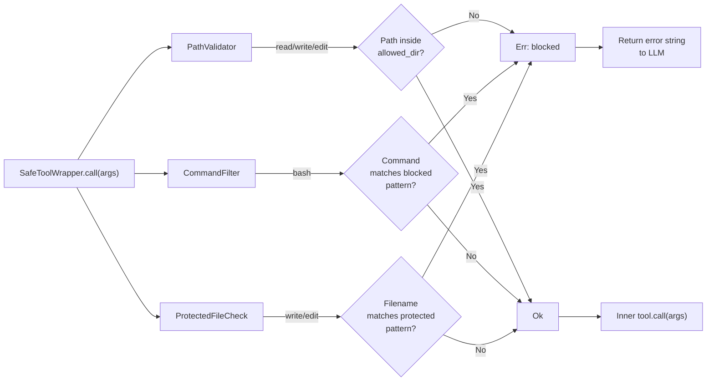

# Chapter 14: Safety Checks

> **File(s) to edit:** `src/safety.rs`
> **Test to run:** `cargo test -p mini-claw-code-starter test_ch18`
> **Estimated time:** 40 min

The permission engine from Chapter 13 gates every tool call -- it decides whether to allow, deny, or ask the user before execution proceeds. But it makes that decision based on the *tool*, not the *arguments*. A `write` call in auto mode is allowed regardless of whether the target path is `src/main.rs` or `.env`. A `bash` call in default mode prompts the user whether the command is `ls` or `rm -rf /`. The permission engine knows *who* is knocking. It does not look at what they are carrying.

Safety checks fill that gap. The `SafetyChecker` performs static analysis on tool arguments *before* the permission engine runs. It examines the actual path being written or the actual command being executed, and blocks operations that are dangerous regardless of what the permission mode says. This is defense-in-depth: even if the permission engine would allow a tool call, the safety checker can still reject it.

Why two layers? Because they protect against different failure modes. The permission engine protects against the LLM doing things the user did not authorize. The safety checker protects against the LLM doing things that are *never* safe -- writing to `.env`, running `rm -rf /`, executing a fork bomb. A user who sets bypass mode is saying "I trust the agent." The safety checker says "trust has limits."

```bash
cargo test -p mini-claw-code-starter test_ch18
```

## Goal

- Implement `PathValidator` to confine file operations to a single directory tree, blocking path traversal attacks like `../../etc/passwd`.
- Implement `CommandFilter` to block dangerous shell commands (`rm -rf /`, `sudo`, fork bombs) using glob pattern matching.
- Implement `ProtectedFileCheck` to prevent writes and edits to sensitive files matching protected patterns (`.env`, `.git/config`).
- Wire all checks together through `SafeToolWrapper` so that any single safety failure blocks the tool call and returns a descriptive error to the LLM.

---

## The SafetyCheck trait and implementations

The safety system lives in `src/safety.rs`. Unlike the reference implementation which uses a single `SafetyChecker` struct, the starter uses a trait-based design with three focused implementations and a wrapper.

### The SafetyCheck trait

```rust
pub trait SafetyCheck: Send + Sync {
    fn check(&self, tool_name: &str, args: &Value) -> Result<(), String>;
}
```

Each safety check implements this trait. It receives the tool name and arguments, and returns `Ok(())` to allow execution or `Err(reason)` to block it. The trait requires `Send + Sync` because safety checks are stored inside `SafeToolWrapper`, which implements `Tool` and may be shared across async tasks.

### Key Rust concept: `Send + Sync` trait bounds

The `Send + Sync` bounds on `SafetyCheck` are required because tools live inside `Box<dyn Tool>`, which is stored in a `HashMap` that the agent holds. In an async runtime like tokio, the agent's futures may be moved between threads. `Send` means the type can be transferred to another thread. `Sync` means `&self` references can be shared between threads. Together they guarantee that the safety check can be called from any async task without data races. Without these bounds, the compiler would refuse to store `Box<dyn SafetyCheck>` inside `SafeToolWrapper`, because `SafeToolWrapper` itself must be `Send + Sync` to satisfy the `Tool` trait.

### PathValidator

```rust
pub struct PathValidator {
    allowed_dir: PathBuf,
    raw_dir: PathBuf,
}
```

The `PathValidator` confines file operations to a single directory tree. It canonicalizes the allowed directory at construction time, then validates each path argument against it. The agent cannot write to `/etc/passwd` or edit `~/.ssh/authorized_keys` even if the LLM asks nicely.

The `validate_path` method resolves relative paths against `raw_dir`, canonicalizes the result (or its parent for new files), and checks `starts_with` against `allowed_dir`. The `SafetyCheck` implementation only fires for tools that take a `path` argument (`read`, `write`, `edit`).

### CommandFilter

```rust
pub struct CommandFilter {
    blocked_patterns: Vec<glob::Pattern>,
}
```

The `CommandFilter` checks bash commands against a list of blocked glob patterns. `rm -rf /` deletes everything. `sudo` escalates privileges. `:(){:|:&};:` is a fork bomb that crashes the system. These are never safe to run, regardless of context.

The `default_filters()` constructor provides a sensible starting point:

```rust
pub fn default_filters() -> Self {
    Self::new(&[
        "rm -rf /".into(),
        "rm -rf /*".into(),
        "sudo *".into(),
        "> /dev/sda*".into(),
        "mkfs.*".into(),
        "dd if=*of=/dev/*".into(),
        ":(){:|:&};:".into(),
    ])
}
```

### ProtectedFileCheck

```rust
pub struct ProtectedFileCheck {
    patterns: Vec<glob::Pattern>,
}
```

The `ProtectedFileCheck` blocks writes and edits to files matching protected glob patterns. It checks both the full path and just the filename against each pattern, so a pattern like `.env` matches `/project/.env` regardless of directory.

---

## The SafeToolWrapper

The `SafeToolWrapper` is the glue that connects safety checks to the tool system:

```rust
pub struct SafeToolWrapper {
    inner: Box<dyn Tool>,
    checks: Vec<Box<dyn SafetyCheck>>,
}
```

It wraps a `Box<dyn Tool>` with a `Vec<Box<dyn SafetyCheck>>`. When `call()` is invoked, it runs all safety checks first. If any check returns `Err`, the wrapper returns `Ok(format!("error: safety check failed: {reason}"))` -- note that it returns `Ok` with an error message string, not `Err`. This is because in the starter, `Tool::call` returns `anyhow::Result<String>`, and a safety denial is not a system error -- it is a controlled rejection that the LLM should see and adapt to.

```rust
#[async_trait]
impl Tool for SafeToolWrapper {
    fn definition(&self) -> &ToolDefinition {
        self.inner.definition()
    }

    async fn call(&self, args: Value) -> anyhow::Result<String> {
        // Run all safety checks. If any returns Err, return the error as a string.
        // Otherwise, call the inner tool.
        unimplemented!()
    }
}
```

The `with_check` convenience constructor wraps a single check:

```rust
pub fn with_check(tool: Box<dyn Tool>, check: impl SafetyCheck + 'static) -> Self {
    Self::new(tool, vec![Box::new(check)])
}
```

This design means safety checks are composable. You can wrap a tool with a `PathValidator`, a `CommandFilter`, and a `ProtectedFileCheck` all at once -- each runs independently, and any single failure blocks the call.

---

## How the checks dispatch



Each `SafetyCheck` implementation decides which tools it applies to by matching on the `tool_name` parameter in its `check` method:

- **`PathValidator`** -- Fires for `read`, `write`, and `edit`. Extracts the `path` argument and validates it against the allowed directory.
- **`CommandFilter`** -- Fires only for `bash`. Extracts the `command` argument and checks it against blocked patterns.
- **`ProtectedFileCheck`** -- Fires for `write` and `edit`. Extracts the `path` argument and checks both the full path and filename against protected patterns.

Tools that do not match any check pass through unchecked. Read-only tools like `read` are checked by `PathValidator` (to enforce directory boundaries) but not by `ProtectedFileCheck` (reading `.env` is not dangerous -- the danger is in *writing* to sensitive files).

Each check returns `Ok(())` for tools it does not handle, so wrapping a tool with an irrelevant check is harmless -- it just passes through.

---

## Path validation

The `PathValidator::validate_path` method implements directory containment checking:

```rust
pub fn validate_path(&self, path: &str) -> Result<(), String> {
    let target = Path::new(path);

    // Step 1: resolve to absolute path
    let resolved = if target.is_absolute() {
        target.to_path_buf()
    } else {
        self.raw_dir.join(target)
    };

    // Step 2: canonicalize (resolves symlinks and ..)
    let canonical = if resolved.exists() {
        resolved.canonicalize()
            .map_err(|e| format!("cannot resolve path: {e}"))?
    } else {
        // For new files, canonicalize the parent directory
        let parent = resolved.parent().ok_or("invalid path")?;
        if parent.exists() {
            let mut c = parent.canonicalize()
                .map_err(|e| format!("cannot resolve parent: {e}"))?;
            if let Some(filename) = resolved.file_name() {
                c.push(filename);
            }
            c
        } else {
            return Err(format!("parent directory does not exist: {}",
                parent.display()));
        }
    };

    // Step 3: check containment
    if canonical.starts_with(&self.allowed_dir) {
        Ok(())
    } else {
        Err(format!("path {} is outside allowed directory {}",
            canonical.display(), self.allowed_dir.display()))
    }
}
```

The key steps:

1. **Resolve relative paths** against `raw_dir` to get an absolute path.
2. **Canonicalize** the target. If the file exists, canonicalize it directly. If not, canonicalize the parent directory and append the filename. This handles the common case of writing a new file in an existing directory.
3. **Check `starts_with`** against the canonicalized `allowed_dir`.

This is more robust than a simple prefix match because canonicalization resolves `..` components and symlinks. A path like `/project/../etc/passwd` gets resolved to `/etc/passwd`, which fails the `starts_with` check against `/project`.

---

## Protected file pattern matching

The `ProtectedFileCheck` uses `glob::Pattern` for matching. For each `write` or `edit` call, it extracts the path argument and checks both the full path and just the filename against each pattern:

```rust
fn check(&self, tool_name: &str, args: &Value) -> Result<(), String> {
    match tool_name {
        "write" | "edit" => {
            if let Some(path) = args.get("path").and_then(|v| v.as_str()) {
                for pattern in &self.patterns {
                    // Check full path and filename separately
                    if pattern.matches(path)
                        || pattern.matches(
                            Path::new(path).file_name()
                                .unwrap_or_default()
                                .to_str().unwrap_or(""),
                        )
                    {
                        return Err(format!(
                            "file `{path}` is protected (matches pattern `{}`)",
                            pattern.as_str()
                        ));
                    }
                }
                Ok(())
            } else {
                Ok(())
            }
        }
        _ => Ok(()),
    }
}
```

Checking both the full path and the filename is important. A pattern like `.env` should match `/project/.env` whether you write the pattern as a full path glob or a simple filename. The `glob::Pattern` crate handles the actual matching, giving us proper glob semantics including wildcards and character classes.

---

## Command filtering

The `CommandFilter::is_blocked` method checks a command against blocked glob patterns:

```rust
pub fn is_blocked(&self, command: &str) -> Option<&str> {
    // Trim command, check against each pattern, return matching pattern
    unimplemented!()
}
```

Unlike the reference implementation which uses substring matching, the starter uses `glob::Pattern` for command matching. This gives more expressive pattern support -- `"sudo *"` matches any command starting with `sudo` followed by arguments, while `"rm -rf /*"` matches the specific dangerous pattern.

The `SafetyCheck` implementation only fires for the `bash` tool:

```rust
fn check(&self, tool_name: &str, args: &Value) -> Result<(), String> {
    // Only check 'bash' tool, extract command, call is_blocked
    unimplemented!()
}
```

The limitations are similar to any pattern-based approach: it can produce false positives (blocking harmless commands that match a pattern) and false negatives (missing dangerous commands that use different syntax). For a tutorial, pattern matching is the right trade-off -- it demonstrates the architecture without the complexity of shell parsing.

---

## How Claude Code does it

Claude Code's safety checking is considerably more sophisticated, operating at multiple levels:

**Command classification with parsing.** Rather than substring matching, Claude Code classifies commands using regex patterns combined with shell AST parsing. It understands that `rm -rf /` and `rm -r -f /` and `command rm -rf /` are the same operation. It parses pipes and redirects to check each command in a pipeline separately. Our substring approach is a flat string scan -- no structure, no parsing.

**Path normalization and symlink resolution.** Claude Code resolves `../`, `~`, environment variables, and symbolic links before checking paths. A path like `$HOME/../../../etc/passwd` gets normalized to `/etc/passwd` before the directory check runs. Our implementation takes paths at face value -- a crafted path with `../` could bypass the allowed directory check.

**Git-aware protected paths.** Claude Code considers git status when deciding what to protect. An untracked `.env` file (one that is not in the repository) gets stronger protection than a tracked one -- if it is untracked, it likely contains real secrets that were intentionally excluded from version control. Our implementation treats all `.env` files the same.

**Severity levels.** Claude Code distinguishes between operations that should be *warned* about and operations that should be *blocked*. Writing to `.env` might produce a warning that the user can override. Running `rm -rf /` is an unconditional block. Our `Permission::Deny` is a single severity -- blocked, no override.

The gap between our implementation and Claude Code's is intentional. Substring matching and prefix-based path checking are easy to reason about and easy to test. They demonstrate the *architecture* of safety checking -- a separate layer that inspects arguments before the permission engine runs -- without the complexity of shell parsing and path resolution. If you understand how `SafetyChecker` fits into the pipeline, you understand how Claude Code's safety system fits. The sophistication of the individual checks is an implementation detail.

---

## Where safety checks fit in the pipeline

To see the complete picture, here is how safety checks and the permission engine compose. In the starter, safety checks are embedded *inside* the tool via `SafeToolWrapper`. When the SimpleAgent dispatches a tool call:

```
LLM requests tool call
    |
    v
PermissionEngine.evaluate(tool_name, args)
    |--- Deny? --> block, return error to LLM
    |--- Ask?  --> prompt user
    |--- Allow? --> continue
    v
SafeToolWrapper.call(args)
    |--- SafetyCheck fails? --> return Ok("error: ...") to LLM
    |--- All checks pass?   --> continue
    v
Inner Tool.call(args)
    |
    v
Return result to LLM
```

In this design, the permission engine runs first (deciding whether the tool should run at all), and the safety checks run inside the tool call itself. The `SafeToolWrapper` catches dangerous arguments even when the permission engine allows the call. The wrapper returns an error *string* (not an `Err`) so the LLM sees the rejection reason and can adjust its approach.

This means safety checks are the inner defense layer. Even with `allow_all()` permission mode, a tool wrapped with `SafeToolWrapper` will still block writes to `.env` or commands containing `rm -rf /`. The safety wrapper is the floor that no permission configuration can lower.

---

## Tests

Run the safety check tests:

```bash
cargo test -p mini-claw-code-starter test_ch18
```

Note: The safety check tests are in `test_ch18`, following the V1 chapter
numbering where safety was Chapter 18.

Key tests:

- **test_ch18_path_within_allowed** -- A file inside the allowed directory passes validation.
- **test_ch18_path_outside_allowed** -- `/etc/passwd` is rejected when the allowed directory is a temp dir.
- **test_ch18_path_traversal_blocked** -- A `../../etc/passwd` traversal path is resolved and rejected.
- **test_ch18_path_new_file_in_allowed** -- A new (not-yet-existing) file in the allowed directory passes validation.
- **test_ch18_safety_check_read_tool** -- PathValidator fires for the `read` tool and validates the path argument.
- **test_ch18_safety_check_ignores_bash** -- PathValidator skips the `bash` tool (no `path` argument to check).
- **test_ch18_command_filter_blocks_rm_rf** -- `rm -rf /` and `rm -rf /*` are both caught.
- **test_ch18_command_filter_blocks_sudo** -- `sudo rm file` matches the `sudo *` pattern.
- **test_ch18_command_filter_allows_safe** -- `ls -la`, `echo hello`, and `cargo test` pass through.
- **test_ch18_protected_file_blocks_env** -- Writes to `.env` and `.env.local` are blocked.
- **test_ch18_protected_file_allows_normal** -- Writes to `src/main.rs` pass through.
- **test_ch18_wrapper_blocks_on_check_failure** -- `SafeToolWrapper` returns an `"error: safety check failed"` string when a check fails.
- **test_ch18_wrapper_allows_valid_call** -- `SafeToolWrapper` passes through to the inner tool when all checks pass.
- **test_ch18_custom_blocked_commands** -- Custom blocked patterns (`docker rm *`, `npm publish*`) work correctly.

---

## Key takeaway

Safety checks inspect tool *arguments*, not tool *identity*. The permission engine asks "should this tool run at all?" while safety checks ask "is this specific invocation dangerous?" The two layers compose through defense-in-depth: even with all permissions granted, `SafeToolWrapper` still blocks writes to `.env` and commands matching `rm -rf /`.

---

## Recap

The safety system adds a second layer of defense between the LLM and tool execution:

- **Trait-based design** -- The `SafetyCheck` trait allows composable, independent checks. `PathValidator`, `CommandFilter`, and `ProtectedFileCheck` each handle one concern.
- **Argument-level inspection** -- Unlike the permission engine which checks tool identity, safety checks examine the actual arguments: which file is being written, which command is being run.
- **SafeToolWrapper** -- Wraps any `Box<dyn Tool>` with a `Vec<Box<dyn SafetyCheck>>`. Returns `Ok("error: ...")` on failure, not `Err`, so the LLM sees the rejection and can adapt.
- **Glob-based matching** -- Both `CommandFilter` and `ProtectedFileCheck` use `glob::Pattern` for pattern matching, giving expressive matching without custom code.
- **Path canonicalization** -- `PathValidator` canonicalizes paths before checking, preventing bypass via `..` components or symlinks.
- **Defense-in-depth** -- Safety checks run inside the tool call. Even with `allow_all()` permission mode, wrapped tools still enforce safety rules.

The architecture -- composable checks that inspect arguments and wrap tools -- demonstrates the same defense-in-depth pattern that Claude Code uses.

## What's next

In [Chapter 15: Hook System](./ch15-hooks.md) you will build pre-tool and post-tool hooks -- shell commands that run before and after tool execution. Hooks let users enforce custom policies beyond what the built-in safety checker covers: run a linter after every edit, block writes to specific directories, log every bash command. Where the safety checker is a built-in guard, hooks are user-defined guards.

---

[← Chapter 13: Permission Engine](./ch13-permissions.md) · [Contents](./ch00-overview.md) · [Chapter 15: Hooks →](./ch15-hooks.md)
