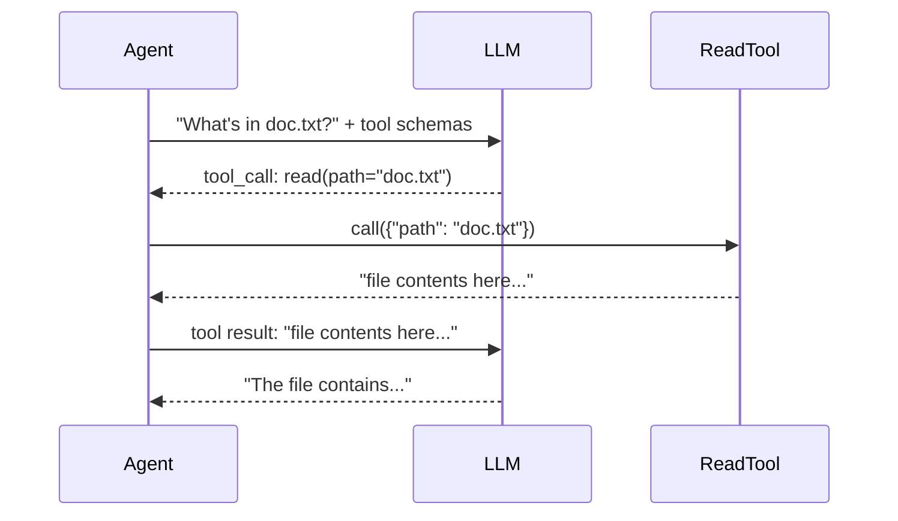

# Chapter 2: Your First Tool Call

> **File to edit:** `src/tools/read.rs`
> **Test to run:** `cargo test -p mini-claw-code-starter test_ch2_`

An LLM can't read files, run commands, or browse the web. It can only generate text. But it can *ask your code* to do those things. That's what tools are.

## Goal

Implement `ReadTool` so that:

1. It declares its name, description, and parameter schema.
2. When called with `{"path": "some/file.txt"}`, it reads the file and returns its contents.
3. Missing arguments or non-existent files produce errors.

## How tool calling works

The LLM never touches the filesystem. It describes what it wants, and your code does it:



The LLM sees a JSON schema describing each tool. When it decides to use one, it outputs a structured request with the tool name and arguments. Your code parses this, runs the real function, and sends the result back.

## The Tool trait

Open `mini-claw-code-starter/src/types.rs` and find the `Tool` trait:

```rust
#[async_trait::async_trait]
pub trait Tool: Send + Sync {
    fn definition(&self) -> &ToolDefinition;
    async fn call(&self, args: Value) -> anyhow::Result<String>;
}
```

Two methods:
- **`definition()`** returns the JSON schema that tells the LLM what this tool does and what arguments it takes
- **`call()`** executes the tool and returns a string result

### Why `#[async_trait]` instead of plain `async fn`?

Later, tools are stored in a `ToolSet` — a `HashMap<String, Box<dyn Tool>>`. This requires dynamic dispatch, which needs a known return size. `async fn` in traits generates uniquely-sized `Future` types per implementation, breaking dynamic dispatch. `#[async_trait]` rewrites them into `Pin<Box<dyn Future>>` which has a fixed size. You write normal `async fn` code; the macro handles the boxing.

The `Provider` trait avoids this with RPITIT (`-> impl Future`) because providers are used as generic parameters (`P: Provider`), never as `dyn Provider`.

## The implementation

Open `src/tools/read.rs`. You'll see the struct and two stubs.

### Step 1: The definition

A `ToolDefinition` describes the tool to the LLM using JSON Schema:

```rust
pub fn new() -> Self {
    Self {
        definition: ToolDefinition::new("read", "Read the contents of a file.")
            .param("path", "string", "Absolute path to the file", true),
    }
}
```

The `.param()` builder adds a parameter with its type, description, and whether it's required. When the LLM sees this schema, it knows it can call a tool named `"read"` with a required string argument `"path"`.

### Step 2: The call

Extract the path from the JSON arguments, read the file, return the contents:

```rust
async fn call(&self, args: Value) -> anyhow::Result<String> {
    let path = args["path"]
        .as_str()
        .context("missing 'path' argument")?;

    tokio::fs::read_to_string(path)
        .await
        .with_context(|| format!("failed to read '{path}'"))
}
```

Three lines of logic. `args` is a `serde_json::Value` — the parsed JSON arguments from the LLM. The `context()` and `with_context()` methods (from `anyhow`) add human-readable error messages.

Here is the data flow:

```mermaid
flowchart LR
    A["args: {\"path\": \"foo.txt\"}"] --> B["as_str()"]
    B --> C["tokio::fs::read_to_string"]
    C --> D["Ok(\"file contents\")"]
    C --> E["Err(\"failed to read\")"]
```

## Run the tests

```bash
cargo test -p mini-claw-code-starter test_ch2_
```

15 tests verify your tool:
- **`test_ch2_read_definition`** — schema has the right name and required params
- **`test_ch2_read_file`** — reads a real file from a temp directory
- **`test_ch2_read_missing_file`** — returns an error for nonexistent files
- **`test_ch2_read_missing_arg`** — returns an error when `path` is missing
- **`test_ch2_read_utf8_content`** — handles multi-line content correctly
- **`test_ch2_read_empty_file`** — reads an empty file without error

## The pattern

Every tool in this project follows the same three-step pattern:

1. **Define** — `ToolDefinition::new("name", "description").param(...)`
2. **Extract** — pull arguments from the JSON `Value`
3. **Execute** — do the thing, return a `String`

You'll repeat this for `WriteTool`, `EditTool`, and `BashTool` in later chapters. Once you've written one tool, you've written them all.

## Key takeaway

A tool is the bridge between "the LLM wants to read a file" and "the file is actually read." The LLM describes its intent as structured JSON. Your code does the work.

---

**Next:** [Chapter 3: The Agentic Loop →](./intro03-agentic-loop.md)
