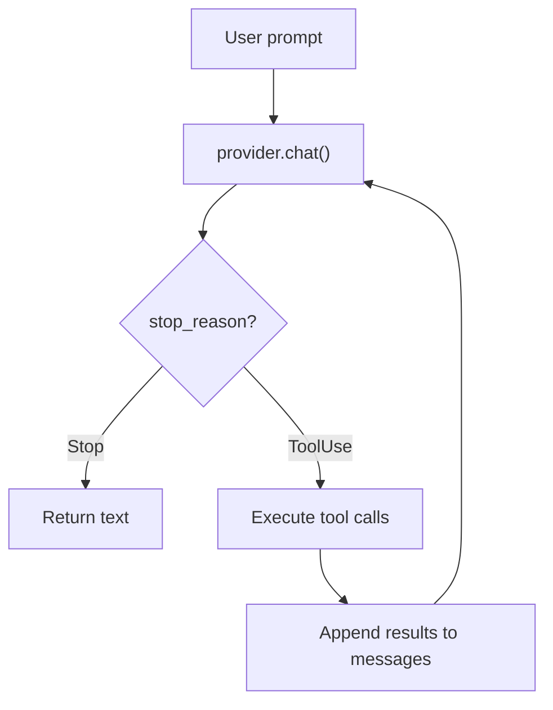
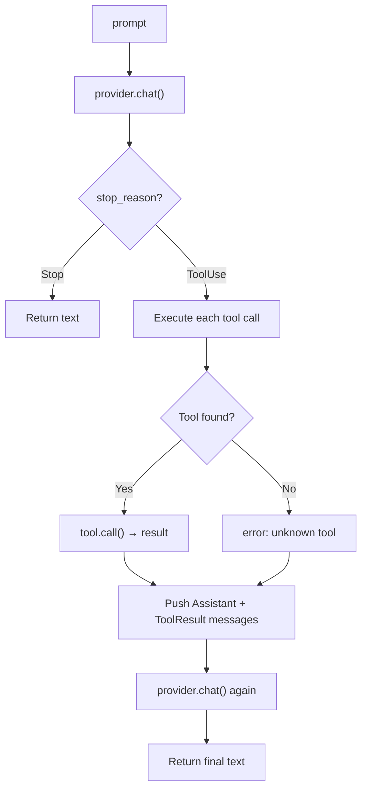

# Chapter 3: The Agentic Loop

> **File to edit:** `src/agent.rs`
> **Tests to run:** `cargo test -p mini-claw-code-starter test_ch3_` (single_turn), `cargo test -p mini-claw-code-starter test_ch5_` (SimpleAgent)

You have a provider (talks to the LLM) and a tool (reads files). Now you connect them. This is where the agent comes alive.

## Goal

Implement two things:

1. **`single_turn()`** — handle one prompt with at most one round of tool calls
2. **`SimpleAgent`** — wrap `single_turn` in a loop that keeps going until the LLM is done

## The core idea

Every coding agent — Claude Code, Cursor, Aider — is this loop:

```
loop {
    response = provider.chat(messages, tools)
    if response.stop_reason == Stop:
        return response.text
    for call in response.tool_calls:
        result = tools.execute(call)
        messages.append(result)
}
```

The LLM decides when to stop. Your code just follows instructions.



## Part 1: single_turn()

Start simple. `single_turn()` handles one prompt with at most one round of tool calls — no looping yet.

### Key Rust concept: ToolSet

The function takes a `&ToolSet` — a `HashMap<String, Box<dyn Tool>>` that indexes tools by name for O(1) lookup:

```rust
pub async fn single_turn<P: Provider>(
    provider: &P,
    tools: &ToolSet,
    prompt: &str,
) -> anyhow::Result<String>
```

### The flow



### Implementation

```rust
pub async fn single_turn<P: Provider>(
    provider: &P,
    tools: &ToolSet,
    prompt: &str,
) -> anyhow::Result<String> {
    let defs = tools.definitions();
    let mut messages = vec![Message::User(prompt.to_string())];

    let turn = provider.chat(&messages, &defs).await?;

    match turn.stop_reason {
        StopReason::Stop => Ok(turn.text.unwrap_or_default()),
        StopReason::ToolUse => {
            // Execute each tool call, collect results
            let mut results = Vec::new();
            for call in &turn.tool_calls {
                let content = match tools.get(&call.name) {
                    Some(t) => t.call(call.arguments.clone())
                        .await
                        .unwrap_or_else(|e| format!("error: {e}")),
                    None => format!("error: unknown tool `{}`", call.name),
                };
                results.push((call.id.clone(), content));
            }

            // Feed results back to the LLM
            messages.push(Message::Assistant(turn));
            for (id, content) in results {
                messages.push(Message::ToolResult { id, content });
            }

            let final_turn = provider.chat(&messages, &defs).await?;
            Ok(final_turn.text.unwrap_or_default())
        }
    }
}
```

Three key details:

1. **Collect results before pushing** `Message::Assistant(turn)` — the push moves `turn`, so you can't borrow `turn.tool_calls` after that
2. **Never crash on tool failure** — catch errors with `unwrap_or_else` and return them as strings. The LLM reads the error and adapts
3. **Unknown tools get an error string** — not a panic. The LLM might hallucinate a tool name; your agent handles it gracefully

### Test it

```bash
cargo test -p mini-claw-code-starter test_ch3_
```

14 tests including:
- **`test_ch3_direct_response`** — LLM responds immediately, no tools
- **`test_ch3_one_tool_call`** — LLM reads a file, then answers
- **`test_ch3_unknown_tool`** — LLM calls a nonexistent tool, gets an error, recovers
- **`test_ch3_provider_error`** — provider returns an error, propagated correctly

## Part 2: SimpleAgent

`single_turn` handles one round. A real agent loops until the LLM is done. That's `SimpleAgent`.

### The struct

```rust
pub struct SimpleAgent<P: Provider> {
    provider: P,
    tools: ToolSet,
}
```

### Constructor and builder

```rust
pub fn new(provider: P) -> Self {
    Self { provider, tools: ToolSet::new() }
}

pub fn tool(mut self, t: impl Tool + 'static) -> Self {
    self.tools.push(t);
    self
}
```

The builder pattern lets you chain tool registration:

```rust
let agent = SimpleAgent::new(provider)
    .tool(ReadTool::new())
    .tool(WriteTool::new())
    .tool(BashTool::new());
```

### The loop: `chat()`

This is `single_turn` generalized into a loop. Instead of calling the provider twice and returning, it keeps going until `StopReason::Stop`:

```rust
pub async fn chat(&self, messages: &mut Vec<Message>) -> anyhow::Result<String> {
    let defs = self.tools.definitions();

    loop {
        let turn = self.provider.chat(messages, &defs).await?;

        match turn.stop_reason {
            StopReason::Stop => {
                let text = turn.text.clone().unwrap_or_default();
                messages.push(Message::Assistant(turn));
                return Ok(text);
            }
            StopReason::ToolUse => {
                let results = self.execute_tools(&turn.tool_calls).await;
                Self::push_results(messages, turn, results);
            }
        }
    }
}
```

Note: clone `turn.text` **before** pushing `Message::Assistant(turn)` — the push moves `turn`.

**`run()`** is a convenience wrapper:

```rust
pub async fn run(&self, prompt: &str) -> anyhow::Result<String> {
    let mut messages = vec![Message::User(prompt.to_string())];
    self.chat(&mut messages).await
}
```

The helper methods `execute_tools()` and `push_results()` factor out the tool execution and message building — see the stubs in `agent.rs` for the signatures.

### Test it

```bash
cargo test -p mini-claw-code-starter test_ch5_
```

16 tests including:
- **`test_ch5_simple_text`** — single-turn text response
- **`test_ch5_multi_step`** — LLM reads a file, then writes a response
- **`test_ch5_three_turn_loop`** — read → edit → verify, three rounds
- **`test_ch5_error_recovery`** — tool fails, LLM reads the error and adapts

## What just happened

You built a coding agent.

```rust
let agent = SimpleAgent::new(provider)
    .tool(ReadTool::new())
    .tool(WriteTool::new())
    .tool(BashTool::new());

let answer = agent.run("What files are in this directory?").await?;
```

The agent sends the prompt to the LLM, the LLM calls `bash("ls")`, the agent executes it, feeds the output back, and the LLM summarizes the result. The loop handles any number of tool calls across any number of rounds.

That is the architecture. Everything else — streaming, permissions, plan mode, subagents — is built on top of this loop.

---

**Next:** Dive into the full architecture with [Chapter 4: Messages & Types →](./ch01-messages-types.md)
