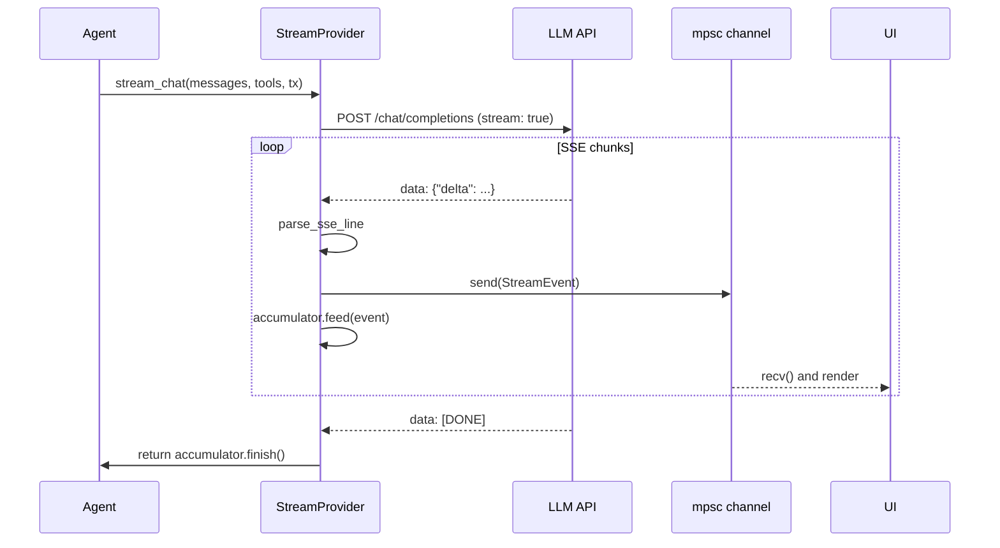

# Chapter 5a: Provider & Streaming Foundations

> **File(s) to edit:** `src/mock.rs`, `src/streaming.rs` (everything *except* `StreamingAgent`)
> **Tests to run:** `cargo test -p mini-claw-code-starter test_mock_` and `cargo test -p mini-claw-code-starter test_streaming_parse_ test_streaming_accumulator_`
> **Estimated time:** 35 min

## Goal

- Implement `MockProvider` so tests can script exact LLM responses without network calls.
- Implement `parse_sse_line` so we can turn a single SSE line into `StreamEvent`s.
- Implement `StreamAccumulator` so a stream of deltas reassembles into a complete `AssistantTurn`.
- Implement `MockStreamProvider` so UI-facing code can be tested without a real HTTP connection.
- Understand when to reach for `std::sync::Mutex` vs `tokio::sync::Mutex` in async code.

Chapter 4 defined the data that flows through the agent. This chapter (and the next) turn those types into something that can actually *drive* data — an LLM backend. We split the work in two halves:

- **Ch5a (this chapter):** the abstractions and testable foundations — traits, mock providers, SSE parsing, stream accumulation.
- **[Ch5b](./ch05b-openrouter-streaming.md):** the real HTTP provider (`OpenRouterProvider`) and the `StreamingAgent` that wires a stream channel through the agent loop.

Keeping streaming *plumbing* (this chapter) separate from *networking and orchestration* (next chapter) makes each part testable in isolation.

---

## How streaming works end-to-end

For orientation, here is what the finished system looks like. Don't worry about the `StreamingAgent` and `OpenRouter API` boxes yet — those belong to 5b. This chapter builds every other box.



## Why a trait?

A coding agent needs to call an LLM, but *which* LLM should not be hard-coded. During tests we want instant, deterministic responses. In production we want streaming over HTTP. The `Provider` trait gives us that seam.

Claude Code uses a similar abstraction internally — every LLM call goes through a provider interface, and the choice of backend (Anthropic API, Bedrock, Vertex) is resolved at startup.

## The Provider trait (RPITIT)

Here is the full trait:

```rust
pub trait Provider: Send + Sync {
    fn chat<'a>(
        &'a self,
        messages: &'a [Message],
        tools: &'a [&'a ToolDefinition],
    ) -> impl Future<Output = anyhow::Result<AssistantTurn>> + Send + 'a;
}
```

A few things to notice:

**No `#[async_trait]`.** The `Provider` trait uses *return-position `impl Trait` in traits* (RPITIT) — stabilized in Rust 1.75. Writing `fn chat(...) -> impl Future<...>` instead of `async fn chat(...)` gives us explicit control over the lifetime and `Send` bound; `async fn` in a trait does not always infer `Send` for the returned future, which would prevent spawning onto a multi-threaded runtime. The explicit `impl Future<...> + Send + 'a` signature solves that, and it avoids the heap allocation that `#[async_trait]` would require.

The `Tool` trait in Chapter 6 uses `#[async_trait]` for the opposite reason — object safety for heterogeneous storage. For the full explanation of when to pick which style, see [Why two async trait styles?](./ch06-tool-interface.md#async-styles). The one-liner version is also in [Chapter 2](./ch02-first-tool.md).

**Why `Send + Sync` on the trait itself?** Our agent loop will hold a `P: Provider` behind a shared reference (and later behind `Arc`). The `Sync` bound lets multiple tasks share the provider, and `Send` lets it cross thread boundaries.

**Lifetime `'a` everywhere.** The returned future borrows both `&self` and the input slices. Tying them to a single lifetime `'a` tells the compiler the future lives no longer than those borrows, avoiding `'static` requirements.

The `Provider` trait is already defined in `src/types.rs` (Chapter 4). The starter puts it alongside the message types because everything lives in a flat layout.

## The Arc\<P\> blanket impl

Directly below the `Provider` trait, the starter has:

```rust
impl<P: Provider> Provider for Arc<P> {
    fn chat<'a>(
        &'a self,
        messages: &'a [Message],
        tools: &'a [&'a ToolDefinition],
    ) -> impl Future<Output = anyhow::Result<AssistantTurn>> + Send + 'a {
        (**self).chat(messages, tools)
    }
}
```

This says: "if `P` is a `Provider`, then `Arc<P>` is also a `Provider`." It just dereferences through the `Arc` and delegates to the inner value.

Why does this matter? Later, when we build subagents, the main agent and its subagents will share the same provider. Cloning an `Arc` is cheap, and the blanket impl means subagent code that is generic over `P: Provider` works identically whether it receives a bare provider or a shared one. Without this impl, you would need separate type plumbing to pass shared providers around.

Both the `Provider` trait and the `Arc<P>` blanket impl are already in `src/types.rs`.

---

## MockProvider

Testing an agent against a live API is slow, expensive, and nondeterministic. The `MockProvider` lets you script exact responses and verify that your agent handles them correctly.

```rust
use std::collections::VecDeque;
use std::sync::Mutex;

pub struct MockProvider {
    responses: Mutex<VecDeque<AssistantTurn>>,
}

impl MockProvider {
    pub fn new(responses: VecDeque<AssistantTurn>) -> Self {
        Self {
            responses: Mutex::new(responses),
        }
    }
}

impl Provider for MockProvider {
    async fn chat(
        &self,
        _messages: &[Message],
        _tools: &[&ToolDefinition],
    ) -> anyhow::Result<AssistantTurn> {
        self.responses
            .lock()
            .unwrap()
            .pop_front()
            .ok_or_else(|| anyhow::anyhow!("MockProvider: no more responses"))
    }
}
```

### Rust concept: `std::sync::Mutex` vs `tokio::sync::Mutex`

The `Provider` trait takes `&self` (not `&mut self`), because providers are shared. But we need to mutate the queue. Which `Mutex` should we use?

The rule of thumb: use `std::sync::Mutex` when the critical section is trivial (no `.await` inside the lock), and `tokio::sync::Mutex` when you need to hold the lock across an `.await` point. Here the critical section is just a `pop_front` — a single pointer operation. Using `tokio::sync::Mutex` would add unnecessary overhead (it is an async-aware lock that yields to the runtime). `std::sync::Mutex` is cheaper and perfectly safe because the lock is never held long enough to block the runtime.

The design:

- **`VecDeque`** — responses are consumed in FIFO order. The first call to `chat` returns the first response, the second call returns the second, and so on.
- **`Mutex`** — wraps the queue so `&self` methods can mutate it. See the Rust concept note above for why `std::sync::Mutex` is the right choice here.
- **Error on exhaustion** — if the test scripts three responses but the agent calls `chat` a fourth time, it gets an error instead of a silent panic. This catches agent loops that spin more times than expected.

### Testing strategy

The `MockProvider` is the foundation of all our tests. By scripting the exact sequence of responses, you can test:

- **Single-turn:** one response with `StopReason::Stop`
- **Tool use loops:** first response has `StopReason::ToolUse` with tool calls, the agent executes them and sends results back, second response has `StopReason::Stop`
- **Multi-turn sequences:** any number of scripted turns
- **Error handling:** an empty queue returns an error

A typical test:

```rust
#[tokio::test]
async fn mock_returns_text() {
    let provider = MockProvider::new(VecDeque::from([AssistantTurn {
        text: Some("Hello!".into()),
        tool_calls: vec![],
        stop_reason: StopReason::Stop,
        usage: None,
    }]));
    let turn = provider.chat(&[Message::User("Hi".into())], &[]).await.unwrap();
    assert_eq!(turn.text.as_deref(), Some("Hello!"));
}
```

Notice that the test ignores the `messages` input — the mock does not look at what the agent sends. This is intentional. You are testing the *agent's behavior* given a known provider response, not the provider's ability to understand prompts.

### Your task

Open `src/mock.rs` in the starter. You will see the `MockProvider` struct with `unimplemented!()` stubs. Fill in `new()` and the `Provider` impl.

---

## StreamEvent

Before defining the streaming trait, we need a vocabulary for the incremental chunks an LLM sends back:

```rust
#[derive(Debug, Clone, PartialEq)]
pub enum StreamEvent {
    /// A fragment of the model's text response.
    TextDelta(String),
    /// The beginning of a tool call (carries the call ID and tool name).
    ToolCallStart {
        index: usize,
        id: String,
        name: String,
    },
    /// A fragment of a tool call's JSON arguments.
    ToolCallDelta {
        index: usize,
        arguments: String,
    },
    /// The stream is complete.
    Done,
}
```

These four variants map directly to the OpenAI streaming API:

- **TextDelta** — a fragment of the model's natural-language output (e.g. `"Hello"`, then `" world"`).
- **ToolCallStart** — the model has begun a tool call. `index` identifies which call (a single turn can request multiple tools), `id` is a server-assigned correlation ID, and `name` is the tool.
- **ToolCallDelta** — a fragment of the JSON arguments for the call at `index`. Arguments arrive incrementally because the model generates JSON token-by-token.
- **Done** — end-of-stream signal.

The `index` field matters because streaming interleaves fragments from multiple tool calls, and consumers need to know which call each fragment belongs to.

## The StreamProvider trait

```rust
pub trait StreamProvider: Send + Sync {
    fn stream_chat<'a>(
        &'a self,
        messages: &'a [Message],
        tools: &'a [&'a ToolDefinition],
        tx: mpsc::UnboundedSender<StreamEvent>,
    ) -> impl Future<Output = anyhow::Result<AssistantTurn>> + Send + 'a;
}
```

The design uses a **channel-based** streaming model rather than returning an `AsyncIterator` or `Stream`. The caller creates a `tokio::sync::mpsc::unbounded_channel()`, passes the sender half to `stream_chat`, and reads events from the receiver half — typically in a separate task that renders them to the terminal.

The method itself still returns the fully assembled `AssistantTurn` when the stream is complete. This means the agent loop always gets a clean `AssistantTurn` to work with, regardless of whether streaming is enabled. The channel is a side-channel for the UI.

Why `UnboundedSender` instead of a bounded channel? Streaming events are tiny and arrive at network speed, not faster. Backpressure is unnecessary because the bottleneck is the API, not the consumer. An unbounded channel keeps the API simpler.

The `StreamEvent` enum and `StreamProvider` trait both live in `src/streaming.rs` in the starter.

---

## MockStreamProvider

The `MockStreamProvider` wraps a `MockProvider` and synthesizes `StreamEvent`s from each canned response. This lets you test UI code that consumes stream events without needing a real HTTP connection.

The struct wraps a `MockProvider` and its `stream_chat` impl works in three steps:

1. Delegate to `self.inner.chat()` to get the canned `AssistantTurn`
2. Decompose it into events: text is sent **character-by-character** as `TextDelta` events, each tool call emits a `ToolCallStart` + single `ToolCallDelta`, and a final `Done` is sent
3. Return the original `AssistantTurn` unchanged

Here is the full implementation:

```rust
pub struct MockStreamProvider {
    inner: MockProvider,
}

impl MockStreamProvider {
    pub fn new(responses: VecDeque<AssistantTurn>) -> Self {
        Self {
            inner: MockProvider::new(responses),
        }
    }
}

impl StreamProvider for MockStreamProvider {
    async fn stream_chat(
        &self,
        messages: &[Message],
        tools: &[&ToolDefinition],
        tx: mpsc::UnboundedSender<StreamEvent>,
    ) -> anyhow::Result<AssistantTurn> {
        let turn = self.inner.chat(messages, tools).await?;

        // Synthesize stream events from the complete turn
        if let Some(ref text) = turn.text {
            for ch in text.chars() {
                let _ = tx.send(StreamEvent::TextDelta(ch.to_string()));
            }
        }
        for (i, call) in turn.tool_calls.iter().enumerate() {
            let _ = tx.send(StreamEvent::ToolCallStart {
                index: i,
                id: call.id.clone(),
                name: call.name.clone(),
            });
            let _ = tx.send(StreamEvent::ToolCallDelta {
                index: i,
                arguments: call.arguments.to_string(),
            });
        }
        let _ = tx.send(StreamEvent::Done);

        Ok(turn)
    }
}
```

This avoids duplicating the response queue logic — the `inner.chat()` call handles the `VecDeque` pop. The `let _ = tx.send(...)` pattern intentionally ignores send errors — if the receiver is dropped, nobody is listening, and that is fine.

### Your task

Fill in `MockStreamProvider::new()` and its `stream_chat()` stub in `src/streaming.rs`.

---

## Server-Sent Events and `parse_sse_line`

When the real provider requests `stream: true`, the API returns a stream of [Server-Sent Events](https://developer.mozilla.org/en-US/docs/Web/API/Server-sent_events/Using_server-sent_events) (SSE). SSE is a simple text protocol over HTTP:

```
data: {"choices":[{"delta":{"content":"Hello"},"finish_reason":null}]}

data: {"choices":[{"delta":{"content":" world"},"finish_reason":null}]}

data: [DONE]
```

Each event is a line starting with `data: ` followed by a JSON payload (or the special string `[DONE]`). Events are separated by blank lines. That is the entire protocol — no framing, no length prefixes, just newline-delimited text. This simplicity is why SSE is the standard for LLM streaming.

Our `parse_sse_line` function handles a single line:

```rust
pub fn parse_sse_line(line: &str) -> Option<Vec<StreamEvent>> {
    let data = line.strip_prefix("data: ")?;
    if data == "[DONE]" {
        return Some(vec![StreamEvent::Done]);
    }

    let chunk: ChunkResponse = serde_json::from_str(data).ok()?;
    let choice = chunk.choices.into_iter().next()?;
    let mut events = Vec::new();

    if let Some(text) = choice.delta.content
        && !text.is_empty()
    {
        events.push(StreamEvent::TextDelta(text));
    }

    if let Some(tool_calls) = choice.delta.tool_calls {
        for tc in tool_calls {
            if let Some(id) = tc.id {
                let name = tc.function
                    .as_ref()
                    .and_then(|f| f.name.clone())
                    .unwrap_or_default();
                events.push(StreamEvent::ToolCallStart {
                    index: tc.index,
                    id,
                    name,
                });
            }
            if let Some(ref func) = tc.function
                && let Some(ref args) = func.arguments
                && !args.is_empty()
            {
                events.push(StreamEvent::ToolCallDelta {
                    index: tc.index,
                    arguments: args.clone(),
                });
            }
        }
    }

    if events.is_empty() { None } else { Some(events) }
}
```

Walk through the logic:

1. **Strip the `data: ` prefix.** Lines that do not start with `data: ` (like `event: ping` or blank lines) return `None` — they are not data events.
2. **Check for `[DONE]`.** This is the OpenAI-standard end-of-stream sentinel. Return a `Done` event.
3. **Parse JSON into `ChunkResponse`.** If the JSON is malformed, `.ok()?` silently skips it. This is intentional — SSE streams occasionally include keep-alive pings or malformed chunks, and crashing would be worse than dropping a token.
4. **Extract text deltas.** The `delta.content` field contains the text fragment. Empty strings are skipped.
5. **Extract tool call events.** A single chunk can contain both a `ToolCallStart` (when the `id` field is present, signaling a new call) and a `ToolCallDelta` (when `arguments` is present). The `if let ... && let ...` syntax is Rust's let-chains feature, stabilized in edition 2024.

### Rust concept: let-chains

The `if let Some(ref func) = tc.function && let Some(ref args) = func.arguments` syntax combines two pattern matches into a single `if` expression. Before let-chains, you would need nested `if let` blocks or a `match` with a tuple. Let-chains flatten the nesting and make the condition more readable. The `ref` keyword borrows the matched value instead of moving it, which is necessary here because `tc` is used again after the `if let`.

The tests verify the parser against three cases: a text delta line produces `StreamEvent::TextDelta("Hello")`, the `data: [DONE]` line produces `StreamEvent::Done`, and non-data lines like `event: ping` or empty strings return `None`.

### Your task

The `parse_sse_line` function and its SSE deserialization types (`ChunkResponse`, `ChunkChoice`, `Delta`, `DeltaToolCall`, `DeltaFunction`) are in `src/streaming.rs`. Fill in the `parse_sse_line` stub.

---

## StreamAccumulator

Streaming gives the UI real-time output, but the agent loop needs a complete `AssistantTurn` to decide what to do next. The `StreamAccumulator` bridges this gap — it collects events as they arrive and produces a finished message at the end.

```rust
pub struct StreamAccumulator {
    text: String,
    tool_calls: Vec<PartialToolCall>,
}

struct PartialToolCall {
    id: String,
    name: String,
    arguments: String,
}
```

The two key methods:

```rust
impl StreamAccumulator {
    pub fn new() -> Self {
        Self {
            text: String::new(),
            tool_calls: Vec::new(),
        }
    }

    pub fn feed(&mut self, event: &StreamEvent) {
        match event {
            StreamEvent::TextDelta(s) => self.text.push_str(s),
            StreamEvent::ToolCallStart { index, id, name } => {
                // Ensure the Vec is large enough for this index
                while self.tool_calls.len() <= *index {
                    self.tool_calls.push(PartialToolCall {
                        id: String::new(),
                        name: String::new(),
                        arguments: String::new(),
                    });
                }
                self.tool_calls[*index].id = id.clone();
                self.tool_calls[*index].name = name.clone();
            }
            StreamEvent::ToolCallDelta { index, arguments } => {
                if let Some(tc) = self.tool_calls.get_mut(*index) {
                    tc.arguments.push_str(arguments);
                }
            }
            StreamEvent::Done => {}
        }
    }

    pub fn finish(self) -> AssistantTurn {
        let text = if self.text.is_empty() {
            None
        } else {
            Some(self.text)
        };
        let tool_calls: Vec<ToolCall> = self
            .tool_calls
            .into_iter()
            .filter(|tc| !tc.name.is_empty())
            .map(|tc| ToolCall {
                id: tc.id,
                name: tc.name,
                arguments: serde_json::from_str(&tc.arguments)
                    .unwrap_or(Value::Null),
            })
            .collect();
        let stop_reason = if tool_calls.is_empty() {
            StopReason::Stop
        } else {
            StopReason::ToolUse
        };
        AssistantTurn {
            text,
            tool_calls,
            stop_reason,
            usage: None,
        }
    }
}
```

Design notes:

- **`feed` appends incrementally.** Text fragments concatenate into `self.text`. Tool call arguments concatenate per-index into `PartialToolCall::arguments`.
- **Sparse index handling.** The `while` loop in `ToolCallStart` pads the vector with empty entries so that `index: 2` works even if the vector only has one element. The `filter(|tc| !tc.name.is_empty())` in `finish` strips those placeholders.
- **Deferred JSON parsing.** Arguments arrive as string fragments during streaming. `finish` parses the concatenated string into `serde_json::Value` only after the stream ends, falling back to `Value::Null` on malformed JSON.
- **`stop_reason` is derived from the tool calls.** If any survived the filter, it is `ToolUse`; otherwise `Stop`. Usage is `None` because most streaming APIs do not include token counts per chunk.

The accumulator tests (`test_streaming_accumulator_text`, `test_streaming_accumulator_tool_call`) feed two text deltas or a tool-call-start plus two argument fragments and verify that the concatenated result is what you'd expect.

### Your task

The `StreamAccumulator` and `PartialToolCall` are in `src/streaming.rs`. Fill in the `new()`, `feed()`, and `finish()` stubs.

---

## Run the tests

```bash
cargo test -p mini-claw-code-starter test_mock_
cargo test -p mini-claw-code-starter test_streaming_parse_
cargo test -p mini-claw-code-starter test_streaming_accumulator_
```

### What these tests verify

**`test_mock_`** (MockProvider):

- **`test_mock_mock_returns_text`** — scripts a single text response and verifies `chat()` returns it
- **`test_mock_mock_exhausted`** — calls `chat()` on an empty queue and verifies it returns an error

**`test_streaming_parse_`** (SSE parser):

- **`test_streaming_parse_text_delta`** — feeds a `data:` line with text content and verifies a `TextDelta` event is produced
- **`test_streaming_parse_done`** — feeds `data: [DONE]` and verifies a `Done` event is produced
- **`test_streaming_parse_non_data_lines`** — feeds a non-data line like `event: ping` and verifies `None` is returned

**`test_streaming_accumulator_`** (stream reassembly):

- **`test_streaming_accumulator_text`** — feeds two `TextDelta` events and verifies the concatenated result
- **`test_streaming_accumulator_tool_call`** — feeds a `ToolCallStart` and two `ToolCallDelta` fragments, verifies they reassemble into a valid `ToolCall` with parsed JSON arguments

Everything else (`test_openrouter_`, `test_streaming_streaming_agent_`, `test_streaming_stream_chat_`) belongs to [Chapter 5b](./ch05b-openrouter-streaming.md).

---

## Key takeaway

The provider layer decouples the agent from any specific LLM backend. `MockProvider` makes tests fast and deterministic; the `StreamProvider` trait pipes incremental events out on a channel while the method itself still returns a clean `AssistantTurn`; `StreamAccumulator` is the bridge that lets the UI see tokens as they arrive while the agent loop sees a complete message.

Everything in this chapter is testable without a network. Next up in [Chapter 5b](./ch05b-openrouter-streaming.md), we plug these primitives into a real HTTP provider and wire the events channel through the agent loop.

---

[← Chapter 4: Messages & Types](./ch04-messages-types.md) · [Contents](./ch00-overview.md) · [Chapter 5b: OpenRouter & StreamingAgent →](./ch05b-openrouter-streaming.md)
