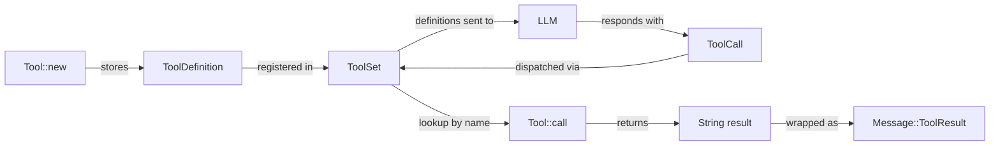

# Chapter 6: Tool Interface

> **File(s) to edit:** `src/tools/read.rs`
> **Test to run:** `cargo test -p mini-claw-code-starter test_read_`
> **Estimated time:** 25 min

## Goal

- Understand why the `Tool` trait uses `#[async_trait]` (object safety for heterogeneous storage) while `Provider` uses RPITIT (zero-cost generics).
- Implement a concrete `EchoTool` that demonstrates the full tool lifecycle: schema definition, trait implementation, registration, and execution.
- Verify that `ToolSet` correctly registers tools and returns their definitions for the LLM.

In the last chapter we gave our agent a voice by connecting it to an LLM provider. But a model that can only produce text is like a programmer who can only talk about code without ever touching a keyboard. In this chapter we give the agent hands.

You already defined the tool types in Chapter 4 -- `ToolDefinition`, `Tool` trait, and `ToolSet`. In this chapter we will understand *why* those types are designed the way they are, explore the critical distinction between `#[async_trait]` and RPITIT, and then wire everything together by implementing your first concrete tool: an `EchoTool`.

## Tool lifecycle



## Design context: how Claude Code models tools

Claude Code's TypeScript codebase defines tools with a generic `Tool<Input, Output, Progress>` type. Each tool carries a Zod schema for input validation, returns rich structured output (sometimes including React elements for terminal rendering), and can emit progress events during long-running operations. There are over 40 tools in production, each with permission metadata, cost hints, and UI integration.

We are going to keep the shape but cut the ceremony. In our Rust version:

| Claude Code (TypeScript)            | mini-claw-code-starter (Rust)                |
|-------------------------------------|----------------------------------------------|
| `Tool<Input, Output, Progress>`     | `trait Tool` (no generics)                   |
| Zod schema for input                | `serde_json::Value` + builder                |
| Rich `ToolResult<T>`               | `anyhow::Result<String>`                     |
| React-rendered progress             | (not implemented)                            |
| 40+ tools with Zod validation       | 5 tools with JSON schema                     |
| `isReadOnly`, `isDestructive`, etc. | (not implemented -- kept minimal)            |

The key simplification: we drop the generic parameters and the safety/display methods. Claude Code needs `<Input, Output, Progress>` because each tool has a distinct strongly-typed input shape and renders different UI. We use `serde_json::Value` for input and `String` for output, which lets us store heterogeneous tools in a single collection without type erasure gymnastics.

<a id="async-styles"></a>

## Why two async trait styles? (`#[async_trait]` vs RPITIT)

This is the most important design decision in the type system, and it is worth understanding deeply. The same trade-off drives every async trait in this book -- `Provider`, `Tool`, `StreamProvider`, `Hook`, `SafetyCheck`. Read this section once; other chapters link back to it.

Look at the `Provider` trait from Chapter 4:

```rust
pub trait Provider: Send + Sync {
    fn chat<'a>(
        &'a self,
        messages: &'a [Message],
        tools: &'a [&'a ToolDefinition],
    ) -> impl Future<Output = anyhow::Result<AssistantTurn>> + Send + 'a;
}
```

This uses **RPITIT** (return-position `impl Trait` in traits), a feature stabilized in Rust 1.75. The compiler generates a unique future type for each implementation. It is zero-cost and avoids boxing.

But RPITIT has a catch: it makes the trait non-object-safe. You cannot write `Box<dyn Provider>` because the compiler needs to know the concrete future type at compile time. That is fine for providers -- we use them as generic parameters (`struct SimpleAgent<P: Provider>`), so the concrete type is always known.

Tools are different. We need to store a heterogeneous collection of tools -- `BashTool`, `ReadTool`, `WriteTool`, all in one `HashMap`. That requires `Box<dyn Tool>`, which requires object safety. And object safety requires that async methods return a known type, not an opaque `impl Future`.

The `#[async_trait]` macro from the `async-trait` crate solves this by rewriting `async fn call(...)` into a method that returns `Pin<Box<dyn Future<...> + Send + '_>>`. The boxing has a small cost (one heap allocation per tool call), but tool calls involve I/O that dwarfs the allocation.

```
Provider: generic param P       -> RPITIT (zero-cost, not object-safe)
Tool:     stored in Box<dyn>    -> #[async_trait] (boxed future, object-safe)
```

This split is a deliberate design choice. If Rust stabilizes `dyn async fn` in the future, we could drop `async_trait` entirely. Until then, the two-strategy approach gives us the best of both worlds.

Note that in the `MockProvider` impl from [Chapter 5a](./ch05a-provider-foundations.md), we wrote `async fn chat(...)` directly. That works because Rust 1.75+ allows `async fn` in trait impls even when the trait signature uses the RPITIT form. The compiler desugars it correctly. You can do the same for `Tool` impls -- write `async fn call(...)` and the `#[async_trait]` macro handles the rest.

## Why errors are values, not `Err`

When a tool fails -- a file doesn't exist, a command exits non-zero, an edit can't be applied -- we do **not** return `Err(...)`. Instead, we return `Ok(format!("error: {e}"))`.

Why? Because a tool failure is not an agent failure. If the LLM asks to read a file that doesn't exist, the correct behavior is to tell the LLM "error: file not found" and let it recover -- try a different path, ask the user, or move on. Returning `Err(...)` would bubble up through the agent loop and terminate the conversation.

Reserve `Err(...)` for genuinely unrecoverable situations: a network failure talking to the LLM, a serialization bug, or a programming error. Tool-level "this didn't work" is always `Ok("error: ...")`.

This distinction will become critical in the next chapter when we build the agent loop. The `SimpleAgent` catches tool errors with `.unwrap_or_else(|e| format!("error: {e}"))` so the model sees the error and can adapt.

## Hands-on: building an EchoTool

Time to implement your first concrete tool. We will build a minimal `EchoTool` that takes a `text` argument and returns it unchanged. This covers the full lifecycle: defining a schema, implementing the trait, and registering with a `ToolSet`.

### Step 1: the struct and definition

```rust
struct EchoTool {
    def: ToolDefinition,
}

impl EchoTool {
    fn new() -> Self {
        Self {
            def: ToolDefinition::new("echo", "Echo the input")
                .param("text", "string", "Text to echo", true),
        }
    }
}
```

The `ToolDefinition` is built once in the constructor and stored as a field. The schema tells the LLM: "this tool is called `echo`, it takes a required string parameter called `text`."

### Step 2: implement the Tool trait

```rust
#[async_trait::async_trait]
impl Tool for EchoTool {
    fn definition(&self) -> &ToolDefinition {
        &self.def
    }

    async fn call(&self, args: Value) -> anyhow::Result<String> {
        let text = args["text"].as_str().unwrap_or("(no text)");
        Ok(text.to_string())
    }
}
```

A few things to note:

- `definition()` returns a reference to the stored `ToolDefinition`.
- `call()` indexes into the JSON `args` to extract `text`. If the key is missing or not a string, we fall back to `"(no text)"` rather than panicking. Always be defensive with LLM-provided arguments.
- `call()` returns `anyhow::Result<String>` -- just a plain string, not a `ToolResult` struct. The starter keeps tool output simple.
- There are only two required methods. No safety flags, no validation, no summary -- the starter's `Tool` trait is minimal.

### Step 3: register and use

```rust
let tools = ToolSet::new().with(EchoTool::new());

// The agent loop would do this:
let defs = tools.definitions();
// ... send defs to LLM, get back a ToolCall ...

let tool = tools.get("echo").unwrap();
let result = tool.call(serde_json::json!({"text": "hello"})).await?;
assert_eq!(result, "hello");
```

That is the full round-trip. Definition goes to the LLM, the LLM produces a `ToolCall`, we look up the tool by name, call it, and feed the result back.

## The minimal trait

The starter's `Tool` trait has exactly two required methods:

| Method | Purpose |
|--------|---------|
| `definition()` | Return the tool's JSON Schema description |
| `call()` | Execute the tool and return a string result |

There are no default methods, no safety flags, no validation hooks. This is intentional -- the starter keeps things simple so you can focus on the agent loop mechanics. Claude Code's real tool system adds `is_read_only()`, `is_destructive()`, `validate_input()`, and more, but those are not needed to build a working agent.

## How this compares to Claude Code

Claude Code's tool system is substantially larger:

- **40+ tools** spanning file operations, git, search, browser, notebook, MCP, and more. We build 5.
- **Zod schemas** provide runtime validation with TypeScript type inference. We use `serde_json::Value` with a builder.
- **React rendering** -- tools can return React elements that render rich terminal UI (diffs, tables, progress bars). We return plain strings.
- **Progress events** -- tools emit typed progress events during execution. We have `activity_description()` for a simple spinner.
- **Tool groups and permissions** -- tools are organized into permission groups with allow/deny lists. We will build our permission system in Chapter 13, but it will be simpler.
- **Cost hints** -- tools can declare estimated token costs to help the context manager. Our `TokenUsage` type from Chapter 4 tracks tokens at the message level, but we do not carry cost hints on individual tools.

Despite these differences, the core protocol is identical. An LLM sees a list of tool schemas, decides to call one, the agent executes it, and the result goes back to the LLM. Everything else -- validation, permissions, progress, rendering -- is orchestration around that loop. Understanding the `Tool` trait gives you the foundation to understand Claude Code's full system.

## Implementation note

There is no new source file to create in this chapter. The `EchoTool` exists
only in the test file (`src/tests/ch3.rs`). Your job is to verify that the types
you built in Chapter 4 -- `Tool`, `ToolDefinition`, `ToolSet` --
work correctly with a concrete tool implementation. If the `test_read_` tests pass,
your type definitions are correct.

## Run the tests

```bash
cargo test -p mini-claw-code-starter test_read_
```

### What the tests verify

- **`test_read_read_definition`** -- the `ReadTool` produces the correct name and a non-empty description from its `ToolDefinition`, and the `"path"` parameter is required
- **`test_read_read_file`** -- calling with a valid path returns the file's content, verifying argument extraction and return value
- **`test_read_read_missing_file`** -- calling with a nonexistent path returns an error
- **`test_read_read_missing_arg`** -- calling with no arguments returns an error

## Key takeaway

The `Tool` trait is deliberately minimal -- just `definition()` and `call()`. This simplicity means every tool, from a trivial echo to a complex bash executor, implements the same two-method interface. The agent loop does not need to know what a tool does; it only needs to look it up by name and call it.

## Summary

This chapter focused on the *why* behind the tool types you defined in Chapter 4:

- **`#[async_trait]` vs RPITIT** -- the critical distinction. Tools need object safety for heterogeneous storage; providers need zero-cost generics. The two-strategy approach gives you both.
- **Errors are values** -- tool failures return `Ok("error: ...")`, not `Err(...)`. The agent loop continues. The model adapts.
- **EchoTool** -- your first concrete tool, demonstrating the full lifecycle: schema definition, trait implementation, registration, execution.

In the next chapter we build the `SimpleAgent` -- the loop that ties providers and tools together into a functioning agent.

## Check yourself

{{#quiz ../quizzes/ch06.toml}}

---

[← Chapter 5b: OpenRouter & StreamingAgent](./ch05b-openrouter-streaming.md) · [Contents](./ch00-overview.md) · [Chapter 7: The Agentic Loop (Deep Dive) →](./ch07-query-engine.md)
