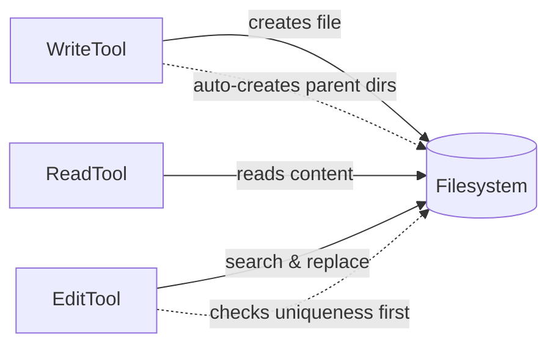
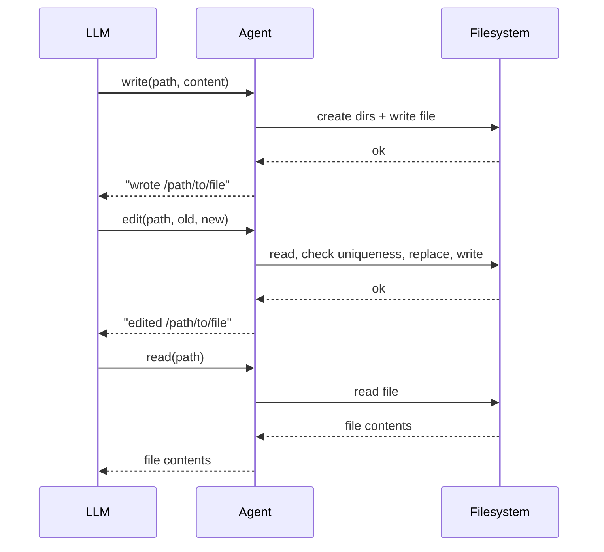

# Chapter 9: File Tools

> **File(s) to edit:** `src/tools/write.rs`, `src/tools/edit.rs`
> (the `TODO ch9:` stubs). `src/tools/read.rs` was completed back in
> [Chapter 2](./ch02-first-tool.md) — this chapter revisits it as the
> baseline and contrasts it with the design decisions that come with
> writing and editing.
> **Tests to run:** `cargo test -p mini-claw-code-starter test_read_` (ReadTool), `cargo test -p mini-claw-code-starter test_write_` (WriteTool), `cargo test -p mini-claw-code-starter test_edit_` (EditTool)
> **Estimated time:** 50 min

## Goal

- Revisit `ReadTool` (built in Ch2) as the baseline and understand the
  trade-offs of its minimal design vs. production tools that add
  line-numbering and offset/limit.
- Implement `WriteTool` with automatic parent directory creation so the agent can create new files without a separate `mkdir` step.
- Implement `EditTool` with a uniqueness check so the agent can make surgical string replacements in existing files.
- Understand why tool errors are returned as `Err(...)` in the starter (the agent loop converts them to messages the LLM can read and recover from -- the detailed rationale is in [Chapter 6 §"Why tool errors never terminate the agent"](./ch06-tool-interface.md#why-tool-errors-never-terminate-the-agent)).

A coding agent that cannot touch the filesystem is just a chatbot with delusions
of grandeur. It can describe code changes, suggest fixes, explain algorithms --
but it cannot do any of it. The tools you built in Chapter 6 gave your agent
hands. In this chapter you give those hands something to hold: files.

File operations are the most fundamental tools in any coding agent's toolkit.
Claude Code ships with Read, Write, and Edit tools (among many others), and
every competitor -- Cursor, Aider, OpenCode -- has its own version. The
operations are simple (read bytes, write bytes, search-and-replace), but the
design choices around them determine whether the agent can reliably modify a
codebase or whether it stumbles over its own edits. You will implement all three
tools in this chapter: `ReadTool`, `WriteTool`, and `EditTool`.

## How the file tools work together





---

## 6.1 ReadTool

`ReadTool` is the simplest of the file tools: it takes a path, reads the file
with `tokio::fs::read_to_string`, and returns the raw contents as a string. No
line numbering, no offset/limit, no transformation. That is what both the
starter and the reference implementation (`mini-claw-code/src/tools/read.rs`)
do -- we keep it deliberately minimal so the rest of the chapter (Write, Edit)
has room to breathe.

### Design discussion: why production agents add more

Production agents like Claude Code go further. Their read tool typically
numbers every line (`cat -n` style) and supports partial reads via `offset` and
`limit` parameters. Two reasons this matters in real systems:

- **Line numbers give the LLM a coordinate system.** "Replace the string on
  line 42" is precise. "Replace the string somewhere around the middle of the
  function" is not. This becomes especially valuable for the Edit tool, where
  the model has to produce an exact string to match and numbered lines help it
  copy the right chunk.
- **Offset/limit protects the context window.** A single 50k-line generated
  file can blow past the model's context. Paginated reads let the LLM fetch
  what it needs without burning the whole budget on one file.

Neither of these appear in the starter *or* the reference implementation in
this book -- they are extensions we point at but deliberately leave out so the
core `Tool` implementation stays a dozen lines. Adding them yourself is one of
the listed extensions at the end of the chapter.

### The starter stub

Open `src/tools/read.rs`:

```rust
use anyhow::Context;
use serde_json::Value;

use crate::types::*;

pub struct ReadTool {
    definition: ToolDefinition,
}

impl Default for ReadTool {
    fn default() -> Self {
        Self::new()
    }
}

impl ReadTool {
    /// Create a new ReadTool with its JSON schema definition.
    ///
    /// The schema should declare one required parameter: "path" (string).
    pub fn new() -> Self {
        unimplemented!(
            "Create a ToolDefinition with name \"read\" and a required \"path\" parameter"
        )
    }
}

#[async_trait::async_trait]
impl Tool for ReadTool {
    fn definition(&self) -> &ToolDefinition {
        &self.definition
    }

    async fn call(&self, _args: Value) -> anyhow::Result<String> {
        unimplemented!(
            "Extract \"path\" from args, read file with tokio::fs::read_to_string, return contents"
        )
    }
}
```

You need to fill in two methods:

1. **`new()`** -- build a `ToolDefinition` with name `"read"` and a required `"path"` parameter.
2. **`call()`** -- extract the path, read the file, and return its contents.

### Implementing the ReadTool

**The definition.** One required parameter: `path`. The LLM sees this as a JSON
Schema and knows it must provide `path`.

```rust
pub fn new() -> Self {
    Self {
        definition: ToolDefinition::new("read", "Read the contents of a file.")
            .param("path", "string", "Absolute path to the file", true),
    }
}
```

**The `call()` method.** Read the file and return its contents as a `String`:

```rust
async fn call(&self, args: Value) -> anyhow::Result<String> {
    let path = args["path"]
        .as_str()
        .context("missing 'path' argument")?;

    let content = tokio::fs::read_to_string(path)
        .await
        .with_context(|| format!("failed to read '{path}'"))?;

    Ok(content)
}
```

### Rust concept: anyhow::Context for rich errors

The `.context("missing 'path' argument")?` and `.with_context(|| format!("failed to read '{path}'"))` calls wrap the underlying error with a human-readable message. `context()` takes a static string; `with_context()` takes a closure for dynamic messages (avoiding the allocation when the `?` path is not taken). Both return `anyhow::Error`, which chains the original error underneath -- so the full error message reads like `"failed to read 'foo.rs': No such file or directory"`. This chaining is what makes `anyhow` errors informative without custom error types.

Notice that `call()` returns `anyhow::Result<String>`, not `ToolResult`. The
starter's `Tool` trait is simplified -- tools return plain strings on success.
If the tool encounters an error (missing argument, I/O failure), it returns
`Err(...)`. The agent loop converts errors to error messages that the LLM sees.

**Possible extensions.** A production-grade `ReadTool` would add `offset` and
`limit` parameters for partial reads and format output with tab-separated line
numbers (like `cat -n`). Neither is in this book's reference implementation;
both are well-scoped exercises if you want to go further.

### What the output looks like

Given a file with three lines:

```
alpha
beta
gamma
```

The tool returns the raw file contents:

```
alpha
beta
gamma
```

This is the simplest approach. Production tools extend it with line numbers
and partial-read support, which are useful for large files and for giving the
LLM precise line references for later edits -- see the design discussion
above.

---

## 6.2 WriteTool

Writing a file is conceptually simple: take a path and content, write the
content to the path. But there is one practical detail that makes a big
difference: creating parent directories automatically.

When the LLM writes `src/handlers/auth/middleware.rs`, the `src/handlers/auth/`
directory might not exist yet. A naive tool would fail with "No such file or
directory." The agent would then need to call `bash("mkdir -p ...")` and retry.
This wastes a tool-use round and confuses the model. Better to handle it
silently.

### The starter stub

Open `src/tools/write.rs`:

```rust
use anyhow::Context;
use serde_json::Value;

use crate::types::*;

pub struct WriteTool {
    definition: ToolDefinition,
}

impl Default for WriteTool {
    fn default() -> Self {
        Self::new()
    }
}

impl WriteTool {
    /// Schema: required "path" and "content" parameters.
    pub fn new() -> Self {
        unimplemented!(
            "Use ToolDefinition::new(name, description).param(...).param(...)"
        )
    }
}

#[async_trait::async_trait]
impl Tool for WriteTool {
    fn definition(&self) -> &ToolDefinition {
        &self.definition
    }

    async fn call(&self, _args: Value) -> anyhow::Result<String> {
        unimplemented!(
            "Extract path and content, create parent dirs, write file, return format!(\"wrote {path}\")"
        )
    }
}
```

### Implementing the WriteTool

**The definition.** Two required parameters: `path` and `content`.

```rust
pub fn new() -> Self {
    Self {
        definition: ToolDefinition::new("write", "Write content to a file, creating directories as needed")
            .param("path", "string", "Absolute path to write to", true)
            .param("content", "string", "Content to write", true),
    }
}
```

**The `call()` method.** Extract the arguments, create parent directories,
write the file, and return a confirmation string:

```rust
async fn call(&self, args: Value) -> anyhow::Result<String> {
    let path = args["path"]
        .as_str()
        .context("missing 'path' argument")?;
    let content = args["content"]
        .as_str()
        .context("missing 'content' argument")?;

    // Create parent directories
    if let Some(parent) = std::path::Path::new(path).parent() {
        if !parent.as_os_str().is_empty() {
            tokio::fs::create_dir_all(parent).await?;
        }
    }

    tokio::fs::write(path, content).await?;

    Ok(format!("wrote {path}"))
}
```

The return value is `format!("wrote {path}")` -- a simple confirmation string.
The agent sees this and knows the write succeeded.

### Walking through the code

**Two required parameters.** Both `path` and `content` are required. There is no
optional behavior here -- you always need both.

**Auto-creating directories.** The `create_dir_all` call is the key design
choice. It mirrors `mkdir -p` -- if the directory already exists, it is a no-op.
If intermediate directories are missing, it creates them all. The guard
`!parent.as_os_str().is_empty()` handles the edge case where the path has no
parent component (e.g., a bare filename like `"file.txt"`), where calling
`create_dir_all("")` would fail.

**Overwrite semantics.** `tokio::fs::write` overwrites the file if it already
exists and creates it if it does not. There is no append mode, no conflict
detection. This is deliberate -- the tool is a clean write, not a merge. If the
LLM wants to modify an existing file, it should use the Edit tool.

**Confirmation string.** The result reports `"wrote /path/to/file"`. This gives
the model confirmation that the write succeeded.

---

## 6.3 EditTool

The Edit tool is the most interesting of the three, and it teaches the most
important design lesson in this book: **errors are values, not exceptions**.

The Edit tool performs a search-and-replace on a file. It takes a path, an
`old_string` to find, and a `new_string` to replace it with. The critical
constraint: `old_string` must appear exactly once in the file. Zero matches
means the model got the string wrong. More than one match means the replacement
is ambiguous -- we do not know which occurrence to change.

Both of these are expected failure modes, not bugs. The model frequently gets
strings slightly wrong (missing whitespace, wrong indentation, stale content
from a previous edit). The tool must report these failures clearly so the model
can correct itself.

### The starter stub

Open `src/tools/edit.rs`:

```rust
use anyhow::{Context, bail};
use serde_json::Value;

use crate::types::*;

pub struct EditTool {
    definition: ToolDefinition,
}

impl Default for EditTool {
    fn default() -> Self {
        Self::new()
    }
}

impl EditTool {
    /// Schema: required "path", "old_string", "new_string" parameters.
    pub fn new() -> Self {
        unimplemented!(
            "Use ToolDefinition::new(name, description).param(...).param(...).param(...)"
        )
    }
}

#[async_trait::async_trait]
impl Tool for EditTool {
    fn definition(&self) -> &ToolDefinition {
        &self.definition
    }

    async fn call(&self, _args: Value) -> anyhow::Result<String> {
        unimplemented!(
            "Extract args, read file, verify old_string appears exactly once, replace, write back"
        )
    }
}
```

### Implementing the EditTool

**The definition.** Three required parameters: `path`, `old_string`, and
`new_string`.

```rust
pub fn new() -> Self {
    Self {
        definition: ToolDefinition::new(
            "edit",
            "Replace an exact string in a file. The old_string must appear exactly once.",
        )
        .param("path", "string", "Absolute path to the file to edit", true)
        .param("old_string", "string", "The exact string to find", true)
        .param("new_string", "string", "The replacement string", true),
    }
}
```

**The `call()` method.** Read the file, check uniqueness, replace, write back:

```rust
async fn call(&self, args: Value) -> anyhow::Result<String> {
    let path = args["path"]
        .as_str()
        .context("missing 'path' argument")?;
    let old = args["old_string"]
        .as_str()
        .context("missing 'old_string' argument")?;
    let new = args["new_string"]
        .as_str()
        .context("missing 'new_string' argument")?;

    let content = tokio::fs::read_to_string(path)
        .await
        .with_context(|| format!("failed to read '{path}'"))?;

    let count = content.matches(old).count();
    if count == 0 {
        bail!("old_string not found in '{path}'");
    }
    if count > 1 {
        bail!("old_string appears {count} times in '{path}', must be unique");
    }

    let updated = content.replacen(old, new, 1);
    tokio::fs::write(path, &updated).await?;

    Ok(format!("edited {path}"))
}
```

The return value is `format!("edited {path}")` on success.

### Walking through the code

**Three required parameters.** `path`, `old_string`, and `new_string` are all
required. The model must specify exactly what to find and what to replace it
with. There is no regex, no line-number-based editing, no diff format. Just
plain string replacement. This simplicity is a feature -- it is unambiguous and
easy for the model to use correctly.

**The uniqueness check.** This is the heart of the tool:

```rust
let count = content.matches(old).count();
if count == 0 {
    bail!("old_string not found in '{path}'");
}
if count > 1 {
    bail!("old_string appears {count} times in '{path}', must be unique");
}
```

### Rust concept: bail! macro

`bail!("old_string not found in '{path}'")` is shorthand for `return Err(anyhow::anyhow!("..."))`. It immediately returns an error from the function with the given message. It is part of the `anyhow` crate and works in any function that returns `anyhow::Result`. Compare with `?` (which propagates an existing error) -- `bail!` creates a new error on the spot.

Two branches, both returning errors via `bail!`. In the starter's simplified
`Tool` trait, tools return `anyhow::Result<String>`. When the tool returns an
`Err`, the agent loop converts it to an error message that the LLM sees. The
model can then retry with a corrected string.

### Error handling in the simplified trait

The starter's `Tool` trait returns `anyhow::Result<String>` from `call()`. This
means error handling is straightforward -- use `bail!()` or `?` for any failure,
and the agent loop takes care of converting errors to messages the LLM can read.

In the agent's `execute_tools` method, a tool call is handled like this:

```rust
match tool.call(call.arguments.clone()).await {
    Ok(result) => result,
    Err(e) => format!("error: {e}"),
}
```

An `Err` from `call()` becomes a string like `"error: old_string not found in 'foo.rs'"`.
The model sees this and knows to try a different string.

A more sophisticated design (used by Claude Code) distinguishes between
recoverable tool-level errors (returned as success values) and genuine I/O
failures (returned as `Err`). The starter keeps things simple by using `Err`
for both -- the agent loop handles them the same way regardless.

---

## 6.4 Integration: Write, Edit, Read

The real power of these tools comes from combining them. A typical agent
workflow looks like this:

1. **Write** a new file
2. **Edit** to fix a bug or refine the code
3. **Read** to verify the result

Here is what that looks like as tool calls:

```
Agent: I'll create the handler file.
-> write(path: "/tmp/project/handler.rs", content: "fn main() { println!(\"hello\"); }")
<- "wrote /tmp/project/handler.rs"

Agent: Let me update the greeting.
-> edit(path: "/tmp/project/handler.rs", old_string: "hello", new_string: "goodbye")
<- "edited /tmp/project/handler.rs"

Agent: Let me verify the change.
-> read(path: "/tmp/project/handler.rs")
<- "fn main() { println!(\"goodbye\"); }"
```

Each tool does one thing and communicates its result clearly. The agent sees
the output of each step and decides what to do next. If the edit had failed
(wrong string), the agent would see the error and retry with the correct string.

This write-edit-read pattern is how Claude Code modifies files in practice. It
does not generate a complete file and overwrite -- that would lose any content
outside the modified section. Instead, it uses surgical edits on the specific
lines that need to change, then reads the result to confirm. This is more
reliable and produces smaller diffs.

---

## 6.5 How Claude Code does it

Claude Code's file tools follow the same protocol but with more sophistication:

**Read** supports images and PDFs. It detects binary files and renders them
appropriately (base64-encoded images are sent as multimodal content blocks).
It has smarter truncation with token counting rather than character counting,
and it warns when a file is empty.

**Write** checks for protected files. Claude Code maintains a list of files
that should never be overwritten (`.env`, `credentials.json`, etc.) and blocks
writes to them. It also integrates with the permission system to require user
approval before overwriting existing files in certain modes.

**Edit** is considerably more powerful. It supports multiple edits in a single
call, has a diff preview mode, handles encoding detection, and validates that
the edit produces syntactically valid code (for supported languages). It also
has a more nuanced uniqueness check that considers context lines around the
match to disambiguate.

But the core protocol is identical to what you just built. A struct holds the
definition. The `Tool` trait provides the interface. The `call` method does
the work. The agent loop dispatches and collects results. Understanding our
three simple tools gives you the foundation to understand Claude Code's full
tool suite.

---

## 6.6 Tool file organization

All three tools live in `src/tools/`, alongside the other tools you will build
in later chapters. The module structure in the starter:

```
src/tools/
  mod.rs    -- re-exports all tools
  ask.rs    -- AskTool (bonus)
  bash.rs   -- BashTool (Chapter 10)
  edit.rs   -- EditTool
  read.rs   -- ReadTool
  write.rs  -- WriteTool
```

The `mod.rs` barrel re-exports everything:

```rust
mod ask;
mod bash;
mod edit;
mod read;
mod write;

pub use ask::*;
pub use bash::BashTool;
pub use edit::EditTool;
pub use read::ReadTool;
pub use write::WriteTool;
```

This lets consumers write `use crate::tools::{ReadTool, WriteTool, EditTool}`
without reaching into individual modules.

---

## 6.7 Tests

Run the file tool tests:

```bash
cargo test -p mini-claw-code-starter test_read_   # ReadTool
cargo test -p mini-claw-code-starter test_write_  # WriteTool
cargo test -p mini-claw-code-starter test_edit_   # EditTool
```

Cargo test filters are substring matches, not regex, so you cannot OR them
together into a single invocation. Run the three commands separately, or
drop all three prefixes with a catch-all like
`cargo test -p mini-claw-code-starter -- --test-threads=1` if you want to
see everything at once.

Here is what each test verifies:

### ReadTool tests (in `test_read_`)

- **`test_read_read_definition`** -- Checks that the tool definition has the name "read".
- **`test_read_read_file`** -- Reads a file and verifies the content appears in the output.
- **`test_read_read_missing_file`** -- Attempts to read a file that does not exist. Verifies that the result is an `Err`.

### WriteTool tests (in ``)

- **`test_write_creates_file`** -- Writes content to a new file, verifies the result contains a confirmation, and reads back the file to confirm the content.
- **`test_write_creates_dirs`** -- Writes to a file inside nested directories. All intermediate directories are created automatically.
- **`test_write_overwrites_existing`** -- Writes to a file that already has content. Verifies the old content is replaced.

### EditTool tests (in ``)

- **`test_edit_replaces_string`** -- Edits a string in a file. Verifies the result says "edited" and the file is updated.
- **`test_edit_not_found`** -- Attempts to replace a string that does not exist. Verifies the result is an `Err`.
- **`test_edit_not_unique`** -- Attempts to replace a string that appears multiple times. Verifies the error mentions the ambiguity.

---

## Recap

Three tools, one pattern. Every tool in this chapter follows the same structure:

1. **A struct** with a `definition: ToolDefinition` field.
2. **A `new()` constructor** that builds the definition with the parameter builder from Chapter 4.
3. **A `Tool` impl** with `definition()` and `call()`.

The pattern scales. When you add Bash in Chapter 10, the shape is identical --
only the `call()` logic changes. This is the power of the `Tool` trait: a
uniform interface that makes every tool interchangeable from the agent's
perspective.

The key lessons from this chapter:

- **Automate the obvious.** The `WriteTool` creates parent directories
  automatically, saving the agent a wasted tool-use round.
- **Check uniqueness.** The `EditTool` requires the old string to appear exactly
  once. Zero matches means the model got the string wrong. Multiple matches
  means the replacement is ambiguous.
- **Errors propagate cleanly.** Tools return `anyhow::Result<String>`. The agent
  loop catches errors and converts them to messages the LLM can read and recover
  from.

## Key takeaway

File tools are the agent's hands on the codebase. The three-tool split -- read, write, edit -- gives the LLM clear verbs for distinct operations rather than one overloaded "file" tool. The `EditTool`'s uniqueness check is the single most important design decision: it forces the LLM to provide an unambiguous match, catching mistakes early and enabling reliable self-correction.

In [Chapter 10: Bash Tool](./ch10-bash-tool.md), you will build the most
powerful (and most dangerous) tool in the agent's arsenal -- one that can run
arbitrary shell commands.

---

[← Chapter 8: System Prompt](./ch08-system-prompt.md) · [Contents](./ch00-overview.md) · [Chapter 10: Bash Tool →](./ch10-bash-tool.md)
