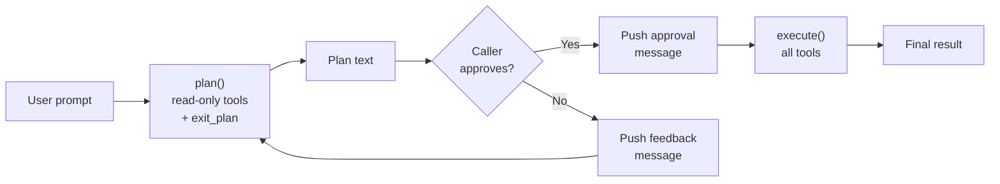

# Chapter 16: Plan Mode

> **File(s) to edit:** `src/planning.rs`
> **Test to run:** `cargo test -p mini-claw-code-starter plan`
> **Estimated time:** 50 min

Your agent can now read files, write code, run shell commands, and do all of it
under a permission system with safety checks and hooks. There is one problem:
it does everything at once. The model reads a file, immediately rewrites it,
runs the tests, and keeps going -- all in a single uninterrupted loop. If the
model misunderstands the task, it has already modified your codebase before you
had a chance to say "wait, that is not what I meant."

Plan mode fixes this by splitting the agent loop into two phases. First, the
agent analyzes the task using only read-only tools -- reading files, searching
code, listing directories. It produces a plan. Then, the caller (you, or your
UI) inspects the plan, approves it, and the agent executes with all tools
available. Think before you act. It is advice that works for humans and agents
alike.

This pattern is not hypothetical. Claude Code ships with a plan mode that
restricts the agent to read-only operations until the user explicitly approves
the plan. Every serious coding agent has some version of this -- a way to let
the model reason about a task before committing to changes. The `is_read_only()`
flag you set on tools back in Chapter 12 has been waiting for exactly this moment.

```bash
cargo test -p mini-claw-code-starter plan
```

## Goal

- Build a `PlanAgent` with two distinct phases: `plan()` (read-only tools only) and `execute()` (all tools available).
- Implement the `exit_plan` virtual tool that lets the LLM explicitly signal "I am done planning" without requiring a `StopReason::Stop`.
- Enforce two layers of write protection during planning: filter tool definitions so the LLM does not see write tools, and block write tool calls at execution time as a fallback.
- Maintain message continuity between phases so the execution phase has full context from the planning phase.

---

## Why a separate agent?

You could implement plan mode as a flag on `SimpleAgent` -- add a `plan_mode:
bool` field, check it in `execute_tools`, filter definitions accordingly. That
works but tangles two concerns. The `SimpleAgent` is the general-purpose agent
loop. Plan mode is a higher-level workflow with distinct phases, transitions,
and a virtual tool that does not exist in the tool set. Mixing them muddies both.

The `PlanAgent` is a separate struct that wraps the same building blocks --
a provider, a `ToolSet` -- but orchestrates them differently.
Two methods, `plan()` and `execute()`, implement the two phases. The caller
controls the transition between them. This keeps the `SimpleAgent` simple and
gives the `PlanAgent` full control over its workflow.

Claude Code takes a similar approach. Its plan mode sets `PermissionMode::Plan`,
which the permission engine enforces (only read-only tools pass). The UI shows
a "Plan Mode" banner and the agent's plan before asking for approval. Our
`PlanAgent` encapsulates the same two-phase pattern with caller-driven approval.

---

## The PlanAgent struct

```rust
use std::collections::HashSet;

use tokio::sync::mpsc;

use crate::agent::{AgentEvent, tool_summary};
use crate::streaming::{StreamEvent, StreamProvider};
use crate::types::*;

pub struct PlanAgent<P: StreamProvider> {
    provider: P,
    tools: ToolSet,
    read_only: HashSet<&'static str>,
    plan_system_prompt: String,
    exit_plan_def: ToolDefinition,
}
```

Five fields, each with a clear role:

- **`provider`** -- The LLM backend. Note the `StreamProvider` bound -- the
  `PlanAgent` uses streaming internally for the plan/execute loop.
- **`tools`** -- The full tool set. During planning, only a subset is exposed.
  During execution, all tools are available.
- **`read_only`** -- An explicit set of tool names allowed during planning.
  Only the listed tools are available during the plan phase.
- **`plan_system_prompt`** -- The system prompt injected during planning. A
  default is provided via the `DEFAULT_PLAN_PROMPT` constant.
- **`exit_plan_def`** -- The `ToolDefinition` for the virtual `exit_plan` tool.
  This tool is injected into the plan phase's tool list but does not exist in
  the `ToolSet`. It is a signal, not a real tool.

### The builder

The builder follows the same `new()` + chaining pattern as `SimpleAgent`.
The `new()` constructor creates the `exit_plan_def` with a description that
tells the model what it does. This definition has no parameters -- the model
just calls it to signal "I am done planning."

```rust
let agent = PlanAgent::new(provider)
    .tool(ReadTool::new())
    .tool(WriteTool::new())
    .read_only(&["read"])
    .plan_prompt("You are a security auditor.");
```

Two builder methods are specific to `PlanAgent`:

- **`read_only(&[&'static str])`** -- Sets the tool names allowed during
  planning. If you call `.read_only(&["bash", "read"])`, only `bash` and `read`
  are available during planning. This is useful for specialized workflows where
  you want the agent to run commands (like `git log` or `cargo test --dry-run`)
  during analysis.

- **`plan_prompt(impl Into<String>)`** -- Replaces the default planning system
  prompt. The default says "You are in PLANNING MODE. Explore the codebase using
  the available tools and create a plan." A custom prompt can focus the agent on
  a specific concern: security auditing, performance analysis, migration planning.

---

## The two phases

The core of `PlanAgent` is two methods: `plan()` and `execute()`. They share
the same loop structure as the SimpleAgent's `chat()`, but with different tool
sets and different termination conditions. Both methods also take an
`mpsc::UnboundedSender<AgentEvent>` for streaming events back to the caller.



The caller drives the transition. After `plan()` returns, the caller can:
1. Show the plan to the user
2. Push a `Message::user("Approved. Go ahead.")` into the message history
3. Call `execute()` with the same message vec

Or the caller can reject the plan, push feedback, and call `plan()` again.
The `PlanAgent` does not care -- it has no built-in UI, no approval dialog.
It is a workflow agent, not a user interface.

---

## Phase 1: plan()

The planning phase runs a restricted agent loop. Only read-only tools and the
virtual `exit_plan` tool are available. Both `plan()` and `execute()` delegate
to a shared `run_loop()` method:

```rust
pub async fn plan(
    &self,
    messages: &mut Vec<Message>,
    events: mpsc::UnboundedSender<AgentEvent>,
) -> anyhow::Result<String> {
    // Inject system prompt if needed
    // Call run_loop with Some(&self.read_only)
    unimplemented!()
}

pub async fn execute(
    &self,
    messages: &mut Vec<Message>,
    events: mpsc::UnboundedSender<AgentEvent>,
) -> anyhow::Result<String> {
    // Call run_loop with None (no restrictions)
    unimplemented!()
}
```

The `run_loop()` method is the shared agent loop. When `allowed` is `Some`,
only those tools plus `exit_plan` are permitted. When `allowed` is `None`,
all tools are available:

Here is the full implementation of `run_loop`:

```rust
async fn run_loop(
    &self,
    messages: &mut Vec<Message>,
    allowed: Option<&HashSet<&'static str>>,
    events: mpsc::UnboundedSender<AgentEvent>,
) -> anyhow::Result<String> {
    // Step 1: filter tool definitions
    let all_defs = self.tools.definitions();
    let defs: Vec<&ToolDefinition> = match allowed {
        Some(names) => {
            let mut filtered: Vec<&ToolDefinition> = all_defs
                .into_iter()
                .filter(|d| names.contains(d.name))
                .collect();
            filtered.push(&self.exit_plan_def);
            filtered
        }
        None => all_defs,
    };

    loop {
        // Step 2: stream the LLM response (forward text deltas to UI)
        let (stream_tx, mut stream_rx) = mpsc::unbounded_channel();
        let events_clone = events.clone();
        let forwarder = tokio::spawn(async move {
            while let Some(event) = stream_rx.recv().await {
                if let StreamEvent::TextDelta(ref text) = event {
                    let _ = events_clone.send(AgentEvent::TextDelta(text.clone()));
                }
            }
        });

        let turn = self.provider.stream_chat(messages, &defs, stream_tx).await?;
        let _ = forwarder.await;

        // Step 3: match on stop reason
        match turn.stop_reason {
            StopReason::Stop => {
                let text = turn.text.clone().unwrap_or_default();
                let _ = events.send(AgentEvent::Done(text.clone()));
                messages.push(Message::Assistant(turn));
                return Ok(text);
            }
            StopReason::ToolUse => {
                let mut results = Vec::with_capacity(turn.tool_calls.len());

                for call in &turn.tool_calls {
                    // Handle exit_plan
                    if allowed.is_some() && call.name == "exit_plan" {
                        let text = turn.text.clone().unwrap_or_default();
                        let _ = events.send(AgentEvent::Done(text.clone()));
                        messages.push(Message::Assistant(turn));
                        messages.push(Message::ToolResult {
                            id: call.id.clone(),
                            content: "Plan submitted for review.".into(),
                        });
                        return Ok(text);
                    }

                    // Block tools not in allowed set
                    if let Some(names) = allowed {
                        if !names.contains(call.name.as_str()) {
                            results.push((
                                call.id.clone(),
                                format!("error: tool `{}` is not available in planning mode",
                                    call.name),
                            ));
                            continue;
                        }
                    }

                    // Execute allowed tools
                    let content = match self.tools.get(&call.name) {
                        Some(t) => t.call(call.arguments.clone()).await
                            .unwrap_or_else(|e| format!("error: {e}")),
                        None => format!("error: unknown tool `{}`", call.name),
                    };
                    results.push((call.id.clone(), content));
                }

                messages.push(Message::Assistant(turn));
                for (id, content) in results {
                    messages.push(Message::ToolResult { id, content });
                }
            }
        }
    }
}
```

The structure mirrors the SimpleAgent's chat loop. Same loop, same provider
call, same stop-reason match. But the `PlanAgent` uses streaming internally
via `StreamProvider`, and three things are different:

### 1. System prompt injection

Before entering the loop, `plan()` injects the planning system prompt at
position 0 of the message history (if not already present), telling the model
it is in planning mode.

### 2. Filtered tool definitions

The plan phase filters tool definitions to only include tools in the
`read_only` set, plus the `exit_plan` tool. The model cannot see write tools
in its schema, so it has no reason to call them.

### 3. The exit_plan escape hatch

When the model calls `exit_plan`, the plan phase ends immediately. The loop
pushes the assistant message and a synthetic tool result ("Plan submitted for review.")
into the history, then returns. The synthetic result is necessary because the
API requires every tool call to have a corresponding result -- without it, the
next provider call would fail.

The plan phase can end in two ways:
- **`StopReason::Stop`** -- The model produces a text response directly. This
  is the implicit exit.
- **`exit_plan` tool call** -- The model explicitly signals it is done
  analyzing. This is the explicit exit.

Both return the plan text (which may be empty if the model put its plan in
tool calls rather than text).

---

## The exit_plan tool

The `exit_plan` tool deserves its own section because it is unusual. It is not
a real tool. It does not exist in the `ToolSet`. It has no `call()` method. It
is a `ToolDefinition` with a name and description, injected into the plan
phase's tool list so the model sees it as an option.

Why not just rely on `StopReason::Stop`? In principle you could: tell the
model "when you are done planning, emit your plan as plain text and stop."
In practice this fights against two behaviours baked into most instruction-tuned
models.

1. **When tools are visible, models keep using them.** Present a model with
   `read`, `glob`, `grep`, and a user prompt, and it will happily spend ten
   turns exploring the codebase before producing any narrative output. There
   is no natural stopping gradient -- one more `grep` is always plausible.
   Without a deliberate stopping signal, the plan phase drags on.
2. **Plain-text stops are easy to mistake for partial work.** A model that
   ends a turn with "Next, I need to check how X is wired" is signalling
   "I am still working" even when `stop_reason == Stop`. The caller cannot
   easily distinguish a finished plan from a mid-thought pause.

`exit_plan` sidesteps both problems. It is a tool the model must *actively
choose to call*, which reads as an explicit commitment ("I am ready"). It
carries the plan text as its argument, so the plan and the stop signal arrive
in the same structured message. And because it lives in the same tool-call
slot the model is already used to, the behaviour composes naturally with the
rest of the loop. It is a social contract expressed as a tool schema.

When the model calls `exit_plan`, the loop detects it by name, pushes the
assistant message, finds the call's ID, and pushes a synthetic `ToolResult`
with "Plan submitted for review." The synthetic result is important -- the message
protocol requires every `ToolCall` to have a matching `ToolResult`. Skip it
and the next API call fails with a malformed request.

---

## Phase 2: execute()

The execution phase is a standard agent loop with the full tool set. No
filtering, no virtual tools, no special termination. The `execute()` method
calls `run_loop(messages, None, events)` -- passing `None` for the allowed set
means all tools are available.

The key point: `execute()` receives the same `&mut Vec<Message>` that `plan()`
used. The message history from planning -- the system prompt, the user request,
the read-only tool calls, the plan text -- is all still there. The model enters
execution with full context of what it analyzed and what it decided to do. This
continuity is what makes the two-phase pattern effective. The model does not
start from scratch; it picks up where it left off.

Between `plan()` and `execute()`, the caller typically pushes a user message:

```rust
let (tx, _rx) = mpsc::unbounded_channel();
let plan = agent.plan(&mut messages, tx.clone()).await?;
println!("Plan: {plan}");

// User approves
messages.push(Message::user("Approved. Go ahead."));

let result = agent.execute(&mut messages, tx).await?;
```

This approval message becomes part of the context for execution. The model sees
it and knows it has permission to proceed with modifications.

---

## Defense in depth: tool filtering

The plan phase uses two layers of protection to prevent write operations:

### Layer 1: Definition filtering

The `run_loop` method filters the tool schemas sent to the model when an
`allowed` set is provided. Only tools whose names are in the set are included,
plus `exit_plan`.

If the model does not see a tool in its schema, it has no reason to call it.
This is the primary defense -- remove the temptation.

### Layer 2: Execution guard

Even if the model somehow requests a blocked tool (hallucination, prompt
injection, or a creative interpretation of the schema), the `run_loop` method
catches it. For each tool call, three things happen:

1. **`exit_plan` is handled specially** -- When the model calls `exit_plan`, the
   loop returns the plan text immediately. A synthetic tool result is pushed
   so the message history stays valid.

2. **Blocked tools return errors** -- If a tool is not in the `allowed` set, the
   tool is not executed. Instead, an error string is returned to the model. The
   model sees this error, understands the constraint, and adjusts.

3. **Allowed tools execute normally** -- Lookup, call, return result. The same
   pipeline as the SimpleAgent's tool execution.

Both layers must fail for a write operation to slip through during planning.

### Key Rust concept: `HashSet<&'static str>` for zero-cost string sets

The `read_only` field uses `&'static str` rather than `String`. This means the set contains references to string literals that live for the entire program -- no heap allocation, no cloning. The `'static` lifetime tells the compiler these strings never become invalid, which is always true for string literals like `"read"` or `"bash"`. The trade-off is that you can only put compile-time-known strings into the set, not dynamically generated ones. For tool names, which are always known at compile time, this is the ideal choice.

### The read_only set

The `read_only` field is a `HashSet<&'static str>` containing the tool names
allowed during planning. It is set via the `read_only()` builder method:

```rust
pub fn read_only(mut self, names: &[&'static str]) -> Self {
    self.read_only = names.iter().cloned().collect();
    self
}
```

Unlike the reference implementation which can fall back to checking
`is_read_only()` flags on tools, the starter requires you to explicitly name
the allowed tools. This is simpler -- there are no `is_read_only()` or
`is_destructive()` methods on the `Tool` trait in the starter.

---

## System prompt injection

The plan phase injects a system message to tell the model it is in planning
mode. This is handled by `maybe_inject_plan_prompt()`:

```rust
fn maybe_inject_plan_prompt(&self, messages: &mut Vec<Message>) {
    // Don't inject if a system message already exists
    let has_system = messages
        .first()
        .is_some_and(|m| matches!(m, Message::System(_)));

    if !has_system {
        messages.insert(0, Message::System(self.plan_system_prompt.clone()));
    }
}
```

Three design decisions here:

1. **Respect existing system prompts** -- The method checks whether any
   `Message::System` is already present at position 0. If the caller already
   set a system prompt (e.g., "You are a security auditor"), plan mode respects
   it rather than overwriting it. If `plan()` is called twice, the second call
   finds the existing message and skips injection.

2. **Position 0** -- The planning prompt is inserted at the beginning of the
   message list, before any existing messages. System prompts at position 0
   have the strongest influence on model behavior.

3. **Custom or default** -- If `plan_prompt()` was called on the builder, that
   text is used. Otherwise, the default tells the model it is in planning mode,
   should use read-only tools, and should call `exit_plan` when done.

---

## The full plan-execute flow

Let's trace through a realistic scenario to see how everything fits together.
The user wants to copy a source file to a new location.

**Setup:**

```rust
let engine = PlanAgent::new(provider)
    .tool(ReadTool::new())
    .tool(WriteTool::new());

let mut messages = vec![Message::user("Copy src.txt to dst.txt")];
```

**Plan phase** -- `plan()` injects the planning system prompt, filters
definitions to `[read, exit_plan]` (write is excluded), and enters the loop.
The model calls `read(path="src.txt")`, sees the contents, and returns
"I'll copy src.txt to dst.txt."

**Approval** -- The caller prints the plan and pushes a user message:

```rust
println!("Plan: {}", plan);
messages.push(Message::user("Approved. Go ahead."));
```

**Execute phase** -- `execute()` exposes all tools. The model calls
`write(path="dst.txt", content="source content")`, the file is created on disk,
and the model returns "Done! Copied the file."

The message history at the end contains the complete trace: planning system
prompt, user request, read-only analysis, plan text, approval, write operation,
final confirmation. The model had full context at every step.

---

## Event streaming: plan_with_events()

Like `SimpleAgent`, the `PlanAgent` has an event-streaming variant.
The plan/execute methods take an `mpsc::UnboundedSender<AgentEvent>` and emit
`ToolCall`, `TextDelta`, `Done`, and `Error` events as the phase runs.
The pattern mirrors `run_with_events()` from the agent module.

A TUI would use this to show a spinner while the agent reads files during
planning, display the plan text as it streams, and prompt the user for approval
before calling `execute()`.

---

## How Claude Code does it

Claude Code's plan mode follows the same two-phase pattern but integrates more
deeply with the permission system.

| Feature | Our PlanAgent | Claude Code |
|---------|---------------|-------------|
| Tool filtering | Explicit read-only set | `PermissionMode::Plan` flag |
| UI integration | Caller-driven (no built-in UI) | "Plan Mode" banner in TUI |
| Approval flow | Caller pushes user message | UI dialog with approve/reject |
| System prompt | Tagged `plan_mode` message | Mode-specific prompt section |
| Exit signal | `exit_plan` virtual tool | Mode transition in permission engine |
| Write blocking | Two layers (definitions + execution) | Permission engine rejects non-read-only |

The biggest difference is where the enforcement happens. In Claude Code, the
permission engine handles it -- plan mode is just another permission mode that
rejects non-read-only tool calls. The `SimpleAgent` does not need to know about
plan mode at all. Our approach is simpler and self-contained: everything about
plan mode lives in one struct, at the cost of less flexibility for "semi-plan"
modes that allow some writes but not others.

---

## Tests

Run the plan mode tests:

```bash
cargo test -p mini-claw-code-starter plan
```

Key tests:

- **test_plan_plan_text_response** -- Plan phase returns text directly when the LLM responds with `StopReason::Stop`.
- **test_plan_plan_with_read_tool** -- Plan phase allows `read` tool calls and returns the plan text.
- **test_plan_plan_blocks_write_tool** -- Plan phase blocks `write` tool calls, returns error to LLM, and verifies the file was not created on disk.
- **test_plan_plan_blocks_edit_tool** -- Plan phase blocks `edit` tool calls and the original file remains unchanged.
- **test_plan_execute_allows_write_tool** -- Execute phase permits writes and the file is created on disk.
- **test_plan_full_plan_then_execute** -- Complete two-phase flow: plan reads a file, execution writes to a new file.
- **test_plan_message_continuity** -- Message history grows correctly across plan and execute phases (system + user + assistant messages accumulate).
- **test_plan_read_only_override** -- Custom `read_only(&["read"])` excludes `bash` from the plan phase.
- **test_plan_streaming_events_during_plan** -- Plan phase emits `TextDelta` and `Done` events through the channel.
- **test_plan_exit_plan_tool** -- The virtual `exit_plan` tool ends planning and injects a synthetic tool result.
- **test_plan_system_prompt_injected** -- Plan phase inserts a `PLANNING MODE` system message at position 0.
- **test_plan_system_prompt_not_duplicated** -- Calling `plan()` twice does not duplicate the system prompt.
- **test_plan_exit_plan_not_in_execute** -- During execute, `exit_plan` is treated as an unknown tool.
- **test_plan_custom_plan_prompt** -- Custom plan prompt replaces the default planning instructions.
- **test_plan_full_flow_with_exit_plan** -- End-to-end: read during planning, exit_plan, approve, write during execution.

---

## Key takeaway

Plan mode is caller-driven separation of concerns: the agent analyzes with read-only tools first, the caller reviews and approves, then the agent executes with the full tool set. The same message history flows through both phases, giving the execution phase complete context from the planning phase.

---

## Recap

Plan mode completes Part III -- Safety & Control. Over four chapters you built
the layers that turn a reckless agent into a disciplined one:

- **Chapter 13: Permission Engine** -- Checks every tool call against permission
  rules before execution. Ask, allow, or deny based on the tool and the mode.
- **Chapter 14: Safety Checks** -- Static analysis of tool arguments. Catches
  dangerous patterns before the permission prompt appears.
- **Chapter 15: Hook System** -- Pre-tool and post-tool hooks for custom
  policies. Run linters after edits, block certain paths, enforce project rules.
- **Chapter 16: Plan Mode** -- A two-phase workflow that separates analysis from
  action. The agent reads and reasons first, then modifies only after approval.

The key architectural insight is **caller-driven approval**. The `PlanAgent`
does not prompt the user, display a dialog, or make assumptions about the UI.
It runs the plan, returns the text, and waits. The caller decides what to do
next. This separation of concerns -- engine logic vs. user interaction -- is
what makes the same `PlanAgent` work in a CLI, a TUI, a web interface, or a
test harness.

---

## What's next

Part III gave your agent safety and control. Part IV -- Configuration --
builds the systems that make your agent project-aware:

- **Chapter 17: Settings Hierarchy** -- Layered configuration from global
  defaults to project-specific overrides.
- **Chapter 18: Project Instructions** -- Loading and assembling CLAUDE.md files
  that tell the agent how to work with this specific codebase.

The safety infrastructure you built in Part III protects the agent from doing
harm. The configuration infrastructure in Part IV teaches it to do good.

## Check yourself

{{#quiz ../quizzes/ch16.toml}}

---

[← Chapter 15: Hooks](./ch15-hooks.md) · [Contents](./ch00-overview.md) · [Chapter 17: Settings Hierarchy →](./ch17-settings.md)
