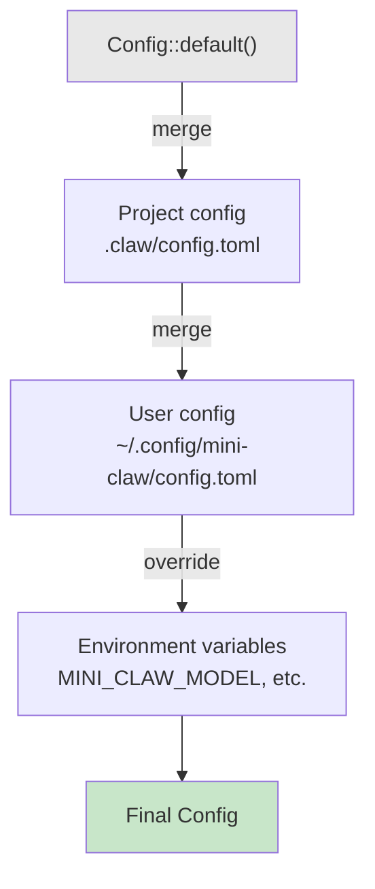

# Chapter 17: Settings Hierarchy

> **File(s) to edit:** `src/config.rs`, `src/usage.rs`
> **Tests to run:** `cargo test -p mini-claw-code-starter config` (Config, ConfigLoader), `cargo test -p mini-claw-code-starter cost_tracker` (CostTracker)
> **Estimated time:** 60 min

Your agent works. It reads files, writes code, runs commands, checks permissions, enforces safety rules, and restricts itself in plan mode. But every one of those behaviors is hardcoded. The model name is a string literal. The blocked commands list is baked into the source. The maximum context window is a constant. If you want to change any of them, you recompile.

Real tools do not work this way. A developer using Claude Code on a Rust project wants different settings than one working on a Python monorepo. A CI pipeline needs different defaults than an interactive session. A user who routes through a self-hosted proxy needs a different base URL. The agent must be configurable -- and the configuration must come from multiple sources, layered by priority, so that project settings override user settings, and environment variables override everything.

This chapter builds a 4-level configuration hierarchy and a cost tracker. By the end, both `config` (config) and `cost_tracker` (cost tracker) should pass.

```bash
cargo test -p mini-claw-code-starter config  # Config, ConfigLoader
cargo test -p mini-claw-code-starter cost_tracker  # CostTracker
```

## Goal

- Define a `Config` struct with serde defaults so that partial TOML files deserialize into complete configurations.
- Define a `ConfigOverlay` struct whose fields are `Option<T>`, so the loader can tell "field not set in the TOML" apart from "field explicitly set to the default value."
- Implement the `merge()` function with a single rule: every `Some(_)` in the overlay replaces the base.
- Build `ConfigLoader` to assemble four layers (defaults, project config, user config, environment variables) in priority order.
- Implement `CostTracker` to accumulate token counts and compute running cost estimates from per-million pricing.

---

## Why layers?

A flat config file would be simple. One `config.toml`, one source of truth, done. But it breaks down immediately in practice:

- **User preferences** like model choice and API base URL should follow you across every project. You should not have to set `model = "anthropic/claude-sonnet-4-20250514"` in every repository.
- **Project settings** like blocked commands and protected file patterns are specific to one codebase. A node project might block `rm -rf node_modules` while a Rust project blocks `cargo publish --allow-dirty`.
- **Environment overrides** let CI pipelines inject settings without touching config files. `MINI_CLAW_MODEL=anthropic/claude-haiku-3-20250414` in a GitHub Actions workflow switches to a cheaper model for automated checks.
- **Defaults** provide sane behavior when nothing is configured at all.

The solution is layered configuration. Each layer can set any field. Higher-priority layers override lower ones. Fields not set in a layer fall through to the next one down.

```
Priority (highest to lowest):

  1. Environment variables    MINI_CLAW_MODEL, MINI_CLAW_BASE_URL, MINI_CLAW_MAX_TOKENS
  2. User config              ~/.config/mini-claw/config.toml
  3. Project config            .claw/config.toml
  4. Defaults                  hardcoded in code
```

Claude Code uses the same approach. Its hierarchy goes: CLI flags > environment > user settings > project settings > defaults. The merge logic is more sophisticated -- it supports per-key overrides and array merging strategies -- but the architecture is identical.



---

## The Config struct

All configuration lives in a single `Config` struct at `src/config/mod.rs`:

```rust
use std::path::{Path, PathBuf};

use serde::{Deserialize, Serialize};

#[derive(Debug, Clone, Serialize, Deserialize)]
pub struct Config {
    #[serde(default = "default_model")]
    pub model: String,

    #[serde(default = "default_base_url")]
    pub base_url: String,

    #[serde(default = "default_max_tokens")]
    pub max_context_tokens: u64,

    #[serde(default = "default_preserve_recent")]
    pub preserve_recent: usize,

    #[serde(default)]
    pub allowed_directory: Option<String>,

    #[serde(default)]
    pub protected_patterns: Vec<String>,

    #[serde(default)]
    pub blocked_commands: Vec<String>,

    #[serde(default)]
    pub instructions: Option<String>,
}
```

Eight fields spanning three categories: provider settings, safety settings, and agent behavior.

### Provider settings

**`model`** identifies which LLM to use. The default is `"anthropic/claude-sonnet-4-20250514"` -- an OpenRouter model path. If a user routes through a different provider or wants a cheaper model for testing, they override this.

**`base_url`** is the API endpoint. The default points to OpenRouter (`https://openrouter.ai/api/v1`). Users running a local proxy, a corporate gateway, or a different OpenAI-compatible API change this to point at their endpoint.

**`max_context_tokens`** caps the context window at 200,000 tokens. A compaction engine would read this value to decide when to summarize old messages. Different models have different context limits -- Haiku supports 200K, but a self-hosted model might only handle 8K.

### Safety settings

**`allowed_directory`** restricts file operations to a single directory tree. When set, the Write, Edit, and Read tools refuse to touch anything outside this path. This is a blunt but effective sandbox -- useful in CI where the agent should only modify the checkout directory.

**`protected_patterns`** is a list of glob patterns for files that cannot be written to. A project might protect `*.lock` files, `.env`, or `Cargo.toml` to prevent the agent from accidentally modifying build-critical files.

**`blocked_commands`** lists command substrings that the bash tool rejects. If any blocked substring appears in a command, execution is denied. This is the configuration surface for the safety checks from Chapter 14.

### Agent behavior

**`preserve_recent`** controls how many recent messages the compaction engine preserves. When compacting, the engine summarizes older messages but keeps the most recent `preserve_recent` messages intact so the model has fresh context. The default of 10 keeps roughly the last 2-3 tool-use rounds.

**`instructions`** injects custom text into the system prompt. This is where project-specific guidance goes -- "always use async/await", "prefer Vec over slices in public APIs", "tests must use the mock provider". Chapter 18 builds the full instruction system; this field is the config hook for it.

### Key Rust concept: `#[serde(default)]` for partial deserialization

Serde's `default` attribute is what makes partial config files work. When a TOML file omits a field, serde normally fails with "missing field." The `#[serde(default = "function_name")]` attribute tells serde to call the named function instead of failing. For fields that default to `None` or empty `Vec`, the simpler `#[serde(default)]` calls `Default::default()`. This pattern is idiomatic in Rust configuration: every field has a sensible default, and the user only specifies what they want to change. The alternative -- requiring every field in every config file -- would make partial configs impossible.

### Default functions and the serde trick

Each field with a non-trivial default uses a named function:

```rust
fn default_model() -> String {
    "anthropic/claude-sonnet-4-20250514".into()
}

fn default_base_url() -> String {
    "https://openrouter.ai/api/v1".into()
}

fn default_max_tokens() -> u64 {
    200_000
}

fn default_preserve_recent() -> usize {
    10
}
```

The `#[serde(default = "default_model")]` attribute tells serde to call `default_model()` when the `model` field is missing from the TOML input. This is what makes partial config files work. A project config that only sets `blocked_commands` still deserializes into a full `Config` -- every omitted field gets its default.

Fields that default to "empty" (`Option<String>`, `Vec<String>`) use the simpler `#[serde(default)]` attribute, which calls `Default::default()` -- `None` for `Option`, empty `Vec` for collections.

The `Default` impl for `Config` mirrors these functions exactly:

```rust
impl Default for Config {
    fn default() -> Self {
        Self {
            model: default_model(),
            base_url: default_base_url(),
            max_context_tokens: default_max_tokens(),
            preserve_recent: default_preserve_recent(),
            allowed_directory: None,
            protected_patterns: Vec::new(),
            blocked_commands: Vec::new(),
            instructions: None,
        }
    }
}
```

Having both the `Default` impl and the serde defaults is intentional. `Config::default()` is used in code -- constructing a base config, comparing against defaults in the merge logic. The `#[serde(default = "...")]` attributes are used during deserialization. They must agree, and sharing the same named functions guarantees they do.

---

## The overlay: telling "unset" from "set to default"

Before we can write the merge function, we need a way to answer a question that `Config` itself cannot answer: **was this field actually set in the TOML file?**

A natural first attempt is "compare the overlay value against `Config::default()` -- if it differs, it was set." That heuristic is wrong. It cannot distinguish two different situations:

1. The user did not set the field in their TOML.
2. The user *did* set the field, and the value they set happens to equal the default.

Case 2 is not hypothetical. If the default `model` is `"anthropic/claude-sonnet-4-20250514"` and the user explicitly writes `model = "anthropic/claude-sonnet-4-20250514"` in their user config to assert it regardless of project overrides, the comparison-to-default heuristic silently treats it as "not set" and keeps whatever the previous layer had. Last-write-wins is violated.

The fix is to encode "set" vs "not set" in the type system. We introduce a second struct -- `ConfigOverlay` -- whose fields are `Option<T>`. Serde deserializes a missing TOML key as `None` and a present one as `Some(value)`. No value comparison needed.

```rust
#[derive(Debug, Clone, Default, Deserialize)]
#[serde(default)]
pub struct ConfigOverlay {
    pub model: Option<String>,
    pub base_url: Option<String>,
    pub max_context_tokens: Option<u64>,
    pub preserve_recent: Option<usize>,
    pub allowed_directory: Option<String>,
    pub protected_patterns: Option<Vec<String>>,
    pub blocked_commands: Option<Vec<String>>,
    pub instructions: Option<String>,
}
```

The struct-level `#[serde(default)]` tells serde to fall back to `Default::default()` for any field missing from the TOML input — and `Default::default()` for `Option<T>` is `None`. That is exactly the "key absent → `None`" mapping we want, and we get it without annotating every field individually.

The two structs play complementary roles. `Config` is the fully-resolved output: every field has a value, everyone downstream can read it without caring how it got there. `ConfigOverlay` is the transport format: a partial, optional view of the same shape, used only while merging layers.

Even `Vec<T>` fields become `Option<Vec<T>>`. This matters -- an overlay that sets `protected_patterns = []` in TOML means "clear the list," which is different from "did not mention the list at all." An `Option<Vec<T>>` represents both cases cleanly; a bare `Vec<T>` cannot.

## The merge logic

With the overlay in hand, merge becomes uniform: every `Some(_)` in the overlay replaces the corresponding field in the base, and every `None` leaves the base untouched.

```rust
pub fn merge(base: Config, overlay: ConfigOverlay) -> Config {
    Config {
        model: overlay.model.unwrap_or(base.model),
        base_url: overlay.base_url.unwrap_or(base.base_url),
        max_context_tokens: overlay.max_context_tokens.unwrap_or(base.max_context_tokens),
        preserve_recent: overlay.preserve_recent.unwrap_or(base.preserve_recent),
        allowed_directory: overlay.allowed_directory.or(base.allowed_directory),
        protected_patterns: overlay.protected_patterns.unwrap_or(base.protected_patterns),
        blocked_commands: overlay.blocked_commands.unwrap_or(base.blocked_commands),
        instructions: overlay.instructions.or(base.instructions),
    }
}
```

Two patterns cover every field:

- `unwrap_or(base.x)` for fields where `Config` holds a concrete value (e.g. `String`, `u64`, `Vec<String>`). If the overlay has `Some(v)`, the result is `v`; otherwise the base value is kept.
- `.or(base.x)` for fields that are already `Option<T>` on `Config` (`allowed_directory`, `instructions`). `Option::or` returns the first `Some(_)` it finds.

That is the entire merge. No value comparisons. No special cases per field. A later layer always wins when it sets a field, regardless of whether the value it sets matches the default, matches the previous layer, or is empty.

### Collections: replace, not append

When an overlay does set `protected_patterns` or `blocked_commands`, its value fully replaces the base. Appending would mean every config layer adds to the list with no way to remove entries from a lower layer. Replacing gives each layer that mentions the field full control over its contents.

Consider a project that protects `.env` and `.secret` at the project level. If the user config also sets `protected_patterns = [".credentials"]`, the replace strategy means only `.credentials` is protected -- the project patterns are gone. Since project config is loaded first (lowest priority among files) and user config is loaded second (higher priority), the user config's patterns replace the project's. For most settings this makes sense -- the user knows their environment better than the project author.

If you wanted append semantics, you would extend the collections instead:

```rust
// Append (not what we do):
if let Some(extra) = overlay.protected_patterns {
    base.protected_patterns.extend(extra);
}
```

Claude Code supports both strategies depending on the field. Our implementation keeps it simple with replace-only, and the overlay's `Option<Vec<T>>` type is what lets "layer did not mention this field" stay distinct from "layer explicitly set it to an empty list."

---

## ConfigLoader: assembling the layers

The `ConfigLoader` orchestrates the full merge pipeline:

```rust
pub struct ConfigLoader {
    project_dir: Option<PathBuf>,
}

impl ConfigLoader {
    pub fn new() -> Self {
        Self { project_dir: None }
    }

    pub fn project_dir(mut self, dir: impl Into<PathBuf>) -> Self {
        self.project_dir = Some(dir.into());
        self
    }

    pub fn load(&self) -> Config {
        let mut config = Config::default();

        // Layer 1: Project config (.claw/config.toml)
        if let Some(ref dir) = self.project_dir {
            let project_path = dir.join(".claw").join("config.toml");
            if let Some(overlay) = Self::load_file(&project_path) {
                config = Self::merge(config, overlay);
            }
        }

        // Layer 2: User config (~/.config/mini-claw/config.toml)
        if let Some(user_dir) = dirs::config_dir() {
            let user_path = user_dir.join("mini-claw").join("config.toml");
            if let Some(overlay) = Self::load_file(&user_path) {
                config = Self::merge(config, overlay);
            }
        }

        // Layer 3: Environment variables (highest priority)
        config = Self::apply_env(config);

        config
    }
}
```

The builder pattern lets callers optionally specify a project directory. In a real agent, this is the working directory where the user invoked the tool. In tests, it is a temp directory.

### The load order matters

The `load()` method applies layers from lowest to highest priority:

1. Start with `Config::default()` -- the absolute baseline.
2. Merge the project config (`.claw/config.toml`) -- project-specific overrides.
3. Merge the user config (`~/.config/mini-claw/config.toml`) -- user-wide preferences.
4. Apply environment variables -- the ultimate override.

Each merge takes the current accumulated config as the base and the new layer as the overlay. Non-default overlay values replace the base. This means user config beats project config, and environment variables beat everything.

The `dirs::config_dir()` call uses the `dirs` crate to find the platform-appropriate config directory -- `~/.config` on Linux, `~/Library/Application Support` on macOS, `%APPDATA%` on Windows. This follows the XDG Base Directory Specification on Linux and platform conventions elsewhere.

### Loading a single file

```rust
pub fn load_file(path: &Path) -> Option<ConfigOverlay> {
    let content = std::fs::read_to_string(path).ok()?;
    toml::from_str(&content).ok()
}
```

Two lines, two possible failure points, both handled with `.ok()?`:

1. The file might not exist -- `read_to_string` returns `Err`, `.ok()` converts to `None`, `?` returns `None`.
2. The file might contain invalid TOML -- `toml::from_str` returns `Err`, same chain.

Notice the return type is `Option<ConfigOverlay>`, not `Option<Config>`. The loader deliberately parses into the partial type -- that is how `merge` later knows which fields the file actually mentioned.

Returning `Option<_>` instead of `Result<_, Error>` is a deliberate choice. Missing config files are not errors -- they are the normal case. Most users will not have a user config file. Most projects will not have a `.claw/config.toml`. The loader should silently skip missing files and apply defaults. Invalid TOML is arguably an error worth reporting, but for simplicity we treat it the same way. A production implementation would log a warning for parse failures while still falling back to defaults.

The `toml` crate handles deserialization. Because every field on `ConfigOverlay` is `Option<T>` with `#[serde(default)]`, a TOML file that only sets one field still parses cleanly -- every other field becomes `None`:

```toml
# This is a valid config file:
model = "anthropic/claude-haiku-3-20250414"
```

This deserializes into a `ConfigOverlay` with `model: Some(...)` and every other field `None`. When `merge` applies it, only `model` is touched on the base.

### Environment variable overrides

```rust
fn apply_env(mut config: Config) -> Config {
    if let Ok(model) = std::env::var("MINI_CLAW_MODEL") {
        config.model = model;
    }
    if let Ok(url) = std::env::var("MINI_CLAW_BASE_URL") {
        config.base_url = url;
    }
    if let Ok(tokens) = std::env::var("MINI_CLAW_MAX_TOKENS") {
        if let Ok(n) = tokens.parse::<u64>() {
            config.max_context_tokens = n;
        }
    }
    config
}
```

Environment variables are the simplest layer -- no files, no parsing, no merge logic. If the variable exists, its value replaces the field. If it does not exist, the field is untouched.

Only three fields have environment variable support: `model`, `base_url`, and `max_context_tokens`. These are the fields most commonly overridden in CI and scripting contexts. Safety fields like `blocked_commands` and `protected_patterns` are intentionally excluded from environment overrides -- you do not want a compromised environment variable to disable your safety rules.

Notice the double-parse for `MINI_CLAW_MAX_TOKENS`: first `std::env::var` to get the string, then `.parse::<u64>()` to convert it to a number. If the string is not a valid integer, the parse silently fails and the existing value is kept. No panic, no error message. This is the right behavior for environment variables -- a typo in `MINI_CLAW_MAX_TOKENS=abc` should not crash the agent.

---

## CostTracker: knowing what you spend

Every LLM API call costs money. The cost depends on two factors: how many tokens you send (input) and how many tokens the model generates (output). Different models have wildly different pricing -- Claude Sonnet is roughly $3 per million input tokens and $15 per million output tokens, while Haiku is an order of magnitude cheaper.

A coding agent makes many API calls per session. A complex task might run 20-30 tool-use turns, each sending the full conversation history. Without tracking, you have no idea whether a session cost $0.02 or $2.00. The `CostTracker` accumulates token counts across a session and computes the running cost.

```rust
pub struct CostTracker {
    input_tokens: u64,
    output_tokens: u64,
    turn_count: u64,
    input_price_per_million: f64,
    output_price_per_million: f64,
}
```

Five fields. The first three are accumulators that grow with each API call. The last two are constants set at construction time based on the model's pricing.

### Construction

```rust
impl CostTracker {
    pub fn new(input_price_per_million: f64, output_price_per_million: f64) -> Self {
        Self {
            input_tokens: 0,
            output_tokens: 0,
            turn_count: 0,
            input_price_per_million,
            output_price_per_million,
        }
    }
}
```

The caller provides pricing. For Claude Sonnet: `CostTracker::new(3.0, 15.0)`. For Haiku: `CostTracker::new(0.25, 1.25)`. This separates the tracker from model-specific knowledge -- it just counts tokens and multiplies by rates.

### Recording usage

```rust
pub fn record(&mut self, usage: &crate::types::TokenUsage) {
    self.input_tokens += usage.input_tokens;
    self.output_tokens += usage.output_tokens;
    self.turn_count += 1;
}
```

Called after each provider response. The `TokenUsage` struct (from Chapter 4) carries the per-request token counts. The tracker accumulates them and increments the turn counter.

Note that `record` takes a reference to `TokenUsage`, not ownership. The caller typically has the usage attached to an `AssistantTurn` and should not have to give it up just to record costs.

### Computing cost

```rust
pub fn total_cost(&self) -> f64 {
    let input_cost = self.input_tokens as f64 * self.input_price_per_million / 1_000_000.0;
    let output_cost = self.output_tokens as f64 * self.output_price_per_million / 1_000_000.0;
    input_cost + output_cost
}
```

Straightforward arithmetic. Input tokens times input price per million, divided by a million. Same for output. Add them together. The result is in USD.

For a session with 100 input tokens at $3/M and 50 output tokens at $15/M:

```
input:  100 * 3.0  / 1,000,000 = 0.0003
output:  50 * 15.0 / 1,000,000 = 0.00075
total:                           0.00105
```

That is $0.00105 -- about a tenth of a cent. A typical interactive session costs $0.05-$0.50 depending on complexity and model choice.

### Summary formatting

```rust
pub fn summary(&self) -> String {
    format!(
        "tokens: {} in + {} out | cost: ${:.4}",
        self.input_tokens,
        self.output_tokens,
        self.total_cost()
    )
}
```

Produces a string like `"tokens: 5000 in + 1000 out | cost: $0.0300"`. Four decimal places gives sub-cent precision. A TUI would display this in the status bar -- a constant reminder of what the session is costing.

### Reset

```rust
pub fn reset(&mut self) {
    self.input_tokens = 0;
    self.output_tokens = 0;
    self.turn_count = 0;
}
```

Zeroes the accumulators but keeps the pricing. Useful when starting a new logical task within the same session, or for per-conversation cost tracking in a multi-conversation agent.

### Accessor methods

The tracker exposes its accumulators through read-only methods:

```rust
pub fn total_input_tokens(&self) -> u64 { self.input_tokens }
pub fn total_output_tokens(&self) -> u64 { self.output_tokens }
pub fn turn_count(&self) -> u64 { self.turn_count }
```

These let the UI and logging systems read the state without mutation. The fields themselves are private -- the only way to modify them is through `record()` and `reset()`, which keeps the accounting consistent.

---

## Putting it together: a sample config file

Here is what a project's `.claw/config.toml` might look like:

```toml
model = "anthropic/claude-sonnet-4-20250514"
max_context_tokens = 100000

protected_patterns = [".env", "*.lock", "secrets/*"]
blocked_commands = ["rm -rf /", "git push --force"]

instructions = "Always run cargo fmt after editing Rust files."
```

And a user's `~/.config/mini-claw/config.toml`:

```toml
model = "anthropic/claude-sonnet-4-20250514"
base_url = "https://my-proxy.example.com/v1"
```

When both exist, the loader merges them:

1. **Defaults** -- all fields get their default values.
2. **Project config** parses into a `ConfigOverlay` with `Some(_)` for exactly the keys the file mentions: `model`, `max_context_tokens`, `protected_patterns`, `blocked_commands`, `instructions`. `merge` applies each one to the base.
3. **User config** parses into an overlay with `Some(_)` for `model` and `base_url`. Even though its `model` value happens to equal the default, that no longer matters -- the overlay says the field was set, so it replaces the project's value. `base_url` likewise replaces the default.
4. **Environment** -- if `MINI_CLAW_MODEL` is set, it overrides everything.

The final config has the project's safety rules, the user's model and proxy URL, and defaults for everything else. Each layer contributes what it knows without needing to repeat what it does not care about, and a layer is never silently ignored just because the value it set coincides with the default.

---

## How Claude Code does it

Claude Code has a similar 4-level hierarchy: project settings, user settings, environment, defaults. The details differ in instructive ways.

**Format.** Claude Code uses JSON (`settings.json`, `settings.local.json`) rather than TOML. JSON is more familiar to web developers (Claude Code's primary audience) and integrates naturally with TypeScript. We use TOML because it is the Rust ecosystem standard -- every Rust developer already reads `Cargo.toml` daily.

**Merge sophistication.** Claude Code supports per-key override strategies. Some fields append (permission rules accumulate across layers), some replace (model name), and some use first-wins semantics (project instructions take precedence over user instructions for the same key). Our merge logic uses a single strategy: every field the overlay set replaces the base, collections included. Simpler, but it covers the common cases.

**Cost tracking.** Claude Code tracks costs per model with cache-aware pricing. When the API reports `cache_read_tokens`, those tokens are billed at a reduced rate (typically 90% cheaper than regular input tokens). Our `CostTracker` ignores caching -- it treats all input tokens the same. Adding cache-aware pricing would mean extending `record()` to accept `cache_read_tokens` and applying a separate rate, but the architecture does not change.

**Validation.** Claude Code validates settings on load -- unknown keys produce warnings, type mismatches produce errors. Our `load_file` silently drops unparseable files. A production implementation would validate and report.

Despite these differences, the layered architecture is the same. Settings flow from general (defaults) to specific (environment), each layer overriding the previous. The `Config` struct is the single source of truth for the entire agent, passed to every subsystem that needs to know how to behave.

---

## Tests

Run the tests:

```bash
cargo test -p mini-claw-code-starter config  # Config, ConfigLoader
cargo test -p mini-claw-code-starter cost_tracker  # CostTracker
```

Note: Config and ConfigLoader tests are in `config` (following the V1
numbering where configuration was Chapter 16). CostTracker tests are in
`cost_tracker` (V1 token tracking chapter).

Key config tests (`config`):

- **test_config_default_config** -- `Config::default()` produces the expected model, token limit, and non-empty safety defaults.
- **test_config_load_from_toml** -- A TOML string with `model` and `max_context_tokens` deserializes correctly.
- **test_config_default_fills_missing_fields** -- A TOML file with only `model` still gets defaults for `preserve_recent`, `instructions`, etc.
- **test_config_load_nonexistent_path** -- Loading from a non-existent path returns `None` instead of panicking.
- **test_config_mcp_server_config** -- MCP server configuration round-trips through TOML correctly.
- **test_config_hooks_config** -- Hook configuration (command, tool_pattern, timeout) deserializes from TOML.
- **test_config_env_override** -- Setting `MINI_CLAW_MODEL` environment variable overrides the model in the loaded config.
- **test_config_protected_patterns_default** -- Default config includes `.env` and `.git/**` in protected patterns.

Key cost tracker tests (`cost_tracker`):

- **test_cost_tracker_empty_tracker** -- A new tracker starts at zero tokens, zero turns, zero cost.
- **test_cost_tracker_record_single_turn** -- Recording one turn increments input/output tokens and the turn counter.
- **test_cost_tracker_accumulates_across_turns** -- Three `record()` calls accumulate totals correctly.
- **test_cost_tracker_cost_calculation** -- 1M input + 1M output tokens at $3/$15 per million = $18.00.
- **test_cost_tracker_cost_small_numbers** -- 1000 input + 200 output tokens = $0.006.
- **test_cost_tracker_summary_format** -- `summary()` produces the expected `"tokens: N in + N out | cost: $X.XXXX"` format.
- **test_cost_tracker_reset** -- `reset()` zeroes accumulators but preserves pricing.

---

## Key takeaway

Layered configuration lets each level (defaults, project, user, environment) contribute only what it knows. Splitting the shape into a fully-resolved `Config` and a partial `ConfigOverlay` (fields are `Option<T>`) puts the "was this field set?" question in the type system: `None` means the file did not mention it, `Some(v)` means it did -- regardless of what `v` is. Merge then has a single rule: every `Some(_)` replaces the base.

---

## Recap

This chapter built two subsystems that the rest of the agent depends on.

- **`Config`** holds every configurable parameter in a single struct. Serde's `#[serde(default)]` attributes make partial TOML files work -- you only set what you want to change.

- **`ConfigOverlay`** is the partial counterpart to `Config`: every field is `Option<T>`. `None` means the field was not set in the layer, `Some(v)` means it was -- and stays distinguishable from the default even when `v` happens to equal the default.

- **`ConfigLoader`** implements the 4-level merge pipeline: defaults, project config, user config, environment variables. Each file layer is parsed into a `ConfigOverlay` and applied with a single rule: every `Some(_)` replaces the base.

- **`CostTracker`** accumulates token usage across a session and computes estimated cost from per-million pricing. Its `summary()` method produces the one-line status string the TUI displays.

- **The merge strategy** is the key design decision. Encoding "set vs unset" in the type system (instead of guessing from the value) guarantees last-write-wins and makes explicit resets -- clearing a list, re-asserting a default -- work correctly.

- **Environment variables** are deliberately limited to three fields. Safety-critical settings like `blocked_commands` and `protected_patterns` should come from config files that are checked into source control or managed explicitly -- not from environment variables that might be manipulated.

---

## What's next

Configuration tells the agent *how* to behave. Chapter 18 -- Project Instructions -- tells it *what* to know. The `instructions` field you saw in `Config` is just a string. The instruction system reads `CLAUDE.md` files from the project tree, merges them with user instructions, and injects them into the system prompt. Together, settings and instructions make the agent context-aware -- it adapts its behavior and knowledge to each project it works in.

---

[← Chapter 16: Plan Mode](./ch16-plan-mode.md) · [Contents](./ch00-overview.md) · [Chapter 18: Project Instructions →](./ch18-instructions.md)
