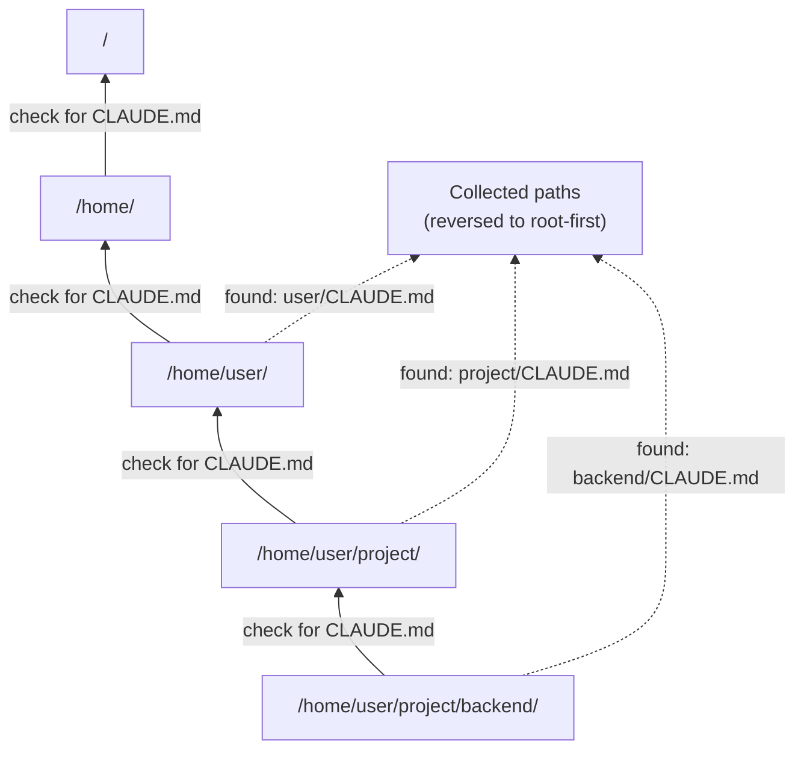

# Chapter 18: Project Instructions & Context Management

> **File(s) to edit:** `src/context.rs`
> **Tests to run:** `cargo test -p mini-claw-code-starter instructions` (InstructionLoader), `cargo test -p mini-claw-code-starter context_manager` (ContextManager)
> **Estimated time:** 40 min

This chapter closes the loop on two pieces that keep an agent running over a
long session:

- **`InstructionLoader`** (built in Chapter 8) discovers CLAUDE.md files by
  walking up the filesystem. We revisit it here to see how its output gets
  injected into the conversation at session start.
- **`ContextManager`** (new in this chapter) keeps the conversation inside the
  model's context window by summarising old turns once the token budget is
  exceeded. This is the piece you fill in.

In Chapter 17 you added `Config`, a layered settings hierarchy. One of its
fields is `instructions: Option<String>` -- custom text the user can put in a
TOML config file and have injected into the system prompt.

This chapter wires all three together. It is the chapter where your agent
becomes *project-aware* (launching from `/home/user/project/backend` picks up
different CLAUDE.md files than `/home/user/other`) and *session-durable* (a
20-turn debugging session does not hit the context wall).

```bash
cargo test -p mini-claw-code-starter instructions  # InstructionLoader
cargo test -p mini-claw-code-starter context_manager  # ContextManager
```

## Goal

- Understand how `InstructionLoader` output and `Config.instructions` get injected as system messages at session start.
- Implement `ContextManager::record` so token usage from each turn accumulates into a running total.
- Implement `ContextManager::compact` so that once the budget is exceeded, the middle of the message history is replaced by an LLM-generated summary while the system prompt and the most recent messages are preserved intact.
- Understand why the system prompt (which includes discovered CLAUDE.md content) must survive compaction unchanged -- it is the one message the LLM needs on every turn.

---

## The session-level pipeline

Here is the complete flow. At session start instructions are discovered and
pushed into the message history. During the session the `ContextManager`
watches token usage and compacts the middle of that history once the budget
is exceeded.

```
  ┌─────────────────────────────┐
  │  Filesystem                 │      (at session start)
  │                             │
  │  /home/user/CLAUDE.md       │──┐
  │  /home/user/project/        │  │
  │    CLAUDE.md                │──┤  InstructionLoader::discover()
  │    backend/                 │  │  walks upward, collects paths
  │      CLAUDE.md              │──┤
  │      .claw/instructions.md  │──┘
  └─────────────────────────────┘
              │
              ▼
  ┌─────────────────────────────┐
  │  InstructionLoader::load()  │
  │  concatenates with headers  │
  │  and --- separators         │
  └─────────────────────────────┘
              │
              ▼
  ┌─────────────────────────────┐
  │  messages[0] = System(      │      (injected once, never edited)
  │    "# Instructions from ... │
  │     <concatenated CLAUDE>"  │
  │  )                          │
  └─────────────────────────────┘
              │
              ▼  (agent loop: User → Assistant → ToolResult → ...)
              │
  ┌─────────────────────────────┐
  │  ContextManager             │      (runs after every turn)
  │                             │
  │  .record(usage)             │  ← accumulate input + output tokens
  │  .should_compact()          │  ← tokens_used >= max_tokens?
  │                             │
  │  On trigger:                │
  │    keep  messages[0]        │  ← the system/instructions message
  │    ask   provider to        │
  │          summarise middle   │  ← LLM call with the old transcript
  │    keep  last N messages    │
  │                             │
  │  Result: short history,     │
  │  same system prompt.        │
  └─────────────────────────────┘
```

Two points to notice.

**Instructions are stable within a session.** They are loaded once, become the
first system message, and are never rewritten. Launch from a different
directory and you get a different `messages[0]`, but once a session has
started the instruction content is fixed. Users generally do not edit
CLAUDE.md mid-chat.

**Context management is session-level, not prompt-level.** Compaction does not
splice new sections into a "system prompt"; it rewrites the message history
by summarising the middle. The system prompt (which carries your instructions)
is deliberately excluded from compaction -- it is always the anchor.

---

## Revisiting InstructionLoader

You built this in Chapter 8. Let's revisit the code now that we are using it
in a real pipeline, because the design decisions matter more in context.

### The struct

```rust
pub struct InstructionLoader {
    file_names: Vec<String>,
}
```

The loader does not hardcode which files to look for. It takes a list of file
names, and `default_files()` sets that list to `["CLAUDE.md",
".claw/instructions.md"]`. This means you can swap in different file names
for testing, or add project-specific alternatives without modifying the loader.

```rust
impl InstructionLoader {
    pub fn new(file_names: &[&str]) -> Self {
        Self {
            file_names: file_names.iter().map(|s| s.to_string()).collect(),
        }
    }

    pub fn default_files() -> Self {
        Self::new(&["CLAUDE.md", ".claw/instructions.md"])
    }
}
```

### Discovery: the upward walk



`discover()` starts at the given directory and walks toward the filesystem
root. At each directory, it checks for every file name in the list:

```rust
pub fn discover(&self, start_dir: &Path) -> Vec<PathBuf> {
    let mut found = Vec::new();
    let mut dir = Some(start_dir.to_path_buf());

    while let Some(current) = dir {
        for name in &self.file_names {
            let candidate = current.join(name);
            if candidate.is_file() {
                found.push(candidate);
            }
        }
        dir = current.parent().map(|p| p.to_path_buf());
    }

    found.reverse(); // Root-first order
    found
}
```

The `found.reverse()` at the end is the key design choice. The walk naturally
collects files from most-specific to most-general (start directory first, root
last). Reversing puts them in root-first order.

After `discover("/home/user/project/backend")` with CLAUDE.md files at three
levels, the vector is:

```
[0] /home/user/CLAUDE.md               ← global preferences
[1] /home/user/project/CLAUDE.md       ← project conventions
[2] /home/user/project/backend/CLAUDE.md ← subdirectory rules
```

Global preferences come first. The most specific rules come last. When the LLM
reads the system prompt, the last instructions have the strongest influence --
the same principle as CSS specificity: general rules first, overrides last.

### Loading: read, filter, join

`load()` calls `discover()`, reads each file, and concatenates the results:

```rust
pub fn load(&self, start_dir: &Path) -> Option<String> {
    let paths = self.discover(start_dir);
    if paths.is_empty() {
        return None;
    }

    let mut sections = Vec::new();
    for path in &paths {
        if let Ok(content) = std::fs::read_to_string(path) {
            let content = content.trim().to_string();
            if !content.is_empty() {
                sections.push(format!(
                    "# Instructions from {}\n\n{}",
                    path.display(),
                    content
                ));
            }
        }
    }

    if sections.is_empty() {
        None
    } else {
        Some(sections.join("\n\n---\n\n"))
    }
}
```

Three details:

**Headers.** Each file's content is prefixed with `# Instructions from <path>`.
This tells the LLM where each block came from, helping it resolve
contradictions between levels.

**Separators.** Files are joined with `\n\n---\n\n` -- a horizontal rule in
markdown that gives the LLM a clear boundary between instruction blocks.

**Empty file skipping.** If a CLAUDE.md exists but is empty or whitespace-only,
it is silently skipped. No point wasting context tokens on an empty section.

**Returning `None`.** If no instruction files are found, or all are empty,
`load()` returns `None` rather than `Some("")`. This lets the caller skip
adding an instructions section entirely.

---

## The instruction hierarchy

Instructions can come from multiple sources. Here is the full hierarchy, from
broadest to most specific:

```
Source                              Priority    Section type
──────────────────────────────────────────────────────────────
/home/user/CLAUDE.md                lowest      file (root-first)
/home/user/project/CLAUDE.md        ↓           file
/home/user/project/backend/CLAUDE.md ↓          file
.claw/instructions.md               ↓           file (alternative)
Config.instructions                 highest     config
```

File-based instructions are discovered by the `InstructionLoader` and appear
in root-first order. Config-based instructions come from the `Config` struct's
`instructions` field -- loaded from `.claw/config.toml` or
`~/.config/mini-claw/config.toml`.

Both become dynamic sections in the system prompt. File instructions are added
first, config instructions second. Since the LLM reads the prompt top-to-bottom,
config instructions have the final word when there is a conflict.

### Why two sources?

CLAUDE.md files are committed to version control. They represent team
conventions that everyone on the project shares. "Run tests with `cargo test`."
"Never modify generated files." "Use edition 2024."

Config instructions are local. They live in `.claw/config.toml` (which may or
may not be committed) or in the user's home config directory (which is never
committed). They represent personal preferences or temporary overrides.
"Always explain your reasoning." "Focus on performance over readability for
this session."

---

### Key Rust concept: `Option` chaining with `if let` for optional pipeline steps

The wiring code uses `if let Some(instructions) = loader.load(...)` to conditionally add sections. This pattern is idiomatic Rust for optional pipeline steps: `InstructionLoader::load()` returns `Option<String>` -- `None` when no instruction files exist, `Some(text)` when they do. The `if let` binding destructures the `Option` and only executes the body when there is a value. Similarly, `Config.instructions` is `Option<String>`, and `if let Some(ref inst) = config.instructions` only adds the section when the config has instructions. This means the prompt builder never adds empty sections -- the system prompt is exactly as long as it needs to be.

---

## Wiring it together

Session startup is where `InstructionLoader` meets `Config.instructions`. Both
end up as system messages at the head of the conversation. In code:

```rust
let loader = InstructionLoader::default_files();
let mut messages: Vec<Message> = Vec::new();

// File-based instructions (CLAUDE.md, root-first).
if let Some(instructions) = loader.load(Path::new(cwd)) {
    messages.push(Message::System(instructions));
}

// Config-based instructions get the last word.
if let Some(ref inst) = config.instructions {
    messages.push(Message::System(inst.clone()));
}
```

`Message::System` is the variant we have been using throughout the book for
the agent's instructions. Both sources become system messages at the head of
the history, in priority order: global → project → subdirectory → config. The
LLM reads them top-down, so later messages override earlier ones when they
disagree.

For this book we do not maintain a separate structured "prompt builder" that
tracks identity / safety / environment / instructions as named sections. A
production agent like Claude Code does: see the sidebar below for the shape
of that design. What matters for the rest of this chapter is that the
instructions are now sitting at the start of `messages`, and that the agent
loop never touches them again.

### Sidebar: prompt builders in production agents (conceptual)

Claude Code and similar agents separate the system prompt into named sections
-- identity, safety, tool schemas, environment, instructions -- and split the
list across a **cache boundary**. Everything above the boundary is stable
across turns and can be marked cacheable by the provider; everything below
can change and is re-sent each turn.

Schematically (this is not in the starter):

```
# identity, safety, tool schemas       ← cached prefix, stable across turns
# ──── cache boundary ─────────
# environment, instructions            ← dynamic suffix, may change
```

This design wins real cost and latency: long stable prefixes are processed
once and reused. The starter does not model it explicitly because our
`Message::System` messages already live in a single list; provider-side
caching (when implemented) can key off the prefix of that list.

For the rest of the chapter we focus on what the starter *does* model:
keeping the conversation short enough to fit in the context window as the
session runs long. That job belongs to `ContextManager`.

---

## `ContextManager`: the compaction algorithm

The starter's `ContextManager` lives in `src/context.rs`. It has three
responsibilities:

1. **Track token usage** (`record`): add the input + output tokens from each
   provider turn to a running counter.
2. **Decide when to act** (`should_compact`): return `true` once the counter
   hits the configured budget.
3. **Rewrite history when asked** (`compact`): collapse old messages into a
   single LLM-generated summary while preserving the anchors.

### The struct

```rust
pub struct ContextManager {
    max_tokens: u64,
    preserve_recent: usize,
    tokens_used: u64,
}
```

Two knobs, one piece of state.

- `max_tokens` — the soft limit. When `tokens_used` reaches it, compaction
  triggers. Set this comfortably below the model's hard context limit so there
  is room for the next turn to complete before you shrink.
- `preserve_recent` — how many trailing messages survive compaction untouched.
  These carry the immediate conversational context -- the last user turn, the
  tool call you just made, the tool result you are about to reason about.
  Summarising them would break the next turn.
- `tokens_used` — the running total, updated by `record` after every provider
  call.

### Recording and triggering

`record` is tiny -- it just accumulates:

```rust
pub fn record(&mut self, usage: &TokenUsage) {
    self.tokens_used += usage.input_tokens + usage.output_tokens;
}
```

And `should_compact` compares against the budget:

```rust
pub fn should_compact(&self) -> bool {
    self.tokens_used >= self.max_tokens
}
```

The agent loop calls `record` after each provider turn and then
`maybe_compact`, which only invokes `compact` when the threshold is reached.
In practice this means compaction is rare: most turns are under budget and do
nothing.

### Compaction: head + summary + tail

`compact` splits the message history into three slices:

```
messages = [ head        | middle        | recent          ]
           <-- keep ---->|<-- summarise->|<-- keep intact ->
```

- **head** — the leading `Message::System` (if present). This is where the
  CLAUDE.md-derived instructions live. Always preserved.
- **middle** — everything between head and the last `preserve_recent`
  messages. This is what gets summarised.
- **recent** — the last `preserve_recent` messages. Always preserved.

The middle is rendered as a compact transcript (`"User: ..."`,
`"Assistant: ..."`, `"  [tool: name]"`, `"  Tool result: <preview>"`), sent to
the provider with a short instruction ("Summarise in 2-3 sentences,
preserving key facts and decisions"), and the result becomes a single synthetic
system message: `Message::System("[Conversation summary]: ...")`.

The reconstructed vector is `[head, summary, ...recent]`. A 40-message
conversation collapses to roughly 1 + 1 + `preserve_recent` messages.

### The /= 3 token reset

After compaction we cannot know exactly how many tokens the new history uses
without re-tokenising. But we know the new history is much shorter than the
old one, so continuing to accumulate against the pre-compaction total would
trigger another compaction immediately. A rough proxy:

```rust
self.tokens_used /= 3;
```

Empirically, compacting a long history down to `[system, summary, N recent]`
reduces token count by roughly 3–5×. Dividing by 3 is a conservative estimate
that keeps the agent running until the real token count climbs back to the
budget. A more precise implementation would re-count tokens from the new
`messages` vector; the proxy is good enough for the starter and keeps the
code simple.

### Why summarise instead of truncate?

The obvious alternative is to drop old messages outright. That is cheap (no
extra LLM call) but loses information. If the user said "use snake_case
throughout" on turn 3 and you drop it on turn 40, the agent forgets. A
summary preserves the decisions and facts from the dropped range at the cost
of one extra LLM roundtrip per compaction. Since compactions are rare, the
tradeoff favours the summary.

Why a *system* message for the summary rather than a user or assistant one?
Because the summary is meta-context, not something either speaker said. System
framing tells the LLM "this is background, not an active speaking turn",
which matches how it is meant to be used.

---

## How Claude Code does it

Claude Code discovers CLAUDE.md files by walking up from the working directory,
following the same upward-walk pattern we implemented. But its instruction
system is more elaborate in several ways.

**User-level instructions.** Claude Code supports `~/.claude/CLAUDE.md` as a
global instruction file. Our `InstructionLoader` achieves the same effect
naturally: if the upward walk reaches the home directory and finds a CLAUDE.md,
it gets included. No special case needed.

**Settings-based tool rules.** Claude Code's `.claude/settings.json` specifies
per-tool permission rules. These configure the permission engine (Chapter 13),
not the prompt. Our `Config` keeps it simpler with `allowed_directory`,
`protected_patterns`, and `blocked_commands`.

**Memory files.** Claude Code supports persistent memory that accumulates facts
across sessions. Memory is loaded alongside instructions but managed separately.
Our book stops before memory, but the instruction loader is the natural hook
point for extending into it.

**Instruction validation.** Claude Code warns when instructions at different
levels contradict each other. Our implementation trusts the LLM to resolve
contradictions using the root-first ordering -- the more specific instruction
wins because it appears later.

The core pattern is identical: discover files, load them in order, inject as
dynamic prompt sections. Everything else is refinement.

---

## Tests

Run the tests:

```bash
cargo test -p mini-claw-code-starter instructions  # InstructionLoader
cargo test -p mini-claw-code-starter context_manager  # ContextManager
```

Note: InstructionLoader tests live in `instructions` (built in Chapter 8 and
revisited here). ContextManager tests live in `context_manager` (added in
this chapter).

Key InstructionLoader tests (`instructions`):

- **test_instructions_discover_in_current_dir** -- Finds a CLAUDE.md in the start directory.
- **test_instructions_discover_in_parent** -- Walks upward and finds a CLAUDE.md in the parent directory.
- **test_instructions_no_files_found** -- Returns an empty list when no instruction files exist anywhere in the path.
- **test_instructions_load_content** -- `load()` returns `Some` with the file content included.
- **test_instructions_load_empty_file** -- `load()` returns `None` for an empty CLAUDE.md (no wasted tokens).
- **test_instructions_multiple_file_names** -- Discovers both `CLAUDE.md` and `.mini-claw/instructions.md` in the same directory.
- **test_instructions_system_prompt_section** -- `system_prompt_section()` wraps content with a "project instructions" header.
- **test_instructions_default_files** -- `default_files()` constructor does not panic.

Key context tests (`context_manager`):

- **test_context_manager_below_threshold_no_compact** -- Context manager does not trigger compaction when below the token threshold.
- **test_context_manager_triggers_at_threshold** -- Compaction triggers when recorded tokens exceed the threshold.
- **test_context_manager_compact_preserves_system_prompt** -- After compaction, the system prompt remains as the first message.
- **test_context_manager_compact_preserves_recent** -- The most recent N messages survive compaction intact.

---

## Key takeaway

Instructions are injected once at session start and compaction runs on demand
mid-session. The system message at `messages[0]` is the anchor: it carries the
instructions that differentiate this project from any other, and it survives
every compaction unchanged so the agent never loses its grounding.

---

## Recap

This chapter connected three pieces:

- **`InstructionLoader`** discovers CLAUDE.md files by walking up the
  filesystem and concatenates them root-first with headers and separators.
  Global preferences come first, subdirectory overrides come last.

- **`Config.instructions`** supplies an optional second block of instructions
  from the layered config built in Chapter 17. It gets appended after the
  file-based block, so it has the final word.

- **`ContextManager`** tracks token usage and compacts the middle of the
  message history into an LLM-generated summary when the budget is exceeded.
  It preserves the leading system message (your instructions) and the trailing
  `preserve_recent` messages (your current conversational context).

The startup pipeline is: discover instruction files, build a `Message::System`
with their concatenated content, optionally append another `Message::System`
from `Config.instructions`, then run the normal agent loop. After every
provider turn the loop calls `record` and `maybe_compact`; in a short session
compaction never fires, in a long one it fires as many times as needed.

---

## Where to go from here

This is the last chapter in the current series. The foundations are now in
place: messages, provider, tools, agent loop, prompt, permissions, safety,
hooks, plan mode, settings, and instructions.

Natural extensions to explore on your own:

- **Persistent memory** -- facts the agent learns in one session and recalls in
  the next. Memory files load alongside instructions, but they are managed
  differently: instructions are authored by humans, memory is authored by the
  agent itself.
- **Token and cost tracking** -- instrumenting the provider to aggregate
  per-session token usage and surface it in the TUI.
- **Smarter compaction** -- our `ContextManager` uses a single summary pass
  and a rough `/= 3` token reset. Production-grade alternatives include hierarchical
  summaries (summary of summaries) and re-tokenising the new history for an
  exact count.
- **Sessions and resume** -- serializing the message history to disk so a
  conversation can be paused and resumed.
- **MCP (Model Context Protocol)** -- loading tools from external MCP servers
  at runtime instead of hardcoding them at startup.
- **Subagents** -- spawning child agents with a filtered tool set for scoped
  subtasks.

---

[← Chapter 17: Settings Hierarchy](./ch17-settings.md) · [Contents](./ch00-overview.md)
