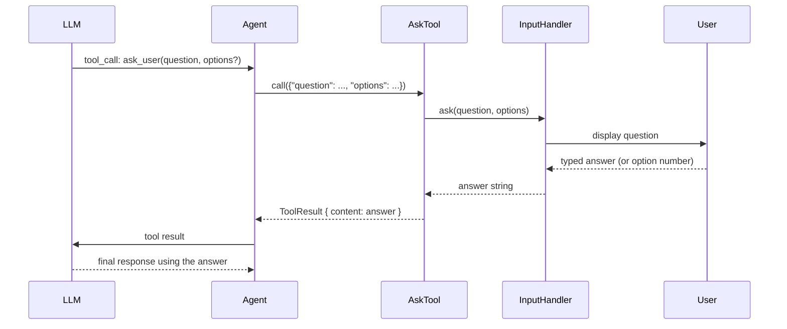

# Chapter 19: AskTool (User Input)

> **File(s) to edit:** `src/tools/ask.rs`
> **Tests to run:** `cargo test -p mini-claw-code-starter test_ask_ -- --ignored`
> **Estimated time:** 25 min

## Goal

- Implement `AskTool` so the LLM can pause the loop and ask the user a clarifying question -- the first tool in this book that lets the agent *receive* information that is not on disk.
- Understand why user input is abstracted behind an `InputHandler` trait with three implementations (CLI, channel, mock) rather than hard-coded `stdin`/`stdout`.
- Learn how the `param_raw` builder on `ToolDefinition` lets a tool declare array-typed parameters that `.param()` cannot express.

Every tool so far has given the LLM a way to *do* something -- read a file, run a command, edit text. `AskTool` is different. It hands control back to the human, waits for a reply, and feeds the answer into the next turn. It is the escape hatch for ambiguity: when the agent is halfway through a refactor and genuinely needs a decision -- "should I preserve the old signature or break callers?" -- it can stop and ask instead of guessing.

Claude Code uses the same pattern. When the model cannot proceed confidently, it emits an `ask_user` tool call; the CLI or TUI renders the question, collects a response, and sends the answer back to the model as a tool result. The protocol is identical to every other tool -- `AssistantTurn { stop_reason: ToolUse }` → tool dispatch → `Message::ToolResult` -- but the "execution" is an interactive prompt rather than a subprocess.

## How AskTool fits into the agent loop



From the agent loop's point of view, `ask_user` is an ordinary tool. Only the handler behind it knows that a human is in the loop.

## Two-layer design: tool + handler

Open `src/tools/ask.rs`. The file is longer than the other tools for one reason: the *input source* is abstracted behind a trait so the same tool works in three environments without change.

```rust
#[async_trait::async_trait]
pub trait InputHandler: Send + Sync {
    async fn ask(&self, question: &str, options: &[String]) -> anyhow::Result<String>;
}
```

One method. Given a question and an optional list of choices, produce an answer. The three implementations already shipped in the starter are:

- **`CliInputHandler`** -- prints the question to stdout and reads from stdin on a blocking thread. Good for demos and the `examples/chat.rs` script.
- **`ChannelInputHandler`** -- sends a `UserInputRequest` through an `mpsc` channel and awaits a oneshot response. Designed for TUI applications where a separate event loop owns the keyboard.
- **`MockInputHandler`** -- pops canned answers from a `VecDeque`. Used by the tests to drive deterministic runs without a human at the keyboard.

### Rust concept: why a trait instead of a free function

A simpler design is tempting: make `AskTool::call` read directly from stdin. It would work for the CLI example. But the moment you plug the agent into a TUI, a web backend, or a test harness, `stdin` is either wrong (the TUI owns the terminal) or impossible (there is no terminal). Hard-coding the input source forces every consumer of the tool into the same I/O assumption.

The trait decouples *what question is being asked* from *how the answer is collected*. The `AskTool` only cares that something, somewhere, can turn a question into a string. Whether that something is stdin, an event-loop channel, or a pre-recorded script is somebody else's problem. This is the same separation you already saw with `Provider` (`OpenRouterProvider` vs `MockProvider`) and `Tool` itself (`BashTool` vs `AskTool`). Abstract at the I/O boundary, swap implementations for testing and for production.

## The AskTool implementation

Here is the starter skeleton:

```rust
pub struct AskTool {
    definition: ToolDefinition,
    handler: Arc<dyn InputHandler>,
}

impl AskTool {
    pub fn new(_handler: Arc<dyn InputHandler>) -> Self {
        unimplemented!("TODO bonus: build ask_user ToolDefinition + store the handler")
    }
}

#[async_trait::async_trait]
impl Tool for AskTool {
    fn definition(&self) -> &ToolDefinition {
        &self.definition
    }

    async fn call(&self, _args: Value) -> anyhow::Result<String> {
        unimplemented!(
            "TODO bonus: pull question+options from args and delegate to self.handler.ask"
        )
    }
}
```

Two stubs. `new()` builds the tool definition and stashes the handler. `call()` extracts the two arguments from the JSON value and delegates to the handler.

### Step 1: the definition

```rust
impl AskTool {
    pub fn new(handler: Arc<dyn InputHandler>) -> Self {
        Self {
            definition: ToolDefinition::new(
                "ask_user",
                "Ask the user a clarifying question. Use this when you need more information \
                 before proceeding. The user will see your question and can provide a free-text \
                 answer or choose from the options you provide.",
            )
            .param("question", "string", "The question to ask the user", true)
            .param_raw(
                "options",
                json!({
                    "type": "array",
                    "items": { "type": "string" },
                    "description": "Optional list of choices to present to the user"
                }),
                false,
            ),
            handler,
        }
    }
}
```

Three pieces worth noting.

**The tool name is `ask_user`, not `ask`.** The name the LLM sees is the whole API surface for the tool. `ask` is ambiguous -- ask what? Ask whom? `ask_user` makes the audience explicit. When the model is choosing between a dozen tools, clear names are the difference between correct dispatch and a wrong guess.

**The description tells the model *when* to use the tool.** "Use this when you need more information before proceeding" is a directive, not a description. It nudges the model toward calling the tool at the right moments (ambiguous requirements, missing context) and away from calling it reflexively on every turn. The trailing clause explains the answer format so the model knows whether to expect free-text or a selection.

**`param_raw` is used for the `options` array.** The `.param()` builder only supports scalar types: `{"type": "string"}`, `{"type": "number"}`, and so on. An array of strings needs a nested schema:

```json
{
  "type": "array",
  "items": { "type": "string" },
  "description": "..."
}
```

Passing that structure through `.param()` would require the builder to know about JSON Schema's `items` key, which it doesn't. `.param_raw()` is the escape hatch: hand it the full JSON schema for the parameter and it stores it verbatim. The test `test_ask_param_raw` exercises this fallback directly, independent of `AskTool`.

### Rust concept: Arc<dyn Trait>

`handler: Arc<dyn InputHandler>` is how Rust stores "some implementation of `InputHandler`, shared by reference, erased at the type level." Three ingredients:

- **`dyn Trait`** is a type-erased trait object. At runtime, it is a fat pointer: one pointer to the value, one pointer to the vtable (which resolves `.ask(...)` to the right implementation). `dyn InputHandler` means "any type that implements `InputHandler`; I don't care which."
- **`Arc<_>`** is the atomic reference-counted smart pointer. Multiple owners can hold clones of the same `Arc`; the inner value is dropped only when the last clone goes out of scope. We need sharing because the same handler might be referenced by the `AskTool` and by the code that feeds responses into it (for `ChannelInputHandler`, the event loop holds the other end of the channel).
- **`Arc<dyn InputHandler>`** combines them: shared, type-erased, `Send + Sync`. The trait requires `Send + Sync` on its bound, which propagates through `dyn` so the `Arc` itself is thread-safe.

If you only needed one handler and one consumer, `Box<dyn InputHandler>` would do. `Arc` is for when multiple pieces of code need to outlive one another while pointing at the same handler.

### Step 2: call

```rust
async fn call(&self, args: Value) -> anyhow::Result<String> {
    let question = args
        .get("question")
        .and_then(|v| v.as_str())
        .ok_or_else(|| anyhow::anyhow!("missing required parameter: question"))?;

    let options = parse_options(&args);
    self.handler.ask(question, &options).await
}
```

Three lines of real work:

1. Extract `question` from the arguments. The chain `get → and_then(as_str) → ok_or_else` handles three failure modes uniformly: the key missing, the value being the wrong type, or the value being explicit null. All three produce the same error, "missing required parameter: question". The test `test_ask_ask_missing_question` pins this message.

2. Extract the `options` array via the `parse_options` helper (already provided in the starter). If the key is missing, the helper returns an empty `Vec<String>`; the LLM is not required to supply options, so we treat "no options" as "free-text prompt."

3. Delegate to the handler. Whatever the handler returns -- a typed answer from stdin, an answer routed through a channel, a canned string from the mock -- becomes the tool result.

The test `test_ask_ask_question_only` calls `tool.call(json!({"question": "Should I proceed?"}))` with a mock handler queued to answer `"Yes"` and expects the tool to return `"Yes"`. The test `test_ask_ask_with_options` adds an `options` array and still expects the handler's canned answer verbatim -- the tool does not enforce that the answer be one of the options, just that it reach the handler.

## The three handlers

### CliInputHandler (already implemented)

```rust
pub struct CliInputHandler;

#[async_trait::async_trait]
impl InputHandler for CliInputHandler {
    async fn ask(&self, question: &str, options: &[String]) -> anyhow::Result<String> {
        use std::io::{self, BufRead, Write};

        let question = question.to_string();
        let options = options.to_vec();

        tokio::task::spawn_blocking(move || {
            println!("\n  {question}");
            for (i, opt) in options.iter().enumerate() {
                println!("    {}) {opt}", i + 1);
            }

            print!("  > ");
            io::stdout().flush()?;
            let mut line = String::new();
            io::stdin().lock().read_line(&mut line)?;
            let answer = line.trim().to_string();

            if let Ok(n) = answer.parse::<usize>()
                && n >= 1
                && n <= options.len()
            {
                return Ok(options[n - 1].clone());
            }
            Ok(answer)
        })
        .await?
    }
}
```

Two details matter.

**`tokio::task::spawn_blocking`.** `std::io::stdin().read_line` blocks the current OS thread. Calling it directly inside an `async fn` would stall the Tokio runtime: no other tool calls, no streaming events, no timeouts. `spawn_blocking` hands the work to Tokio's dedicated pool of blocking threads, letting the runtime continue on everything else. The closure receives owned copies (`question.to_string()`, `options.to_vec()`) because the blocking thread has no `'static` guarantee on the borrowed references.

**Number-to-option resolution.** If the user types `2` and two options were offered, the handler returns the second option as a string. If they type a name (or anything not parseable as a valid index), it returns the raw input. This is a small convenience that pays off: the LLM always receives a canonical form (the exact option string) regardless of whether the human typed a number or the full word.

### ChannelInputHandler (already implemented)

```rust
pub struct UserInputRequest {
    pub question: String,
    pub options: Vec<String>,
    pub response_tx: oneshot::Sender<String>,
}

pub struct ChannelInputHandler {
    tx: tokio::sync::mpsc::UnboundedSender<UserInputRequest>,
}

#[async_trait::async_trait]
impl InputHandler for ChannelInputHandler {
    async fn ask(&self, question: &str, options: &[String]) -> anyhow::Result<String> {
        let (response_tx, response_rx) = oneshot::channel();
        self.tx.send(UserInputRequest {
            question: question.to_string(),
            options: options.to_vec(),
            response_tx,
        })?;
        Ok(response_rx.await?)
    }
}
```

This is the handler for TUI applications. The agent runs in one task, the event loop runs in another, and `UserInputRequest` is the protocol between them:

- The agent's task sends the request through an unbounded `mpsc` channel. The request carries its own `oneshot::Sender` so the receiver can reply to this specific question, not "the next reply in the queue."
- The event loop receives the request, renders the question in the UI, collects the user's input, and sends it back through the `oneshot`.
- The agent `.await`s the `oneshot::Receiver`. As soon as the reply arrives, the tool call completes.

Two channel types are doing distinct jobs. `mpsc` carries the *questions* (many questions, one event loop), and `oneshot` carries each *answer* (one per question). Using an `mpsc` for both would be possible but would require tagging responses with request IDs; the `oneshot` per request is a cleaner pairing.

The test `test_ask_channel_handler_roundtrip` exercises this wiring directly, without going through `AskTool`: it spawns a task that answers `"B"`, calls `handler.ask("Pick one", ...)`, and asserts the answer comes back. That test is already `#[tokio::test]` (not `#[ignore]`) because it has no dependency on the rest of the agent.

### MockInputHandler (your implementation)

```rust
pub struct MockInputHandler {
    answers: Mutex<VecDeque<String>>,
}

impl MockInputHandler {
    pub fn new(answers: VecDeque<String>) -> Self {
        Self {
            answers: Mutex::new(answers),
        }
    }
}

#[async_trait::async_trait]
impl InputHandler for MockInputHandler {
    async fn ask(&self, _question: &str, _options: &[String]) -> anyhow::Result<String> {
        self.answers
            .lock()
            .await
            .pop_front()
            .ok_or_else(|| anyhow::anyhow!("MockInputHandler: no more answers"))
    }
}
```

The mock ignores the question entirely -- the test already knows what the answer should be. It pops from a `VecDeque` in FIFO order, so `VecDeque::from(["A", "B"])` produces `"A"` on the first call and `"B"` on the second. An exhausted queue returns a clear error (`"MockInputHandler: no more answers"`) rather than panicking, which the `test_ask_mock_handler_exhausted` test pins.

### Rust concept: tokio::sync::Mutex vs std::sync::Mutex

`MockInputHandler` uses `tokio::sync::Mutex`, not `std::sync::Mutex`. The difference matters in async code:

- **`std::sync::Mutex`** blocks the calling OS thread until the lock is acquired. In an async runtime, this means a waiting task stalls an entire executor thread -- a classic cause of async deadlocks when the lock holder also needs to make progress on the runtime.
- **`tokio::sync::Mutex`** yields the task back to the scheduler while waiting. Other tasks continue. It is slightly slower when uncontended (an extra `.await`) but it does not starve the runtime.

The rule of thumb: if you *only* hold the lock for a quick in-memory update, `std::sync::Mutex` is fine and faster. If you hold it across an `.await`, you need `tokio::sync::Mutex`. `MockInputHandler` holds it briefly, but the trait method is `async fn`, so using the async mutex is the safe default.

## Run the tests

```bash
cargo test -p mini-claw-code-starter test_ask_ -- --ignored
```

The `--ignored` flag is required because the bonus tests are all marked `#[ignore = "bonus: requires AskTool implementation (Ch11)"]` in the starter. Without `--ignored`, Cargo treats them as skipped and they will not even be picked up. The two tests that do *not* have `#[ignore]` (`test_ask_channel_handler_roundtrip` and `test_ask_param_raw`) run under the regular `cargo test` and exercise the handler trait and the `param_raw` builder respectively.

The ten tests verify each piece of the tool:

- **`test_ask_ask_tool_definition`** -- The schema has the right name, `question` is required and typed as `string`, `options` is optional and typed as `array` of `string`.
- **`test_ask_ask_question_only`** -- A call without `options` returns whatever the handler answers.
- **`test_ask_ask_with_options`** -- A call with `options` still returns the handler's answer (the tool does not enforce validation).
- **`test_ask_ask_missing_question`** -- A call without `question` returns `Err` with `"missing required parameter"`.
- **`test_ask_mock_handler_exhausted`** -- A call to a drained mock returns `Err` with `"no more answers"`.
- **`test_ask_agent_ask_then_continue`** -- End-to-end: the LLM emits an `ask_user` tool call, the handler answers, the LLM finishes with a text response.
- **`test_ask_ask_then_tool`** -- Two-step flow: the LLM asks for a path, then uses the path to call `read`, then answers.
- **`test_ask_multiple_asks`** -- Back-to-back `ask_user` calls drain the mock queue in order.
- **`test_ask_channel_handler_roundtrip`** -- The `mpsc` + `oneshot` plumbing of `ChannelInputHandler` works under `tokio::spawn`.
- **`test_ask_param_raw`** -- `param_raw` correctly attaches array schemas to `ToolDefinition`, with and without `required = true`.

## What production Claude Code adds on top

Our `AskTool` is the raw protocol -- six lines of real logic between the LLM and the handler. Claude Code's version adds operational concerns that only matter in a long-running, multi-session agent:

- **Rich rendering.** Options are displayed with keyboard navigation (arrow keys, shortcuts) rather than numbered lines, and questions can include code blocks or diffs.
- **Timeouts and cancellation.** If the user walks away, the tool call eventually cancels rather than hanging the agent forever.
- **Answer history.** Previous answers to similar questions can be surfaced as suggested defaults, the same way shell history works.
- **Interrupt integration.** `Ctrl-C` while the agent is waiting on an answer cancels the *tool call* without killing the session; the next turn just never receives a reply, and the LLM recovers.

The trait interface is identical across all of these. The fancy rendering and cancellation live inside a handler implementation, not inside the tool.

## Recap

- `AskTool` is an ordinary tool -- `Tool::call(args) → Result<String>` -- whose side effect is prompting a human.
- The `InputHandler` trait abstracts *where the answer comes from*. One tool definition, three handlers (CLI, channel, mock), zero branching in `AskTool::call`.
- `.param_raw()` is the builder escape hatch for parameters whose JSON Schema is too complex for the scalar-only `.param()`.
- `tokio::task::spawn_blocking` moves blocking I/O off the async runtime so `stdin::read_line` does not freeze the agent.
- `tokio::sync::Mutex` is the right lock when the critical section is inside `async fn`, even for a quick `VecDeque::pop_front()`.

## Key takeaway

The LLM does not need a special mechanism to talk to the user. Give it a tool called `ask_user`, and "talking to the user" becomes one more tool call in the same loop that handles reads, writes, and shell commands. The power of the `Tool` trait is that the same agent loop drives subprocesses, filesystem operations, and human conversation with no branching at all.

## What's next

In [Chapter 20: Subagents](./ch20-subagent.md) you will build `SubagentTool`, which lets the LLM spawn a *child agent* with its own message history and tool set for scoped subtasks. Once again, the trick is that the "child" is just another tool call from the parent's point of view -- the recursion hides behind the same `Tool::call` interface.

## Check yourself

{{#quiz ../quizzes/ch19.toml}}

---

[← Chapter 18: Project Instructions](./ch18-instructions.md) · [Contents](./ch00-overview.md) · [Chapter 20: Subagents →](./ch20-subagent.md)
