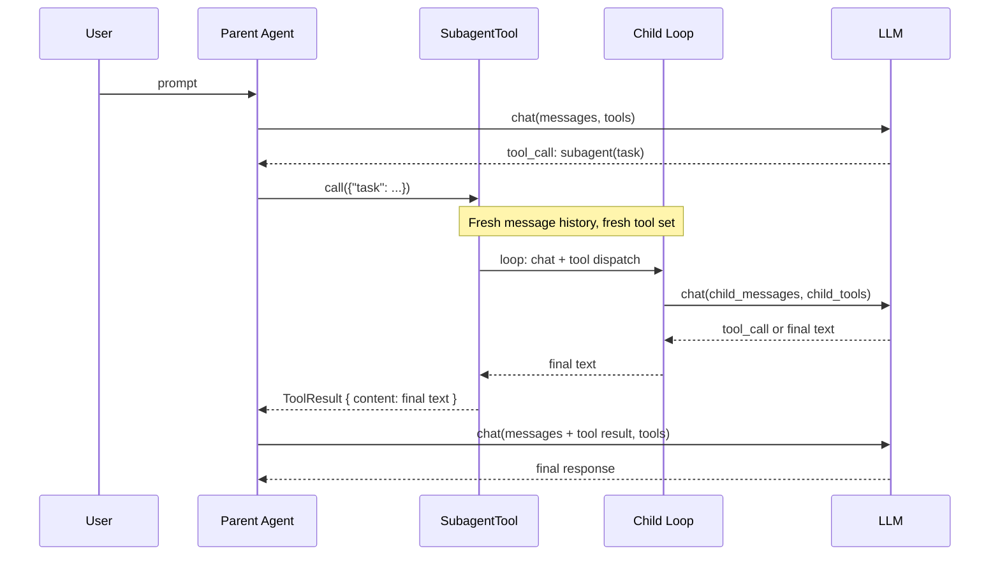

# Chapter 20: Subagents

> **File(s) to edit:** `src/subagent.rs`
> **Tests to run:** `cargo test -p mini-claw-code-starter test_subagent_ -- --ignored`
> **Estimated time:** 35 min

## Goal

- Implement `SubagentTool` so the parent agent can spawn a *child agent* with its own message history and tool set for a scoped subtask.
- Understand why the child runs a self-contained provider-tool loop instead of reusing the parent's `SimpleAgent`.
- Learn why the provider is shared via `Arc<P>` while the tool set is rebuilt per call through a closure factory, and what Rust ownership constraints force that split.

Every tool you have built so far does something concrete: reads a file, runs a command, asks the user a question. `SubagentTool` is different. Its "execution" is *another full agent loop* -- a fresh conversation with the LLM, its own tools, its own turn budget -- hidden behind an ordinary `Tool::call`. The parent sees only the final answer. The child's internal messages never leak back into the parent's history.

This is how real coding agents decompose work. Claude Code's [Agent tool](https://docs.anthropic.com/en/docs/agents-and-tools/subagents) lets the model say "spawn a general-purpose subagent to find all the places where `parse_sse_line` is called" and get back a concise list, not a transcript of twenty grep results. The parent stays focused on the high-level plan; the child burns tokens on the messy search; only the answer crosses the boundary.

## The key idea: isolation via tool call



From the parent's vantage point, `subagent` is just another tool. The fact that its implementation runs an entire LLM conversation is an internal detail. The only thing that crosses the boundary is the child's final string.

## Why isolate the child?

You could imagine a simpler design: give the parent a bigger tool set and let it handle everything in one conversation. Two reasons real agents separate the child:

**Context cost.** A search through a large codebase might generate dozens of tool results -- file lists, grep matches, file contents. Every one of those results lives in the parent's message history until the session ends, consuming prompt tokens on every subsequent turn. If the parent spawns a subagent to do the search and gets back just `"The function is defined in src/parser.rs:142"`, the parent's history grows by one short string instead of tens of kilobytes of raw search output.

**Scope discipline.** When the parent's job is "refactor this module," it helps to keep the parent's tool set small: read, write, edit. If the parent also needs to run tests and browse the web, you can give it a subagent whose tools are bash and web-fetch. The child has tools the parent does not. The parent can delegate without bloating its own capabilities.

**Separate turn budgets.** A stuck parent can delegate a task and still get back control. A stuck child hits its own `max_turns` limit and returns an error string -- the parent stays at turn 1 of its own loop and can try a different approach.

## The SubagentTool implementation

Here is the starter skeleton:

```rust
pub struct SubagentTool<P: Provider> {
    provider: Arc<P>,
    tools_factory: Box<dyn Fn() -> ToolSet + Send + Sync>,
    system_prompt: Option<String>,
    max_turns: usize,
    definition: ToolDefinition,
}

impl<P: Provider> SubagentTool<P> {
    pub fn new(
        _provider: Arc<P>,
        _tools_factory: impl Fn() -> ToolSet + Send + Sync + 'static,
    ) -> Self {
        unimplemented!("TODO bonus: wire provider+factory and build the 'subagent' ToolDefinition")
    }
    // ... system_prompt and max_turns builders already implemented
}

#[async_trait::async_trait]
impl<P: Provider + 'static> Tool for SubagentTool<P> {
    fn definition(&self) -> &ToolDefinition {
        &self.definition
    }

    async fn call(&self, _args: Value) -> anyhow::Result<String> {
        unimplemented!(
            "TODO bonus: run a self-contained agent loop for up to max_turns and return the final text"
        )
    }
}
```

Two stubs. `new()` wires up the tool. `call()` runs the child loop.

### Step 1: new()

```rust
pub fn new(
    provider: Arc<P>,
    tools_factory: impl Fn() -> ToolSet + Send + Sync + 'static,
) -> Self {
    Self {
        provider,
        tools_factory: Box::new(tools_factory),
        system_prompt: None,
        max_turns: 10,
        definition: ToolDefinition::new(
            "subagent",
            "Spawn a child agent to handle a subtask independently. \
             The child has its own message history and tools.",
        )
        .param(
            "task",
            "string",
            "A clear description of the subtask for the child agent to complete.",
            true,
        ),
    }
}
```

The tool definition is the simplest one in the book -- one required string parameter, `task`. The LLM decides what the task is and writes it in English; the subagent will seed a fresh conversation with that task as the user message.

The defaults are deliberately conservative:

- **`max_turns = 10`**: far fewer than the parent's typical budget of 50. A child that needs more than ten turns is almost certainly stuck in a loop. A tight budget catches stuckness early instead of burning tokens on a runaway conversation.
- **`system_prompt = None`**: the child inherits only the task. Callers who want to narrow the child's role ("You are a security auditor. Report findings only.") can attach a system prompt via the `.system_prompt(...)` builder.

### Rust concept: why the provider is `Arc<P>` and tools are a factory

This is the most subtle piece of the chapter. Look at the struct definition:

```rust
provider: Arc<P>,
tools_factory: Box<dyn Fn() -> ToolSet + Send + Sync>,
```

The provider is stored as `Arc<P>`. Tools are stored as a *closure that builds a new `ToolSet` on demand*. Why the asymmetry?

**`Arc<P>` works because `P: Provider` can be cloned behind a reference.** The blanket `impl<P: Provider> Provider for Arc<P>` in `types.rs` means an `Arc<OpenRouterProvider>` is itself a `Provider`. The child agent calls `self.provider.chat(...)`, which dereferences the `Arc` and delegates to the inner `OpenRouterProvider`. Parent and child share the same HTTP client, the same API key, the same connection pool -- no clone needed, just a reference count bump.

**A `ToolSet` cannot be cloned.** Tools are stored as `Box<dyn Tool>`, and `Box<dyn Tool>` is not `Clone` (you cannot generally duplicate a trait object -- the concrete type is erased). That leaves two options:

1. Share the same `ToolSet` between parent and child with an `Arc<ToolSet>`. This works but forces parent and child to expose the *same* tools, which kills the whole point of scoping the child's capabilities.

2. Hand the subagent a *factory*: "here is a closure that knows how to build a fresh `ToolSet`; call it each time you spawn a child." The parent can give the child a different tool set than itself, and because the factory is a closure, it can be stored in `SubagentTool` and invoked on each `call`.

We go with option 2. The tests make this concrete:

```rust
let agent = SimpleAgent::new(provider)
    .tool(ReadTool::new())
    .tool(SubagentTool::new(p, || {
        ToolSet::new().with(WriteTool::new())
    }));
```

The parent has `ReadTool`. The child has `WriteTool`. They coexist in the same session because the child's tools live inside the factory, not inside the parent's `ToolSet`.

### Rust concept: Box<dyn Fn()> instead of `F: Fn`

A simpler alternative is to parameterize the struct by the factory type:

```rust
pub struct SubagentTool<P: Provider, F: Fn() -> ToolSet> { ... }
```

This adds an extra generic parameter that propagates to every caller. The `Box<dyn Fn(...) + Send + Sync>` form hides the closure type behind a trait object so consumers only have to write `SubagentTool<P>`, not `SubagentTool<P, _>`. The heap allocation is one-time (at construction), not per-call, so the cost is negligible. This is the same trade-off as `Box<dyn Tool>` inside `ToolSet`: give up compile-time monomorphisation for a simpler user-facing type.

### Step 2: call()

```rust
async fn call(&self, args: Value) -> anyhow::Result<String> {
    let task = args
        .get("task")
        .and_then(|v| v.as_str())
        .ok_or_else(|| anyhow::anyhow!("missing required parameter: task"))?;

    let tools = (self.tools_factory)();
    let defs = tools.definitions();

    let mut messages = Vec::new();
    if let Some(ref prompt) = self.system_prompt {
        messages.push(Message::System(prompt.clone()));
    }
    messages.push(Message::User(task.to_string()));

    for _ in 0..self.max_turns {
        let turn = self.provider.chat(&messages, &defs).await?;

        match turn.stop_reason {
            StopReason::Stop => {
                return Ok(turn.text.unwrap_or_default());
            }
            StopReason::ToolUse => {
                let mut results = Vec::with_capacity(turn.tool_calls.len());
                for call in &turn.tool_calls {
                    let content = match tools.get(&call.name) {
                        Some(t) => t
                            .call(call.arguments.clone())
                            .await
                            .unwrap_or_else(|e| format!("error: {e}")),
                        None => format!("error: unknown tool `{}`", call.name),
                    };
                    results.push((call.id.clone(), content));
                }
                messages.push(Message::Assistant(turn));
                for (id, content) in results {
                    messages.push(Message::ToolResult { id, content });
                }
            }
        }
    }

    Ok("error: max turns exceeded".to_string())
}
```

This is the same agent loop you built in Chapter 3, run inside a tool instead of inside `SimpleAgent::chat`. Walk through the pieces.

**Argument extraction.** The `task` parameter is extracted with the same `get → and_then(as_str) → ok_or_else` pattern used in every other tool. Missing `task` returns `Err`, which the parent's agent loop turns into a `ToolResult` the LLM can read and recover from. The `test_subagent_subagent_missing_task` test pins this.

**Building the child's world.** Three lines set up an isolated environment:

```rust
let tools = (self.tools_factory)();
let defs = tools.definitions();
let mut messages = Vec::new();
```

Each call to `SubagentTool::call` runs the factory fresh, so every spawn gets its own `ToolSet` -- no state carries across spawns. The message vector is also fresh; the parent's conversation is inaccessible from inside this function.

**Seeding the conversation.** An optional system prompt and a required user message:

```rust
if let Some(ref prompt) = self.system_prompt {
    messages.push(Message::System(prompt.clone()));
}
messages.push(Message::User(task.to_string()));
```

The user message is the `task` argument the LLM provided -- whatever the parent wrote into the tool call becomes the first message of the child's conversation. The parent's natural-language task description is the prompt; no translation or framing is added.

**The loop.** A bounded `for _ in 0..self.max_turns` drives provider/tool alternation. On `Stop`, the child returns the final text. On `ToolUse`, each tool call is dispatched through `tools.get(&name)`:

- Found tool: `.call(args.clone()).await`. If the tool itself errors, `.unwrap_or_else(|e| format!("error: {e}"))` converts the error into an "error: ..." string so the LLM can recover on the next turn. A tool failure is not a child failure -- the same philosophy you saw in `single_turn`.
- Unknown tool: `"error: unknown tool `{name}`"`. The model receives the error as a tool result and typically adjusts on the next turn. The `test_subagent_subagent_unknown_tool_in_child` test pins this recovery: the child calls a nonexistent tool, gets the error string back, and then produces a sensible final answer.

After executing all tool calls, the assistant turn and the tool results are pushed into the child's message vector. The loop continues.

**Turn budget exhaustion.** If the loop completes without hitting `Stop`, the child ran too long. Two ways to signal that:

- `Err(...)` -- but then the parent's agent loop treats it like any other tool error, attaches `"error: exceeded max turns"`, and the child's identity gets lost in the generic handling.
- `Ok("error: max turns exceeded")` -- the child returns the string *as* the tool result. The parent sees exactly what the child experienced, phrased from the child's perspective.

The second form is the one tested. `test_subagent_max_turns_exceeded` calls `tool.call(...).await.unwrap()` and expects the literal string `"error: max turns exceeded"` back. Returning `Err` would have caused the `unwrap` to panic.

Note the subtle asymmetry: **provider errors propagate (`.await?`), but tool errors don't**. If the provider itself fails -- a network error, a rate limit, a panic -- that is not something the child can recover from, so `?` propagates it up to the parent as a genuine `Err`. Tool errors, on the other hand, are soft: the model gets to see the error message and try again. The `test_subagent_subagent_child_provider_error` test exercises this: an empty `MockProvider` fails on its first call, and the child returns `Err`.

### Rust concept: why the async loop cannot use `chat_loop`

The reference implementation factors the provider/tool loop into a shared helper called `chat_loop`:

```rust
pub async fn chat_loop<P: Provider>(
    provider: &P,
    tools: &ToolSet,
    config: &QueryConfig,
    messages: &mut Vec<Message>,
    events: Option<&mpsc::UnboundedSender<AgentEvent>>,
) -> anyhow::Result<String>
```

Both `SimpleAgent::chat` and `SubagentTool::call` delegate to it, which is the whole point of the refactor -- one place to fix bugs in the loop, one place to add features like streaming or observability.

In the starter, there is no shared `chat_loop`. Chapters 3 and 7 deliberately keep the loop inside `SimpleAgent::chat`, where the learner can see the whole flow in one place. Extracting it would hide structure the chapter is trying to teach. The subagent therefore re-implements the loop locally. When you reach the reference implementation (`mini-claw-code/src/subagent.rs`), you will see it collapse into a single `chat_loop(...)` call -- same behavior, less code, once you are ready to factor the loop out.

## How the Arc blanket impl makes this work

```rust
// From types.rs
impl<P: Provider> Provider for Arc<P> {
    fn chat<'a>(
        &'a self,
        messages: &'a [Message],
        tools: &'a [&'a ToolDefinition],
    ) -> impl Future<Output = anyhow::Result<AssistantTurn>> + Send + 'a {
        (**self).chat(messages, tools)
    }
}
```

This small blanket impl is what makes `Arc<P>` compose with the rest of the code. A `SimpleAgent<Arc<MockProvider>>` *is* a `SimpleAgent<P: Provider>` -- the `Arc` implements `Provider` by delegation. That means the parent `SimpleAgent` can hold one `Arc<MockProvider>` and the child `SubagentTool` can hold a clone of the same `Arc`, both satisfying `P: Provider`, both pointing at the same concrete mock.

The test wiring uses exactly this pattern:

```rust
let provider = Arc::new(MockProvider::new(queue));
let p = provider.clone();                       // bump the Arc
let agent = SimpleAgent::new(provider)          // parent consumes the original
    .tool(SubagentTool::new(p, || { ... }));    // child consumes the clone
```

Parent and child share a single `MockProvider`. Clones of `Arc` share state, so the child's `chat(...)` calls draw from the same `VecDeque<AssistantTurn>` as the parent's -- which is why the test mocks in `test_subagent_subagent_with_write_tool` list parent turns, child turns, parent turns in a single queue. The `Arc` makes ownership work; the shared queue makes the test ergonomic.

### Rust concept: Send + Sync bounds on the closure

The factory is `Box<dyn Fn() -> ToolSet + Send + Sync>`. The `Send + Sync` bounds are required because `SubagentTool` itself needs to be `Send + Sync` (tools are stored in `ToolSet` inside an `Arc`-shared agent, and moved between tasks). A closure captures its environment; if anything captured is not `Send` or not `Sync`, the closure isn't either. So in practice, the factory closure can only capture owned, thread-safe data (usually nothing at all -- the typical factory is a zero-sized closure that just constructs new tools).

## Run the tests

```bash
cargo test -p mini-claw-code-starter test_subagent_ -- --ignored
```

The twelve tests cover the protocol end-to-end:

- **`test_subagent_subagent_text_response`** -- A child that returns text on the first turn (no tool calls).
- **`test_subagent_subagent_with_tool`** -- A child that calls `read` once and then answers.
- **`test_subagent_subagent_multi_step`** -- A child that calls `read` twice before answering.
- **`test_subagent_max_turns_exceeded`** -- `max_turns(2)` against a provider that always returns `ToolUse` returns the literal string `"error: max turns exceeded"`.
- **`test_subagent_subagent_missing_task`** -- A call without `task` returns `Err`.
- **`test_subagent_subagent_child_provider_error`** -- An empty `MockProvider` propagates the provider error as `Err`, not as a tool result.
- **`test_subagent_subagent_unknown_tool_in_child`** -- A child that calls an unknown tool receives the error string, recovers, and finishes normally.
- **`test_subagent_builder_pattern`** -- `system_prompt(...)` and `max_turns(...)` chain cleanly.
- **`test_subagent_system_prompt_in_child`** -- A tool configured with `.system_prompt(...)` still works end-to-end.
- **`test_subagent_subagent_with_write_tool`** -- The parent calls the subagent, the child writes a file, the parent finishes. Verifies both the final message and the file on disk.
- **`test_subagent_parent_continues_after_subagent`** -- The parent calls the subagent *and* its own `ReadTool` in the same session.
- **`test_subagent_isolated_message_history`** -- After a subagent call, the parent's message vector is exactly `[User, Assistant(ToolUse), ToolResult, Assistant(Stop)]` -- four messages. The child's internal messages (its own `User`, `Assistant`, `ToolResult`) never appear in the parent's history.

The isolation test is the contract that justifies the whole design. Without it, subagents would be no different from a big tool set, because every child conversation would pollute the parent's prompt on every subsequent turn. The test verifies the parent only sees the child's final string, nothing else.

## What production Claude Code adds on top

Our `SubagentTool` is the raw mechanism -- about fifty lines of real code. Claude Code's subagent system layers several features on the same foundation:

- **Agent types.** Claude Code ships named subagent types (`general-purpose`, `web-researcher`, `coding-agent`, etc.) with pre-configured tool sets and system prompts. The LLM picks an agent type as a parameter of the tool call instead of specifying tools inline.
- **Isolation per-turn.** Each subagent call gets a genuinely isolated model instance: its own API key quota, its own rate-limit bucket. If a child hits a rate limit, the parent does not.
- **Cost and latency accounting.** Each subagent reports its own token usage, which the CLI rolls up into a per-session total. You can see the parent's overhead vs. the children's overhead separately.
- **Recursive subagents.** A subagent can itself spawn subagents. In principle our implementation supports this (the child's tool set can include another `SubagentTool`), but depth limits and circular-spawn detection have to be added explicitly.
- **Streaming child output.** Claude Code streams the child's partial output back to the user as it runs, instead of blocking until the final string is ready. Our version is synchronous from the parent's point of view -- the `await` on `call(...)` resolves only when the child is done.

The core pattern -- "a tool call that runs another agent loop" -- is exactly what our implementation does. Everything else is infrastructure around that pattern.

## Recap

- `SubagentTool` is an ordinary tool whose `call()` runs a full provider-tool loop on a fresh message history and a fresh `ToolSet`.
- Sharing the provider via `Arc<P>` and rebuilding the tool set via a closure factory is the Rust way to have parent and child cooperate without cloning non-clonable objects.
- The child's loop is deliberately tight: `max_turns` defaults to 10, and exhaustion returns a string, not an `Err`, so the parent sees exactly what went wrong.
- Provider errors propagate (`?`); tool errors degrade to strings (`unwrap_or_else`). Different failure modes, different handling.
- Only the child's final text crosses the boundary. The parent's message history grows by exactly one `Message::ToolResult`, regardless of how many turns the child took.

## Key takeaway

A subagent is just a tool call with an agent loop inside it. The `Tool` trait interface is powerful enough that running an entire LLM conversation as a "tool" requires no special protocol, no new message variants, no recursion in the parent's loop. You get the isolation, the separate turn budget, and the scoped tool set for free, because `Tool::call` already returns a single string -- the most compressed possible summary of whatever work happened behind it.

## What's next

This is the last chapter of the book. If you have built the starter through here, your agent can:

- Talk to an LLM (Ch1, Ch5).
- Read, write, edit, and bash (Ch2, Ch9, Ch10).
- Run its own loop (Ch3, Ch7).
- Stream results (Ch5b).
- Gate dangerous actions through permissions, safety, and hooks (Ch13-15).
- Plan before executing (Ch16).
- Layer configuration (Ch17).
- Load project instructions and compact context (Ch18).
- Ask the user for clarification (Ch19).
- Spawn subagents (Ch20).

That is every piece of the Claude Code architecture in miniature. Where you go from here -- a real TUI, a web backend, a multi-agent system -- is a matter of taste, not of missing concepts.

## Check yourself

{{#quiz ../quizzes/ch20.toml}}

---

[← Chapter 19: AskTool](./ch19-ask-tool.md) · [Contents](./ch00-overview.md)
